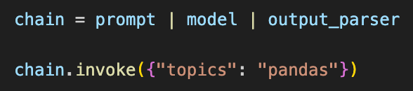
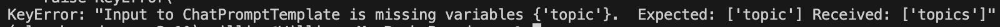
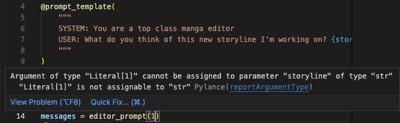
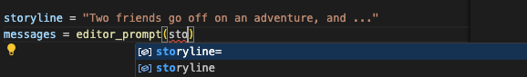

# A Guide to Prompt Templates in LangChain

A LangChain prompt template is a class containing elements you typically need for a Large Language Model (LLM) prompt. At a minimum, these are:

- **A natural language string that will serve as the prompt:** This can be a simple text string, or, for prompts consisting of dynamic content, an f-string or docstring containing placeholders that represent variables.
- **Formatting instructions** (optional), that specify how dynamic content should appear in the prompt, i.e., whether it should be italicized, capitalized, etc.
- **Input parameters** (optional) that you pass into the prompt class to provide instructions or context for generating prompts. These parameters influence the content, structure, or formatting of the prompt. But oftentimes they’re variables for the placeholders in the string, whose values resolve to produce the final string that goes into the LLM through an API call as the prompt.

<!-- more -->

A LangChain prompt template defines how prompts for LLMs should be structured, and provides opportunities for reuse and customization. You can extend a template class for new use cases. These classes are called “templates” because they save you time and effort, and simplify the process of generating complex prompts.

The prompts themselves can be as simple or as complex as you need them to be. They can be a simple question to the LLM. Or they can consist of several parts, like a part explaining context, a part containing examples, etc., to elicit more relevant or nuanced responses. However you decide to structure your prompt will depend more on your use case; there’s no universal best practice that your prompt needs to contain separate parts like context, roles, etc.

LangChain encourages developers to use their prompt templates to ensure a given level of consistency in how prompts are generated. This consistency, in turn, should achieve reliable and predictable model responses. Consistent prompt structures help to fine-tune model performance over time by reducing variability in inputs, and they support iterative model improvement and optimization.

LangChain's prompt templates are a great solution for creating intricate prompts, and we appreciate their functionality. However, when dealing with codebases involving production-grade LLM applications, ones making around 100 LLM calls (or so), in our experience prompting can become harder to manage and organize using LangChain’s native prompt templates and management system. Mirascope’s focus on developer best practices promotes a norm of writing clean code that’s easy to read, easy to find, and easy to use.

In this article, we give an overview on how LangChain prompt templates work and provide examples of these. Then we explain how prompting works in [Mirascope](https://github.com/mirascope/mirascope), and highlight its differences with LangChain.

## **3 Types of LangChain Prompt Templates**

When you prompt in LangChain, you’re encouraged (but not required) to use a predefined template class such as:

- `PromptTemplate` for creating basic prompts.
- `FewShotPromptTemplate` for few-shot learning.
- `ChatPromptTemplate` for modeling chatbot interactions.

Prompt types are designed for flexibility, not exclusivity, allowing you to blend their features, like merging a FewShotPromptTemplate with a ChatPromptTemplate, to suit diverse use cases.

### `PromptTemplate`

LangChain’s [PromptTemplate class](https://api.python.langchain.com/en/latest/prompts/langchain_core.prompts.prompt.PromptTemplate.html#langchain_core.prompts.prompt.PromptTemplate) creates a dynamic string with variable placeholders:

```python
from langchain.prompts import PromptTemplate

prompt_template = PromptTemplate.from_template(
  "Write a delicious recipe for {dish} with a {flavor} twist."
)

# Formatting the prompt with new content
formatted_prompt = prompt_template.format(dish="pasta", flavor="spicy")

print(formatted_prompt)
```

It contains all the elements needed to create the prompt, but doesn’t feature autocomplete for the variables `dish` and `flavor`.

LangChain’s templates use Python’s [`str.format`](https://docs.python.org/3/library/stdtypes.html#str.format) by default, but for complex prompts you can also use [jinja2](https://palletsprojects.com/p/jinja/).

### `FewShotPromptTemplate`

Often a more useful form of prompting than sending a simple string with a request or question is to include several examples of outputs you want.

This is few-shot learning and is used to train models to do new tasks well, even when they have only a limited amount of training data available.

Many real-world use cases benefit from few-shot learning, for instance:

- **An automated fact checking tool** where you provide different few-shot examples where the model is shown how to verify information, ask follow-up questions if necessary, and conclude whether a statement is true or false.
- **A technical support and troubleshooting guide** that assists users in diagnosing and solving issues with products or software, where the `FewShotPromptTemplate` could contain examples of common troubleshooting steps, including how to ask the user for specific system details, interpret symptoms, and guide them through the solution process.

The [`FewShotPromptTemplate`](https://python.langchain.com/docs/modules/model_io/prompts/few_shot_examples) class takes a list of (question-and-answer) dictionaries as input, before asking a new question:

```python
from langchain.prompts.few_shot import FewShotPromptTemplate
from langchain.prompts.prompt import PromptTemplate

examples = [
    {
        "question": "What is the tallest mountain in the world?",
        "answer": "Mount Everest",
    },
    {"question": "What is the largest ocean on Earth?", "answer": "Pacific Ocean"},
    {"question": "In which year did the first airplane fly?", "answer": "1903"},
]

example_prompt = PromptTemplate(
    input_variables=["question", "answer"],
    template="Question: {question}\n{answer}",
)
prompt_template = FewShotPromptTemplate(
    examples=examples,
    example_prompt=example_prompt,
    suffix="Question: {input}",
    input_variables=["input"],
)

print(
    prompt_template.format(
        input="What is the name of the famous clock tower in London?"
    )
)
```

### `ChatPromptTemplate`

The [`ChatPromptTemplate`](https://api.python.langchain.com/en/latest/prompts/langchain_core.prompts.chat.ChatPromptTemplate.html#langchain-core-prompts-chat-chatprompttemplate) class focuses on the conversation flow between a user and an AI system, and provides instructions or requests for roles like user, system, assistant, and others (the exact roles you can use will depend on your LLM model).

Such roles give deeper context to the LLM and elicit better responses that help the model grasp the situation more holistically. System messages in particular provide implicit instructions or set the scene, informing the LLM of expected behavior.

```python
from langchain_core.prompts import ChatPromptTemplate

# Define roles and placeholders
chat_template = ChatPromptTemplate.from_messages(
  [
    ("system", "You are a knowledgeable AI assistant. You are called {name}."),
    ("user", "Hi, what's the weather like today?"),
    ("ai", "It's sunny and warm outside."),
    ("user", "{user_input}"),
   ]
)

messages = chat_template.format_messages(name="Alice", user_input="Can you tell me a joke?")
```

The roles in this class are:

- `System` for a system chat message setting the stage (e.g., “ _You are a knowledgeable historian_ ”).
- `User`, which contains the user’s specific historical question.
- `AI`, which contains the LLM’s preliminary response or follow-up question.

Once the template object is instantiated, you can use it to generate chat prompts by replacing the placeholders with actual content.

This prompt sets the context, provides the user's question, and typically leaves the AI response blank for the LLM to generate.

## Chaining and Pipelines in LangChain

As its name suggests, LangChain is designed to handle complex pipelines consisting of disparate components, like prompts and output parsers, that get chained together—often through special classes and methods, as well as via the pipe operator (`|`).

Examples of special LangChain structures for chaining components are classes like `LLMChain`, `SequentialChain`, and `Runnable`, and methods such as `from_prompts`.

Here, however, we’ll highlight LangChain’s use of piping to pass outputs of
one component to the next, to achieve an end result.

### Chaining with the Pipe Operator

The code below shows an example of a LangChain pipeline joining together the
following components: a context (retrieved from a vector store), a prompt
template, an LLM interaction, and an output parser function, all in a single
statement (at the bottom, under `retrieval_chain`):

```python
from langchain_community.vectorstores import FAISS
from langchain_core.output_parsers import StrOutputParser
from langchain_core.prompts import ChatPromptTemplate
from langchain_core.runnables import RunnablePassthrough
from langchain_openai import ChatOpenAI, OpenAIEmbeddings

vectorstore = FAISS.from_texts(
    ["Julia is an expert in machine learning"], embedding=OpenAIEmbeddings()
)
retriever = vectorstore.as_retriever()
template = """Answer the question based only on the following context:
{context}

Question: {question}
"""
prompt = ChatPromptTemplate.from_template(template)
model = ChatOpenAI()

retrieval_chain = (
    {"context": retriever, "question": RunnablePassthrough()}
    | prompt
    | model
    | StrOutputParser()
)

retrieval_chain.invoke("what is Julia's expertise?")
```

In the above chain, the inputs are dynamically provided content (i.e., context from the `retriever` and a question passed as is without change), which are fed into a template that formats them into a complete prompt. This formatted prompt is then processed by the model, and the model's output is parsed into a structured format.

### Forwarding Data Unchanged

The example also illustrates LangChain’s [`RunnablePassthrough`](https://python.langchain.com/docs/expression_language/how_to/passthrough), an object that forwards input data without changes, if these are already in the desired format.

In the example, `RunnablePassthrough` takes the input from the preceding part of the pipeline—namely, the outputs of `retriever` and the input `question`—and forwards these unaltered to `prompt` for further processing.

LangChain also offers the [`Runnable.bind`](https://api.python.langchain.com/en/latest/agents/langchain.agents.openai_assistant.base.OpenAIAssistantRunnable.html#langchain.agents.openai_assistant.base.OpenAIAssistantRunnable.bind) method if you want to add conditions to the pipeline at runtime. An example is `model.bind(stop="SOLUTION")` below, which stops the model’s execution when the token or text "SOLUTION" is encountered:

```python
runnable = (
    {"equation_statement": RunnablePassthrough()}
    | prompt
    | model.bind(stop="SOLUTION")
    | StrOutputParser()
)
print(runnable.invoke("x raised to the third plus seven equals 12"))
```

This means that before executing the `model`, `.bind` creates a new `Runnable` that has been pre-configured with a stop parameter set to "SOLUTION". This pre-configuration doesn’t execute the model; it only sets up how the model should behave once it’s invoked.

Using `.bind` in such a way is useful in scenarios where you want to adduser interactivity to control a chat interaction, such as when users mark a response from a tech support bot as the solution.

## How Prompting in Mirascope Works

As suggested previously, it gets harder to manage prompts and LLM calls at scale when these are separately located. That’s why Mirascope makes the LLM call the central organizing unit around which everything gets versioned, including the prompt. We refer to this as colocation—everything that affects the quality of the call, from the prompt to model parameters, should live with the call.

We believe this provides an efficient approach to managing your codebase, and brings benefits such as simplicity, clarity, and maintainability.

With our library, all you need to know to accomplish [effective prompt engineering](https://mirascope.com/blog/prompt-engineering-tools) is Python and Pydantic. We don’t introduce new, complex structures and you can just code as you need to. For example, if you need to create an output parser then you just code it in Python without concern that it won’t later pass correctly in some other special class.

### Mirascope’s `prompt_template` Decorator

As a library premised on best developer practices, Mirascope offers its [`prompt_template`](https://mirascope.com/learn/prompts/#prompt-templates-messages)` decorator that enables writing prompt templates as python functions to centralize internal prompt logic such as computed fields:

```python
from mirascope.core import BaseDynamicConfig, prompt_template


@prompt_template(
    """
    I've recently visited the following places: {places_in_quotes}.
    Where should I travel to next?
    """
)
def travel_recommendation_prompt(visited_plates: list[str]) -> BaseDynamicConfig:
    places_in_quotes = ", ".join([f'"{place}"' for place in visited_places])
    return {"computed_fields": {"places_in_quotes": places_in_quotes}}


visited_places = ["New York", "London", "Hawaii"]
messages = travel_recommendation_prompt(visited_plates)
print(messages)
# > [BaseMessageParam(role='user', content='...')]
print(messages[0].content)
# > I've recently visited the following places: "New York", "London", "Hawaii"
#   Where should I travel to next?
```

The computed field `places_in_quotes` dynamically constructs a part of the prompt (i.e., the list of places visited, formatted with quotes) based on the function's input argument (`visited_places`), illustrating the functions's capacity to internally contain all functionality needed to produce the final list of messages (i.e. the prompt's content).

Mirascope's `prompt_template` functions also enable automatic data validation through Pydantic's [`validate_call`](https://docs.pydantic.dev/latest/concepts/validation_decorator/) decorator. Furthermore, when using the Mirascope `call` decorator to turn a prompt function into an actual LLM API call, the response is a `BaseCallResponse` instance, which subclasses Pydantic's [`BaseModel`](https://docs.pydantic.dev/latest/concepts/models/). All of this means that:

- You prompt inputs can be seamlessly type checked and constrained, without you having to write extra error validation or handling logic. Pydantic also reports when data fails validation (e.g., in your IDE and at runtime), allowing you to quickly identify which field failed validation and why (as well as handle validation errors gracefully in production).
- You can use Pydantic's [`AfterValidator`](https://docs.pydantic.dev/latest/api/functional_validators/#pydantic.functional_validators.AfterValidator) class with another LLM functions call to add additional custom validation. For example, you can verify that a company's internal policies are legally compliant with existing regulations, which would otherwise be difficult to manually verify without an LLM's assistant, even using code.
- You can export responses to dictionaries, JSON, or other formats, which facilitates serialization and interoperability with other systems or APIs. This can be particularly useful for observability.

Below is an example of using `AfterValidator` to verify a company policy. `write_policy()` extracts a `Policy`, a schema which uses `check_policy_compliance()` as an `AfterValidator` for the policy’s text. Since `check_policy_compliance()` also extracts a `ComplianceStatus`, it is easy to directly check the LLM’s output with code and incorporate it into the validation:

```python
from typing import Annotated

from mirascope.core import anthropic, prompt_template
from mirascope.retries.tenacity import collect_errors
from pydantic import AfterValidator, BaseModel, Field
from tenacity import retry, stop_after_attempt


class ComplianceStatus(BaseModel):
    compliance: bool = Field(
        description="Whether the entity is compliant with the regulation."
    )


@anthropic.call(
    "claude-3-5-sonnet-20240620",
    response_model=ComplianceStatus,
)
@prompt_template("Is this policy complian with CA regulations? {policy_text}")
def check_policy_compliance(policy_text: str): ...


def validate_compliance(policy_text: str) -> str:
    """Validate the compliance of a policy."""
    policy_compliance = check_policy_compliance(policy_text)
    assert policy_compliance.compliance, "Policy is not compliant"
    return policy_text


@retry(stop=stop_after_attempt(3), after=collect_errors(ValidationError))
@anthropic.call(
    "claude-3-5-sonnet-20240620",
    response_model=Annotated[str, AfterValidator(validate_compliance)],
)
@prompt_template(
    """
    Write a sample workplace policy about {topic}.
    It must be in compliance with CA regulations.
    Keep it under 100 words.
    """
)
def write_policy(topic: str): ...


policy = write_policy("remote work hours")
print(policy)  # `policy` is of type `str`
```

One of the most important aspects about prompt validation, and the main reason why we designed Mirascope in this way, is to prevent uncaught errors from entering into your prompts and affecting LLM outputs. We want to ensure type safety and the general quality of your prompts.

### Prompting with Mirascope vs. LangChain

As you may have noticed, Mirascope and LangChain handle prompting similarly in terms of using dedicated classes that contain strings with variable placeholders. However, we’d like to point out a few differences.

One difference is in error handling. Below is an example of a LangChain `ChatPromptTemplate`:

```python
from langchain_core.output_parsers import StrOutputParser
from langchain_core.prompts import ChatPromptTemplate
from langchain_openai import ChatOpenAI

prompt = ChatPromptTemplate.from_template("tell me a fun fact about {topic}")
model = ChatOpenAI(model="gpt-4")
output_parser = StrOutputParser()

chain = prompt | model | output_parser

chain.invoke({"topic": "pandas"})
```

LangChain doesn’t offer editor support for `topic` since the input to `invoke` is a dict with string keys. So you could indeed enter `topics` (plural) in the invocation dictionary and the editor would give you no warning or error message, as shown below.



The error would only be shown at runtime:



In contrast, the following [`prompt_template`](https://mirascope.com/learn/prompts) example from Mirascope shows how `storyline` is defined as a fixed word and string attribute, and so passing in, say, a plural form of the word would automatically generate an error, thanks to Python:

```python
from mirascope.core import prompt_template


@prompt_template(
    """
    SYSTEM: You are a top class manga editor
    USER: What do you think of this new storyline I'm working on? {storyline}
    """
)
def editor_prompt(storyline: str): ...


storyline = "Two friends go off on an adventure, and ..."
messages = editor_prompt(storyline)

print(messages)
# > [
#     BaseMessageParam(role='system', content='You are a top class manga editor'),
#     BaseMessageParam(role='user', content='What do you think of this storyline I'm working on? Two friends go off on an adventure, and ...')
#   ]
```

In our IDE, trying to pass in `storylines` as a non-string generates an error:



And autocompletion is also provided for the attribute:



The catch here is that in the case of LangChain, if you haven’t defined your own error handling logic, it might take you a while to figure out from where bugs originate. Mirascope warns you immediately of such errors.

### Mirascope Colocates Prompts with LLM Calls

Another important difference is that Mirascope colocates everything contributing to the output of an LLM call to simplify oversight and modifications.

As we’ve seen previously, certain information regarding the API call, such as parameters defining model type and temperature, are passed in as keyword arguments to the provider’s function decorator, which then show up in the response’s dump.

Mirascope’s wrappers for [tools (function calling)](https://mirascope.com/learn/tools) are included in call responses, increasing cohesion of the code even further and reducing or eliminating any boilerplate or convoluted callback mechanisms needed to extend LLM capabilities.

For instance, the tool `format_book` below is tied to the LLM call:

```python
from mirascope.core import openai


def format_book(title: str, author: str) -> str:
    """Returns the title and author of a book nicely formatted.

    Args:
        title: The title of the book.
        author: The author of the book in all caps.
    """
    return f"{title} by {author}"


@openai.call(
    "gpt-4o-mini",
    tools=[format_book],
    call_params={"tool_choice": "required"},
)
def recommend_book(genre: str) -> str:
    return f"Recommend a {genre} book"


tool = recommend_book("fantasy").tool  # `format_book` tool instance
print(tool.call())  # runs `format_book` with `title` and `author` args
# > The Name of the Wind by PATRICK ROTHFUSS
```

Encapsulating call parameters and critical functionality like tools within one call in this way makes your code more organized, modular, and easier to maintain. It also promotes reusability, as the same set of parameters (such as the tool in the above example) can be reused across multiple API calls with minimal modification.

Additionally, colocating all the relevant information together means it can all get versioned together as a single unit [via Lilypad](https://lilypad.so/docs), allowing you to easily track all changes, so you're effectively pushing as much information as feasible into the version.

On the contrary, LangChain doesn’t encourage you to colocate everything with the LLM call, so this increases the risk that relevant code gets scattered around the codebase, thus requiring you to manually track everything.

This means that, in LangChain, if you end up locating the code defining your model type (e.g., gpt-4-turbo) separately from your prompt for instance, it’s more effort to find this code to modify it when needed.

To associate model information with a prompt in LangChain, you use `Runnable.bind`—as we previously discussed in the context of LangChain pipelines and chains. This is the equivalent of Mirascope’s `call_params` argument. The biggest difference here is that `call_params` is tied to the prompt function, whereas LangChain’s `.bind` isn’t, as shown below:

```python
from langchain_core.prompts import ChatPromptTemplate
from langchain_core.runnables import RunnablePassthrough
from langchain_openai import ChatOpenAI

function = {
    "name": "solver",
    "description": "Formulates and solves an equation",
    "parameters": {
        "type": "object",
        "properties": {
            "equation": {
                "type": "string",
                "description": "The algebraic expression of the equation",
            },
            "solution": {
                "type": "string",
                "description": "The solution to the equation",
            },
        },
        "required": ["equation", "solution"],
    },
}

prompt = ChatPromptTemplate.from_messages(
    [
        (
            "system",
            "Translate the given word problem into a mathematical equation and solve it.",
        ),
        ("human", "{equation_statement}"),
    ]
)
model = ChatOpenAI(model="gpt-4-turbo", temperature=0.4).bind(
    function_call={"name": "solver"}, functions=[function]
)
runnable = {"equation_statement": RunnablePassthrough()} | prompt | model

runnable.invoke("the square root of a number plus five is equal to eight")
```

### Chaining in Mirascope vs. LangChain

The key difference between how Mirascope and LangChain accomplish chaining is that Mirascope’s approach relies on existing structures already defined in Python (i.e. functions), whereas LangChain’s approach requires an explicit definition of chains and their flows. For this, they offer their LangChain Expression Language (LCEL), which provides an interface for building complex chains.

This approach involves using specific classes and methods provided by the LangChain framework, which introduces additional layers of abstraction. This requires developers to adapt to LangChain’s specific way of structuring applications.

For example, simple chains in LangChain could be considered clean and easy to use:

```python
from langchain_community.vectorstores import FAISS
from langchain_core.output_parsers import StrOutputParser
from langchain_core.prompts import ChatPromptTemplate
from langchain_openai import ChatOpenAI, OpenAIEmbeddings

vectorstore = FAISS.from_texts(
    ["Julia is an expert in machine learning"], embedding=OpenAIEmbeddings()
)
retriever = vectorstore.as_retriever()
template = """Answer the question based only on the following context:
{context}

Question: {question}
"""

question = "what is Julia's expertise?"
context = retriever.invoke("Julia is an expert in machine learning")[
    0
]  # Retrieve context based on the input

prompt = ChatPromptTemplate.from_template(
    template.format(context=context, question=question)
)
model = ChatOpenAI()

retrieval_chain = prompt | model | StrOutputParser()

result = retrieval_chain.invoke({"question": "What is Julia's expertise?"})
print(result)
```

However, for passing arguments through the chain at runtime, or to achieve reusability, you might consider using LangChain’s `RunnablePassthrough` (as shown in previous examples). This is a LangChain-specific construct to master, however. And using such structures throughout your codebase eventually adds a layer of complexity to your code.

Mirascope’s approach, however, is more implicit, and leverages Python’s syntax and functions to chain together components.

An example of this is the `recommend_recipe` function in the code below, which internally calls the `select_chef` function and enables use of `computed_fields` to ensure that serialization of previous calls' responses are included in the serialization of the final call:

```python
from mirascope.core import BaseDynamicConfig, openai, prompt_template


@openai.call("gpt-4o-mini")
@prompt_template(
    """
    Name a chef who excels at making {food_type} food.
    Return only their name in First, Last format.
    """
)
def select_chef(food_type: str): ...


@openai.call("gpt-4o-mini")
@prompt_template(
    """
    SYSTEM: Imagine you are {chef} and recommend a recipe they would love.
    USER: Recommend a {food_type} recipe using {ingredient}.
    """
)
def recommend_recipe(food_type: str, ingredient: str) -> BaseDynamicConfig:
    chef = select_chef(food_type)
    return {"computed_fields": {"chef": chef}}


recipe = recommend_recipe(food_type="dessert", ingredient="apples")
print(recipe.content)
# > Certainly! As a renowned chef, I'd love to share a delightful recipe...
print(recipe.dynamic_config["computed_fields"]["chef"])
# > Pierre Hermé
```

This style of chaining encapsulates related functionality in the `recommend_recipe` function, making the code more readable and maintainable, whilst colocating all chain details into one final response object.

## Take a Modular Approach to Building Complex LLM Applications

Choosing the right library will depend on the complexity of your project. For straightforward tasks and prompt designs, the OpenAI SDK, or the respective API for your chosen LLM, is often sufficient.

For simple prompt chains, LangChain works fine because its chaining generally offers a clean structure for such use cases. But the moment you depart into more complex scenarios, LangChain gets complicated to use.

Mirascope’s philosophy is that a development library should let you build a complex LLM application or system, if that’s what you want. But it shouldn’t build that complex app or system for you, because that would mean dictating how you should build it.

Moreover, Mirascope eliminates the need for extensive boilerplate code and complex abstractions. [As a viable LangChain alternative](https://mirascope.com/blog/langchain-alternatives), Mirascope simplifies the development process to its core components: identifying your prompts, defining your variables, and specifying your calls.

This approach lets developers focus on their main task of prompting and building LLM applications, and less on tracking errors and dealing with unnecessary complexity.

Want to learn more? You can find more Mirascope code samples on both our [documentation site](https://mirascope.com) and on [GitHub](https://github.com/mirascope/mirascope/).
