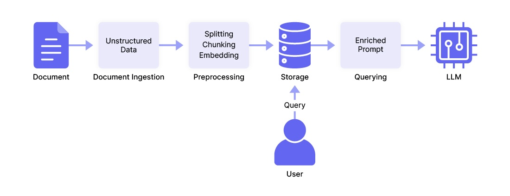

# Building an LLM Pipeline: Tools and Techniques

An LLM pipeline—in the context of building applications based on language models—refers to the stages of a data workflow for ensuring that data is properly sourced, preprocessed, and integrated to obtain the best model results.

Accurate model outputs can positively influence an application's performance and user experience, leading to greater satisfaction, trust, and usage of the application.

To get accurate model outputs, you generally do one of two things: ‍

* Fine-tune and train the model itself to better align with specific tasks and datasets (as part of LLMOps), _or_
* Improve the quality of your prompts through an ongoing process of iteration and refinement.

As we’re very focused on improving and revising prompts in the context of our own LLM app development library, [Mirascope](https://github.com/mirascope/mirascope), we believe crafting good prompts is a cost effective way to get reliable model responses.

<!-- more -->

[We’ve previously explained](https://mirascope.com/blog/prompt-engineering-examples) that one way to get desirable outputs is to supply your inputs with as much detail as feasible. By this we mean extra _context_, which reduces ambiguity for the LLM and allows it to better understand and address the needs of your request.

A popular way to add this additional context is through retrieval augmented generation (RAG), which enriches prompts with relevant information from external sources, thereby leveraging the trained model’s ability to generate responses that are more aligned with your expectations and the nuances of the query.

In this article, we explain how a RAG pipeline integrates external data into your LLM workflow. Then we follow this explanation with an example in code of how to implement RAG using LangChain and Mirascope.

## How a RAG Pipeline Works

Language models, like standalone calculators, have one big shortcoming and that’s their natural inability to access external information. This is inherent in their design, as they generate responses solely from the static datasets on which they were trained.

RAG establishes a data pipeline to reliably provide external information as part of the prompt. By “reliably” we mean information that’s consistently relevant to your requests: a well-designed RAG pipeline effectively curates the right information to match your queries and enrich them.

So what kinds of information are we talking about? ‍

* **Internal sources** (company’s financial statements, market analyses, benefits data, etc.).
* **External sources** like the internet (via services like Google Cloud API), for summarizing or analyzing information from social media, news, and research findings from online sources, to name a few.

But most current examples of RAG systems use a database—often referred to as a vector store, for reasons we explain further below—to store and serve internal data as context for LLM queries.

### Examples and Use Cases of RAG Systems

As noted, most RAG examples focus on internal sources, highlighting enterprises' interest in using generative AI to leverage internal knowledge. RAG systems are more commonly implemented in internal research projects than in full production systems.

However, interest is growing in developing applications (most of which incorporate the ubiquitous chatbot) such as: ‍

* Customer support systems that automate the first line of support, escalating cases to humans when needed.
* Legal tools for assisting with research around relevant laws, cases, and legal documents.
* Financial analysis tools for retrieving market analysis data and optimizing investment advice and risk assessments.
* Personalized education platforms recommending learning materials, resources, and exercises based on the learner’s progress and preferences.

Another potentially useful area for RAG is the integration of agent roles such as task executors.

A typical use case for this is in customer service, where a customer contacts the application to request a replacement part and a “Replacement Agent” analyzes the model’s recommended part, initiating a process for sending the part to the customer.

### Stages of a RAG Pipeline

RAG pipelines are typically orchestrated through a framework like LangChain or [Llama Index](https://mirascope.com/blog/llamaindex-vs-langchain) to ensure consistency and reliability in input flows to the language model.

In theory at least, they allow you to scale an application with increasing volumes of data and more complex queries. You can build in automated data quality checks and validations while lowering operational costs for data management, processing, and maintenance.

The stages of a RAG pipeline are typically:

1. **Document ingestion** for loading documents (like PDFs) and other unstructured data (e.g., images, webpages, text files, etc.) into the pipeline. [Frameworks](https://mirascope.com/blog/llm-tools) like LangChain offer specialized loaders or connectors for specific file types.
2. **Preprocessing** that transforms raw data into embeddings (i.e., vectors, or numerical representations of content in vector space) through a sequence of splitting, chunking, and embedding. This “splitting” breaks down large documents into smaller units at the paragraph or sentence level. “Chunking” groups these smaller units into cohesive chunks that maintain context, while embedding converts the chunks into numerical representations (vectors) to facilitate [similarity searches](https://www.pinecone.io/learn/what-is-similarity-search/).
3. **Storage** for storing and indexing embeddings and their metadata in a vector store or database.
4. **Querying** , where the user or application sends prompts to the LLM, together with the related context. The prompts are similarly processed and vectorized, and then compared with stored embeddings using techniques like similarity search. The most similar search results are pulled out of the vector store, decoded into normal text, and sent along with the prompt as useful context for the LLM.



### Challenges with Building a RAG

For all the talk of using RAG in enterprise, these systems are still rather experimental in the sense they have complex requirements and there are still no best practices or industry standards for these.

As with any new technology, users report a variety of issues:

* **Technical implementation challenges** such as getting models to follow instructions accurately, limitations in embedding models resulting in poor performance around niche queries or specific jargon, and failures by the LLM to extract correct answers from the provided context due to noise or contradicting information.
* **Data management and quality challenges** such as retrieving relevant context without including too much irrelevant information, common issues around content quality that impacts the quality of responses, and poor chunking techniques that lead to inaccurate embeddings and that affect the relevance of retrieved documents.
* **Testing and monitoring challenges** stemming from evolutions and changes in large language models that cause outputs to vary over time (for the same inputs). Monitoring in real time can introduce negative metrics like latency, especially when dealing with large datasets and high volumes of queries.

## Setting Up a RAG Pipeline

To follow on from our descriptions of RAG, we’ll show you a simple Python example below using [LangChain](https://www.langchain.com/) for data ingestion and preprocessing, and Mirascope for fashioning queries.

LangChain is a popular open-source LLM orchestration framework offering over 160 integrations with [other providers](https://mirascope.com/blog/langchain-alternatives) and is an ecosystem in its own right. One positive aspect about LangChain is it offers data loading, preprocessing, and embedding capabilities.

Below, we show an example of how to use these preprocessing features in combination with Mirascope’s [prompt engineering](https://mirascope.com/blog/prompt-engineering-best-practices).

To start off, here’s the entire RAG code example we’ll use, and which we’ll describe step by step below. It’s partly taken from LangChain’s own tutorial on [how to build a RAG app](https://python.langchain.com/v0.2/docs/tutorials/rag/) for querying a blog page about LLM powered agents: ‍

Now we’ll go through each important part of this example:

```python
from langchain_text_splitters import RecursiveCharacterTextSplitter

from mirascope.core import openai

# Load and chunk the contents of the blog.
loader = WebBaseLoader(
    web_paths=("https://lilianweng.github.io/posts/2023-06-23-agent/",),
    bs_kwargs=dict(
        parse_only=bs4.SoupStrainer(
            class_=("post-content", "post-title", "post-header")
        )
  ),
)
docs = loader.load()

text_splitter = RecursiveCharacterTextSplitter(chunk_size=1000, chunk_overlap=200)
splits = text_splitter.split_documents(docs)

# Embed and index the contents of the blog
vector_store = Chroma.from_documents(documents=splits, embedding=OpenAIEmbeddings())


@openai.call("gpt-4o-mini")
@prompt_template(
   """
   Here is some context related to a query: {context}
   Answer this query using the given context: {query}
   """
)
def query_documents(query: str, vector_store: Chroma) -> openai.OpenAIDynamicConfig:
   """Answers a query by retrieving documents related to the query."""
   documents = vector_store.similarity_search(query=query, k=3)
   return {
       "computed_fields": {
           "context": [document.page_content for document in documents]
       }
   }


query = "What are some common choices for ANN algorithms in fast MIPS?"
print(query_documents(query=query, vector_store=vector_store))
# > Some common choices for approximate nearest neighbors (ANN) include...
```

### Step 1: Setting Up

First, we set up our pipeline by installing the necessary modules for ingestion and preprocessing:

```python
import bs4
from langchain_chroma import Chroma
from langchain_community.document_loaders import WebBaseLoader
from langchain_openai import OpenAIEmbeddings
from langchain_text_splitters import RecursiveCharacterTextSplitter

from mirascope.core import openai
```

We’ll need to install modules from both LangChain and Mirascope: ‍

* `WebBaseLoader` is a text loader for blog articles (note that LangChain offers many different kinds of loaders for different data types, such as CSV, markdown, PDF, etc.).
* `RecursiveCharacterTextSplitter` is a preprocessing task ensuring that documents and information we’re loading fits into the model’s context window.
* LangChain’s `OpenAIEmbeddings` converts text into vectors.
* Chroma is the vector store that’ll be our content database.
* Mirascope’s `openai` module adds convenience around interactions with OpenAI’s large language models.

### Step 2: Data Sourcing and Ingestion

At this step, we’ll normally identify and collect relevant (unstructured) data from different sources, such as databases, APIs, web scraping results, document repositories, and other text sources.

As we pointed out earlier, low-quality content (e.g., containing inaccurate or irrelevant information and low diversity of topics with redundancy) can negatively impact responses.

In the following sample, we load a blog page and split it into smaller chunks: ‍

```python
# Load and chunk the contents of the blog.
loader = WebBaseLoader(
    web_paths=("https://lilianweng.github.io/posts/2023-06-23-agent/",),
    bs_kwargs=dict(
        parse_only=bs4.SoupStrainer(
            class_=("post-content", "post-title", "post-header")
        )
  ),
)
docs = loader.load()

text_splitter = RecursiveCharacterTextSplitter(chunk_size=1000, chunk_overlap=200)
splits = text_splitter.split_documents(docs)
```

* We initialize `WebBaseLoader` and load the URL to fetch and process the blog article.
* We use Beautiful Soup to parse specific parts of the HTML (such as the post content, title, and header).
* `RecursiveCharacterTextSplitter` splits the text into chunks of 1000 characters each. Note that `chunk_overlap` is set to 200 characters, meaning there’ll be an overlap of 200 characters between consecutive chunks. This overlap ensures that important contextual information is not lost between chunks.

One main tradeoff with chunk size is that larger chunks tend to capture more context but correspondingly introduce more noise and require more time and compute costs to process. While smaller chunks contain less noise but may not fully capture the necessary context, so might consider overlapping chunks.

### Step 3: Embedding and Indexing

Next, we encode each chunk as a vector using Chroma’s embedding model, with metadata being extracted and stored separately for indexing purposes. ‍

```python
# Embed and index the contents of the blog
vectorstore = Chroma.from_documents(documents=splits, embedding=OpenAIEmbeddings())
```

* `Chroma.from_documents` creates a vector store from the provided documents.
* `embedding=OpenAIEmbeddings()` specifies the embedding model to be used.

### Step 4: Response Generation

Lastly, we slot in code from Mirascope to create a prompt where you can ask a question about the retrieved documents (in this case, the original blog post about LLM powered agents).

Besides the query in the [prompt template](https://mirascope.com/blog/langchain-prompt-template) you see below, note that we also retrieve relevant contextual information from the vector database to go along with our query, before sending everything together in our call to the model: ‍

```python
@openai.call("gpt-4o-mini")
@prompt_template(
   """
   Here is some context related to a query: {context}
   Answer this query using the given context: {query}
   """
)
def query_documents(
    query: str, vector_store: Chroma
) -> openai.OpenAIDynamicConfig:
   """Answers a query by retrieving documents related to the query."""
   documents = vector_store.similarity_search(query=query, k=3)
   return {
       "computed_fields": {
           "context": [document.page_content for document in documents]
       }
   }
```

* The `query_documents` function generates a prompt for the model to answer a query using the retrieved context. When the function is called with a `query`, it retrieves all documents related to that query from a storage system (`vector_store`), extracting the text from these documents and compiling them into a list of `Document`s.
* Within dynamic configuration, we take the `page_content` attribute of each `Document` and include this as `context`.
* We call the model via our `@openai.call()` decorator.
* The model uses the returned configuration to replace the `{**context**}` placeholder in the prompt template.

Above, we showcased a practical example of setting up a RAG pipeline using LangChain to load, chunk, and embed data from a blog, and Mirascope to generate a context-aware book recommendation query.

## Build Your LLM Pipeline Using Mirascope

Building an efficient LLM pipeline involves several key components, including data ingestion, preprocessing, and query generation. Mirascope’s [prompting capabilities and management](https://mirascope.com/blog/prompt-versioning) help deliver accurate and contextually relevant responses from the language model.

‍Want to learn more? You can find more Mirascope code samples both on our [documentation site](https://mirascope.com) and on our [GitHub page](https://github.com/mirascope/mirascope).
