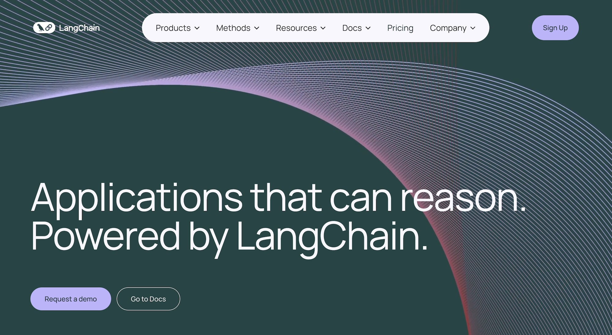
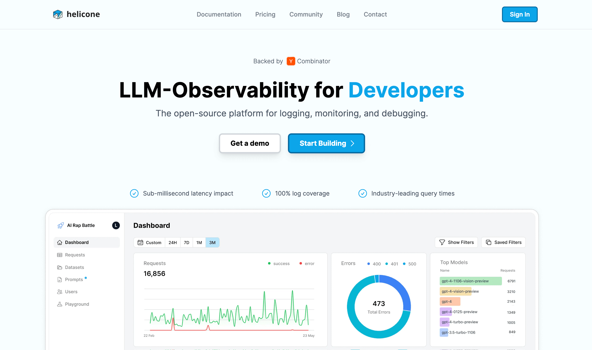
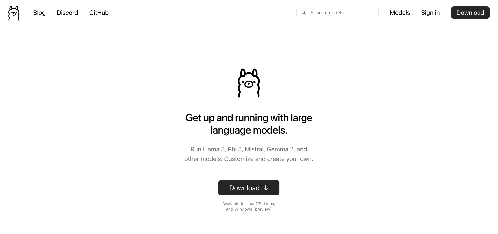
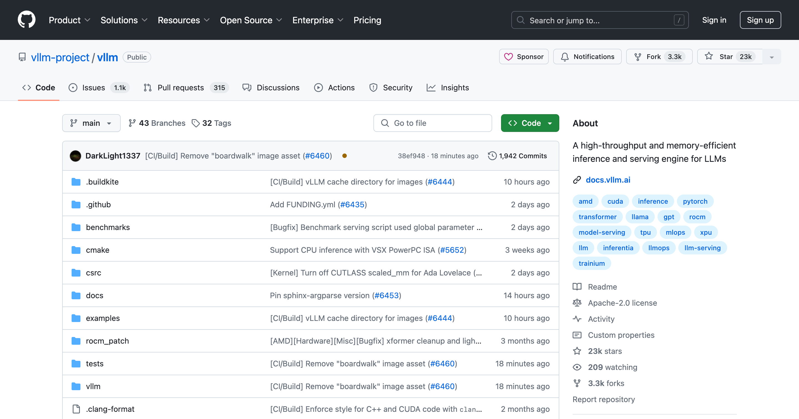
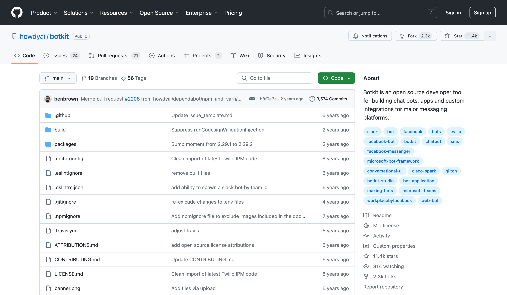
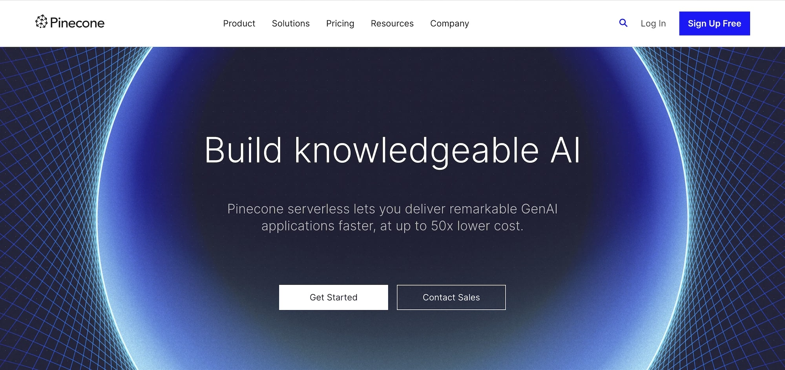
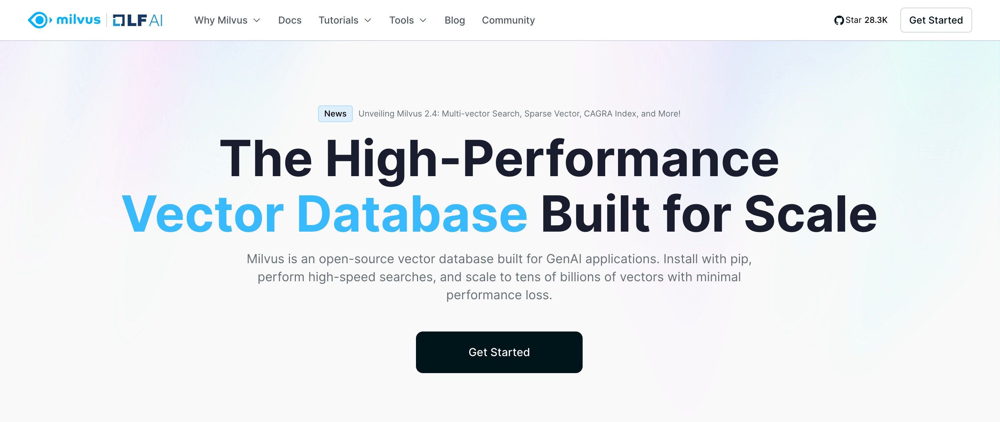
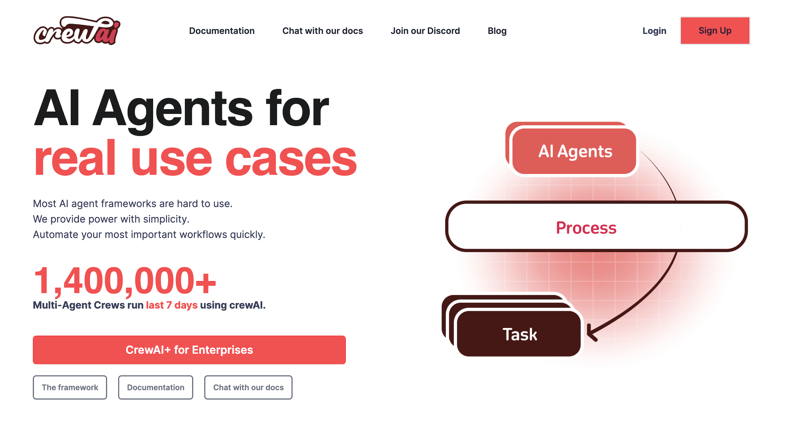
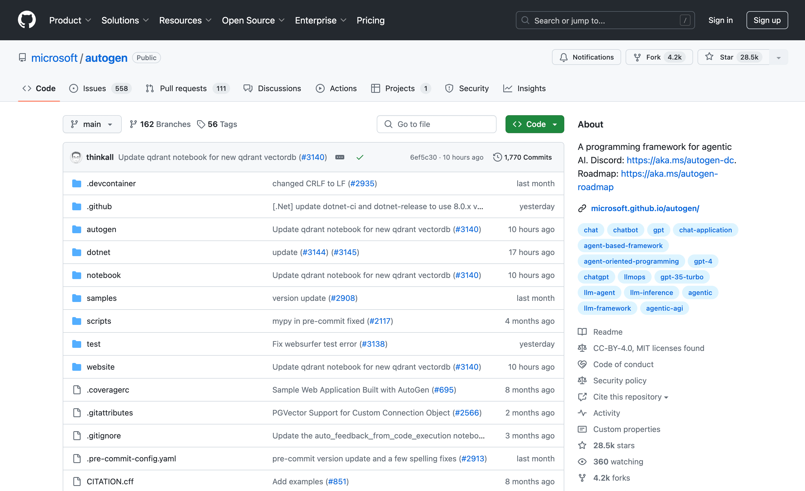

# 12 LLM Tools to Help You Build LLM Applications

While you can build LLM applications using just the raw model APIs — and we've done this a few times before helper libraries existed — leveraging specialized tools that are tailored for your Large Language Model (LLM) workflows can reduce complexity and the risk of errors, allowing you to focus on developing applications and their LLMs.

LLM tools typically consist of software libraries, frameworks, and platforms that cater to different stages of the LLM lifecycle — from data preparation and prompt engineering to model fine-tuning, deployment, and monitoring. **In general, they take away the grunt work by giving you pre-built utilities and workflows to save you time you’d normally spend on repetitive tasks and complex infrastructure setups.**

So, whether you’re creating conversational chatbots, question-answering systems, or recommendation engines, having the right tools in your LLM stack will generally make your workflows more productive.

<!-- more -->

To help you decide what’s worth evaluating for your stack, we present a curated list of tools, starting with our own LLM development library, [Mirascope](https://github.com/mirascope/mirascope). For each tool in this list, we'll spotlight its purpose and advantages: ‍

- **LLM application development tools** to build and deploy language model applications using pre-trained models, prompt engineering techniques, and API integrations.
- **Model serving tools and frameworks** for scalable hosting, management, and serving of LLMs in production environments.
- **Chatbots and virtual assistant tools** for the development and deployment of conversational AI applications powered by LLMs.
- **Vector database tools** for effective management of text and multimedia representations.
- **AI agent tools and frameworks** that allow you to build intermediaries between users and LLMs.

## LLM Application Development Tools

Tools for building language model applications allow developers to leverage the full potential of LLMs by providing them with frameworks, libraries, and interfaces that simplify their integration, prompt management, and performance evaluation.

### Mirascope


‍[Mirascope](https://mirascope.com) is a lightweight Python toolkit for developing LLM applications that gives you building blocks rather than a framework for setting up [prompt engineering workflows](https://mirascope.com/blog/prompt-engineering-best-practices). We purposefully designed Mirascope with simplicity and reliability in mind, and developing with Mirascope feels like you're simply writing the Python code you already know.

While we understand the potential of working with LLMs, **we also know firsthand the struggles of building LLM applications that are production grade.** Some modern development frameworks don’t make this any easier and make you code, for instance, in verbose and repetitive ways.

Or they make available the pipe command for data input — rather than regular functions with clear inputs and outputs. They may even try to lock you in their ecosystem to dictate your coding practices — which somewhat restricts your ability to develop your own solutions.

All this means you don't need to learn unnecessarily complex concepts or fancy structures that make development more tedious than it needs to be.

#### Clean, Readable, and Maintainable Code

Mirascope follows Pythonic conventions. Take function call sequencing, for example. We don't make you implement directed acyclic graphs (DAGs) outright — which introduces unnecessary complexities. Instead, we code call sequences using regular Python that’s readable, lightweight, and easy to maintain.

An example of this is our [`prompt_template`](https://mirascope.com/learn/prompts) decorator, which enables writing prompt templates as simply Python functions.

An example of our `prompt_template` decorator is below, where the prompt template provides a string for generating a prompt that requests music recommendations based on pairs of durations and genres. The computed field `durations_x_genres` constructs these pairs and integrates them into the prompt template for the final prompt output.

```python
from mirascope.core import BaseDynamicConfig, prompt_template


@prompt_template(
    """
    Can you recommend some music based on these duration and genre pairs?
    {durations_x_genres:list}
    """
)
def recommend_music_prompt(
    durations: list[str], genres: list[str]
) -> BaseDynamicConfig:
    durations_x_genres = [
        f"Duration: {duration}, Genre: {genre}"
        for duration in durations
        for genre in genres
    ]
    return {"computed_fields": {"durations_x_genres": durations_x_genres}}


messages = recommend_music_prompt(["short", "long"], ["rock", "jazz"])
print(messages)
# > [BaseMessageParam(role='user', content='Can you recommend some music based on these duration and genre pairs?\nDuration: short, Genre: rock\nDuration: short, Genre: jazz\nDuration: long, Genre: rock\nDuration: long, Genre: jazz')]
print(messages[0].content)
# > Can you recommend some music based on these duration and genre pairs?
#   Duration: short, Genre: rock
#   Duration: short, Genre: jazz
#   Duration: long, Genre: rock
#   Duration: long, Genre: jazz
```

Although `recommend_music_prompt` in the example above treats the prompt as a a single user message for simplicity, you can add more context by incorporating roles like System, User, and Assistant to generate more relevant responses. Since Mirascope prompt templates are just Python functions, you can write them to fit any specific use case needed for your application.

#### Colocation of LLM Call Elements

One of the major challenges we’ve had with prompting was the lack of centralization of calls to keep all the relevant information neatly contained within the prompt itself.

This didn't just apply to the API call, but also to relevant parameters like model configuration, making it difficult to manage changes and ensure consistency across large codebases.

We believe that all components that can affect the quality of a model call to an LLM — like prompt formatting, arguments, original responses from your model provider, and more, [should all live together in one place](https://mirascope.com/blog/engineers-should-handle-prompting-llms). This gives you a clear view of your call structure and allows for easier customization, leading to more efficient debugging and refinement.

Mirascope colocates calls and makes these the central organizing unit of the prompt, including [versioning](https://mirascope.com/blog/prompt-versioning) and testing. This ensures your code is clean and easily maintainable.

Below is an example of how we centralize and manage information for all calls:

```python
from mirascope.core import openai, prompt_template


@openai.call(model="gpt-4o", call_params={"temperature": 0.5})
@prompt_template(
    """
    Can you recommend some music based on these duration and genre pairs?
    {durations_x_genres:list}
    """
)
def recommend_music(
    durations: list[str], genres: list[str]
) -> openai.OpenAIDynamicConfig:
    durations_x_genres = [
        f"Duration: {duration}, Genre: {genre}"
        for duration in durations
        for genre in genres
    ]
    return {"computed_fields": {"durations_x_genres": durations_x_genres}}


response = recommend_music(durations=["short", "long"], genres=["rock", "jazz"])
```

Above, when running the `recommend_music` method, the resulting call centralizes the `durations_x_genres` computed field, model configuration, temperature, and potentially any other call parameter you wish to use.

#### Easier Prompt Development with Stateful Interactions

Although LLMs are effectively stateless, Mirascope provides a way to preserve state from one LLM call to the next, allowing you to potentially overcome context limitations where these might be an issue.

In the example below, we preserve state by appending interactions to the `history` attribute of our chat, which is injected into the prompt template using the `MESSAGES` keyword. All this is passed as part of the prompt in future iterations of `run()`.

As everything is collocated inside of a class, you can make multiple calls over multiple iterations while maintaining state inside of a call class, making it easy to define agents that require state be preserved across calls (including a history of which tools had been called, etc.).

For the chat history example below, we’re obviously injecting the chat history, but **you can also manage and maintain any additional state you want** through public and private fields of the class and the addition of tools.

```python
from mirascope.core import openai, prompt_template
from openai.types.chat import ChatCompletionMessageParam
from pydantic import BaseModel


class Chat(BaseModel):
    history: list[openai.OpenAIMessageParam] = []

    @openai.call(model="gpt-4o")
    @prompt_template(
        """
        MESSAGES: {self.history}
        USER: {question}
        """
    )
    def _step(self, question: str): ...


    def run(self):
        while True:
            question = input("(User): ")
            if question == "exit":
                break
            response = self._step(question)
            self.history += [
                response.user_message_param,
                response.message_param
            ]
           print(f"(Assistant): {response.content}")


Chat().run()
# > (User): Hi! Who are you?
# > (Assistant): Hello! I'm an AI developed by OpenAI. How can I assist you today?
# > (User): What did I just ask you?
# > (Assistant): You asked, "Who are you?" Is there anything else you'd like to know or discuss?
```

**Note:** Different model providers have specific rules and limitations regarding their roles, so be sure to follow their role requirements when injecting `MESSAGES` into your prompt.

#### Streamlined Function Calling (Tools)

Mirascope lets you extend model capabilities [by adding tools](https://mirascope.com/learn/tools) (i.e., function calling) to your workflows. Tools allow LLMs to access external information, perform calculations, run code, and more, and are straightforward to set up with Mirascope’s pythonic conventions.

One of the simplest examples of using Mirascope's tools convenience is automatically generating a tool schema and object from a function with a docstring, allowing you to pass the function directly into your calls. For example:

```python
from mirascope.core import openai, prompt_template


def get_stock_price(ticker: str) -> str:
   """Fetches the current stock price for the given `ticker`.

   Args:
       ticker: The stock ticker symbol (e.g., "AAPL" for Apple Inc.).
   """
   if ticker == "AAPL":
       return f"The current stock price of {ticker} is $150."
   elif ticker == "GOOGL":
       return f"The current stock price of {ticker} is $2800."
   else:
       return f"I'm sorry, I don't have the stock price for {ticker}."


@openai.call(model="gpt-4o", tools=[get_stock_price])
@prompt_template("What's the stock price for {stock}?")
def check_stock_price(stock: str): ...


response = check_stock_price("AAPL")
if tool := response.tool:
   print(tool.call())
# > The current stock price of AAPL is $150.
```

A call response using Mirascope gives you a wrapper around the original response from the model, giving you access to the `call()` method. This way, you can easily invoke the function and manage its arguments.

Our code uses Google-style Python docstrings, but we support other styles too, including ReST, Numpydoc, and Epydoc-style docstrings. For more code samples and use cases, please refer to our documentation on [tools (function calling)](https://mirascope.com/learn/tools).

#### Extraction of Structured Information from Unstructured LLM Outputs

Mirascope offers extraction to parse unstructured data from language model outputs, using function calls as tools for reliable extraction. This allows you to integrate LLM outputs with external systems like CRMs and databases, expanding the data’s usefulness by allowing it to be easily queried and analyzed in other workflows.

To use Mirascope extraction, define a schema with a Pydantic `BaseModel` and set `response_model` to the schema in the decorator.

In the example below, `TaskDetails` defines the structure of the data with fields for `due_date`, and `priority`. By setting `response_model=TaskExtractor` , the output of our call becomes an instance of `TaskExtractor` with the correct details inside.

```python
from typing import Literal

from mirascope.core import openai
from pydantic import BaseModel


class TaskDetails(BaseModel):
   due_date: str
   priority: Literal["low", "normal", "high"]


@openai.call(model="gpt-4o", response_model=TaskDetails)
def get_task_details(task: str) -> str:
    return f"Extract details from this task: {task}"


task = "Submit quarterly report by next Friday. Task is high priority."
task_details = get_task_details(task)
assert isinstance(task_details, TaskDetails)
print(task_details)
# > due_date='next Friday' priority='high'
```

Mirascope defines the schema for extraction via Pydantic models, which are classes derived from [`Pydantic.BaseModel`](https://docs.pydantic.dev/latest/api/base_model/).

Mirascope currently supports [extracting built-in types](https://mirascope.com/learn/response_models/#built-in-types) including: `str`, `int`, `float`, `bool`, `list`, `set`, `tuple`, and `Enum`.

### LangChain



[LangChain](https://www.langchain.com/) is an open-source framework for developing LLM-powered applications. Available in both Python and JavaScript-based libraries, LangChain provides support for a wide range of pre-trained models, which allows you to leverage existing AI models like GPT-4 or Llama while easily integrating your proprietary data.

With LangChain, you can easily connect and query LLMs from your code through its APIs. The framework provides [predefined templates](https://mirascope.com/blog/langchain-prompt-template) and utilities for processing different data formats (e.g., PDF, HTML, and CSV) to prepare these for LLM consumption. Its chaining and agent features allow you to combine transformer language models with other components like retrieval systems and planners to build more intelligent and sophisticated applications.

‍[LangChain](https://mirascope.com/blog/llamaindex-vs-langchain) also integrates with platforms like Microsoft Azure, GCP, and more, achieving impressive benchmarks in performance and efficiency.

For more information, you can read about LangChain on its website, documentation site, and GitHub page.

### Helicone



[Helicone](https://www.helicone.ai/) is an open source LLM observability tool built for developers working with LLMs. The tool provides real-time monitoring of model interactions, allowing users to collect data, monitor performance, and continuously improve their AI-powered applications.

An interesting aspect of Helicone is that it provides a dashboard where you can view key metrics such as requests, costs, latency, and errors. However, Helicone extends beyond surface-level monitoring — you can carry out deeper analysis using its extensive filtering and segmentation options. This is useful when analyzing metrics by timeframes, users, models, prompt inputs, or any custom properties of interest.

Helicone supports broad integration across LLM providers like OpenAI, Anthropic, Claude, Gemini, and more, making it suitable for different development environments and LLM technology stacks.

Helicone has a website with complete documentation, as well as a GitHub page for its source code.

## Model Serving Tools and Frameworks

Model serving tools allow you to deploy and serve machine learning models, including LLMs, in a production environment. They handle tasks like model versioning, scaling, and monitoring, ensuring that the models are available and performant for end users.

### Ollama



[Ollama](https://www.ollama.com/) is an open source framework for serving language models on your local machine, and is an alternative to using cloud-based LLMs like OpenAI’s GPT-3 or GPT-4, Google’s BERT, or Meta’s OPT. Ollama offers access to an extensive library of pretrained models such as Llama, Mistral, Gemma, and more.

It’s relatively straightforward to set up. If you’re on Mac, you can install it using Homebrew. Otherwise it’s also available on Windows and Linux. The pretrained models can be directly imported and configured using a modelfile. Ollama also provides JavaScript, Python, and Rest API libraries.

It also offers a CLI for model operations, such as creating, pulling, removing, and copying models, along with a long list of integrations including Open WebUI, LibreChat, Bionic GPT, Saddle, Typescript UI, Chatbox, RAGFlow, oterm, cmdh, shell-pilot, MindsDB, Helm Chart, LangChain, LlamaIndex, and many more.

You can download Ollama from its GitHub page (where you can also find its documentation) and get additional information such as the link to its Discord community on its website.

### vLLM



[vLLM](https://github.com/vllm-project/vllm) is a fast library for LLM inference and serving. This library is all about making it faster and easier to put LLMs into production through its PagedAttention technique. One of the key issues vLLM tackles is the inefficiencies in managing Key-Value (KV) cache memory in current LLM serving systems through its innovative PagedAttention mechanism, which efficiently manages attention key and value memory.

Besides memory optimization, vLLM also streamlines operations by allowing for continuous batching of incoming requests, rather than processing them individually. On top of that, it leverages quantization techniques like FP16 to store cached data with reduced precision. This means you’ll benefit from smaller memory footprints and faster computations.

Another standout feature of vLLM is its flexibility across use cases. The library supports both offline and online inference modes through its engine. Plus, it integrates perfectly with popular HuggingFace models and OpenAI-compatible API servers, giving you flexibility and ease of use across different platforms.

For more information, you can read about vLLM on its documentation site or GitHub page.

### OpenLLM


[OpenLLM](https://github.com/bentoml/OpenLLM) is an open source platform designed to facilitate the operation and deployment of LLMs in production environments.

A key capability of OpenLLM is that it allows you to run any open source LLM, such as Llama 2, Mistral, StableLM, Falcon, Dolly, StarCoder, and more, as optimized API endpoints compatible with OpenAI. This enables serving the LLM's capabilities at high throughput suited for production use cases.

The platform offers deployment flexibility, supporting cloud-based as well as on-premises model hosting — plus, you can easily integrate your LLMs with other models and services, such as LangChain, LlamaIndex, BentoML, and Hugging Face to build more complex AI applications.

You can find more information about OpenLLM on its GitHub page or documentation site.

## Chatbots and Virtual Assistants

The following tools enable you to create conversational AI applications powered by generative AI and LLMs. They leverage natural language processing (NLP) and text generation capabilities of LLMs to facilitate human-like dialogs and interactions across various platforms and use cases.

### Rasa


[Rasa](https://rasa.com/) is an open source platform that allows you to build chatbots (like ChatGPT) and virtual assistants that can understand natural language. At its core, Rasa provides tools to define the building blocks that make up a conversation flow — the domains of discussion, recognizing user intents, and extracting important entities like names, dates, etc., from the user's input.

Rasa has two main components that work together:

- **Rasa NLU:** This handles tasks like recognizing the user’s intent and extracting relevant information from their input using advanced language understanding techniques.
- **Rasa Core:** This manages the flow of the conversation. It decides how your chatbot should respond based on the user’s input, the context of the conversation, and predefined actions. It’s what makes the conversation feel natural and logical.

Rasa lets you build AI assistants in any language you want. Plus, it comes with tools for continuous training and improvement, so your chatbots can get smarter over time.

More information about Rasa is available on its website and documentation.

### Botkit



‍[Botkit](https://github.com/howdyai/botkit) is an open source tool for building chatbots and conversational agents. It offers a CLI and comprehensive SDK in JavaScript and Node.js, helping you get started quickly.

What's nice is that Botkit provides you with pre-built building blocks for creating chat interfaces that feel natural. It has special functions like `hears()` , `ask()` , and `reply()` for creating conversational interfaces.

Additionally, Botkit allows you to integrate your bots with various chat platforms, including Webex, Slack, Facebook Messenger, and Google Hangout, for easy multi-channel deployment. This lets you build once and create a consistent experience everywhere.

You can read more about BotKit on its GitHub page.

## Vector Database Tools

These LLM tools help you manage data representations for effectively storing, accessing, and querying vector embeddings, primarily for Retrieval Augmented Generation (RAG) applications.

### Pinecone



[Pinecone](https://www.pinecone.io/) is a cloud-native vector database that handles high-performance vector data. It combines vector search capabilities with the ability to filter and sort based on familiar metadata properties.

One of Pinecone's key differentiators is that it lets you attach rich metadata like key-value pairs to the vectors in your index. Then when querying, you can specify filters to only surface the most relevant results fetched by that metadata.

Additionally, Pinecone supports real-time updates, meaning that you can continuously add the latest data to keep vector indexes fresh. It even allows combining vector similarity with keyword-boosting techniques to prioritize the newest, most timely information.

And being fully cloud-native, Pinecone makes it easy to manage across environments like AWS, Azure, and GCP. No servers to provision or scale yourself.

More information about Pinecone can be found on its website and documentation.

### Milvus



[Milvus](https://milvus.io/) is an open source vector database built to power embedding similarity search and AI apps. A key advantage is that it provides SDKs supporting all the major programming languages like Python, Ruby, Node.js, C#, Java, and more. So you can integrate Milvus vector search no matter what stack you're building on.

But Milvus isn't just limited to vector data. It also supports hybrid search across different data types — everything from booleans and integers to floating point numbers. This gives you the flexibility to combine vector embeddings with traditional structured data.

Under the hood, Milvus uses a scalable, service-oriented architecture that allows sizing individual components like CPU, GPU, and storage resources up or down easily based on your needs. No monolithic scaling limitations.

Milvus has a website, alongside docs and a GitHub repo where its source code is hosted.

## AI Agent Tools and Frameworks

The following tools are software libraries that help you develop autonomous AI agents that leverage the reasoning capacity of LLMs to accomplish various tasks.

### CrewAI



[CrewAI](https://www.crewai.com/) is an open source framework for orchestrating role-playing, autonomous AI agents. It allows you to build collaborative AI agents that can take on roles, delegate tasks, and work towards shared goals — much like a real-world team or "crew."

Some of CrewAI's core features include role-based agents, where you define agents with specific roles, objectives, and backstories to provide more context to LLMs before generating responses. It also offers task management capabilities to assign different tasks, along with any required tools, to the various agents. Perhaps most uniquely, CrewAI allows the AI agents to delegate tasks amongst themselves to enable effective collaboration.

The framework integrates with various LLMs including LangChain’s ecosystem, so you can use LangChain's tools and LLM integrations along with CrewAI.

CrewAI has a website with documentation to learn more, as well as a repository on GitHub to access the code.

### AutoGen



[AutoGen](https://microsoft.github.io/autogen/docs/Getting-Started/) is an open source framework that lets you build complex LLM workflows by employing multiple conversable AI agents. These agents can engage in conversations with each other as well as with humans to collaboratively solve tasks.

The customizable and conversable agents support diverse conversation patterns, giving you flexibility regarding autonomy levels, the number of agents involved, and the topology of how agents interact.

Besides multi-agent collaboration, AutoGen also provides enhanced capabilities when working with LLM inference. This includes handy utilities like API unification, caching, error handling, context programming, and more. For a broader range of LLM agent tools, check out our detailed article on [LangChain alternatives](https://mirascope.com/blog/langchain-alternatives).

Additionally, more information on AutoGen is available on AutoGen's GitHub page.

## Add Mirascope to Your LLM Tool Stack

Mirascope aims to remove the complexities around your LLM engineering workflow so you can focus more on application development. That is, you can do more coding and less bug chasing and figuring things out.

Users only need to know Python and the Pydantic library — there are no other unique abstractions or fancy concepts to learn. Mirascope also slots readily into existing developer workflows, making it easy to get started.

‍Want to learn more? You can find more Mirascope code samples both on our [documentation site](https://mirascope.com) and the [GitHub repository](https://github.com/mirascope/mirascope).
