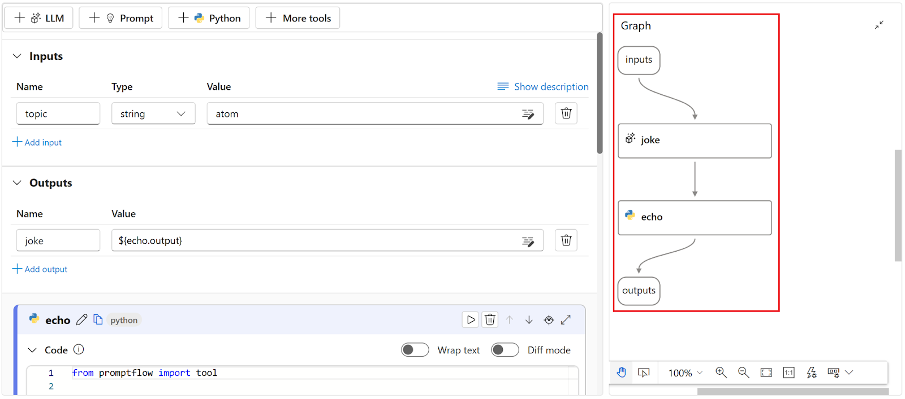
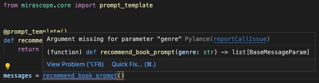
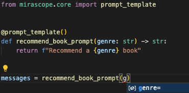

# Comparing Prompt Flow vs LangChain vs Mirascope

Currently, LangChain is one of the most popular frameworks among developers of Large Language Model (LLM) applications, and for good reason: its library is rather expansive and covers many use cases.

But teams using LangChain also report that it:

- Takes a while to catch up in functionality to new features of the language models, which unfortunately means users must wait too.
- Is an opinionated framework, and as such, encourages developers to implement solutions in its way.
- Requires developers to learn its unique abstractions for doing tasks that might be easier to accomplish in native Python or JavaScript. This is in contrast to other frameworks that may offer abstractions, but don’t require that users learn or use them.
- Sometimes uses a large number of dependencies, even for comparatively simple tasks.

<!-- more -->

Don’t get us wrong; LangChain is still incredibly valuable—it’s a pioneering framework in a rapidly changing domain. Plus, no library in a field this new can make everyone happy; each one has its pluses and minuses depending on your situation and use case, and LangChain is no exception.

Meanwhile, [new tools and frameworks](https://mirascope.com/blog/langchain-alternatives) continue to appear in the space. So in this article, we’ll compare LangChain with two other tools that address some of its potential shortcomings:

- **Prompt Flow:** Azure AI Studio’s visual IDE for prompt engineering. It’s an open source LLM workflow builder that represents tools and data as nodes in a GUI that you connect together to develop full-scale applications.
- **[Mirascope](https://github.com/mirascope/mirascope):** our own modular toolkit for building LLM applications. Mirascope offers building blocks—from which you pick and choose—rather than an overarching framework. We incorporate developer best practices throughout our library. For instance, we ensure type safety of prompt inputs via the Pydantic library, and eschew abstractions for vanilla Python as much as possible.

Both the tools above, along with LangChain, do similar things in helping you build LLM applications, so it makes sense to discuss their differences through the lens of four key differentiators:

- How is chaining implemented?
- What is the relationship between LLM calls and prompts?
- How are prompts versioned?
- Is data automatically validated?

## How Chaining is Implemented

### LangChain: Uses Abstractions in Chaining Together Data and Tools

As the framework’s name suggests, chains are a major part of LangChain’s architecture and are mainly used to orchestrate sequences of LLM calls. LangChain makes available different kinds of abstractions for working with its chains, starting with [LangChain Expression Language (LCEL)](https://js.langchain.com/docs/expression_language), its tool for declaratively building and linking chains that support synchronous and asynchronous operations, as well as data streaming.

Below, we describe two other kinds of LangChain abstractions you use in conjunction with LCEL.

#### Chain Abstractions For Specific Use Cases

LangChain offers a number of off-the-shelf [LCEL chain constructors](https://python.langchain.com/docs/modules/chains/) for different use cases, such as generating a SQL query from a question ([`create_sql_query_chain`](https://api.python.langchain.com/en/latest/chains/langchain.chains.sql_database.query.create_sql_query_chain.html#langchain.chains.sql_database.query.create_sql_query_chain)). The idea is you choose a constructor from their list and repurpose it with minimal hassle.

On the surface, these offer convenience. They’re readily available and remove the decision making from the hands of developers, lowering entry barriers for LLM newcomers and seemingly reducing complexity. On the other hand, they entail a loss of flexibility and control. And there’s a steeper learning curve, as people need to spend time getting acquainted with how these abstractions work, especially when debugging errors.

#### LangChain’s Runnables

Another important LCEL abstraction is LangChain’s **Runnable** , which is a Python object that manages data processing tasks. It can apply transformations to single or multiple data inputs, and stream results while executing these operations in parallel or asynchronously.

It’s also [characterized as an interface](https://python.langchain.com/docs/expression_language/interface/) because of the functionalities it exposes, such as `stream`, `invoke`, and `batch`.

Each Runnable in a chain accepts input, performs an action, and passes its output to the next Runnable in the chain. Understood as a whole, runnables facilitate the orchestration and execution of tasks. The code below illustrates this, showing an example of [`RunnablePassthrough()`](https://python.langchain.com/docs/expression_language/primitives/passthrough/) (which allows you to pass inputs unchanged):

```python
from langchain_community.vectorstores import FAISS
from langchain_core.output_parsers import StrOutputParser
from langchain_core.prompts import ChatPromptTemplate
from langchain_core.runnables import RunnablePassthrough
from langchain_openai import ChatOpenAI, OpenAIEmbeddings

vectorstore = FAISS.from_texts(
    ["The theory of relativity"], embedding=OpenAIEmbeddings()
)
retriever = vectorstore.as_retriever()
template = """Answer the question based only on the following context:
{context}

Question: {question}
"""
prompt = ChatPromptTemplate.from_template(template)
model = ChatOpenAI()

retrieval_chain = (
    {"context": retriever, "question": RunnablePassthrough()}
    | prompt
    | model
    | StrOutputParser()
)

print(retrieval_chain.invoke("What was Einstein best known for?"))
# > 'The theory of relativity.'
```

The `retrieval_chain` above orchestrates a sequence of operations to answer questions based on a certain context. The sequence begins with a dictionary that links both the question and context to a `retriever` that fetches relevant information from a FAISS vector store initialized with the text, "The theory of relativity." The `question` key uses `RunnablePassthrough()` to directly pass through the user's query without changes.

Such abstractions are elegant for simple chains. However, they add complexity to your overall codebase, which can grow as you scale up and need to implement dozens of such chains.

### Prompt Flow: A Visual Representation of Chains

You develop LLM applications in Prompt Flow by instantiating nodes and connecting them together in a “flow,” which holistically refers to an LLM application development workflow.

Using Prompt Flow in an IDE like Visual Studio Code allows you to visualize flows (which can also be referred to as chains), as shown on the right side of the screenshot below—reproduced from [Azure AI Studio’s documentation](https://learn.microsoft.com/en-us/azure/ai-studio/how-to/prompt-flow):



The graph visually highlights the dependencies and connections between nodes, giving you an overview of the entire workflow. A YAML-defined Directed Acyclic Graph (DAG) manages all aspects of the workflow, including its sequence of steps.

You can use Prompt Flow to build AI applications like Retrieval Augmented Generation (RAG) applications, where you instantiate and connect nodes with different functions from vectorizing a user’s question and searching for related text in a vector store, to sending the enriched prompt to the LLM and retrieving the output.

Prompt Flow also allows you to evaluate your chains against larger datasets by submitting batch runs using built-in evaluation methods to calculate metrics such as accuracy, GPT similarity, relevance, F1 score, and Ada similarity.

### Mirascope: Leverages Native Python for Chaining

Mirascope takes a more implicit approach to chaining than the previous two tools, preferring to rely on Python’s syntax and existing structures like inheritance for executing steps in sequence.

In the example below, which chains two LLM calls, `recommend_destination()` uses a computed field to make an initial LLM call via `select_guide()` to fetch a travel guide's name based on the region type. This guide's name is then used in a subsequent, enriched LLM call within `recommend_destination()` to generate personalized travel destination recommendations.

```python
from mirascope.core import openai, prompt_template


@openai.call(model="gpt-4o-mini")
@prompt_template(
    "Name a travel guide who is very knowledgeable about {region_type} regions"
)
def select_guide(region_type: str): ...


@openai.call(model="gpt-4o-mini")
@prompt_template(
    """
    SYSTEM:
    Imagine that you are the guide {guide}.
    Your task is to recommend travel destinations that you, {guide}, would be excited to showcase.

    USER:
    Recommend a {region_type} destination that includes {feature}.
    """
)
def recommend_destination(region_type: str, feature: str) -> openai.OpenAIDynamicConfig:
    guide = select_guide(feature)
    return {"computed_fields": {"guide": guide}}


print(recommend_destination(region_type="European", feature="historic sites"))
# > Certainly! Here's a travel guide to a stunning destination in Europe known for its rich history and magnificent historic sites.
```

Relying on native Python for structuring sequences of steps keeps the development environment familiar and accessible to Python developers, and reduces the learning curve and integration overhead that comes with using new domain-specific languages or proprietary frameworks. This means that users can often easily figure out how to do things without additional documentation or research.

## The Relationship Between Prompts and LLM Calls

### LangChain: Gives You Flexible Options for API Calling

In LangChain, you’re free to make LLM calls wherever convenient, and so calls end up scattered in different places around the codebase, with the risk that changing the code in one place may have unforeseen changes in another.

LangChain also allows you to [bind arguments](https://python.langchain.com/docs/expression_language/primitives/binding/) (such as tools and model ID) to the call at runtime to dynamically specify call parameters. For example:

```python
tools = [
    {
        "type": "function",
        "function": {
            "name": "get_current_stock_price",
            "description": "Get the current stock price for a given company",
            "parameters": {
                "type": "object",
                "properties": {
                    "company": {
                        "type": "string",
                        "description": "The company symbol, e.g., AAPL for Apple Inc.",
                    },
                },
                "required": ["company"],
            },
        },
    }
]

model = ChatOpenAI(model="gpt-4").bind(tools=tools)
model.invoke("What's the stock price for AAPL, MSFT, and GOOGL?")
```

This is useful for dynamically specifying or changing the language model as the code is being run, and is beneficial especially in cases where you might not know up front which model will be used, for example.You can also use `.bind()` to set a specific runtime argument like a stopping condition or directive. This can be helpful for developing an LLM-driven tech support bot, for instance:

```python
runnable = (
    {"support_query": RunnablePassthrough()}  # Passes through customer support queries unchanged.
    | prompt  # Assumes `prompt` handles formatting or additional setup.
    | model.bind(stop="CASE CLOSED")  # Stop when the support case is marked as resolved.
    | StrOutputParser()  # Parses the string output from the model.
)
print(runnable.invoke("My computer won't start, what should I do?"))
```

Attaching runtime arguments can be useful but they may also lead to unpredictable results if they’re not managed (and versioned) carefully. For example, defining model “stop” conditions in multiple places but inconsistently defining these risks degrading the quality of the system.

LangChain gives developers a lot of flexibility but also requires careful management of dependencies and code changes.

### Prompt Flow: Uses DAGs to Sequence LLM Calls

As previously mentioned, Microsoft Prompt Flow uses DAGs to specify the sequence of LLM calls. While this offers a structured and traceable way to build applications, it also introduces overhead as the number of nodes and edges (dependencies) grow in the application, requiring more resources for orchestration.

It can also constrain your flexibility in case you need to make modifications, and so requires careful planning. Take the example of a customer service automation system consisting of a number of nodes for analyzing and responding to customer queries.

If you wanted to tailor responses more effectively (especially for sensitive issues like billing and complaints) by adding a new node (“Emotional Tone Analysis”) right after language detection, you would have to reconsider inputs to the other nodes, as well as the relationships between them.

Specifically, the edges of the DAG—representing data flow between nodes—would need to be adjusted to incorporate the outputs of the Emotional Tone Analysis into subsequent decision-making processes.

For example, Query Categorization would now need to take into account not just the content and language of the query, but also its emotional tone. The edge from Language Detection to Query Categorization would now pass through Emotional Tone Analysis, adding an additional layer of complexity to the data being considered.

```plaintext
Query Reception → Language Detection → Emotional Tone Analysis → Query Categorization → Automated Response or Escalation to Human Agent
```

The upshot of all this is that DAGs become more complex with added or changed nodes, increasing the overhead for maintaining and updating the system.

### Mirascope: Colocates Prompts with LLM Calls

We’ve found that making the LLM call the central organizing unit around which everything gets versioned, including the prompt, [provides benefits](https://mirascope.com/blog/engineers-should-handle-prompting-llms) in terms of code cleanliness, maintainability, and scalability.

By treating each LLM call as a distinct component, developers can manage changes more effectively and ensure that each module remains well organized and understandable, promoting an environment of code quality.

The way we typically do this is by passing all the parameters pertaining to the language model to `call_params`, which is defined inside call decorator as shown below:

```python
from mirascope.core import openai, prompt_template


def get_weather(city: str) -> str:
    if city == "Tokyo":
        return "85 degrees"
    else:
        return "80 degrees"


@openai.call(model="gpt-4o-mini", tools=[get_weather])
@prompt_template("What's the weather in {city}")
def get_city_weather(city: str): ...


response = get_city_weather(city="Tokyo")
if tool := response.tool:
    print(tool.call())
```

`call_params` is an instantiation of the `OpenAICallParams` class, which serves as a configuration blueprint for parameters used when making calls to the OpenAI API. `call_params` also associates the tool `get_exchange_rate` to the LLM call.

Not having to manage arguments dynamically configured at runtime also simplifies pipeline management and increases predictability and ease of use.

**Note** : Although not required, you can modify these settings in Mirascope at runtime without altering the general configuration. For instance, you can override the default parameters dynamically using Mirascope’s dynamic configuration:

```python
@openai.call(model="gpt-4o-mini")
@prompt_template("Recommend me a {genre} book.")
def recommend_book(genre: str) -> openai.OpenAIDynamicConfig:
    return {"call_params": {"temperature": 0.8}}
```

## How Prompts are Versioned

### LangChain: Offers Prompt Versioning via LangSmith

LangChain offers its [LangChain Hub](https://blog.langchain.dev/langchain-prompt-hub/) for versioning and management of prompts. It’s a central, cloud-based repository for submitting, versioning, sharing, and downloading prompts.

The hub provides ways for you to search, filter, and find prompts, along with push and pull commands to manage prompt versions across teams. LangChain Hub uses a Git-like versioning system that works with SHA numbers.

The hub is convenient for prompt collaboration, allowing users to easily share and manage [prompt templates](https://mirascope.com/blog/langchain-prompt-template) across various projects. However, it’s worth noting that downloading small, lightweight prompts from across the internet may not always be the most resource-efficient method.

In addition, for UX purposes, some of the more complex prompts could offer better documentation so users would not first have to entirely read and understand the prompt to know details about what inputs are required, for instance. You get no editor support for downloaded prompts, nor can you edit prompts on the fly as the canonical versions are stored in the hub.

It’s also worth pointing out that you’re not necessarily versioning your entire prompt codebase (including LLM calls) when using LangChain Hub.

### Prompt Flow: Tracks Changes in Node Variants

Azure Machine Learning Prompt Flow versions prompts in the context of tool nodes, and refers to these as [variants](https://microsoft.github.io/promptflow/concepts/concept-variants.html). Versioning prompts involves saving different versions of selected nodes in your workflow, and specifying the variant number when running the workflow. This allows you to directly compare the effects of changes in prompt configuration on the model’s output.

Prompt Flow stores information about node variants in YAML files associated with the workflow’s DAG.

While versioning in this way allows you to effectively experiment with prompts, it’s part of the overhead involved in working with DAGs, which can become complex to manage as the numbers of nodes in your workflow increase.

### Lilypad: Prompt Versioning and Management for Fine-Tuning LLM Inputs

Mirascope offers a sibling library, [`Lilypad`](https://lilypad.so/docs), that versions and traces every LLM call automatically. This is the necessary first step for prompt engineering. Without versioning and tracing, you lack the data to engineer prompts effectively.

We've purpose built Lilypad for prompt engineering to be simple and easy so you can take your mind off annoying and manual tedium and focus on what really matters: engineering quality prompts. In line with our commitment to open-source, Lilypad is fully open-source and can even be run locally.

The framework structure is simple:

```plaintext
|
|-- .lilypad/
|-- |-- config.json
|-- lily/
|   |-- __init__.py
|   |-- {llm_function_name}.py
|-- pad.db
```

- Configuration lives in the `.lilypad/config.json`
- LLM functions live in the `lily/` folder
- Versions and traces are stored in `pad.db`

To automatically version and trace LLM functions, you simply wrap the function in the `lilypad.llm_fn` decorator:

```python
# lily/recommend_book.py
import lilypad
from mirascope.core import openai


@lilypad.llm_fn()
@openai.call("gpt-4o-mini")
def recommend_book(genre: str) -> str:
    return f"Recommend a {genre} book"


if __name__ == "__main__":
    output = recommend_book("fantasy")
    print(output.content)
```

Now the `recommend_book` function will be automatically versioned and traced on every call, and you can easily run the function using the CLI (`lilypad run recommend_book`).

We also understand that not everyone uses Mirascope, so we've engineered Lilypad to work with using provider SDKs directly:

```python
# lily/recommend_book.py
import lilypad
from openai import OpenAI

client = OpenAI()


@lilypad.llm_fn()
def recommend_book(genre: str) -> str:
    completion = client.chat.completions.create(
        model="gpt-4o-mini",
        messages=[{"role": "user", "content": f"Recommend a {genre} book"}],
    )
    return str(completion.choices[0].message.content)


if __name__ == "__main__":
    output = recommend_book("fantasy")
    print(output)
```

When using the `lilypad.llm_fn` decorator, the version is determined based on all user-defined code that could impact the prompt. In more technical terms, the version is determined by the entire lexical closure.

This means not only that any changes to the function itself will be versioned but also that any changes to user-defined functions used by this function will also update the version:

```python
# lily/recommend_book.py
import lilypad
from mirascope.core import openai


# Changes to this function will also be detected and bump
# the version of the LLM function :)
def get_available_books() -> list[str]:
    return ["The Name of the Wind"]


@lilypad.llm_fn()
@openai.call("gpt-4o-mini")
def recommend_book(genre: str) -> str:
    books = get_available_books()
    return f"Recommend a {genre} book from this list: {books}"


if __name__ == "__main__":
    output = recommend_book("fantasy")
    print(output.content)
```

## Automatic Data Validation of Prompt Inputs and Outputs

### LangChain: Manually Implement Data Validation of Outputs

LangChain doesn’t provide automatic data validation out of the box; you’re expected to integrate and set up external libraries necessary for validating data. For example, for validating LLM outputs, you can integrate Pydantic V1 (for which support will be dropped June 20, 2024) for type validation or TypeORM for verifying SQL statements against predefined schemas. See LangChain’s documentation for details on the particular validation task you want to accomplish.

### Prompt Flow: Implement an Available Input Validation Class

In Microsoft Prompt Flow you can apply a [`FlowValidator`](https://microsoft.github.io/promptflow/reference/python-library-reference/promptflow-core/promptflow.executor.flow_validator.html) class to node inputs to ensure that:

- Only inputs that are required by a node (and no other inputs) are processed and returned.
- All inputs to a flow are complete and of the correct type. If inputs don’t meet the type requirements specified within the flow, an exception is raised.

In this way, you can catch errors before they go to the LLM. For example, an ecommerce company might implement a customer support bot that collects data from customer inquiries such as `inquiry_type`, `order_id`, and `customer_id`. `FlowValidator` would verify each of these inputs to ensure they’re of the correct type, such as `inquiry_type` needing to be a string.

### Mirascope: Automatically Validate Prompt Inputs and Outputs

We provide automatic type validation of prompt inputs, requiring only a single Pydantic deceorator. Mirascope's `prompt_template` decorator enables writing prompts as Python functions, which means you can use Pydantic's [`validate_call`](https://docs.pydantic.dev/latest/concepts/validation_decorator/) decorator to ensure type safety and input verification on template variables. This allows you to focus more on prompting activities and less on debugging and maintenance, and eliminates the need to write your own validation boilerplate. It also encourages more consistent coding practices, as data validation is standardized through Pydantic.

Again, since Mirascope prompt templates are written as Python functions, you get inline documentation and linting out of the box, conveniently available in your IDE.

A missing argument in a function call:



Autocompletion of a function call:



**Beyond automatic validation of prompt inputs, you can also use Pydantic to validate data extracted from LLM outputs, as shown in the example code below:**

```python
from mirascope.core import openai
from pydantic import BaseModel, ValidationError


class Movie(BaseModel):
    title: str
    rating: float


@openai.call(model="gpt-4o-mini", response_model=Movie)
def recommend_movie() -> str:
    return "Recommend a movie"


try:
    movie = recommend_movie()
    assert isinstance(movie, Movie)
    print(movie)
except ValidationError as e:
    print(e)
    # > 1 validation error for Movie
    #  rating
    #    Input should be a valid number, unable to parse string as a number [type=float_parsing, input_value='standard', input_type=str]
    #      For further information visit https://errors.pydantic.dev/2.6/v/float_parsing
```

This is an example of graceful error handling in validating an extracted `Movie` object with respect to its schema as defined in Pydantic.

## Dive Deeper into LLM Tooling with Mirascope’s Library

Mirascope is a lightweight LLM toolkit in Python that provides building blocks rather than a framework whose abstractions make the design decisions for you. To use Mirascope, all you have to know is Python and the Pydantic library—there are no unique abstractions to learn.

Our preference for Pythonic simplicity reduces both dependencies and the complexities of working with LLMs. Mirascope makes it easy to get started and slots right into your existing developer workflows.

Want to learn more? You can find more Mirascope code samples on both our [documentation site](https://mirascope.com) and on [GitHub](https://github.com/mirascope/mirascope/).
