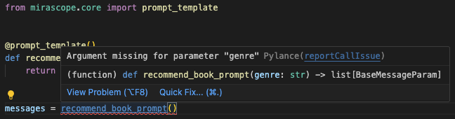
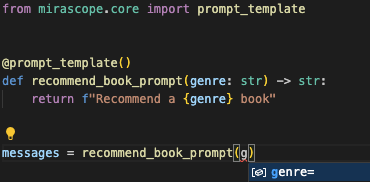
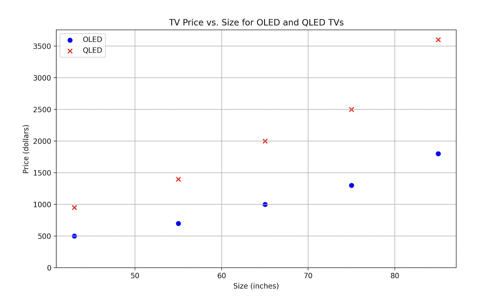

# A Guide to Synthetic Data Generation

Synthetic data generation involves creating artificial data that closely imitates the characteristics of real-world data, providing an alternative when real data is difficult to collect, and helping to address data bottlenecks where real-world data is scarce or inaccessible.

Instead of collecting data from actual events or observations, **you use algorithms and models to produce data that replicates the patterns, structures, and statistical attributes found in real datasets**.  

Such data is widely used in industries where real data is either sensitive, unavailable, or limited in scope. In healthcare, for instance, synthetic data lets you test medical systems or train AI models on patient-like records without risking sensitive information.

Similarly, in finance, you can simulate customer transactions for fraud detection and risk analysis without exposing sensitive customer information or confidential business data.

You might want to generate artificial data in order to:

* Save yourself the time and effort of collecting and managing real data yourself.  
* Augment your datasets with synthetic data that covers more scenarios and edge cases; for example, simulating rare instances of poor lighting so your facial recognition model adapts better to such situations.

<!-- more -->

Generating high-quality synthetic data isn’t typically straightforward and you generally need to define rules and constraints, use statistical modeling, etc., which can be tedious and time-consuming.

However, ML models can overcome these challenges due to their ability to generate realistic, contextually rich data because of their understanding of complex patterns and relationships within real-world datasets.

For instance, LLMs are good at generating human-like text such as product reviews or chatbot responses, as well as producing structured data that reflects statistical patterns and dependencies.

In this article, we explain how synthetic data generation works, its challenges, and some best practices for producing it.

We also show an example of how to generate synthetic data using [Mirascope](https://github.com/mirascope/mirascope), our lightweight and user-friendly LLM toolkit.

## Three Types of Synthetic Data

Synthetic data can be classified into three broad categories based on the extent to which it replicates original data:

### Fully Synthetic Data

This data is generated from scratch using algorithms and doesn’t involve directly copying, modifying, or extracting information from real-world datasets. It’s commonly used in model training to simulate real scenarios without exposing sensitive data.

This is ideal for tasks like generating an artificial dataset of customer demographics (e.g., age, income level, etc.) for market analyses, such as studying audience behavior and consumer trends — while avoiding the risk of exposing real customer information.

### Partially Synthetic Data

Partially synthetic data replaces only the sensitive or identifiable parts of a real dataset with synthetic values. This makes the data unusable for identification while still preserving some of the statistical patterns of the original dataset.

For example, in a customer database, details like names, addresses, or phone numbers might be replaced with generic identifiers or randomly generated values (yet realistic data)  that can’t be traced back to real individuals.

### Hybrid Synthetic Data

Lastly, hybrid synthetic data takes data from a real dataset and combines this with fake data that still preserves real-world patterns.

For example, if a company wants to analyze customer buying trends, they could mix synthetic data with real sales data to get useful insights for predictive modeling or market analysis.

## 5 Ways of Generating Synthetic Data

The choice of technique below depends on your use case, your data’s characteristics, and the desired level of realism.

For instance, if you’re working with simple datasets having well-defined statistical distributions, you might use a statistical distribution or rule-based generation technique to create the data.

But for [complex applications](https://mirascope.com/blog/llm-applications/) requiring high realism, such as image generation or natural language processing, more advanced techniques like deep learning models or LLMs would be preferred.

### 1. Statistical Distribution

This involves analyzing the way data values are spread out or organized within a dataset and using that information to generate synthetic data with similar statistical properties.

Take a dataset of people's heights, for instance: most heights might cluster around a certain average (e.g., 5' 7") with fewer people being very short or very tall. This means you can create and apply a normal bell curve to the data.

### 2. Rule-based Generation

With this method, you create synthetic data using predefined rules or logic. It works well when the patterns in the data are known in advance and need to follow specific formats or constraints.

For example, you can use rule-based generation to produce random phone numbers in the format of (123) 456-7890, where rules define the length and placement of digits.

This approach is commonly used for testing systems or creating datasets for validation purposes, where consistency and adherence to strict formats are important.

### 3. Deep Learning Models

Deep learning uses machine learning techniques like neural networks to create synthetic data that looks and behaves like real data. Two common techniques used in this category are Generative Adversarial Networks (GANs) and Variational Autoencoders (VAEs).

GANs work by using two neural networks: a generator and a discriminator. The generator creates fake data, while the discriminator evaluates how realistic the generated data is, compared to real data.

Through this iterative process, the generator will optimize it until it produces data so realistically that the discriminator can’t tell the difference.

VAEs, on the other hand, compress data into a simplified form and then reconstruct it, creating new data points that resemble the original data. These methods are especially useful for generating diverse and realistic datasets, like synthetic images (e.g., creating realistic faces) and medical data (e.g., generating X-rays for training artificial intelligence models).

### 4. Agent-Based Modeling

Agent-based modeling (ABM) is a method for generating synthetic data by simulating the behaviors and interactions of individual entities, known as agents, within a system.

Each agent operates based on predefined rules or characteristics and can represent anything from a person to an organization or even a physical object. By observing how these agents interact with each other and their environment, realistic and complex data can be created.

For example, in a retail store simulation, each customer (agent) might have unique preferences, budgets, and shopping habits. The model would simulate how they move through the store, interact with products, and make purchase decisions.

### 5. Large Language Models

Generating synthetic data with LLMs allows you to create high-quality datasets without the traditional process of gathering, cleaning, and annotating data manually.

Instead of relying on humans to prepare data, these models can quickly generate diverse datasets often with less reliance on domain-specific rules or statistical modeling.

Thanks to their ability to capture complex relationships and implicit knowledge from vast amounts of training data, they’re especially effective at generating data across broad categories or simulating intricate scenarios that traditional methods can’t easily replicate.

LLMs are preferred in situations where:

* The relationships among data are especially hard or tricky to model through rules or statistics.  
* The resulting data should be diverse and realistic, not restricted to simplified patterns that don’t capture the complexity of real-world variations.  
* The resulting data shouldn’t expose sensitive information.  
* The resulting data should be largely unstructured, like text, images, audio, and video (which mimic human creativity), rather than, say, a series of numerical data.

## Challenges in Generating Synthetic Data

### Generating Data That’s Realistic Enough to Match Real-World Data

If the artificial data doesn’t accurately represent the patterns, relationships, and structures of actual data, machine learning models trained on it might not do well when applied to real-world scenarios.

For example, if synthetic customer data doesn’t reflect real buying behaviors, a recommendation model trained on it might not make useful suggestions. Ensuring this level of realism is difficult because real-world data often contains subtle, complex patterns that are hard to replicate artificially.

### Overcoming Bias in the Training Data

There’s a risk that any biases in the original dataset can be carried over or even made worse in the synthetic version. Biases could include patterns that unfairly favor or disadvantage certain groups (e.g., based on gender, race, or socioeconomic status).

If these biases are not carefully addressed during the generation process, AI models trained on this data may replicate unfair or discriminatory outcomes.

These effects can be quite real, for instance, when a hiring algorithm trained on synthetic data that reflects a bias against certain demographics unfairly rejects qualified candidates from certain groups.

### Capturing Domain-Specific Knowledge

While the usual methods for generating synthetic data produce datasets that are statistically accurate, they often lack the detailed complexities and domain-specific [knowledge](https://mirascope.com/blog/how-to-build-a-knowledge-graph/) needed to represent real-world scenarios effectively.

In healthcare, for example, synthetic patient data must reflect medical realities, like accurate disease progression or treatment outcomes, which can’t be captured by traditional methods like statistical modeling or pre-defined rules.

Plus, evaluating the quality and relevance of the data further complicates the process, as it’s not always easy to measure how accurately the synthetic data reflects the specific characteristics, constraints, and complexities of the domain it represents.

## How to Use an LLM to Generate Synthetic Data: Example  

As we’ve seen, language models are great at learning and representing complex patterns from vast amounts of data.

Below, we walk you through [an example](https://mirascope.com/tutorials/more_advanced/generating_synthetic_data/) of using OpenAI's GPT-4o-mini to create ecommerce data on home appliances, including attributes like name, price, and inventory.

The main libraries we’ll use are:

* Mirascope for [prompting](https://mirascope.com/blog/advanced-prompt-engineering/), output parsing, and reliable validation  
* Pydantic for defining and validating the schema used for synthetic data generation  
* Pandas DataFrames for managing the generated data

### Set Up the Environment

First, let’s install the required packages:

```bash
pip install "mirascope[openai]" pandas
```

Next, store your API key for OpenAI in the environment variable.

```python
import os

os.environ["OPENAI_API_KEY"] = "YOUR_API_KEY"
# Set the appropriate API key for the provider you're using
```

### Generate Synthetic Data as DataFrames

DataFrames, provided by the pandas library, are tables that offer a row-and-column format — similar to spreadsheets — that are perfect for working with ecommerce data.

We use a DataFrame to define the structure of the data to be generated by the LLM, while using Pydantic’s `BaseModel` class to enforce this structure (e.g., Pydantic provides error checking and type safety at runtime):

```python
from typing import Any, Literal

import pandas as pd

class DataFrameGenerator(BaseModel):
    data: list[list[Any]] = Field(
        description="the data to be inserted into the dataframe"
    )
    column_names: list[str] = Field(description="The names of the columns in data")

    def append_dataframe(self, df: pd.DataFrame) -> pd.DataFrame:
        return pd.concat([df, self.generate_dataframe()], ignore_index=True)

    def generate_dataframe(self) -> pd.DataFrame:
        return pd.DataFrame(dict(zip(self.column_names, self.data, strict=False)))


@openai.call(model="gpt-4o-mini", response_model=DataFrameGenerator)
@prompt_template(
    """
    Generate {num_datapoints} random but realistic datapoints of items which could
    be listed in an e-commerce fashion store. Generate your response as `data` and
    `column_names`, so that a pandas DataFrame may be generated with:
    `pd.DataFrame(data, columns=column_names)`.

    Format:
    ProductName, Price, Stock

    ProductName - the name of the fashion product
    Price - the price of an individual product, in dollars (include cents)
    Stock - the quantity of the item available in stock
    """
)
def generate_df_data(num_datapoints: int): ...

df_data = generate_df_data(5)
df = df_data.generate_dataframe()
print(df)
>
```

|---|---|---|---|
| 0 | ProductName | Price | Stock |
| 1 | Leather Jacket | 149.99 | 20 |
| 2 | Sneakers | 89.99 | 50 |

In the code above, `generate_df_data` specifies how the language model should generate the data and indicates that five rows of data should be generated.

The `@prompt_template` decorator provides formatting instructions for the LLM, and the call decorator `@openai_call` defines both the language model to use and the formatting of the output return type via a `response_model`, which is specified by the Pydantic `BaseModel` we defined earlier.

Mirascope’s call decorators easily turn any Python function into a prompt and ensure [colocation](https://mirascope.com/blog/engineers-should-handle-prompting-llms/) of both prompts and their calls.

Colocation simplifies development by keeping the logic, structure, and [prompt](https://mirascope.com/blog/llm-prompt/) content all in one place, improving readability, maintainability, and reducing context-switching for developers.

This differs from practices encouraged by other major [LLM frameworks](https://mirascope.com/blog/llm-frameworks/) that don’t promote colocation, with the effect that prompts, logic, and configuration can get scattered around the codebase, leading to greater challenges in debugging, testing, and iterating on functionality.

Mirascope’s call decorators are also model agnostic, requiring minimal code changes for switching LLM providers (our library interfaces with [many popular providers](https://mirascope.com/WELCOME/)).

Mirascope’s `response_model` parameter lets you take full advantage of Pydantic’s type annotations, which integrate features like autocomplete, type hints, and linting directly in your IDE.

These allow you to catch potential errors like mismatched data types or missing fields before you even run your code:



We also offer auto suggestions:



This automates validation of synthetic data outputs through structured, Pydantic-inspired response models.

### Append Data to a DataFrame

You can add new rows to an existing DataFrame by changing the prompt slightly and using the `append_dataframe()` method that was defined earlier for `DataFrameGenerator`:

```python
@openai.call(model="gpt-4o-mini", response_model=DataFrameGenerator)
@prompt_template(
    """
    Generate {num_datapoints} random but realistic datapoints of items which would
    make sense to the following dataset:
    {df}
    Generate your response as `data` and
    `column_names`, so that a pandas DataFrame may be generated with:
    `pd.DataFrame(data, columns=column_names)` then appended to the existing data.
    """
)
def generate_additional_df_data(num_datapoints: int, df: pd.DataFrame): ...

df_data = generate_additional_df_data(5, df)
df = df_data.append_dataframe(df)
print(df)
```

|---|---|---|---|
| 0 | ProductName | Price | Stock |
|1 | Leather Jacket | 149.99 | 20 |
|2 | Sneakers | 89.99 | 50 |
|3 | Handbag | 129.99 | 15 |
|4 | Denim Jeans | 49.99 | 40 |
|5 | Cotton Shirt | 29.99 | 60 |

### Add Constraints to the DataFame

Besides imposing constraints for precise validation (as we did with `DataFrameGenerator`, by extending Pydantic’s `BasePrompt` class), we can also use [prompt](https://mirascope.com/blog/prompt-engineering-examples/) constraints to allow for natural language-defined rules.

Below, we adjust our prompt slightly by specifying that generated data for TVs follow these conditions:

* The price of a TV should roughly match its size — as the size increases, the price should increase proportionally.  
* TVs with "QLED" screens should be 2–3 times more expensive than those with "OLED" screens, assuming both TVs are the same size.

```python
class TV(BaseModel):
    size: int = Field(description="The size of the TV")
    price: float = Field(description="The price of the TV in dollars (include cents)")
    tv_type: Literal["OLED", "QLED"]


@openai.call(model="gpt-4o-mini", response_model=list[TV])
@prompt_template(
    """
    Generate {num_datapoints} random but realistic datapoints of TVs.
    Output the datapoints as a list of instances of TV.

    Make sure to abide by the following constraints:
    QLEDS should be roughly (not exactly) 2x the price of an OLED of the same size
    for both OLEDs and QLEDS, price should increase roughly proportionately to size
    """
)
def generate_tv_data(num_datapoints: int): ...

for tv in generate_tv_data(10):
    print(tv)
```

```plaintext
size=32 price=299.99 tv_type='OLED'
size=32 price=549.99 tv_type='QLED'
size=43 price=399.99 tv_type='OLED'
size=43 price=749.99 tv_type='QLED'
size=55 price=699.99 tv_type='OLED'
size=55 price=1399.99 tv_type='QLED'
size=65 price=999.99 tv_type='OLED'
size=65 price=1999.99 tv_type='QLED'
size=75 price=1299.99 tv_type='OLED'
size=75 price=2499.99 tv_type='QLED'
```

To confirm these constraints you can plot the data using Matplotlib:



## 3 Best Practices for Generating Synthetic Data

A synthetic dataset should ensure realism, relevance, and anonymization. Below are a few recommendations we’ve found helpful for generating high-quality synthetic data:

### 1. Refine and Validate Synthetic Data

Once synthetic data is generated, it’s important to ensure that it aligns with domain-specific relationships and expectations, such as pricing rules or attribute dependencies.

In the last section, our [prompts](https://mirascope.com/blog/prompt-engineering-best-practices/) guided the model to generate outputs that specified TV price and size, aligning with domain-specific constraints.

We also [validated generated outputs](https://mirascope.com/blog/llm-evaluation/) by using Pydantic schemas, which enforce strict adherence to the defined structure, types, and constraints.

### 2. Balance Realism and Diversity

You should also find a middle ground between realism and diversity: if the synthetic data is too similar to the real data, it risks overfitting where the models trained on it perform well on the training data but poorly on new data.

Conversely, if the synthetic data is too random and doesn't capture the underlying patterns and structures of the real data, it loses realism and won’t be effective for training or testing models. Ultimately, the goal should be to ensure that your synthetic data is both representative of real-world data and varied enough to prevent overfitting and protect data privacy.

### 3. Use Domain Expertise

Involving subject matter experts (SMEs) in your workflows can ensure the generated data is both relevant and accurate for its intended purpose.

For example, in education, student performance data should reflect real-world trends, like how grades vary between math and literature or how attendance affects success. Teachers and school staff can provide insights to make the data mirror actual classroom conditions.

This collaboration ensures the data is valuable for tasks like spotting struggling students, improving teaching methods, or designing better curricula.

## Generate Realistic and Anonymous Data with Mirascope

Mirascope lets you leverage native Python and generative AI to create artificial datasets — no complicated setup required.

Its rigorous and structured data validation ensures the generated data is reliable and free from private or identifiable information, making it safe and compliant for use in downstream applications.

Want to learn more? You can find Mirascope code samples both on our [documentation site](https://mirascope.com/) and the [GitHub repository](https://github.com/mirascope/mirascope).
