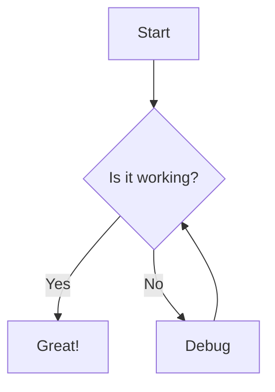

# Heading 1
## Heading 2
### Heading 3
#### Heading 4
##### Heading 5
###### Heading 6


```python
@llm.call(provider="$PROVIDER", model="$MODEL")
def get_capital(country: str) -> str:
    return f"What is the capital of {country}?"
```

```
The capital of Japan is Tokyo.
```
<TabbedSection showLogo={true}>
<Tab value="Shorthand">
```python
from mirascope import llm
from pydantic import BaseModel
```
</Tab>
<Tab value="Template">
```python
from mirascope import llm, prompt_template
from pydantic import BaseModel
```
</Tab>
</TabbedSection>

## Text Formatting

Regular paragraph text. Lorem ipsum dolor sit amet, consectetur adipiscing elit. Nullam eget justo nec nisl tincidunt tincidunt.

**Bold text** and *italic text* and ~~strikethrough text~~.

A [link to somewhere](#) looks like this.

## Lists

Unordered list:
- Item 1
- Item 2
  - Nested item 2.1
  - Nested item 2.2
- Item 3

Ordered list:
1. First item
2. Second item
   1. Nested item 2.1
   2. Nested item 2.2
3. Third item

## Blockquotes

> This is a blockquote. It can span multiple lines and is useful for highlighting important information or quotes.

## Code

Inline `code` looks like this.

Code block:

```javascript
// JavaScript code example
function greeting(name) {
  console.log(`Hello, ${name}!`);
  return `Hello, ${name}!`;
}

greeting("World");
```

Python code:

```python
# Python code example
def greeting(name):
    print(f"Hello, {name}!")
    return f"Hello, {name}!"

greeting("World")
```

## Tables

<div className="overflow-x-auto">
  <table className="min-w-full divide-y divide-border my-6">
    <thead>
      <tr>
        <th className="px-4 py-2 bg-muted text-left text-sm font-medium">Name</th>
        <th className="px-4 py-2 bg-muted text-left text-sm font-medium">Type</th>
        <th className="px-4 py-2 bg-muted text-left text-sm font-medium">Default</th>
        <th className="px-4 py-2 bg-muted text-left text-sm font-medium">Description</th>
      </tr>
    </thead>
    <tbody>
      <tr>
        <td className="px-4 py-2 border-t border-border">id</td>
        <td className="px-4 py-2 border-t border-border">string</td>
        <td className="px-4 py-2 border-t border-border">-</td>
        <td className="px-4 py-2 border-t border-border">Unique identifier</td>
      </tr>
      <tr>
        <td className="px-4 py-2 border-t border-border">name</td>
        <td className="px-4 py-2 border-t border-border">string</td>
        <td className="px-4 py-2 border-t border-border">-</td>
        <td className="px-4 py-2 border-t border-border">Display name</td>
      </tr>
      <tr>
        <td className="px-4 py-2 border-t border-border">enabled</td>
        <td className="px-4 py-2 border-t border-border">boolean</td>
        <td className="px-4 py-2 border-t border-border">false</td>
        <td className="px-4 py-2 border-t border-border">Whether it's enabled</td>
      </tr>
      <tr>
        <td className="px-4 py-2 border-t border-border">count</td>
        <td className="px-4 py-2 border-t border-border">number</td>
        <td className="px-4 py-2 border-t border-border">0</td>
        <td className="px-4 py-2 border-t border-border">Item count</td>
      </tr>
    </tbody>
  </table>
</div>

# Custom Components

## Callouts


<Note>
  This is a note callout for informational content.
</Note>

<Note title="Take note">
  This note has a title.
</Note>

<Warning>
  This is a warning callout for important warnings.
</Warning>

<Warning title="Take Warning">
  This Warning has a title.
</Warning>

<Info>
  This is an info callout for additional information.
</Info>

<Info title="Take Info">
  This Info has a title.
</Info>

<Success>
  This is a success callout for positive outcomes.
</Success>

<Success title="Take Success">
  This Success has a title.
</Success>


## Install Snippet

<InstallSnippet package="mirascope" />

## Mermaid Diagram



## Logos and Brand Elements

<ProductLogo size="small" />
<ProductLogo size="medium" />
<ProductLogo size="large" />


## Color Theme Combinations

<h3 className="text-xl font-semibold mb-3">Background + Text Colors</h3>
<ColorThemeDisplay
  bgColors={["bg-background", "bg-muted", "bg-accent"]}
  textColors={[
    "text-foreground",
    "text-primary",
    "text-secondary",
    "text-accent-foreground",
    "text-muted-foreground",
  ]}
/>

<h3 className="text-xl font-semibold mb-3">Semantic Background + Text Colors</h3>
<ColorThemeDisplay
  bgColors={["bg-button-primary", "bg-primary", "bg-secondary", "bg-lilypad-green"]}
  textColors={[
    "text-primary-foreground",
    "text-secondary-foreground",
    "text-accent-foreground",
  ]}
/>

## Cards

<div className="grid grid-cols-1 md:grid-cols-2 gap-4 my-6">
  <div className="p-4 border rounded-lg shadow-sm">
    <h3 className="text-lg font-medium mb-2">Pythonic By Design</h3>
    <p>Our design approach is to remain Pythonic so you can build your way</p>
  </div>
  <div className="p-4 border rounded-lg shadow-sm">
    <h3 className="text-lg font-medium mb-2">Editor Support & Type Hints</h3>
    <p>Rich autocomplete, inline documentation, and type hints to catch errors before runtime</p>
  </div>
  <div className="p-4 border rounded-lg shadow-sm">
    <h3 className="text-lg font-medium mb-2">Provider-Agnostic & Provider-Specific</h3>
    <p>Seamlessly engineer prompts agnostic or specific to various LLM providers</p>
  </div>
  <div className="p-4 border rounded-lg shadow-sm">
    <h3 className="text-lg font-medium mb-2">Comprehensive Tooling</h3>
    <p>Complete suite of tools for every aspect of working with LLM provider APIs</p>
  </div>
</div>
