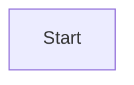
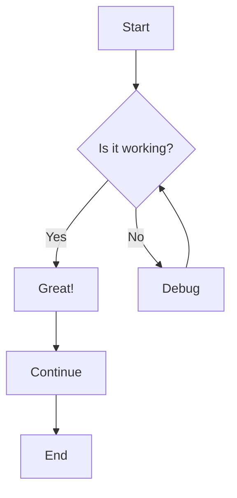
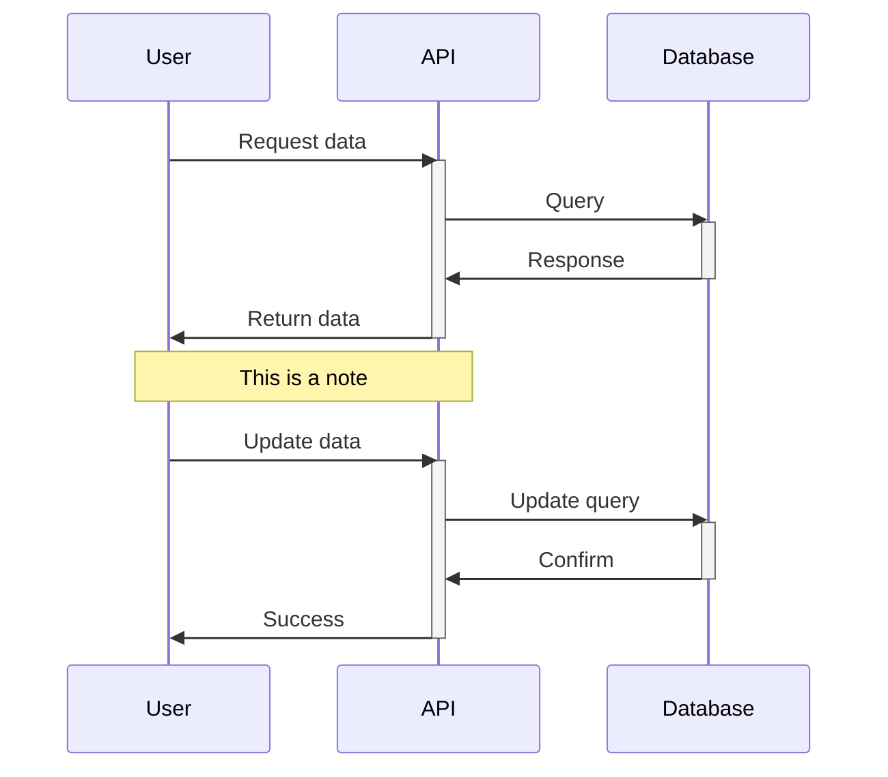
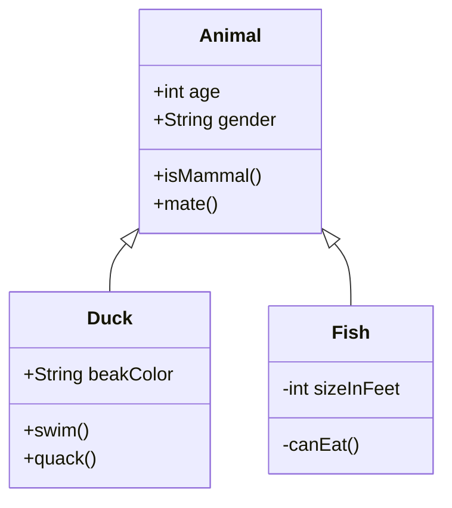
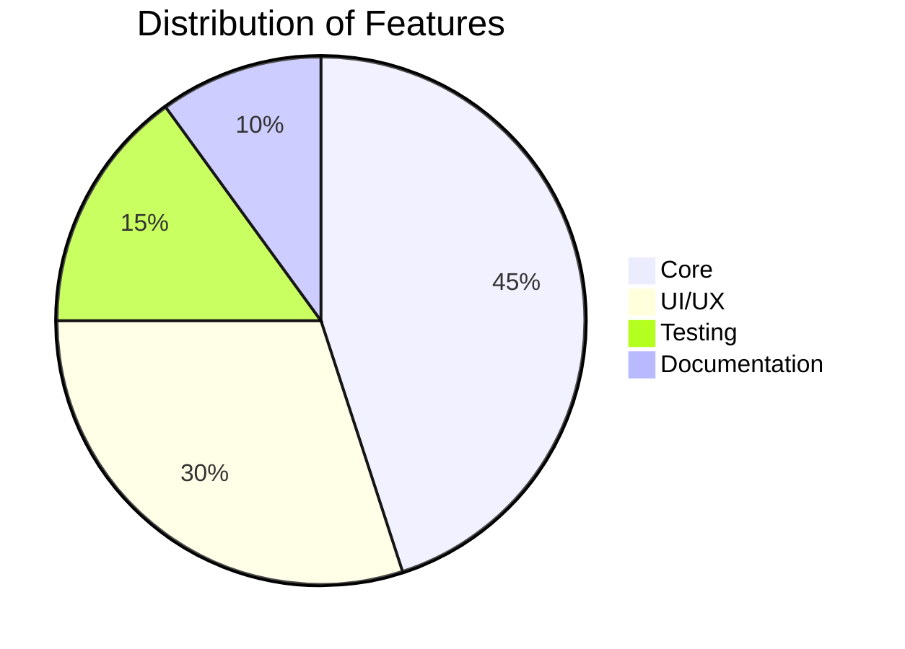
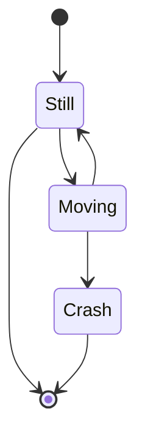
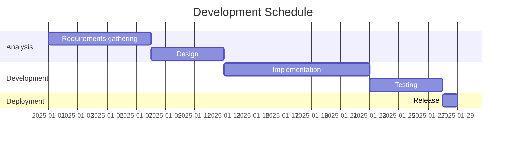
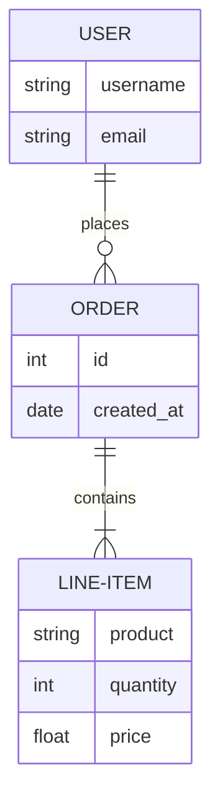
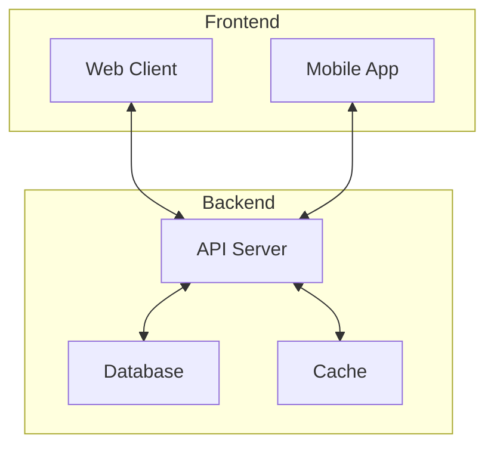
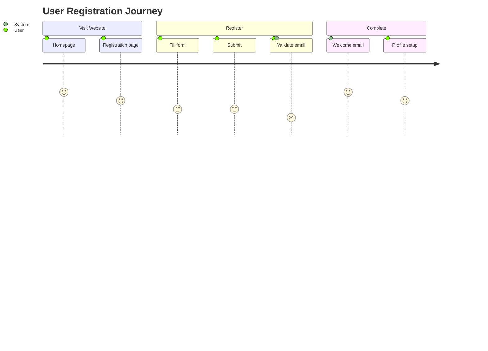

# Mermaid Diagram Test

This page showcases various Mermaid diagram types to test the theme integration.

<Note title="On supporting more diagrams" collapsible={true} defaultOpen={false}>
Rather than using the Mermaid theme system (which was brittle), we're overriding mermaid styling using
custom css in MermaidDiagram.module.css. 

The benefit of this is that we automatically benefit from the css theme system (including light/dark,
product themes, etc).

If you have a chart that isn't looking good yet:
- Copy the raw generated svg into Claude
- Ask it to help generate the css you need to override
</Note>

## Flowchart

## Sequence Diagram

## Class Diagram

## Pie Chart

## State Diagram

## Gantt Chart

## Entity Relationship Diagram

## Subgraphs

## Journey Diagram

