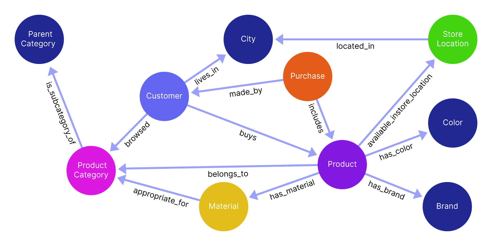
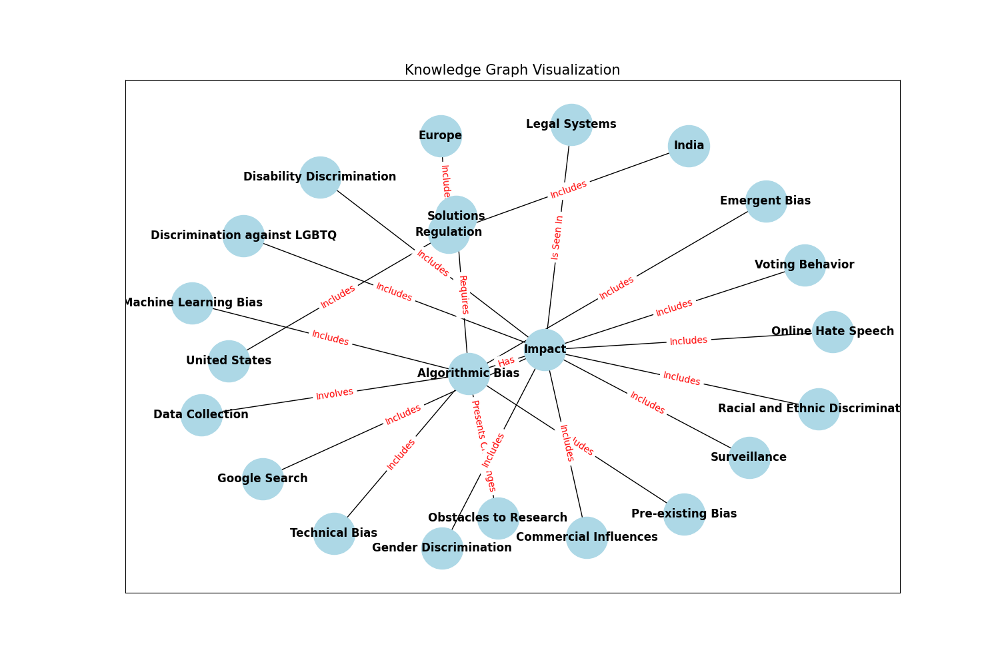

# How to Build a Knowledge Graph from Unstructured Information

A knowledge graph is a structured representation of interconnected information where entities are linked through defined relationships.

Knowledge graphs show you which entities are connected and how they’re related, and are most useful for structuring and giving context to unstructured data (like text, images, and audio), allowing you to:

* Visualize subtle (or hidden) patterns or insights that might not be immediately apparent in traditional data formats.  
* Get accurate and context-aware search results by better connecting related entities and concepts.  
* Bring data together from multiple, often unrelated sources into a single, unified system.

Building a knowledge graph involves setting up these entities and their relationships:

* **Entities** are the primary subjects within the graph — whether people, organizations, places, or events — and each holds attributes relevant to that subject, like a "Person" entity with attributes of name, age, and occupation.
* **Relationships** between entities — often called edges — show how these entities connect and interact, such as a "Person" node being linked to a "Company" node by a "works for" relationship.
* **Properties** add additional context, or metadata like dates or locations, to entities and edges.

Traditionally, building knowledge graphs used to involve bringing together a wide range of disciplines to manually design ontologies, curate data, and develop algorithms for extracting entities and relationships, which required expertise in areas like data science, natural language processing, and semantic web technologies.

Today, **you no longer need to be an expert in graph theory or taxonomies to build your own graph**, especially when LLMs can help simplify entity recognition and relationship extraction.

We dive into key concepts and steps for getting started with knowledge graphs, and show you how to leverage an LLM to build a graph using [Mirascope](https://github.com/mirascope/mirascope), our lightweight toolkit for developing AI-driven applications.

<!-- more -->

## Our Challenges with Using LLMs to Build Knowledge Graphs

Language models change the game when it comes to automating the extraction of entities and relationships from unstructured data, because they understand context and identify complex patterns.

While some LLMs offer SDKs to help developers integrate entity and relationship extraction, these tools are sometimes rigid and introduce redundant code.

Case in point: While working with an early version of the OpenAI SDK during our time at a machine learning company, we ended up writing tons of boilerplate to accomplish seemingly simple tasks.

These issues stem from the fact the code is autogenerated from their API, which prevents them from taking better advantage of language-specific benefits like Mirascope does with decorators for API calls and prompt templates.

This persistent drawback eventually led us to ask **why there weren't easier and more [flexible tools](https://mirascope.com/blog/llm-tools) for building LLM-powered applications**, especially given the rigid, homegrown abstractions of the [big frameworks](https://mirascope.com/blog/llamaindex-vs-langchain).

These considerations led us to create Mirascope, a library that embraces Python’s natural syntax and extensibility, and offers easy, modular integration with existing workflows.

We designed Mirascope to ease the development of LLM applications such as ones building or using knowledge graphs, for example, by providing a model-agnostic interface and built-in validation of language model outputs.

## Building a Knowledge Graph: Start with Your Data

As a first step, define your data sources and use cases as clearly as possible to ensure the graph’s structure will closely align with the real-world entities and relationships that you’re trying to capture.

For example, if you’re building a recommendation engine, you’ll want to focus on core entities like "Product," "Customer," and "Purchase," along with relevant relationships such as "browsed" or "located in."



Structuring the graph to focus specifically on core entities and their most important relationships **keeps it tightly aligned with your use case and allows for efficient retrieval of actionable insights**.

Depth of detail is also important, as different applications require varying levels of granularity in how entities and relationships are represented.

In our recommendation engine example above, you might only need to define broad categories like "Product" and "Customer," whereas you’d need a much finer level of detail for a medical diagnostics use case.

There, every symptom, condition, and interaction would need to be precisely defined and interconnected to support the high standards of accuracy and specificity demanded by the healthcare system.

### Define an Ontology

An **ontology** outlines the graph’s structure, relationships, and properties, and defines how entities are connected and categorized. It’s basically the way you represent information in your knowledge graph.

Some ontologies are simple to design, covering only basic entities and straightforward relationships, whereas others are complex, encompassing detailed hierarchies, multiple layers of relationships, and domain-specific attributes.

Depending on your project’s requirements, you might even consider working with a domain expert to define an ontology with a structure that accurately reflects the data’s entities and relationships.

A well-designed ontology does more than organize data, though. It also makes searching for nodes and relationships faster and easier by establishing a clear semantic structure that guides efficient indexing, reduces ambiguity in entity relationships, and enables more accurate filtering and retrieval of relevant data.

It also grows as your needs grow by allowing new entities, relationships, and attributes to be added with little overhead within the existing structure, ensuring the graph remains adaptable and scalable over time.

(Schemas go hand in hand with ontologies, and in our example of [building a knowledge graph](#building-a-knowledge-graph-example) below, the LLM call generates a JSON schema from your knowledge graph data using Mirascope.)

### Choose a Knowledge Graph

The two main types of knowledge graphs are RDF triple stores and property graphs, described below:

#### RDF Triple Stores

RDF (Resource Description Framework) triple stores represent data in a "subject-predicate-object" structure, or triple, and are best suited for interconnected systems like the web where many sources are shared.

The reason for this is the universality of this "triple," which is a kind of common language that disparate systems can speak with each other.

An example of this is "Alice works for AcmeCorp," which has three parts: `Alice` (subject), `worksFor` (predicate), and `AcmeCorp` (object).

In RDF graphs, nodes are often identified by URIs, making them globally unique and accessible in semantic web contexts. 

Nodes are also primitives, where each triple is a simple statement that connects an entity to an attribute or another entity. Additional details, or properties, are attached via further triples. For example, to state that Alice is 30 years old, we add a triple: `Alice - hasAge - 30`.

RDF has its own query language, [SPARQL](https://www.w3.org/TR/sparql11-query/), which is designed to navigate these semantic triples by allowing users to ask complex questions about relationships between entities, such as finding connections, filtering specific attributes, or exploring patterns within the data.

For example, a SPARQL query could retrieve all employees who have worked on a specific project, find all books by a certain author within a library database, or identify relationships between different diseases and their symptoms in a medical dataset.

Overall, you’ll find the that RDFs have the following pros and cons:

* On the plus side, they enable interoperability, are highly standardized, and work well with formal ontologies.  
* However, managing and querying large RDF datasets can be complex and less intuitive than alternative graph models, especially when you’re scaling highly dynamic or interconnected data.

#### Property Graphs

Property graphs are great for dynamic, interconnected data since they store multiple properties in nodes and edges, and support attribute-rich queries directly on these.

For instance, each node (like a `Person` node) can contain several key-value pairs, such as `name`, `age`, and `occupation`. Relationships (edges) between nodes can also carry properties, such as `reportsTo` making this type of graph advantageous for applications requiring complex queries.

Property graphs are well-supported by databases like Neo4j that use query languages like [Cypher](https://opencypher.org/) to efficiently traverse large, interconnected datasets.

Property graphs have these advantages and disadvantages:

* They easily accommodate complex data structures and support high-performance querying, especially in dense, interconnected networks.  
* On the other hand, they lack a standardized taxonomy or vocabulary, which can lead to challenges with  other web-based data standards.

### Clean, Organize, and Format Your Data

Next, identify, gather, and clean your raw data — sometimes scattered across unstructured sources like web pages, logs, or articles — to transform it into a consistent and structured format:

#### 1. Gather Data and Clean It to Reduce Noise

After identifying and gathering the correct data, remove any irrelevant or noisy information, correct inconsistencies in formatting, and address missing information where possible.

You might consider "tokenizing" text by segmenting it according to words or phrases to enable better recognition of key entities, relationships, and concepts.

#### 2. Standardize and Format for Compatibility

Once cleaned, you should standardize the data to ensure it can be uniformly understood and integrated within the knowledge graph.

This step often involves converting different data formats (like CSV or JSON) into a unified structure compatible with whichever graph database (e.g., Neo4j, NebulaGraph, etc.) you choose.

Standardization also makes it easier to categorize data into distinct entities, relationships, and properties that align with the knowledge graph's structure.

#### 3. Categorize and Align Data with Graph Structure 

The final step is to categorize the information to align it with the graph’s structure. Organize the data into entities, relationships, and properties based on their role within the graph.

For example, a `Person` entity may relate to an `Organization` entity through an `employed_by` relationship. This categorization aligns your data with the semantic model that will form the foundation of your knowledge graph.

Libraries like Mirascope also offer [structured output parsing](https://mirascope.com/blog/langchain-structured-output) to transform raw LLM responses into clean, structured formats that match knowledge graph schemas, reducing errors and ensuring consistent data types across entities and relationships.

### Select a Graph Database

Choosing the right database depends on both your use case and the complexity of your data. 

If your application focuses on:

* Analyzing patterns within highly connected, continuously changing data, then you might go with a **property graph database** (e.g., Neo4j). This represents data as nodes (entities) and edges (relationships), both of which can have properties that add depth and detail. Examples of applications using property graphs include recommendation engines, fraud detection systems, and social networks, all of which require rapid retrieval of complex relationship paths without emphasizing strict semantic structures.  
* Semantic data modeling, data interoperability, and the use of ontologies, then consider an **RDF triple store** (e.g., GraphDB or Stardog). RDF stores are especially well-suited for applications where consistency and structured vocabularies are key, like in academic research networks and healthcare information systems.

### Don’t Boil the Ocean

When building a knowledge graph for the first time, we advise starting with a pilot project that’s focused and limited in scope.

It should include only the essential components needed to test core functionalities like data ingestion and basic querying. By narrowing the scope, you set up a realistic foundation that allows you to learn and refine without the overhead of unnecessary details.

Keep your ontology as lean as possible, limiting it to what’s necessary for the specific use case you’re testing. So if your pilot focuses on customer relationships within an organization, avoid the temptation to include tangentially related areas, like logistics or vendor data, unless they directly impact the project goals.

As your knowledge graph grows, the initial simplicity of your ontology will allow you to expand gradually, adding additional layers and domains in response to changing needs rather than preconceived assumptions.

## Building a Knowledge Graph: Example

Below we show you an example of how to build a property graph around the question, "*What factors contribute to algorithmic bias in data collection and selection?*" We’ll base our graph on unstructured text from the Wikipedia article on [algorithmic bias](https://en.wikipedia.org/wiki/Algorithmic_bias).

We’ll also use Mirascope to [define and build](https://mirascope.com/blog/advanced-prompt-engineering) the property graph, along with:

* Pydantic, to define the graph’s nodes and edges  
* OpenAI’s GPT-4o mini model, to parse the Wikipedia page and handle entity recognition and relationship extraction  
* NetworkX and Matplotlib for visual rendering of the graph  
* Neo4j at the end for improving graph storage and querying

Our example is based on a Mirascope tutorial on [building a knowledge graph](https://mirascope.com/docs/tutorials/more_advanced/knowledge_graph/).

### Set Up the Environment

First we install Mirascope and its dependencies, as well as the other libraries we’ll be using:

```py
!pip install "mirascope[openai]"
# (Optional) For visualization
!pip install matplotlib networkx
# (Optional) For parsing HTML
!pip install beautifulsoup4 requests
```

### 1. Define and Initialize the Knowledge Graph

As a first step, we define our knowledge graph using a Pydantic `BaseModel` to specify the graph’s nodes and edges and enforce data validation, type safety, and consistency across all entities and relationships in the graph.

For example, Pydantic allows you to easily require that every node has an `id`, `type`, and optional `properties` dictionary, and if this isn’t the case, it’ll generate an error at runtime.

Pydantic models also convert code into JSON schemas for storing, transmitting, or displaying knowledge graph data, which is useful for working with APIs and web applications.

Below is our defined property graph:

```py
from pydantic import BaseModel, Field

class Edge(BaseModel):
    source: str = Field(..., description="The source node of the edge")
    target: str = Field(..., description="The target node of the edge")
    relationship: str = Field(
        ..., description="The relationship between the source and target nodes"
    )

class Node(BaseModel):
    id: str = Field(..., description="The unique identifier of the node")
    type: str = Field(..., description="The type or label of the node")
    properties: dict | None = Field(
        ..., description="Additional properties and metadata associated with the node"
    )


class KnowledgeGraph(BaseModel):
    nodes: list[Node] = Field(..., description="List of nodes in the knowledge graph")
    edges: list[Edge] = Field(..., description="List of edges in the knowledge graph")
```

We set up `Edge` to represent the relationship between two nodes in the graph, and `Node` to define individual entities. We also define properties and relationships for each.

Our `KnowledgeGraph` class serves as the container for all nodes and edges, and specifies the graph’s overall structure.

### 2. Create the Knowledge Graph

We create a structured knowledge graph from the text of a Wikipedia article in Python:



```py
import os
from bs4 import BeautifulSoup
import requests
from mirascope.core import openai, prompt_template

os.environ["OPENAI_API_KEY"] = "YOUR_API_KEY"
# Set the appropriate API key for the provider you're using 

@openai.call(model="gpt-4o-mini", response_model=KnowledgeGraph)
@prompt_template(
    """
    SYSTEM:
    Your job is to create a knowledge graph based on the given article text.

    Example:
    John and Jane Doe are siblings. Jane is 25 and 5 years younger than John.
    Node(id="John Doe", type="Person", properties={{"age": 30}})
    Node(id="Jane Doe", type="Person", properties={{"age": 25}})
    Edge(source="John Doe", target="Jane Doe", relationship="Siblings")

    USER: Generate a knowledge graph based on this article text: {text}
    """
)
def generate_knowledge_graph(url: str) -> openai.OpenAIDynamicConfig:
    html = requests.get(url).text
    text = BeautifulSoup(html, "html.parser").get_text()
    return {"computed_fields": {"text": text}}


kg = generate_knowledge_graph("https://en.wikipedia.org/wiki/Algorithmic_bias")
```



In the code sample above, we:

* Read and clean the Wikipedia article’s HTML content using `requests` and `BeautifulSoup`, turning the content into plain text.  
* Send the article text to the OpenAI model via `@openai.call(model="gpt-4o-mini",response_model=KnowledgeGraph)`; this uses Mirascope’s model-agnostic call decorator, which we can easily attach to any Python function to turn it into an LLM call while ensuring type safety and consistency across providers; it also generates a JSON representation of the knowledge graph that’s parsed and validated against the defined Pydantic schema. Remember to set the API key for your provider  
* Specify the instructions to the language model with our `@prompt_template(...)` decorator, so that it understands the structure and requirements of the knowledge graph it’ll produce; note also the user question will guide graph generation. Finally, using decorators for our LLM call and template allows us to colocate calls with prompts, easing configuration by [keeping prompt logic and API calls together](https://mirascope.com/blog/engineers-should-handle-prompting-llms), which improves readability and maintainability.  
* Use `computed_fields` to return cleaned text from the Wikipedia article as a prompt template variable; this text, along with the user’s question, is passed to the LLM to generate the knowledge graph.

Note that in the `@openai.call`, we specify the type of response we want from the language model using Mirascope’s response model, which is based on Pydantic.

Here, we indicate we want the LLM’s output to be formatted as a `KnowledgeGraph`. This way of structuring responses enables Mirascope’s type checking and validation features, ensuring that the output conforms to the expected `KnowledgeGraph` format and making it easier to integrate into downstream applications.

Note also we use computed fields in `generate_knowledge_graph` so the function can take a URL and handle loading the text internally. You could also just pass the text in directly and load it outside the function.

Lastly, we print the contents of our knowledge graph:

```py
print(kg)
```

```
nodes=[Node(id='Algorithmic Bias', type='Concept', properties={}), Node(id='Data Collection', type='Method', properties={}), Node(id='Machine Learning Bias', type='Type', properties={}), Node(id='Pre-existing Bias', type='Type', properties={}), Node(id='Technical Bias', type='Type', properties={}), Node(id='Emergent Bias', type='Type', properties={}), Node(id='Impact', type='Effect', properties={}), Node(id='Commercial Influences', type='Impact', properties={}), Node(id='Voting Behavior', type='Impact', properties={}), Node(id='Gender Discrimination', type='Impact', properties={}), Node(id='Racial and Ethnic Discrimination', type='Impact', properties={}), Node(id='Legal Systems', type='Application', properties={}), Node(id='Online Hate Speech', type='Impact', properties={}), Node(id='Surveillance', type='Application', properties={}), Node(id='Discrimination against LGBTQ', type='Impact', properties={}), Node(id='Disability Discrimination', type='Impact', properties={}), Node(id='Google Search', type='Application', properties={}), Node(id='Obstacles to Research', type='Challenge', properties={}), Node(id='Solutions', type='Concept', properties={}), Node(id='Regulation', type='Concept', properties={}), Node(id='Europe', type='Region', properties={}), Node(id='United States', type='Region', properties={}), Node(id='India', type='Region', properties={})] edges=[Edge(source='Algorithmic Bias', target='Data Collection', relationship='Involves'), Edge(source='Algorithmic Bias', target='Machine Learning Bias', relationship='Includes'), Edge(source='Algorithmic Bias', target='Pre-existing Bias', relationship='Includes'), Edge(source='Algorithmic Bias', target='Technical Bias', relationship='Includes'), Edge(source='Algorithmic Bias', target='Emergent Bias', relationship='Includes'), Edge(source='Algorithmic Bias', target='Impact', relationship='Has'), Edge(source='Impact', target='Commercial Influences', relationship='Includes'), Edge(source='Impact', target='Voting Behavior', relationship='Includes'), Edge(source='Impact', target='Gender Discrimination', relationship='Includes'), Edge(source='Impact', target='Racial and Ethnic Discrimination', relationship='Includes'), Edge(source='Impact', target='Legal Systems', relationship='Is Seen In'), Edge(source='Impact', target='Online Hate Speech', relationship='Includes'), Edge(source='Impact', target='Surveillance', relationship='Includes'), Edge(source='Impact', target='Discrimination against LGBTQ', relationship='Includes'), Edge(source='Impact', target='Disability Discrimination', relationship='Includes'), Edge(source='Impact', target='Google Search', relationship='Includes'), Edge(source='Algorithmic Bias', target='Obstacles to Research', relationship='Presents Challenges'), Edge(source='Algorithmic Bias', target='Solutions', relationship='Requires'), Edge(source='Solutions', target='Regulation', relationship='Includes'), Edge(source='Regulation', target='Europe', relationship='Includes'), Edge(source='Regulation', target='United States', relationship='Includes'), Edge(source='Regulation', target='India', relationship='Includes')]
```

### 3. Query the Knowledge Graph

We then create a `query_kg` function to answer a question based on the knowledge graph we just created:

```py
@openai.call(model="gpt-4o-mini")
@prompt_template(
    """
    SYSTEM:
    Answer the following question based on the knowledge graph.

    Knowledge Graph:
    {knowledge_graph}

    USER:
    {question}
    """
)
def query_kg(question: str, knowledge_graph: KnowledgeGraph): ...


response = query_kg(
    "What factors contribute to algorithmic bias in data collection and selection?",
    kg,
)
print(response.content)
```

```
Factors that contribute to algorithmic bias in data collection and selection include:

1. **Pre-existing Bias**: This refers to biases present in the societal context or in historical data that can be reflected in the dataset used for training algorithms.

2. **Technical Bias**: This arises from the methods and techniques used in data processing, feature selection, and algorithm design that may favor certain groups over others.

3. **Data Collection Methods**: If the data collection process is flawed or if certain groups are underrepresented or overrepresented in the data, this can lead to biased outcomes.

4. **Emergent Bias**: This occurs when biases emerge over time as algorithms interact with the environment, leading to skewed results that reflect underlying patterns in the data rather than objective truths.

5. **Sampling Bias**: If the data collected is not representative of the overall population, it can lead to biased conclusions when the algorithm is applied.

6. **Labeling Bias**: The way data is labeled can introduce bias, especially if human judgment influenced the labeling process, leading to inconsistencies and subjective interpretations.

7. **Domain Knowledge**: Lack of understanding about the target domain can lead to incorrect assumptions in data collection and feature selection processes.

Addressing these factors is crucial for minimizing algorithmic bias and ensuring fair and equitable outcomes in machine learning applications.
```

### 4. Render Your Graph

As a last step we use NetworkX and Matlab to draw the edges and nodes of our knowledge graph:

```py
import matplotlib.pyplot as plt
import networkx as nx


def render_graph(kg: KnowledgeGraph):
    G = nx.DiGraph()

    for node in kg.nodes:
        G.add_node(node.id, label=node.type, **(node.properties or {}))

    for edge in kg.edges:
        G.add_edge(edge.source, edge.target, label=edge.relationship)

    plt.figure(figsize=(15, 10))
    pos = nx.spring_layout(G)

    nx.draw_networkx_nodes(G, pos, node_size=2000, node_color="lightblue")
    nx.draw_networkx_edges(G, pos, arrowstyle="->", arrowsize=20)
    nx.draw_networkx_labels(G, pos, font_size=12, font_weight="bold")

    edge_labels = nx.get_edge_attributes(G, "label")
    nx.draw_networkx_edge_labels(G, pos, edge_labels=edge_labels, font_color="red")

    plt.title("Knowledge Graph Visualization", fontsize=15)
    plt.show()


render_graph(kg) 
```



### 5. Using Neo4j as the Knowledge Graph Driver

First, you'll need to set up your Neo4j graph database, which you can do [locally on your desktop](https://neo4j.com/product/developer-tools/#desktop) or through Neo4j's fully managed system. For this example, we'll be using the local desktop version.

We created a local "KG Blog Post DBMS" database with the password "password" for the example.

Next, you'll need to install the neo4j package and connect using the Python GraphDatabase driver:



```py
!pip install neo4j

from neo4j import GraphDatabase, Driver


def load_knowledge_graph(driver: Driver, kg: KnowledgeGraph, clear_first: bool = True):
    with driver.session() as session:
        # Clear existing data if requested
        if clear_first:
            session.run("MATCH (n) DETACH DELETE n")

        # Create nodes
        for node in kg.nodes:
            session.run(
                f"CREATE (n:{node.type} $props)",
                props={"id": node.id, **(node.properties or {})},
            )

        # Create edges
        for edge in kg.edges:
            # Replace spaces with underscores in relationship name
            relationship = edge.relationship.replace(" ", "_")

            session.run(
                f"""
                MATCH (source {{id: $source_id}})
                MATCH (target {{id: $target_id}})
                CREATE (source)-[:{relationship}]->(target)
                """,
                source_id=edge.source,
                target_id=edge.target,
            )


driver = GraphDatabase.driver("bolt://localhost:7687", auth=("neo4j", "password"))

try:
    driver.verify_connectivity()
    print("Connected to Neo4j!")
except Exception as e:
    print(f"Failed to connect to Neo4j: {e}")


load_knowledge_graph(driver, kg)


@openai.call("gpt-4o-mini", output_parser=str)
def convert_query_to_cypher(query: str) -> str:
    return f"""Given a Neo4j knowledge graph about algorithmic bias and related concepts with the following structure:

Node Types:
- Concept (e.g., "Algorithmic Bias")
- Method (e.g., "Data Collection")
- Type (e.g., "Machine Learning Bias")
- Effect (e.g., "Impact")
- Impact (e.g., "Commercial Influences")
- Application (e.g., "Legal Systems")
- Challenge (e.g., "Obstacles to Research")
- Region (e.g., "Europe")

Valid Relationship Types:
- Involves
- Includes
- Has
- Is_Seen_In
- Presents_Challenges
- Requires

Each node has these properties:
- id: string identifier
- properties: dictionary of additional metadata

Valid relationship patterns include:
- (Concept)-[Involves|Includes|Has]->(Type|Effect|Impact)
- (Method)-[Is_Seen_In]->(Application|Region)
- (Concept|Method)-[Presents_Challenges]->(Challenge)
- (Application)-[Requires]->(Method)

Convert this question into a Cypher query that will answer it: {query}

Use ONLY the node labels and relationship types listed above.

Example conversions:
"What challenges are presented by algorithmic bias?" ->
MATCH (c:Concept {{id: 'Algorithmic Bias'}})-[r:Presents_Challenges]->(ch:Challenge)
RETURN c.id, type(r), ch.id

"Where is data collection used?" ->
MATCH (m:Method {{id: 'Data Collection'}})-[r:Is_Seen_In]->(a:Application)
RETURN m.id, type(r), a.id

"What types of bias exist in machine learning?" ->
MATCH (c:Concept)-[r:Includes]->(t:Type)
WHERE c.id CONTAINS 'Bias'
RETURN c.id, type(r), t.id

Please convert this question: {query}

Output only the converted Cypher query with no blocks."""


@openai.call(model="gpt-4o-mini")
@prompt_template(
    """
    SYSTEM:
    Answer the following question based on the knowledge graph query results.

    Results: {results}

    USER:
    {question}
    """
)
def query_neo4j_kg(question: str, driver: Driver) -> openai.OpenAIDynamicConfig:
    cypher_query = convert_query_to_cypher(question)
    with driver.session() as session:
        results = list(session.run(cypher_query, {}).data())
    return {"computed_fields": {"results": results}}


response = query_neo4j_kg(
    "What are the key concepts related to algorithmic bias in the knowledge graph?",
    driver,
)
print(response.content)

driver.close()
```



In the code sample above, we:

* Implement a method `load_knowledge_graph` for loading the Pydantic knowledge graph into our Neo4j graph database.  
* We connect to the Neo4j driver instance and verify our connection, running the load function once the connection is verified.  
* We implement a `convert_query_to_cypher` method using Mirascope to make an LLM API call to convert the given user's query into a Cypher query for querying the graph database. Notice that we've written the prompt specifically to handle the relationships present in the graph database, which we've identified by inspecting the resulting structure from loading the knowledge graph into the Neo4j database.  
* We update our `query_kg` method to `query_neo4j_kg` to query the Neo4j graph database first and then use dynamic configuration to insert the results into the prompt as a computed field.  
* We run the method on our question and print the resulting response content:

```
The key concepts related to algorithmic bias in the knowledge graph are:

1. Data Collection (Involves)
2. Machine Learning Bias (Includes)
3. Pre-existing Bias (Includes)
4. Technical Bias (Includes)
5. Emergent Bias (Includes)
6. Impact (Has)
```

## Unlock Insights Through Knowledge Graphs

Discover new insights and connections within your data by building your knowledge graph with Mirascope. Our toolkit offers [easy prompting](https://mirascope.com/blog/prompt-engineering-examples), data validation, and effortless LLM integration so you can easily map connections, discover patterns, and make better decisions.

Want to learn more about Mirascope’s structured output tools? You can find Mirascope code samples both on our [documentation site](https://mirascope.com/WELCOME) and the [GitHub repository](https://github.com/mirascope/mirascope).
