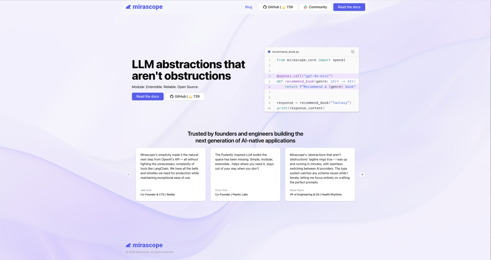
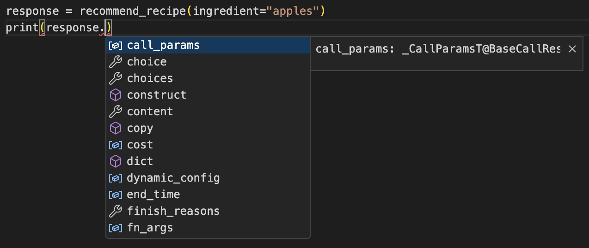
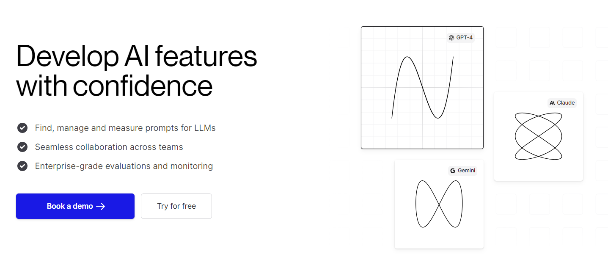
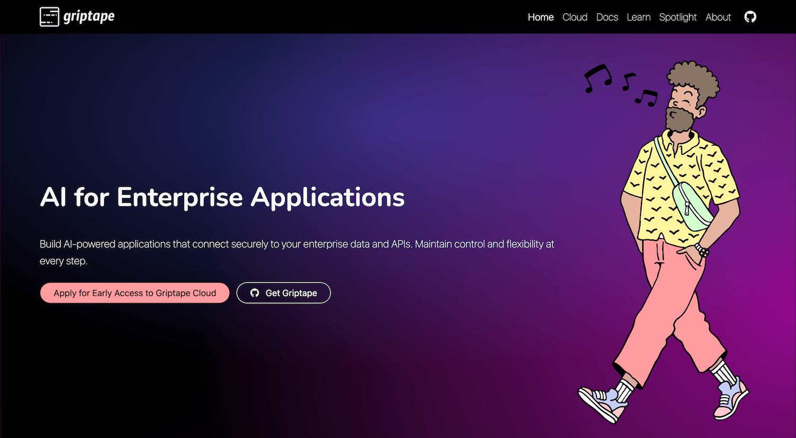

# Top 12 LangChain Alternatives for AI Development

LangChain is a popular Large Language Model (LLM) orchestration framework because:

- It’s a good way to learn concepts and get hands-on experience with natural language processing tasks and building LLM applications.
- Its system of chaining modules together in different ways lets you build complex use cases. LangChain modules offer different functionalities such as interfacing with LLMs or retrieving data from them.
- Its framework is broad and expanding: it offers hundreds of integrations, as well as LangChain Expression Language (LCEL) and other tools for managing aspects like debugging, streaming, and output parsing.
- It has a large and active following on Twitter and Discord, and especially on GitHub. In fact, [according to their blog](https://blog.langchain.dev/langchains-first-birthday/), over 2,000 developers contributed to their repo in their first year of existence.  

<!-- more -->
  ‍
But despite its flexibility and wide range of uses, LangChain might not be the best fit for every project. Here are a few reasons:

- LangChain is relatively new and somewhat experimental, which may lead to instability in some cases.
- Creating dependencies on LangChain might require you to wait when AI providers like OpenAI release new tools and updates.
- Like any framework, LangChain embodies a certain approach to LLM development that you might not universally agree with. For instance, in LangChain you have to wrap everything, even f-strings, into their LCEL and chaining functionality.

If you’re looking for alternatives in certain areas, we’ve organized this list into the following categories:

- [**Prompt engineering tools**](#langchain-alternatives-for-prompt-engineering) to help you optimize interactions with LLMs to get accurate, relevant, or creative responses.
- [**Agent tools and frameworks**](#langchain-alternatives-for-developing-llm-agents) that allow you to build intermediaries between users and LLMs.
- [**LLM orchestration frameworks**](#langchain-alternatives-for-llm-orchestration) that coordinate and manage workflows and data in conjunction with LLMs.
- [**A data extraction framework**](#langchain-alternatives-for-data-extraction) for extracting structured data from LLM-generated text to transform free-form responses into actionable data.

## **LangChain Alternatives for Prompt Engineering**

Prompt engineering tools play the most decisive role in developing LLM applications because they directly influence the quality, relevance, and accuracy of LLM responses.

### **Mirascope**



[Mirascope](https://github.com/mirascope/mirascope) is a toolkit for working with LLMs for lightning-fast, high-quality development. Building with Mirascope feels like writing the Python code you’re already used to writing.

We designed Mirascope with simplicity and reliability in mind:

- Our library uses Pythonic conventions throughout, which makes the code intuitive and easier to understand.‍
- We offer a structured and modular approach to LLM prompting and calls, reducing complexity and enabling you to develop with efficiency and clarity.
- We’ve built data validation and editor support into your prompting and calls via Python and Pydantic, helping you eliminate bugs from the start.

These benefits make prompt development overall more accessible, less error prone, and more productive for developers.

Our three core beliefs around prompt engineering have influenced our approach
in building Mirascope:

1. **Prompt engineering is engineering because prompting is a complex endeavor that defies standardization**. LLM outputs aren’t entirely predictable and require, for instance, different prompt tuning techniques. Also, LLM tasks are diverse and require varying steps and approaches. Prompting demands a more manual, hands-on approach than other tools and frameworks might acknowledge or recognize. For all this, you need developer tools that help you build complex prompts as easily as possible.
2. [**Prompts should live in your codebase,**](https://mirascope.com/blog/engineers-should-handle-prompting-llms)**not outside of it**. Separating prompting from engineering workflows limits what you can build with LLMs. The code inside of prompts should be co-located with the codebase, since changing variables or classes within a prompt might generate errors if these changes aren’t also tracked in the codebase. The same goes for functionality that can impact the quality of a prompt (e.g. temperature, model, tools, etc.) so that you don't have to worry about a code change external to the prompt changing its quality or behavior. Tools like GitHub's Codespaces allow non-technical roles to create and edit prompts that remain in engineering workflows.
3. **Generalized wrappers and complex abstractions aren’t always necessary**. You can accomplish a lot with vanilla Python and OpenAI’s API. Why create complexity when you can leverage Python’s inherent strengths?

For us, [prompt engineering](https://mirascope.com/blog/prompt-engineering-tools) deserves the same level of tooling and consideration as any other aspect of software engineering. This means providing features to free you of cumbersome and repetitive tasks so you can focus on creativity and effectiveness.

Mirascope allows you to:

- Simplify and collaborate on prompt management
- Elevate prompt quality with robust validation and structured data
- Streamline API interactions with LLM convenience wrappers

We describe and show examples of each of these points below.

#### Simplify and Collaborate on Prompt Management

One way Mirascope makes your life easier is that it organizes prompts as [self-contained functions](https://mirascope.com/learn/prompts) that can live in their own directories. This centralizes internal prompt logic and improves clarity and maintainability:

```python
from mirascope.core import BaseDynamicConfig, prompt_template


@prompt_template(
    """
    I recently read these books: {titles_in_quotes}.
    What should I read next?
    """
)
def book_recommendation_prompt(book_titles: list[str]) -> BaseDynamicConfig:
    titles_in_quotes = ", ".join([f'"{title}"' for title in book_titles])
    return {"computed_fields": {"titles_in_quotes": titles_in_quotes}}
```

The computed field `titles_in_quotes` illustrates co-location in that each [version of the prompt](https://mirascope.com/blog/prompt-versioning) has everything that needs to be versioned. This means each iteration of the prompt is self-contained, carrying with it all the operational settings necessary for its execution and ensuring quality control across versions.

Mirascope also abstracts away the complexities of prompt formatting, allowing you to focus on the content of prompts rather than getting into the weeds of how they’re constructed and displayed.

For example, below you can use `book_recommendation_prompt` in any context without needing to get into any functionality impacting the prompt:

```python
prompt = book_recommendation_prompt(
    ["The Name of the Wind", "The Wise Man's Fears"]
)

print(prompt)
# > I recently read these books: "The Name of the Wind", "The Wise Man's Fears"
#   What should I read next?
```

You can also access the `messages` directly when using Mirascope calls via decorators, so if OpenAI releases a new feature (like GPT-4 Vision), you can modify `messages` directly to include these changes:

```python
from mirascope.core import openai


@openai.call("gpt-4o-mini")
def recommend_book(genre: str) -> openai.OpenAIDynamicConfig:
    return {"messages": {"role": "user", "content": f"Recommend a {genre} book"}}
```

Creating prompts efficiently is one thing, but managing and tracking changes to prompts over time is another. Prompts are exploratory, often involving trial and error. Without a process for storing, versioning, and tracing prompts, it’s easy to lose iterations and it’s more difficult to collaborate with others on prompt design.

Mirascope offers a prompt management tool called [Lilypad](https://lilypad.so/docs) for automatically versioning any and all changes made to a prompt as well as automatically tracing every call made against that version.

**The working directory contains subdirectories and files for:**

- Configuring project settings (`.lilypad/`)
- Prompt management and engineering (`lily/`)
- Automatic versioning and tracing (`pad.db`)

**In addition, Lilypad offers commands and functionality allowing you to:**

- Easily run prompts / LLM functions individually
- View all prompt versions and their traces
- Generate LLM function shims

These features become especially useful if you’re generating large volumes of prompts in a collaborative environment.

Mirascope extends its support beyond the command line interface. If you prefer to work within a code editor environment, Mirascope offers comprehensive editor integration for its API documentation, as shown in this example of autocomplete suggestions for a property.



#### ‍Elevate Prompt Quality with Robust Validation

One aspect of developing complex prompts with code is the potential for generating bugs. Data validation would obviously be helpful here, and yet many frameworks treat this as an afterthought, requiring you to come up with your own custom validation logic.

Mirascope leverages the popular [**Pydantic data validation library**](https://pydantic.dev/) to parse data and verify its correctness in your prompts.

In fact, Mirascope's prompts are designed as functions so they can take advantage of Pydantic's [`validate_call`](https://docs.pydantic.dev/latest/concepts/validation_decorator/) decorator, and all response objects inherit from Pydantic's [`BaseModel`](https://docs.pydantic.dev/latest/concepts/models/) class. This means:

- Your prompts can be properly typed like any other function with the ability to validate input arguments at runtime. This makes prompting more systematic, less error-prone, and easier to manage.
- Serialization of response objects and data becomes simpler, since BaseModel provides methods to serialize Python objects into JSON-compatible dictionaries, and deserialize JSON data into Python objects. This allows you to more easily pass data to and from NLP models.
- Writing prompts as functions improves the clarity and organization of prompt code by providing a declarative syntax (leveraging Python’s own syntax) for specifying what the data should look like—rather than you having to write procedural code to validate it.
- Pydantic automates much of the process of data validation, reducing the need for boilerplate. By defining data models with Pydantic, you can specify validation rules, which leads to cleaner and more maintainable code.

Mirascope adds convenience tooling for writing and formatting your prompts as functions. As shown below, it enables writing prompt templates (with dynamic variable injection) to the prompts with a simple decorator:

```python
from mirascope.core import prompt_template


@prompt_template()
def recommend_book_prompt(genre: str) -> str:
    return f"Recommend a {genre} book"


print(recommend_book_prompt("fantasy"))
# > [BaseMessageParam(role='user', content='Recommend a fantasy book')]
```

The code above shows the value of the template by running the function, which lets you retrieve and review the formatted template easily with any input template variables.

Since prompt templates in Mirascope are just Python functions, you can easily write more complex computed fields which depend on one or more existing computed fields -- all as their own functions for good decomposition:

```python
from mirascope.core import BaseDynamicConfig, prompt_template


def _formatted_name(name: str) -> str:
    """Returns `name` with pizzazz."""
    return f"⭐{name}⭐"


def _name_specific_question(name: str) -> str:
    """Returns a question based on `name`."""
    if name.lower() == name[::-1].lower():
        return "a palindrome"
    return "not a palindrome"


def _name_specific_remark(name: str) -> str:
    """Returns a remark based on `name`."""
    return f"Can you believe my name is {_name_specific_question(name)}?"


@prompt_template(
    """
    Hi! My name is {formatted_name}. {name_specific_remark}
    What's your name? Is your name also {name_specific_question}?
    """
)
def greetings_prompt(name: str) -> BaseDynamicConfig:
    return {
        "computed_fields": {
            "formatted_name": _formatted_name(name),
            "name_specific_remark": _name_specific_remark(name),
            "name_specific_question": _name_specific_question(name),
        }
    }
```

Writing computed fields this way (rather than requesting them as input arguments) ensures prompt-specific logic is tied directly to the prompt. It happens under the hood from the perspective of the person using the **greetings_prompt** function. Constructing the prompt requires only the **name** argument.

You can also write prompts with multiple messages using the SYSTEM, USER, and ASSISTANT keywords when writing prompts as string templates:

```python
from mirascope.core import prompt_template


@prompt_template(
    """
    SYSTEM: You can only speak in haikus.
    USER: Hello! My name is {name}. How are you today?
    """
)
def greetings_prompt(name: str): ...


print(greetings_prompt("William Bakst"))
# > [
#     BaseMessageParam(role='system', content='You can only speak in haikus.'),
#     BaseMessageParam(role='user', content='Hello! My name is William Bakst. How are you today?'),
#   ]
```

A prompt without any of the keywords will parse into a single user message.

We also understand that writing prompts as string templates aren't for everyone, so Mirascope enables returning the list of messages inside of the prompt template function so you can more directly template variables into the strings using f-strings:

```python
from mirascope.core import prompt_template


@prompt_template()
def greetings_prompt(name: str) -> str:
    return f"Hello! My name is {name}. How are you today?"


print(greetings_prompt("William Bakst"))
# > [BaseMessageParam(role='user', content='Hello! My name is William Bakst. How are you today?')]
```

Similarly, you can use the `Messages.System`, `Messages.User`, and `Messages.Assistant` methods for specifying messages with specific roles:

```python
from mirascope.core import Messages, prompt_template


@prompt_template()
def greetings_prompt(name: str) -> Messages.Type:
    return [
        Messages.System("You can only speak in haikus."),
        Messages.User(f"Hello! My name is {name}. How are you today?"),
    ]


print(greetings_prompt("William Bakst"))
# > [
#     BaseMessageParam(role='system', content='You can only speak in haikus.'),
#     BaseMessageParam(role='user', content='Hello! My name is William Bakst. How are you today?'),
#   ]
```

**Streamline API Interactions with LLM Call Decorators:**

In addition to writing prompt templates as Python functions, Mirascope provides [call decorators](https://mirascope.com/learn/calls) to simplify making LLM API calls and reduce unnecessary boilerplate. We want to make it as easy as possible to incorporate LLM functionalities into your applications.

For example, simply wrapping a Mirascope prompt template with the `openai.call` decorator turns the function into an actual call to the OpenAI API, which returns the **`OpenAICallResponse`** convenience wrapper:

```python
from mirascope.core import openai


@openai.call("gpt-4o-mini")
def recommend_recipe(ingredient: str) -> str:
    return f"Recommend recipes that use {ingredient}."


response = recommend_recipe("apples")
print(response.content)  # prints the string content of the completion
```

Below, we show that `OpenAICallResponse` is a simple wrapper around the
`ChatCompletion` class in `openai`. In fact, you can access everything from
the original completion as desired.

```python
from mirascope.core.openai import OpenAICallResponse

response = OpenAICallResponse(...)

response.response    # ChatCompletion(...)
response.content     # original.choices[0].message.content
```

**Mirascope’s LLM convenience wrappers further allow you to:**

- Easily chain multiple levels of prompt-based queries in a modular fashion, enabling dynamic assembly of prompts based on varying inputs.‍
- Stream LLM responses, which allows you to better handle large volumes of data by processing data chunks as they arrive, rather than waiting for the entire response.‍
- Automatically transform functions into “tools” or callable objects in the Mirascope framework, which enables you to easily incorporate complex logic and functionalities into your workflows without extra coding.‍
- Serialize data from unstructured text (e.g., natural language outputs) into a format like JSON, using a customized Pydantic **BaseModel** schema of your design. We describe [automatic data extraction](#langchain-alternatives-for-data-extraction) in more detail below.‍

Mirascope also makes **async** readily available to make task execution more efficient simply by marking the function as `async`. This allows tasks to proceed without waiting for previous ones to finish. Additionally, Mirascope lets you pass provider-specific keyword arguments through its function decorators to both provide developers with direct access to the underlying API’s arguments, and to allow use of data dictionaries to dynamically specify arguments in their calls to the OpenAI
client. Mirascope also works with any model provider that supports the OpenAI API as well as other model providers such as Anthropic, Gemini, Mistral, and more. [Mirascope](https://mirascope.com) is the framework for prompt engineers and data scientists to design, manage, and optimize prompts and calls for more efficient and higher-quality interactions with LLMs.

### **Priompt**


[Priompt](https://github.com/anysphere/priompt) (_priority + prompt_) is a JSX-based prompting library and open-source project that bills itself as a prompt design library, inspired by web design frameworks like React. Priompt’s philosophy is that, just as web design needs to adapt its content to different screen sizes, prompting should similarly adapt its content to different context window sizes.

It uses both absolute and relative priorities to determine what to include in the context window. Priompt uses JSX for composing prompts, treating prompts as components that are created and rendered just like React. So developers familiar with React or similar libraries might find the JSX-based approach intuitive and easy to adopt.

You can find Priompt’s actively maintained source code on GitHub.

### **Humanloop**



[Humanloop](https://humanloop.com/) is a low-code tool that helps developers and product teams create LLM apps using technology like GPT-4. It focuses on improving AI development workflows by helping you design effective prompts and evaluate how well the AI performs these tasks.

Humanloop offers an interactive editor environment and playground allowing both technical and non-technical roles to work together to iterate on prompts. You use the editor for development workflows, including:

- Experimenting with new prompts and retrieval pipelines
- Fine tuning prompts
- Debugging issues and comparing different models
- Deploying to different environments
- Creating your own templates

Humanloop has a website offering complete documentation, as well as a GitHub repo for its source code.

### **Guidance**


[Guidance](https://github.com/guidance-ai/guidance/tree/main) is a prompting library available in Jupyter Notebook format and Python, and enables you to control the generation of prompts by setting constraints, such as regular expressions (regex) and context-free grammars (CFGs). You can also mix loops and conditional statements with prompt generation, allowing for more complex and customized prompts to be created.

Guidance helps users generate prompts in a flexible and controlled manner by providing tools to specify patterns, conditions, and rules for prompt generation, without using chaining. It also provides multi-modal support.

Guidance, along with its documentation, is available on GitHub.

## **LangChain Alternatives for Developing LLM Agents**

The following open source libraries help you develop autonomous agents, which are software entities leveraging the capabilities of LLMs to independently perform tasks, make decisions, and interact with users or other systems.

### **Auto-GPT**


[Auto-GPT](https://news.agpt.co/) is a project consisting of four main components:

- A semi-autonomous, LLM-powered generalist agent that you can interact with via a CLI
- Code and benchmark data to measure agent performance
- Boilerplate templates and code for creating your own agents
- A flutter client for interacting with, and assigning tasks to agents

The idea behind Auto-GPT is that it executes a series of tasks for you by iterative prompting until it has found the answer. It automates workflows to execute more complex tasks, such as financial portfolio management.

You provide input to Auto-GPT (or even keywords like “recipe” and “app”), and the agent figures out what you want it to build—it tends to be especially useful for coding tasks involving automation, like generating server code or refactoring.

Auto-GPT’s documentation is available on its website, and its source code (largely in JavaScript) can be found on GitHub.

### **AgentGPT**


[AgentGPT](https://agentgpt.reworkd.ai/) allows users to create and deploy autonomous AI agents directly in the browser. Agents typically take a single line of input (a goal), and execute multiple steps to reach the goal.

The agent chains calls to LLMs and is designed to understand objectives, implement strategies, and deliver results without human intervention. You can interact with AgentGTP via its homepage using a browser, or you can install it locally via CLI. The project also makes available [prompting templates](https://mirascope.com/blog/langchain-prompt-template), which it imports from LangChain.

AgentGPT offers a homepage where you can test the service, as well as a GitHub repo from where you can download the code (mostly in Typescript).

### **MetaGPT**


[MetaGPT](https://www.deepwisdom.ai/) is a Python library that allows you to replicate the structure of a software company, complete with roles such as managers, engineers, architects, QAs, and others. It takes a single input line, such as “create a blackjack game,” and generates all the required artifacts including user stories, competitive analysis, requirements, tests, and a working Python implementation of the game.

An interesting aspect about how this library works is that you can basically define any roles you want to fulfill a task, such as researcher, photographer, and tutorial assistant, and provide a list of tasks and activities to fulfill.

MetaGPT has a website with an extensive list of use cases, a GitHub repo where you can see the source code, and a separate site for documentation.

### **Griptape**



[Griptape](https://www.griptape.ai/) is a Python framework for developing AI-powered applications that enforces structures like sequential pipelines, DAG-based workflows, and long-term memory. It follows these design tenets:

- All framework primitives are useful and usable on their own in addition to being easy to plug into each other.
- It’s compatible with any capable LLM, data store, and backend through the abstraction of drivers.
- When working with data through loaders and tools, it aims to efficiently manage large datasets and keep the data off prompt by default, making it easy to work with big data securely and with low latency.
- It’s much easier to reason about code written in a programming language like Python, not natural languages. Griptape aims to default to Python in most cases unless absolutely necessary.

Griptape features both a website for documentation and a repo on GitHub.

## **LangChain Alternatives for LLM Orchestration**

LLM orchestration in application development involves managing and integrating multiple LLMs to create sophisticated, responsive artificial intelligence systems. Below we introduce orchestration libraries that serve as effective alternatives to LangChain.

### **Llamaindex**


[Llamaindex](https://www.llamaindex.ai/), formerly known as GPT Index, is a data framework for building LLM applications that benefit from “context augmentation,” meaning that user queries also retrieve relevant information from external data sources (e.g., documents and knowledge bases).

This is done to enrich answers by injecting the retrieved information into the machine learning LLM before it generates its response, providing it with a better understanding of context and allowing it to produce more accurate and coherent real-time outputs.

A typical example of context augmentation is a retrieval augmented generation (RAG) system that uses a vector database like Chroma, for which Llamaindex specializes in orchestrating tasks.

Llamaindex has a website (along with a separate site for documentation), and a GitHub repo where you can download the source code.

### **Haystack**


[Haystack](https://haystack.deepset.ai/) is an end-to-end framework for building applications using LLMs, transformer models, vector search, and more. Examples of such applications include RAG, question answering, and semantic document search.

Haystack is based on the notion of pipelines, which allow you to connect various Haystack components together as workflows that are implemented as directed multigraphs. These can run in parallel, allowing information to flow through different branches, while loops can be implemented for iterative processes.

Haystack features extensive resources including a website, a dedicated documentation site, and a GitHub repository.

### **Flowise AI**


[Flowise](https://flowiseai.com/) lets you build LLM-based applications (e.g., chatbots, agents, etc.) using a cutting-edge low-code or no-code approach via a graphical user interface, eliminating the need for extensive programming knowledge.

Through its drag and drop approach, Flowise enables you to develop many of the same applications you normally would with standard coding libraries. Flowise’s approach is great for those who want to develop LLM and generative AI applications—this could include beginners, those not proficient at coding, or those just wanting to rapidly develop prototypes. It also works with other low-code or no-code applications like Bubble and Zapier (the latter offering integrations with numerous other tools).

Flowise has a website that features extensive documentation, as well as a GitHub repository.

## **LangChain Alternatives for Data Extraction**

Data extraction is the process of systematically retrieving structured data from the raw text generated by LLMs—usually through output parsing—allowing developers to transform free-form LLM responses into organized, usable data formats like JSON.

### **Mirascope Response Model**


Although we described [Mirascope](https://mirascope.com) above in the context of prompt engineering, we also want to highlight its capabilities for automatically extracting structured data from natural language inputs.

This comes in handy when you need to convert user inputs or conversational language into a format like JSON for exchange with other applications. It can be time consuming to write all this parsing and serialization functionality yourself, so we provide this right out of the box as a convenience wrapper.

For any of our provider-specific function decorators, specify the
`response_model` argument as a [Pydantic](https://pydantic.dev/) **`BaseModel`** schema to extract information into a specific structure:

```python
from mirascope.core import openai
from pydantic import BaseModel


class Book(BaseModel):
    title: str
    author: str


@openai.call("gpt-4o-mini", response_model=Book)
def extract_book(text: str) -> str:
    return f"Extract the book from this text: {text}"


text = "The Name of the Wind by Patrick Rothfuss"
book = extract_book(text)
assert isinstance(book, Book)
print(book)
# > title='The Name of the Wind' author='Patrick Rothfuss'
```

Mirascope extraction is also resilient, letting you retry failed extractions with our Tenacity integration. You can set the number of retries as well as pass previous `ValidationError`s into the prompt so the model can learn from past mistakes:

```python
from mirascope.core import openai
from mirascope.retries.tenacity import collect_errors
from pydantic import BaseModel, ValidationError
from tenacity import retry, stop_after_attempt


class Book(BaseModel):
    title: str
    author: str


@retry(stop=stop_after_attempt(3), after=collect_errors(ValidationError))
@openai.call(model="gpt-4o", response_model=Book)
    """
    {previous_errors}
    Extract the book details from the following book:
    {book}
    """
def extract_book_details(
    book: str, *, errors: list[ValidationError] | None = None
) -> str:
    if errors:
        return f"Previous errors: {errors}. Extract the book from {text}"
    return f"Extract the book from {text}"
```

You can also extract built-in Python types directly without a Pydantic `BaseModel`. It still uses Pydantic under the hood, but this simplifies the user interface for simple extractions. Built-in type extraction is also useful when you want to generate content in a structured format.

```python
from mirascope.core import openai


@openai.call("gpt-4o-mini", response_model=list[str])
def recommend_books(genre: str, num: str) -> str:
    return f"Recommend a list of {num} {genre} books"


books = recommend_books("fantasy", 3)
print(books)
# > ['The Name of the Wind by Patrick Rothfuss', 'Mistborn: The Final Empire by Brandon Sanderson', 'A Darker Shade of Magic by V.E. Schwab']
```

### **Instructor**


[Instructor](https://jxnl.github.io/instructor/) is a Python library that eases the process of extracting structured data like JSON from a variety of LLMs, including proprietary models such as GPT-3.5, GPT-4, GPT-4-Vision, as well other AI models and open-source alternatives. It supports functionalities like Function and Tool Calling, alongside specialized sampling modes, improving ease of use and data integrity.

It uses Pydantic for data validation and Tenacity for managing retries, and offers a developer-friendly API that simplifies handling complex data structures and partial responses.

Resources for Instructor include a documentation site and a GitHub repository.

## **Get Started with Prompt Engineering**

Mirascope aims to remove the complexities around the engineering workflow so you can focus on the content of your prompts. We uphold the expressive simplicity of Python, which allows you to engineer how you normally engineer, without getting bogged down in dense and confusing abstractions.

Want to learn more? You can find Mirascope’s code samples mentioned in this article on both our [documentation site](https://mirascope.com) and on [GitHub](https://github.com/mirascope/mirascope/).
