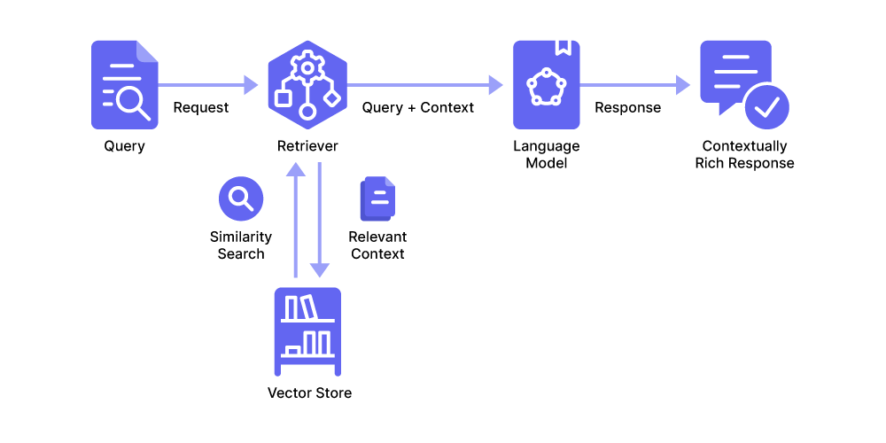

# Getting Started with LangChain RAG

LangChain is well suited for retrieval augmented generation (RAG) because it offers modules and abstractions for practically anything you want to do in terms of data ingestion, chunking, embedding, retrieval, and LLM interaction.

An ecosystem in itself, LangChain lets you build out complete workflows for developing LLM-powered applications. Some of its unique abstractions, however, entail steep learning curves and opaque structures that are hard to debug.

Take [runnables](https://mirascope.com/blog/langchain-runnables) for instance, which LangChain relies on for chaining together steps to handle prompt flows:

Although **`RunnablePassthrough`** lets you pass data such as user inputs unchanged through a sequence of processing steps, **it actually doesn’t indicate what’s going on under the hood, making it harder to find the source errors**.

That’s why you might not want to rely on LangChain’s modules for absolutely *everything*; after all, simpler, more transparent Python logic can be more efficient and easier to manage.

That’s why we designed [Mirascope](https://github.com/mirascope/mirascope/), a lightweight toolkit for building agents directly in native Python without needing to resort to unique, complex abstractions that complicate development and debugging.

**Mirascope avoids the rigid, all-or-nothing approach you find in the [big frameworks](https://mirascope.com/blog/llamaindex-vs-langchain)**, and instead offers a flexible architecture that lets you select only the modules you need, while giving you full control over [prompting](https://mirascope.com/blog/prompt-engineering-examples), context management, and LLM interactions.

In this article, we show you how to build a simple RAG application using LangChain’s functionality for data ingestion, preprocessing, and storage. We then integrate this with Mirascope to simplify query and response flows.

<!-- more -->

## How RAG with LangChain Works

**The whole idea behind RAG is to get better answers out of the LLM** — answers that are more accurate and relevant to user queries — by including additional *context* alongside the user's query in the prompt.

To get this added context, we pull it from a vector store of documents, websites, PDFs, and any other content we think may be helpful.

Why a vector store? It’s a popular option right now and it’s easy to do searches (using mathematical formulas that measure similarity between data points) where you’re comparing entire *chunks* of content with the user’s question. But using vectors isn’t strictly necessary.

So how does a RAG application work, broadly speaking?

It involves, first and foremost, storing and indexing your data somewhere for later retrieval. Then, the application generates responses to queries based on that indexed data.

You could describe this process in three steps:

1. Ingest the data around which you want to form a knowledge base. Then prepare that data for storage by splitting it into chunks so they’ll be easy to index and retrieve once they’re stored.

2. Transform those chunks into vectors (or “embeddings” as they’re known, so they become eminently searchable and retrievable), and store them.

3. Respond to user queries by searching for, and including, relevant chunks as context in prompts to the language model.



We describe this process in more detail below.

### RAG Pipeline Workflow

#### 1. Ingesting and Chunking

The first thing is to load your data from various sources, like PDFs, websites, or text documents, and prepare these for later stages [in the pipeline](https://mirascope.com/blog/llm-pipeline).

What do we mean by “prepare?” We mean **preprocessing** the data, such as parsing the HTML of a submitted website to extract specific content like titles, headers, images, and main body text.

For such tasks, LangChain provides [multiple loader types](https://python.langchain.com/docs/how_to/) designed for different file formats like PDFs, CSV files, databases, and more.

After parsing and loading the data, the next step is **chunking**, or breaking the text into smaller, more manageable pieces. LangChain offers text-splitting tools for this, which allow you to define chunk size.

Chunk size, often measured in characters, directly influences the effectiveness of the steps to follow, like embedding.

For example, if the chunk size is too small, it may lack sufficient context to capture the full meaning of the content. If it’s too large, it may dilute the focus or mix up multiple ideas so that later on the embeddings are less specific and harder to match with queries.

A typical chunk size is 1,000 characters, which is generally considered a “safe” amount to capture coherent ideas without overwhelming the LLM.

It’s also important to set the *overlap* between chunks to maintain context across splits and ensure meaningful transitions (especially in lengthy passages) — an average overlap to use is 200 characters.

#### 2. Embedding and Storage

Next, we convert the preprocessed text chunks into **vector embeddings** using an embedding model.

Converting a chunk of text into an embedding means turning it into a numerical fingerprint that captures the semantic meaning of the text, which in turn helps us do [similarity-based searches](https://www.pinecone.io/learn/what-is-similarity-search/) to identify relevant information based on context rather than word matches.

Keep in mind, though, we don’t have to use vectors — we could insert a [knowledge graph](https://mirascope.com/blog/how-to-build-a-knowledge-graph/) (or use any other appropriate structure like a document store) — it’s just that vectors are efficient under certain circumstances, like when querying large volumes of unstructured data.

For the actual task of converting chunks into vectors, we generally use the LLM’s own embedding models, and LangChain makes available wrappers for these like `OpenAIEmbedding`.

Once we’ve got our embeddings, we next pull these into a **vector store** that’s optimized for efficient management and retrieval, allowing you to quickly perform similarity searches and retrieve the most relevant content based on the semantic meanings of user queries

The LangChain library offers modules for a number of popular vector stores like Chroma, FAISS, and Pinecone.

#### 3. Querying and Retrieval

When the application receives a query, it accesses the vector store to compare the query to the embeddings stored there (via similarity search or another search method), to find those chunks of information that most similarly match the user’s intent.

LangChain instantiates a **retriever object** for this purpose, which locates the relevant chunks in the vector store and returns both the query and chunks for further processing by the application.

Retrievers are part of LangChain’s [runnable architecture](https://python.langchain.com/docs/concepts/runnables/), meaning they can be composed with other runnables like models, prompts, and parsers.

For example, a retriever can be part of a chain where the retrieved documents are formatted, passed into a prompt, and then sent to an LLM for processing.

Retrievers accept a string-based query input and then output a list of relevant chunks, though they don’t necessarily store this information permanently.

The specific retriever chosen can vary based on the type of data store in use (e.g., a vector or document store) and the particular application needs.

Once LangChain has identified and retrieved the relevant information, **it combines the fetched chunks with the original user query to create a [context-enriched prompt](https://mirascope.com/blog/llm-prompt)** to elicit a targeted answer from the LLM.

### Challenges in Building a RAG System with LangChain

Although [LangChain](https://mirascope.com/blog/langchain-sucks) offers tools for simplifying the development of RAG applications, the entire process isn’t without its pains.

For one thing, **RAG itself is still considered an experimental system** by the development community and lacks any industry standards or even best practices. It feels like there's a new RAG method released every day still.

This means developers are pretty much on their own in finding the best solutions for their use cases, often requiring rolling a system properly customized to their use case.

For example, developers must often use trial and error to find the best ways to create embeddings as there’s currently no consensus on which models (e.g., OpenAI embeddings, BERT, Sentence Transformers) are most suitable for different use cases.

But **LangChain’s complex architecture doesn’t make things easier**. The [framework](https://mirascope.com/blog/llm-tools) requires multiple dependencies and installations of various components (i.e., core, hub, and community), while many report its documentation is outdated.

Its unique abstractions, like runnables and pipes, seem intuitive enough at first, but these quickly become complicated when managing more intricate workflows.

An example of this is LangChain’s familiar chaining structure, or the sequence [orchestrating](https://mirascope.com/blog/llm-orchestration) retrieval, formatting, prompting, and response generation in a RAG application (e.g., `rag_chain`):

```py
from langchain_core.prompts import PromptTemplate

template = """Use the following pieces of context to provide a brief summary.
If you don't have enough information, just say so without guessing.
Limit your response to three sentences for brevity.
Always end with "hope this helps!" to wrap up your response.

{context}

Topic: {topic}

Summary:"""

custom_rag_prompt = PromptTemplate.from_template(template)

rag_chain = (
    {"context": retriever | format_docs, "topic": RunnablePassthrough()}
    | custom_rag_prompt
    | llm
    | StrOutputParser()
)

rag_chain.invoke("Explain Quantum Computing") 
```

You see above that `rag_chain` consists of several steps, all joined together by pipes that pass the output of one component as input to the next:

* Retrieval (via `retriever | format_docs`)  
* [Prompting](https://mirascope.com/blog/prompt-engineering-tools) (via `custom_rag_prompt`)  
* LLM response generation (via `llm`)  
* [Output parsing](https://mirascope.com/blog/langchain-structured-output) (via `StrOutputParser()`)

On the surface, the flow of inputs and outputs between these components seems logical, since the pipe moderators provide an intuitive way to [chain these together](https://mirascope.com/blog/prompt-chaining).

But when errors happen, these become hard to debug as they obscure what’s happening under the hood. Imagine what that means when the chain becomes longer or the components themselves take on more processing tasks or conditional logic.

Runnables themselves are unique abstractions with their own learning curve that can complicate the flow of data because they’re essentially Python callables wrapped in [LangChain Expression Language (LCEL)](https://python.langchain.com/docs/concepts/lcel/).

So while each runnable allows specific actions or transformations, tracing errors or understanding intermediate states requires you to get deeply familiar with LangChain’s conventions that go beyond standard Python.

## Steps to Build a LangChain RAG Application

Now that we know how RAG works on a theoretical level, here’s a simple tutorial showing how to build a simple RAG application using [LangChain](https://mirascope.com/blog/langchain-alternatives), Chroma, and Mirascope.

As LangChain offers decent data ingestion, preprocessing, storage, and retrieval (or imports these from modules that do), we use it for those parts of the system.

We also use Mirascope to simplify querying the LLM and generating a response.

The goal of our RAG application is to answer questions about a publicly available scientific paper that introduced the original [transformer architecture](https://arxiv.org/html/1706.03762v7) (“Attention is All You Need” by Vaswani et al.) years ago.

### Set Up the Environment

First, we install Mirascope and LangChain.

```py
pip install "mirascope[openai]"
pip install -qU langchain-openai
```

Next, we import Mirascope and LangChain’s API wrappers for interacting with OpenAI’s language models.

```py
import getpass
import os

os.environ["OPENAI_API_KEY"] = getpass.getpass()
# Set the appropriate API key for the provider you're using
from mirascope.core import openai
from langchain_openai import ChatOpenAI
```

Then, we import the various LangChain dependencies for document ingestion, preprocessing, and storage.

```py
import bs4
from langchain_chroma import Chroma
from langchain_community.document_loaders import WebBaseLoader
from langchain_openai import OpenAIEmbeddings
from langchain_text_splitters import RecursiveCharacterTextSplitter
```

In import statements above:

* **`bs4`** (Beautiful Soup library) is a Python library for parsing HTML and XML documents, and structuring these into an easily navigable tree format.  
* **`Chroma`** is a vector store for storing embeddings from documents.  
* **`WebBaseLoader`** is a document loader that uses the Beautiful Soup library to parse text from HTML pages.  
* **`OpenAIEmbeddings`** is an embedding model for encoding chunks into vectors, allowing [LLM\-based applications](https://mirascope.com/blog/llm-applications) to understand the relationships between different words.  
* **`RecursiveCharacterTextSplitter`** splits documents into chunks of uniform size for preprocessing.

Next, we’re ready to build our RAG application.

### 1. Load and Chunk Documents

After preparing the environment, we set up a web scraping and text chunking workflow:

```py
# Load, chunk and index the contents of the blog 
loader = WebBaseLoader(
   web_paths=("https://arxiv.org/html/1706.03762v7",),
   bs_kwargs=dict(
       parse_only=bs4.SoupStrainer(
           class_=("post-content", "post-title", "post-header")
       )
   ),
)
docs = loader.load()

# Split extracted text into overlapping chunks
text_splitter = RecursiveCharacterTextSplitter(chunk_size=1000, chunk_overlap=200)
splits = text_splitter.split_documents(docs)

```

Above, we fetch the paper on transformers by initializing **`WebBaseLoader`** at the URL provided, then use Beautiful Soup to target the sections containing the main page content, title, and header.

The **`loader.load()`** method fetches and parses the HTML, extracting only the relevant sections defined by **`bs4.SoupStrainer`** and storing this text in **`docs`**.

We then split this extracted text into overlapping chunks using **`RecursiveCharacterTextSplitter`**, and then store the series of chunks in **`splits`**, a list of dictionaries.

Note that the larger the chunk size, the more context you’ll capture, but then also the more irrelevant information. Smaller chunks contain more concisely focused content, but may lack the broader context needed for comprehensive understanding.

### 2. Embed and Store Chunks

We then convert each text chunk into its vector representation using the `OpenAIEmbeddings` model, and index and store each chunk in our Chroma vector store:

```py
vector_store = Chroma.from_documents(documents=splits, embedding=OpenAIEmbeddings())
```

Indexing provides efficient retrieval of text for similarity searches (discussed further below).

### 3. Query and Generate a Response

After using LangChain to set up document ingestion and storage, we then search the vector store for relevant context based on the user's input query, and use Mirascope to format and [optimize the prompt](https://mirascope.com/blog/prompt-engineering-best-practices) that integrates both the retrieved context and the query.

We structure prompt inputs using placeholders like **`{context}`** and **`{question}`**, which are dynamically filled with the retrieved chunks and user query, respectively.

```py
@openai.call("gpt-4o-mini")
@prompt_template(
    """
   Here is some context related to a query:
   {context}

   Answer this query using the given context: {query}
   """
)
def query_documents(query: str, vector_store: Chroma) -> openai.OpenAIDynamicConfig:
    """Answers a query by retrieving documents related to the query."""
    documents = vector_store.similarity_search(query=query, k=3)
    return {
        "computed_fields": {
            "context": [document.page_content for document in documents]
        }
    }

query = "What are the advantages of the Transformer model in terms of parallelization and training time?"
print(query_documents(query=query, vector_store=vector_store))
# > The Transformer model offers significant advantages in parallelization... 
```

First, the **`query_documents`** function takes the user’s **`query`** and does a similarity search on the **`vector_store`** to find the most relevant documents related to the query, retrieving the top three most-relevant chunks.

Note we don’t instantiate a **`retriever`** object as in LangChain, as this would otherwise add a layer of abstraction and require additional configuration.

Next, **`context`** returns the page content of the relevant chunks, which populates the **`{context}`** placeholder in the prompt template.

This **`context`**, along with the original **`query`**, is passed to the language model via Mirascope’s **`openai.call`** decorator and generates a response based on the provided information.

Our prompt decorator allows you to transform [prompt templates](https://mirascope.com/blog/langchain-prompt-template) written in Python into API calls to the LLM using minimal boilerplate — making Mirascope model agnostic — while providing type safety and consistency across providers.

Also, this way of sending the context plus the query to the language model offers a certain pythonic simplicity compared with LangChain’s **`RunnablePassthrough`** and its chains composed of pipe operators.

## Build Your RAG Pipeline Using Mirascope

Simplify your RAG workflows and dispense with the complexities of the [big frameworks](https://mirascope.com/blog/prompt-flow-vs-langchain) by using Mirascope’s lightweight toolkit, whose modules easily slot into existing workflows and give you control over [prompting](https://mirascope.com/blog/engineers-should-handle-prompting-llms) and LLM interactions.

You can find Mirascope code samples and tutorials both on our [documentation site](https://mirascope.com/WELCOME) and on our [GitHub page](https://github.com/mirascope/mirascope).
