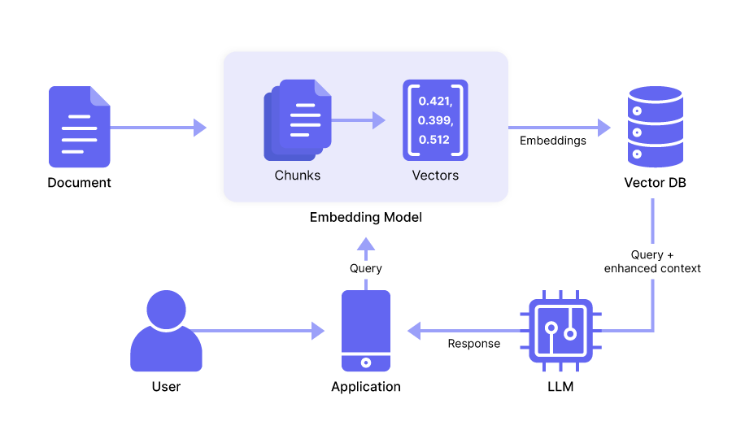

# Does LangChain Suck? Our Thoughts on Maximizing Its Potential

Some developers feel LangChain is overly complex, mainly because:

- It requires you to learn unique abstractions for tasks that are often more straightforward in native Python and JavaScript. **These abstractions tend to obscure what's going on under the hood** , making the code hard to follow and debug.
  ‍
- The library wasn’t designed with software developer best practices in mind, so the lack of modularity, consistency, and clear documentation results in tightly coupled code that’s difficult to maintain and extend.

This complexity leads some to believe **the framework is only good for building prototypes** rather than production-grade codebases.

<!-- more -->

Despite its shortcomings, LangChain has some positive points. It’s one of the pioneering frameworks for LLM application development, and offers hundreds of integrations with third-party tools and frameworks. Also, its retrieval augmented generation (RAG) functionality does a decent job of data ingestion and embedding.

In fact, you can maximize LangChain’s potential by combining certain of its modules, like its RAG functionality, with tools that offer better functionality in other areas, like the prompt engineering capabilities of [Mirascope](https://github.com/mirascope/mirascope), our own Python toolkit.

Below, we point out some of the downsides of LangChain, and compare these to how Mirascope approaches it. Further down, we show you how to combine LangChain's RAG features with those of Mirascope.

## LangChain: One Size Fits All

As we said above, LangChain provides abstractions governing how applications interact with language models. Their framework is inherently monolithic, meaning you’re encouraged not just to use a few of its abstractions, but rather to use all of them. (Some have even pointed out it uses wrappers for functions it doesn’t need to). We’ll show a few examples of this later on.

But suffice it to say that in trying to be an ecosystem, LangChain offers some educational benefits for those seeking a better understanding of how LLM app development works.

It doesn’t scale well, however, for commercial applications since its design limits flexibility and is difficult to maintain and extend in a production environment—in our experience.

In contrast, we designed Mirascope to let you use native Python as much as possible (the other library we use is Pydantic), which promotes readability and consistency.

Here's an example contrasting the two approaches using [text summarization](https://mirascope.com/blog/prompt-engineering-examples). First, Mirascope: ‍

```python
from mirascope.core import openai


@openai.call(model="gpt-4o")
def summarize(text: str) -> str:
    return f"Summarize this text: {text}"


text = """The recent advancements in technology have had a profound impact on the way we communicate and interact with each other on a daily basis. With the advent of smartphones and social media platforms, people are now able to stay connected with friends and family members regardless of geographical distances. Moreover, these technological innovations have also revolutionized the business world, allowing companies to reach a global audience with ease and efficiency."""

print(summarize(text))
```

We use a simple decorator for the call and a function with a docstring to define the prompt.

Looking at LangChain, the same text summarization task would be implemented like this:

```python
from langchain.prompts import PromptTemplate
from langchain_core.output_parsers import StrOutputParser
from langchain_core.runnables import RunnablePassthrough
from langchain_openai import ChatOpenAI

def summarize(text: str):
    model = ChatOpenAI()
    template = "Summarize this text: {text}"
    prompt = PromptTemplate.from_template(template)

    chain = (
        {"text": RunnablePassthrough()} | prompt | model | StrOutputParser()
    )

    return chain.invoke(text)

text = """The recent advancements in technology like generative AI (e.g., the chatbot-like ChatGPT) have had a profound impact on the way we communicate and interact with each other on a daily basis. With the advent of smartphones and social media platforms, people are now able to stay connected with friends and family members regardless of geographical distances. Moreover, these technological innovations have also revolutionized the business world, allowing companies to reach a global audience with ease and efficiency."""

print(summarize(text))
```

Here, we see some concepts introduced by LangChain:

- First, you pass in [`PromptTemplate`](https://python.langchain.com/v0.1/docs/modules/model_io/prompts/quick_start/), `StrOutputParser`, [`RunnablePassthrough`](https://python.langchain.com/v0.1/docs/expression_language/primitives/passthrough/), and `ChatOpenAI()`. This requires learning three additional concepts (or four if you're new to OpenAI) just to set up a simple text summarization pipeline.
- The `chain` construction is not immediately intuitive and you may have to consult LangChain’s documentation to understand what’s going on with that.
- It’s not clear how you’d invoke `RunnablePassthrough`, if you have multiple parameters or whether additional instances of runnables would need to be defined. You’d probably need to consult their docs again.
- It’s also unclear whether `RunnablePassthrough` only accepts a string, and their lack of editor docs provides zero type hints on what to do.

## No Colocation of LLM Calls

**There’s no colocation for LLM calls in LangChain**. This means calls are made wherever and whenever convenient. There’s no consistent structure for calls—and even call parameters can be managed separately.

This approach might seem convenient at first, but it’s not scalable when developing apps making around 100 LLM calls because the effects of a change made in one call can be hard to trace throughout the rest of the code.

Say you add a new key-value pair to an input for an LLM call; if an error crops up then without colocation of the call in the vicinity of the code affecting the call, you may have to manually hunt down any further effects of that change throughout the rest of your code. And even then, it may still be hard to catch any errors flowing silently into the model.

Another area of concern is that [**LangChain was designed by data scientists and not software engineers**](https://mirascope.com/blog/engineers-should-handle-prompting-llms), and so doesn’t reflect software development best practices like built-in type safety, inline documentation, error checking, and autocomplete for code editors.

Mirascope on the other hand is designed with the philosophy that call parameters should be colocated with the call. This ensures all relevant information—prompts, model parameters, and other configuration details—get tested and [versioned together as a single unit](https://mirascope.com/blog/engineers-should-handle-prompting-llms).

So we use a decorator such as `@openai.call()` whose argument list contains all the required parameters, as shown below:

```python
from mirascope.core import openai


@openai.call(model="gpt-4", call_params={"temperature": 0.5})
@prompt_template(
    """
    Can you recommend some gifts based on the following occasion and category pairs?
    {occasions_x_categories}
    """
)
def recommend_gifts(
    occasions: list[str], categories: list[str]
) -> openai.OpenAIDynamicConfig:
    occasions_x_categories = [
        f"Occasion: {occasion}, Category: {category}"
        for occasion in occasions
        for category in categories
    ]
    return {"computed_fields": {"occasions_x_categories": occasions_x_categories}}


response = recommend_gifts(
    occasions=["valentine", "birthday", "wedding"],
    categories=["electronics", "jewelry", "books"],
)
```

## No Built-In Type Safety for Return Values of Functions

Mirascope also implements under-the-hood type safety to show you the return types of functions and the LLM calls made with those functions.

We provide full linting and editor support for warnings and errors as you code, as well as autocomplete to allow you to catch potential issues early and maintain code consistency.

In the example below, `response` is set to the output of an OpenAI call that returns a stream, and so hovering the cursor over the `response` object shows it to be defined as an `OpenAIStream` object type.


Mirascope’s focus on developer experience makes it easy to set what you want the model’s response to be in terms of, for example, stream, string, response model, etc., as well as to know what the return type is whenever you call that function anywhere in your codebase. And since the call decorator is working on a function, you can add type hints to the input arguments for the function to improve your own developer experience.

This is in contrast to LangChain’s implementation of calls, where (for example), its `invoke()` method takes a data dictionary as input but little else in the way of type hints. **It will require a failure at runtime to identify, for example, an improper key in the invocation dictionary.**


## Chaining LLM Calls Together in LangChain

LangChain provides specialized abstractions for chaining—notably [`runnables`](https://mirascope.com/blog/langchain-runnables)—that **require explicit definitions of chains and flows via its LangChain expression language (LCEL)**. While runnables and LCEL offer a clean structure for simple prompt chains, they get harder to manage as chains grow in complexity, since it’s difficult to discern what’s happening under the hood.

LangChain is complemented by a range of off-the-shelf chain constructors for different use cases, like `load_qa_chain` for creating a question-answering chain for a set of documents. The idea is to provide a list of ready-made constructors that developers can easily choose from and repurpose with minimal hassle.

While these might offer convenience and a quick start for certain projects, they also limit flexibility and control as such pre-built solutions might not always align with specific project requirements. Plus, they require users to spend time learning how they work in order to sufficiently understand them when debugging errors.

Mirascope takes a more explicit, and obvious approach to chaining, relying on existing structures already defined in Python.

Here, you can [chain LLM calls](https://mirascope.com/learn/chaining) using either **computed fields** (that cache results) or **functions** (that pass outputs directly as inputs to subsequent calls). We generally recommend using computed fields for most use cases since it gives you the ability to cache and reuse outputs, so you can make less calls and economize on computing resources.

Here’s an example of computed fields where `explain_attraction` first calls `recommend_attraction` once and injects the result into the prompt template as a computed field:

```python
from mirascope.core import openai, prompt_template


@openai.call("gpt-4o")
@prompt_template(
    """
    Recommend a popular tourist attraction in {city}.
    Give me just the name.
    """
)
def recommend_attraction(city: str):


@openai.call("gpt-4o")
@prompt_template(
    """
    SYSTEM:
    You are the world's greatest travel guide.
    Your task is to explain why the tourist attraction "{attraction_name}" is popular in {city}.

    USER:
    Explain why "{attraction_name}" in {city} is popular.
    """
)
def explain_attraction(city: str) -> openai.OpenAIDynamicConfig:
    return {"computed_fields": {"attraction_name": recommend_attraction(city)}}


explanation = explain_attraction("Paris")
print(explanation)
# > "The Eiffel Tower," located in Paris, is immensely popular due to its iconic status, stunning views...
```

Since we used `computed_field`, we can see the output at every step of the chain in the final dump:

```python
print(explanation.model_dump())
# {
#     "metadata": {},
#     "response": {
#         "id": "chatcmpl-9r9jDaalZnT0A5BXbAuylxHe0Jl8G",
#         "choices": [
#             {
#                 "finish_reason": "stop",
#                 "index": 0,
#                 "logprobs": None,
#                 "message": {
#                     "content": "The Eiffel Tower, standing as an iconic symbol of Paris...",
#                     "role": "assistant",
#                     "function_call": None,
#                     "tool_calls": None,
#                 },
#             }
#         ],
#         "created": 1722455807,
#         "model": "gpt-4o-2024-05-13",
#         "object": "chat.completion",
#         "service_tier": None,
#         "system_fingerprint": "fp_4e2b2da518",
#         "usage": {"completion_tokens": 550, "prompt_tokens": 50, "total_tokens": 600},...
```

As already mentioned, you can also use [functions for chaining](https://mirascope.com/blog/prompt-chaining), which, though not offering caching benefits, will nonetheless provide more explicit control over the flow of execution, as well as reuse across classes and methods.

## LangChain’s Approach to Prompt Templates and Management

While offering [pre-defined templates](https://mirascope.com/blog/langchain-prompt-template) might seem to standardize prompt engineering and make it more accessible at first sight, in practice it can be limiting for a few reasons.

For one, large language models are inherently non-deterministic, and [effective prompt engineering](https://mirascope.com/blog/prompt-engineering-tools) requires tailored, hand-written prompts rather than generic templates—which may not fully address the specific needs of each application.

Also, offering a template for different [prompting techniques](https://mirascope.com/blog/prompt-engineering-examples) might suggest they’re encouraging users to rely on their predefined abstractions. While this may not be exactly locking someone into their framework, it encourages continued reliance on their ecosystem for as many use cases as possible.

In this vein, the framework seems to offer a tool and a template for everything, which eventually makes it harder to seek improvements by selectively importing [external modules](https://mirascope.com/blog/langchain-alternatives) here and there.

What ends up happening is some people opt to start over and either rewrite their application from scratch or find another open source framework offering greater flexibility.

When it comes to prompt management, LangChain offers its [hub](https://smith.langchain.com/hub), which is a centralized server and repository for the community’s prompt templates. LangChain Hub allows you to pull templates down into your workspace by specifying the prompt’s SHA number.

Placing prompts in a central repo for everyone to access might be convenient as far as collaboration is concerned, but we don’t find tremendous utility in expending resources to download small text files across the internet. Also, the design of the hub has a few UX issues, such as unclear docs for complex prompts and no editor support for the prompts you download.

By contrast, Mirascope's prompt engineering framework [Lilypad](https://lilypad.so/docs) makes prompt management easy by versioning and tracing every prompt (LLM function) automatically. It provides a local or hosted environment where you can track every function trace against the exact prompt versioned used for that trace.

We believe that the ability to use this tool locally enables rapid testing and refinement of prompts, giving developers greater control and flexibility over their workflows -- even before they're ready to use a cloud-hosted tool.

## Using LangChain’s RAG Functionality with Mirascope

Earlier we mentioned that LangChain’s modules for data loading, ingesting, and embedding are useful and can be incorporated into Mirascope to build RAG applications.

To understand how this integration works, let’s first review the (very generalized) basic operation of a RAG system:

- First, we import relevant information (e.g., a dataset in JSON like company data, private data, etc.), into a vector database, using tools like a text splitter and chunker for data preprocessing.
- Later, the system sends the information and metadata acquired in the previous step as extra context to the user’s or application’s query, which are all sent together to the LLM to generate relevant responses.



To use LangChain’s functionality together with Mirascope, we basically take the information (i.e., the context) acquired using LangChain’s modules and a third-party vector store like Chroma or Pinecone and inject this into a Mirascope call.

The code might look something like this:

```python
from langchain_chroma import Chroma
from langchain_core.documents import Document
from langchain_openai import OpenAIEmbeddings

from mirascope.core import openai, prompt_template


# Initialize your vector store
embeddings = OpenAIEmbeddings(model="text-embedding-3-large")
vector_store = Chroma(
   collection_name="books",
   embedding_function=embeddings,
   persist_directory="./chroma_langchain_db",  # Where to save data locally, remove if not necessary
)


# Add documents to the store
documents = [
   Document(page_content="The Name of the Wind by Patrick Rothfuss"),
   Document(page_content="Harry Potter and the Sorcerer's Stone by J.K. Rowling"),
   Document(page_content="Mistborn: The Final Empire by Brandon Sanderson"),
   # Add more documents as needed
]
vector_store.add_documents(documents=documents)


@openai.call("gpt-4o")
@prompt_template(
    """
    Recommend a {genre} book from the catalogue.

    Here are some {genre} books available in the catalogue:
    {context}
    """
)
def recommend_book(genre: str, vector_store: Chroma) -> openai.OpenAIDynamicConfig:
   return {
       "computed_fields": {"context": vector_store.similarity_search(query=genre, k=3)}
   }


# Example usage
recommendation = recommend_book(genre="fantasy", vector_store=vector_store)
print(recommendation.content)
# > I highly recommend **"The Name of the Wind" by Patrick Rothfuss**...
```

Note that `computed_fields` is being used to dynamically generate and inject contextual information by retrieving relevant documents from the `Chroma` vector store` and inserting them into the prompt template for the OpenAI call.

If we weren’t using Mirascope, it’s likely we’d resort to using LangChain’s runnables with pipe moderators, to inject context into the call:

```python
from langchain import hub
from langchain_core.output_parsers import StrOutputParser
from langchain_core.runnables import RunnablePassthrough
from langchain_openai import ChatOpenAI


llm = ChatOpenAI(model="gpt-4o-mini")

retriever = vector_store.as_retriever(search_kwargs={"k": 3})
retriever.invoke("fantasy books")

prompt = hub.pull("rlm/rag-prompt")


def format_docs(docs):
   return "\n\n".join(doc.page_content for doc in docs)


rag_chain = (
   {"context": retriever | format_docs, "question": RunnablePassthrough()}
   | prompt
   | llm
   | StrOutputParser()
)
print(rag_chain.invoke("What are some fantasy books in my catalogue?"))
```

The pipeline in this example (`rag_chain`) is rather untransparent and limits your control, making it difficult to identify and troubleshoot issues as they arise.

## Mirascope Lets You Choose Your Tools

Mirascope’s building block approach gives you the freedom to slot the functionality you need into your workflows. Choose from external modules from LangChain, LlamaIndex, and others, and leverage Mirascope's features to build exactly what you want.

Want to learn more? You can find more Mirascope code samples both on our [documentation site](https://mirascope.com) and on [GitHub](https://github.com/mirascope/mirascope).
