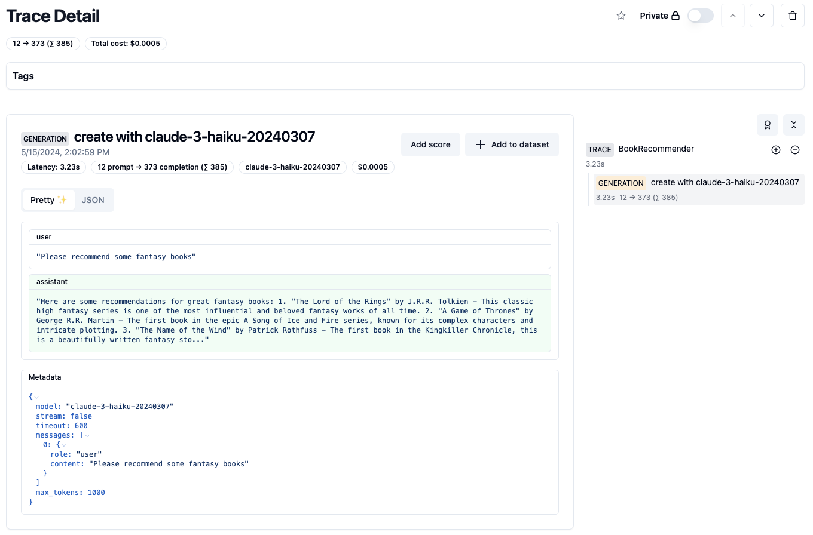
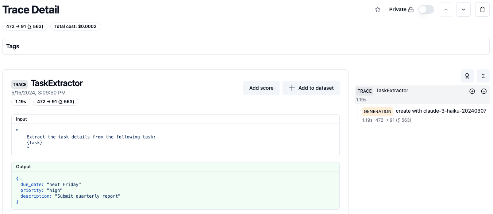

# Mirascope and Langfuse Integration

We’re thrilled to announce our integration with the LLM Engineering Platform [Langfuse](https://langfuse.com/). LLM Development without any observability tool is a dangerous endeavor, so we at Mirascope have made it easy for you to slot in Langfuse into your workflow.

<!-- more -->

## Mirascope and Langfuse

Mirascope integrates with Langfuse with a decorator `@with_langfuse`. This gives you full control on what you want to observe and what you don’t.

### Call

This is a basic call example that will work across all [Mirascope call function settings](https://mirascope.com/learn/calls), including [streams](https://mirascope.com/learn/streams), [async](https://mirascope.com/learn/async), and more.

```python
import os
from mirascope.integrations.langfuse import with_langfuse
from mirascope.core import openai

os.environ["LANGFUSE_PUBLIC_KEY"] = "pk-lf-..."
os.environ["LANGFUSE_SECRET_KEY"] = "sk-lf-..."
os.environ["LANGFUSE_HOST"] = "https://cloud.langfuse.com"


@with_langfuse()
@openai.call("gpt-4o-mini")
def recommend_book(genre: str) -> str:
    return f"Recommend a {genre} book"


response = recommend_book("fantasy")  # this will automatically get logged with langfuse
print(response.content)
```

And that’s it! Now your Mirascope class methods will be sent to Langfuse traces and calls will be sent to Langfuse generation. Mirascope automatically sends tags, latency, cost, and other metadata alongside inputs and outputs.



### Response Models

Mirascope's [`response_model`](https://mirascope.com/learn/response_models) argument enables extracting or generating structured outputs with LLMs. You can easily observe these structured outputs in Langfuse as well so you can assess the quality of your data and ensure your results are accurate.

```python
import os

from mirascope.integrations.langfuse import with_langfuse
from mirascope.core import openai

os.environ["LANGFUSE_PUBLIC_KEY"] = "pk-lf-..."
os.environ["LANGFUSE_SECRET_KEY"] = "sk-lf-..."
os.environ["LANGFUSE_HOST"] = "https://cloud.langfuse.com"


class TaskDetails(BaseModel):
    description: str
    due_date: str
    priority: Literal["low", "normal", "high"]


@with_langfuse()
@openai.call("gpt-4o-mini", response_model=TaskDetails)
def extract_task_details(task: str) -> str:
    return f"Extract task details from this task: {task}"


task = "Submit quarterly report by next Friday. Task is high priority."
task_details = extract_task_details(task)  # this will be logged automatically with langfuse 
assert isinstance(task_details, TaskDetails)
print(task_details)
```

Head over to [Langfuse](https://langfuse.com/) and you can view your results!


