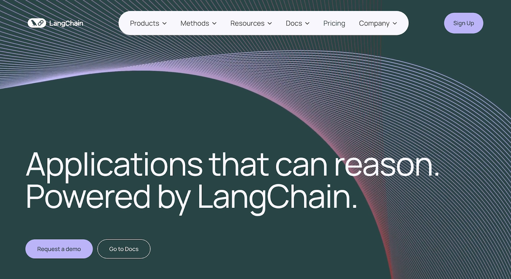
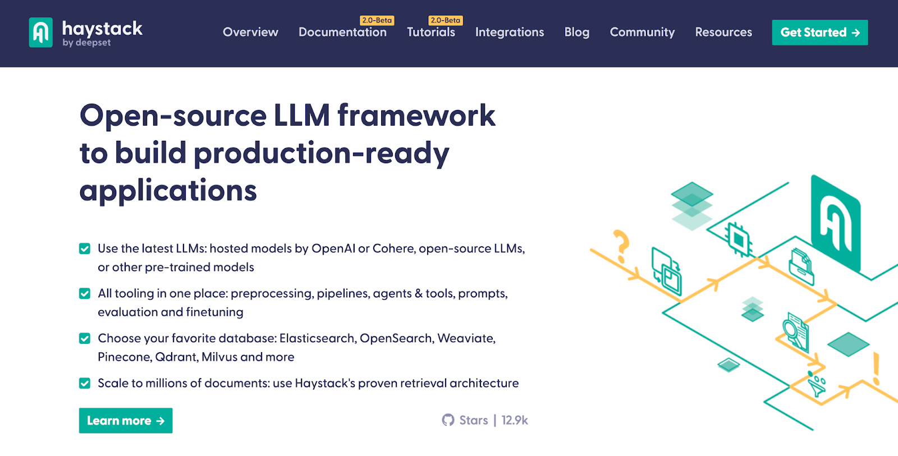
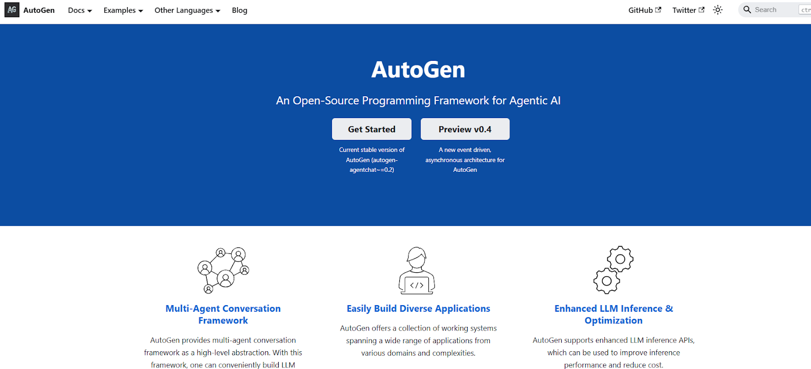

# Top LLM Frameworks For AI Application Development

LLM frameworks provide tools and libraries for building and scaling language model applications. They handle everything from model integration to deployment — allowing you to focus on your app’s functionality without having to build everything from scratch. 

Frameworks: 

* Offer prompt engineering and quality assurance tools for accurate and relevant responses.  
* Provide pre-built modules for common tasks like data preprocessing, model [fine-tuning](https://mirascope.com/blog/prompt-engineering-vs-fine-tuning/), and response generation.
* Make it easy to integrate with other tools and platforms like Hugging Face Transformers, TensorFlow, or PyTorch without having to deal with complex APIs.   
* Orchestrate workflows to manage complex, multi-step processes like input validation, output formatting, and more. 

**In general, these frameworks *should* simplify tasks that would otherwise require lots of manual coding and multiple iterations**. 

But [modern frameworks](https://mirascope.com/blog/llamaindex-vs-langchain/) (like LangChain) impose their own unique abstractions, requiring you to do things their way. This not only feels limiting but also makes development and maintenance harder than it needs to be.

**For this reason, we developed [Mirascope](https://github.com/mirascope/mirascope) - a lightweight Python toolkit that provides building blocks for developing LLM-powered applications without unnecessary constraints.**

Below, we’ve curated a list of the top LLM frameworks and highlighted the strengths and purpose of each framework in the following categories: 

* [**Development frameworks**](#llm-application-development-frameworks) for building, testing, and deploying LLM-driven applications.   
* [**Data integration and retrieval frameworks**](#data-integration-and-retrieval-frameworks) to connect, retrieve, and manage data from various sources.   
* [**Model development and fine-tuning frameworks**](#model-development-and-fine-tuning-framework) for customizing models to your specific needs.    
* [**Workflow orchestration frameworks**](#workflow-orchestration-frameworks) that automate multi-step processes.  
* [**AI agent frameworks**](#ai-agent-frameworks) for building agents that facilitate interactions between users and LLMs. 

<!-- more -->

## LLM Application Development Frameworks

These frameworks offer [tools](https://mirascope.com/blog/llm-tools/) and libraries that simplify and scale the process of building, testing, and deploying LLM-based applications.

Below are some of the most effective frameworks that facilitate this process. 

### Mirascope


[Mirascope](https://github.com/mirascope/mirascope/) is an LLM toolkit that follows a "use-when-you-need" design philosophy, meaning it offers modules that can be selectively and easily slotted into your existing task flows.

This approach lets you productively focus on solving your problems at hand rather than worrying about how to use complex abstractions or other unnecessary but typical constraints of modern frameworks.

To explain how all this works in practice, here are some of Mirascope’s core features. 

#### Leveraging Native Python for Scalable AI Application Development

The key to its ease of use is its reliance on familiar Python constructs for tasks that the big frameworks introduce specialized abstractions for. This means there’s no learning curve for those already familiar with that language

Mirascope lets you scale projects efficiently and rapidly while maintaining full control over the development process.

This entire approach provides an intuitive, transparent coding experience, giving you clear insight into what’s happening under the hood.

This is in contrast to LangChain, whose elaborate abstractions like [runnables](https://mirascope.com/blog/langchain-runnables) (consisting of Python callables wrapped in LangChain Expression Language, or LCEL) obscure their underlying logic.

Take a complex workflow like chaining, for example. When looking at how frameworks like LangChain do this, you might not realize that it can be done in native Python.

Developers using LangChain often encapsulate chaining operations in [runnables and pipe moderators](https://python.langchain.com/docs/tutorials/rag/), as shown in the code snippet below for a retrieval augmented generation (RAG) pipeline:

```python hl_lines="45-50"
from bs4 import SoupStrainer
from langchain_chroma import Chroma
from langchain_community.document_loaders import WebBaseLoader
from langchain_core.output_parsers import StrOutputParser
from langchain_core.runnables import RunnablePassthrough
from langchain_openai import OpenAIEmbeddings, ChatOpenAI
from langchain_text_splitters import RecursiveCharacterTextSplitter
from langchain_core.prompts import PromptTemplate

# Load, chunk and index the contents of the blog.
loader = WebBaseLoader(
    web_paths=("https://lilianweng.github.io/posts/2023-06-23-agent/",),
    bs_kwargs=dict(
        parse_only=SoupStrainer(class_=("post-content", "post-title", "post-header"))
    ),
)
docs = loader.load()

text_splitter = RecursiveCharacterTextSplitter(chunk_size=1000, chunk_overlap=200)
splits = text_splitter.split_documents(docs)
vectorstore = Chroma.from_documents(documents=splits, embedding=OpenAIEmbeddings())

# Retrieve and generate using the relevant snippets of the blog.
retriever = vectorstore.as_retriever()
llm = ChatOpenAI()


def format_docs(docs):
    return "\n\n".join(doc.page_content for doc in docs)


template = """Use the following pieces of information to provide a concise overview.
If the details are insufficient, state that clearly without making assumptions.
Keep your response to three sentences for conciseness.
End with "hope this provides clarity!" to conclude your response.

{information}

Topic: {subject}

Overview:"""

custom_overview_prompt = PromptTemplate.from_template(template)

overview_chain = (
    {"information": retriever | format_docs, "subject": RunnablePassthrough()}
    | custom_overview_prompt
    | llm
    | StrOutputParser()
)

output = overview_chain.invoke("Describe machine learning")
print(output)
```

The bolded pipeline structure above looks elegant but gets harder to debug the more components you add, or when some of those components grow bigger and more complex.

In particular, `RunnablePassthrough()` above allows you to pass data through the chain unchanged — that’s fine, but it’s unclear to us what kinds of data it accepts (where’s the editor support?).

It’s also a workaround, in our opinion, to the complexity LCEL adds when it introduces more layers of abstraction to make straightforward tasks more convoluted.

Mirascope avoids such complexity by sticking to Python’s standard control logic. 

Below, we use Python’s computed fields in place of the runnables and pipes of the previous example, passing outputs from one step to the next.

This allows you to directly manage chain execution — without needing intermediate constructs:

```py
from bs4 import SoupStrainer
from langchain_chroma import Chroma
from langchain_community.document_loaders import WebBaseLoader
from langchain_openai import OpenAIEmbeddings
from langchain_text_splitters import RecursiveCharacterTextSplitter

from mirascope.core import openai, prompt_template

# Load, chunk and index the contents of the blog.
loader = WebBaseLoader(
    web_paths=("https://lilianweng.github.io/posts/2023-06-23-agent/",),
    bs_kwargs=dict(
        parse_only=SoupStrainer(class_=("post-content", "post-title", "post-header"))
    ),
)
docs = loader.load()

text_splitter = RecursiveCharacterTextSplitter(chunk_size=1000, chunk_overlap=200)
splits = text_splitter.split_documents(docs)
vectorstore = Chroma.from_documents(documents=splits, embedding=OpenAIEmbeddings())

# Retrieve and generate using the relevant snippets of the blog.
retriever = vectorstore.as_retriever()


@openai.call("gpt-4o-mini", output_parser=str)
@prompt_template(
    """
    Use the following pieces of information to provide a concise overview.
    If the details are insufficient, state that clearly without making assumptions.
    Keep your response to three sentences for conciseness.
    End with "hope this provides clarity!" to conclude your response.

    {information}

    Topic: {subject}

    Overview:
    """
)
def overview(subject: str) -> openai.OpenAIDynamicConfig:
    information = "\n\n".join(doc.page_content for doc in retriever.invoke(subject))
    return {"computed_fields": {"information": information}}


output = overview("Describe machine learning")
print(output)
```

Although both code samples above aren’t especially complex, they illustrate how vanilla Python can handily replace LangChain’s custom abstractions when it comes to complex operations like chaining while providing far more control over exactly how your prompt is formatted.

You can pick and choose which of Mirascope's modules you want to use in your existing workflows whenever and wherever you need them like any standard Python function. 

The above snippet shows how you can build a RAG pipeline using [LangChain](https://mirascope.com/blog/langchain-sucks/)'s `retriever` object for retrieving the relevant documents from the Chroma vector store but use Mirascope for writing the `overview` function instead of a LangChain chain for formatting your prompt and making the LLM call.

#### A Convenient Approach to LLM Calling 

Mirascope’s [call decorator](https://mirascope.com/docs/learn/calls/) (e.g., `@openai.call()`) converts regular Python functions into [prompts](https://mirascope.com/blog/advanced-prompt-engineering/) by turning the function signature and return statement into an API request.

This automates prompt formatting, model selection, and response parsing, while ensuring type safety and smooth integration with various LLM providers.

It basically allows you to focus on your application's logic without worrying about the complexities of API interactions, allowing for quicker development and easier maintenance.

It also [colocates your calls with your prompts](https://mirascope.com/blog/engineers-should-handle-prompting-llms) to avoid separating them in your codebase, thus improving your code’s readability and maintainability.

Another feature of Mirascope’s call decorator is its consistent interface across different LLM providers like OpenAI, Anthropic, Mistral, and more. 

This consistency lets you switch between providers with minimal code changes, as the structure and usage of the call decorators remain the same.

For instance, calls to OpenAI and to Anthropic are structured exactly the same:

```py
from mirascope.core import openai, anthropic

@openai.call("gpt-4o-mini")
def recommend_recipe(cuisine: str) -> str:
    return f"Recommend a {cuisine} recipe"

response = recommend_recipe("italian")
print(response.content)


@anthropic.call("claude-3-5-sonnet-20240620")
def recommend_recipe(genre: str) -> str:
    return f"Recommend a {cuisine} recipe"

response = recommend_recipe("french")
print(response.content)
```

You can reuse the same [prompt logic](https://mirascope.com/blog/llm-prompt/) across different model providers.

While Mirascope’s call decorators make your life easier, when it comes to integrating various LLM providers, the library also provides functionality allowing you to dynamically configure LLM behavior in real time based on given input arguments.

**Dynamic configuration** lets you change prompts, adjust parameters, and tweak metadata just as you would if using the base SDK but in a provider-agnostic way.

It's useful in scenarios where you need to change certain settings or change the template variables you are injecting into the prompt based on given input arguments. For example, you may want to implement chatbots that take the message history as an input argument but only insert certain messages or the most recent messages into the prompt.

The code sample below shows an example of inserting only the most relevant messages and updating temperature dynamically, enabling real time handling of user queries entirely internally to the function call:

```py
from mirascope.core import mistral, Messages
from typing import Literal


def get_relevant_messages(
    query: str, history: list[mistral.MistralMessageParam]
) -> list[mistral.MistralMessageParam]:
    # Filter the messages based on the query,
    # returning only the most relevant ones.
    ...


@mistral.call("gpt-4o-mini")
def chatbot(
    query: str,
    creativity: Literal["low", "high"],
    history: list[mistral.MistralMessageParam],
) -> mistral.MistralDynamicConfig:
    messages = [
        Messages.System("You are a helpful chatbot"),
        *get_relevant_messages(query, history),
        Messages.User(query),
    ]
    return {
        "messages": messages,
        "call_params": {"temperature": 0.25 if creativity == "low" else 0.75},
    }


response = chatbot("What is the best way to learn programming?", "low", [...])
print(response.content)
```

Dynamic configuration is also an important feature in Mirascope's call chaining, where the output of one model's response is injected into the prompt of another. 

By using dynamically configured computed fields, the final response will include all information about the entire chain — from inputs and outputs to metadata and the original provider's response — making it easier to monitor and observe even more complex workflows.

For example, a customer support chatbot might first need to understand why a customer is contacting it in the first place before finally responding, so the chain could first run another sub-call to identify the customer's issue.

By using dynamic configuration to inject the first call's response into the prompt for the final call, the final call's response will include all of the first call's metadata (e.g. the reason the customer is in contact). This helps to better troubleshoot your chains.

#### Validating LLM Outputs with Response Models 

The big frameworks leave a lot of the responsibility for output validation on your shoulders, requiring you to write your own boilerplate in many instances.

On the contrary, Mirascope offers its built-in **`response_model`**, allowing you to easily define, structure, and validate outputs using Pydantic’s `BaseModel`.

With Pydantic’s type annotations, you also benefit from improved static analysis, which provides features like autocomplete, type hints, and linting directly in your IDE.

For example, Mirascope flags missing arguments based on type hints for function return types and variables:


It also shows autosuggestions:

  
You implement response models by:

1. Extending `BaseModel` to represent the desired structure of the LLM’s output.  
2. Setting the `response_model` argument in a `@<provider>.call` decorator to the class you just defined previously. 

An example of this is shown in the code below:

```py

from pydantic import BaseModel
from mirascope.core import openai, prompt_template

class TaskDetails(BaseModel):
    due_date: str
    priority: str

@openai.call(model="gpt-4o-mini", response_model=TaskDetails)
@prompt_template("Extract the task details from this text: {text}")
def extract_task(text: str):
    ...

response = extract_task(text="Finish the report by Friday, it's high priority")
print(response.due_date)  # Output: Friday
print(response.priority)  # Output: high 
```

When `extract_task` is called, Mirascope uses the `TaskDetails` model to parse the LLM's output, making `due_date` and `priority` accessible as attributes of the `response` object.

While response models ensure that your [outputs](https://mirascope.com/blog/langchain-structured-output/) are well structured and validated, handling unexpected errors is equally important to making your code robust. 

To further improve reliability, you can beef up error handling by using third-party libraries like [Tenacity](https://tenacity.readthedocs.io/en/latest/#) to automatically retry failed requests.

One effective way of using Tenacity is to incorporate previous validation errors into subsequent [prompts](https://mirascope.com/blog/prompt-engineering-examples/) to guide the model to refine its responses using context-driven adjustments.

This approach allows the LLM to improve its accuracy based on past outputs by leveraging a form of few-shot learning. Also, by automating validation through structured response models, you ensure that outputs conform to the expected format.

Below is an example of how Mirascope reinserts validation errors into follow-up prompts for more accurate outcomes: 

```python
from typing import Annotated

from mirascope.core import anthropic, prompt_template
from mirascope.integrations.tenacity import collect_errors
from pydantic import AfterValidator, BaseModel, Field, ValidationError
from tenacity import retry, stop_after_attempt

class FactCheck(BaseModel):
    has_errors: bool = Field(
        description="Whether the text contains factual errors"
    )

@anthropic.call(
    model="claude-3-5-sonnet-20240620",
    response_model=FactCheck,
    json_mode=True,
)
@prompt_template(
    """
    Does the following text contain any factual errors? {text}
    """
)
def check_for_factual_errors(text: str): ...

class FactCorrection(BaseModel):
    text: Annotated[
        str,
        AfterValidator(
            lambda t: t
            if not (check_for_factual_errors(t)).has_errors
            else (_ for _ in ()).throw(ValueError("Text still contains factual errors"))
        ),
    ] = Field(description="The corrected text with factual accuracy")
    explanation: str = Field(description="Explanation of factual corrections made")

@retry(stop=stop_after_attempt(3), after=collect_errors(ValidationError))
@anthropic.call(
    "claude-3-5-sonnet-20240620", response_model=FactCorrection, json_mode=True
)
@prompt_template(
    """
    {previous_errors}

    Verify and correct factual information in the following text.
    If no corrections are needed, return the original text.
    Provide an explanation of any corrections made.

    Text: {text}
    """
)
def correct_factual_errors(
    text: str, *, errors: list[ValidationError] | None = None
) -> anthropic.AnthropicDynamicConfig:
    previous_errors = f"Previous Errors: {errors}" if errors else ""
    return {"computed_fields": {"previous_errors": previous_errors}}

try:
    text = "Mount Everest is the tallest mountain in the United States."
    result = correct_factual_errors(text)
    print(f"Corrected text: {result.text}")
    print(f"Explanation: {result.explanation}")
except ValidationError:
    print("Failed to correct factual errors after 3 attempts")
```

A `FactCheck` class is first defined to validate whether text contains factual errors, using Mirascope’s `@anthropic.call` decorator to ensure responses fit the expected structure. 

`FactCorrection` then refines this further by validating corrected text with an `AfterValidator`. If factual errors are still detected, it raises an exception, prompting further adjustments.

To handle errors more efficiently, the `correct_factual_errors` function uses Tenacity's `@retry` decorator, retrying failed requests up to three times and collecting errors with `collect_errors`. 

The `previous_errors` field includes past validation errors as contextual information in [subsequent prompts](https://mirascope.com/blog/prompt-engineering-best-practices/), allowing the model to leverage insights from prior outputs to refine its responses — similar to how few-shot learning uses examples to guide the model.

### LangChain 



[LangChain](https://www.langchain.com/) is an open-source framework built for developing [applications](https://mirascope.com/blog/llm-applications/) that rely on language models. Available as both Python and JavaScript libraries, it offers an environment where you can orchestrate LLM-based pipelines with various data sources and workflows. 

As the name suggests, LangChain centers around [chaining steps](https://mirascope.com/blog/prompt-chaining/) needed to sequence multiple calls to an LLM, allowing for complex interactions and iterative processing that build upon previous responses. 

LangChain integrates with various LLM providers and third-party services. Key tools include:

* **LangGraph** for constructing multi-actor, stateful applications  
* **LangSmith** for monitoring and evaluating performance  
* **LangServe** to convert LangChain\-based applications into deployable APIs 

For more information, you can read about LangChain on its website, documentation site, and GitHub page. 

### Dify 


[Dify](https://github.com/langgenius/dify?tab=readme-ov-file) is an open-source platform designed to simplify the development of LLM applications. With an intuitive interface, Dify lets developers build, test, and deploy AI workflows efficiently. It offers a range of features, including RAG pipelines, model management, and tools for creating [intelligent agents](https://mirascope.com/blog/openai-function-calling/).

Dify integrates with models from popular providers like OpenAI, Hugging Face, and Cohere, allowing developers to choose the best models for their applications. It includes observability tools for real-time monitoring and performance analysis — essential for optimizing and scaling AI applications.

To ease the transition from prototype to production, Dify offers backend-as-a-service support, prompt IDEs, and a modular visual workflow builder. This setup enables developers to customize and fine-tune LLM projects, making Dify a solid choice for moving an LLM project from concept to deployment.

You can learn more about Dify on its GitHub page (where you can also find its documentation) and get additional information such as links to its Discord community and Twitter. 

## Data Integration and Retrieval Frameworks

The following frameworks help you aggregate, manage, and access various data sources for LLM applications. 

### LlamaIndex


[LlamaIndex](https://www.llamaindex.ai/) (formerly GPT Index) is a framework that makes it easy to link LLMs with external data sources. Its main focus is to boost LLM capabilities by providing tools for efficient data retrieval, so LLMs work smoothly with both structured and unstructured data. 

With built-in connectors, LlamaIndex allows developers to easily bring in data from various sources, like documents, databases, or APIs. This setup helps build applications that can handle complex questions, combining the generative power of LLMs with rich external data.

LlamaIndex has a website that features its documentation for both Python and TypeScript, as well as a GitHub repository. 

### Haystack 



[Haystack](https://haystack.deepset.ai/) is an end-to-end framework for building NLP applications using large language models. With Haystack, you can create question-answering systems, conversational agents, and other applications by linking LLMs, vector databases, and related components through [configurable pipelines](https://mirascope.com/blog/llm-pipeline/).

The framework supports both pre-built models and fine-tuning, so you can either leverage off-the-shelf models from providers like OpenAI, Cohere, or Hugging Face or adapt models to meet specific needs. 

Haystack’s integration with various data storage options and vector search methods enables it to scale efficiently, making it capable of handling millions of documents. This flexibility and scalability make Haystack a strong choice for building robust, high-performance NLP solutions. 

For more information, you can read about Haystack on its website, documentation site, and GitHub page. 

## Model Development and Fine-Tuning Framework

This LLM framework allows developers to create customized language models that meet specific application requirements and improve performance.

### Marvin 


[Marvin](https://www.askmarvin.ai/) is an AI library that lets you build reliable, scalable language interfaces. The framework comes with self-documenting tools that tackle common challenges like entity extraction, classification, and synthetic data generation. 

Each tool works independently — giving you the flexibility to pick and choose or combine them with other libraries. 

A key strength of Marvin is its ability to handle not just text, but also image and audio inputs for tasks like classification, summarization, and generation. It’s simple to integrate into any project and with minimal code, letting you focus on applying AI rather than building from the ground up.

Created by the team behind Prefect, Mavin has a website with documentation and a GitHub repository. 

## Workflow Orchestration Frameworks

Workflow [orchestration frameworks](https://mirascope.com/blog/llm-orchestration/) manage and coordinate interactions to improve the performance and effectiveness of LLM-powered applications. 

### Orkes 


[Orkes Conductor](https://orkes.io/content/) is a workflow orchestration platform. Originally built as an open-source project at Netflix, it’s now available as a cloud product through Orkes. It’s designed to simplify integrating AI and LLM models into natural language processing applications, offering a drag-and-drop interface that lets teams add AI capabilities to their workflows without complex coding. 

With Conductor, it’s easy to add steps for tasks like calling models, processing outputs, and connecting with providers like OpenAI, Azure, Cohere, and Google Vertex AI.

Beyond integration, Orkes Conductor also emphasizes security, access control, and scalability, which makes it suitable for enterprises looking to incorporate AI and machine learning into their operations. 

Orkes has a documentation site and GitHub page where you can explore its source code and learn more about its features. 

### ControlFlow AI 


[ControlFlow AI](https://www.prefect.io/controlflow) is a Python framework crafted for building agentic workflows. 

With ControlFlow AI, you can assign specialized agents to specific tasks, each equipped with unique instructions, tools, and even different LLMs like OpenAI and Anthropic. This detailed control lets you fine-tune tasks individually, balancing autonomy with direction across your projects without disrupting the overall workflow.

ControlFlow AI integrates easily with existing tech stacks and is compatible with most [LangChain](https://mirascope.com/blog/langchain-alternatives/)\-supported LLMs. By leveraging Prefect 3.0, its orchestration and observability features, the framework improves AI capabilities with Prefect’s reliable orchestration and observability.

For more details, the ControlFlow AI website provides extensive documentation, along with a GitHub repository where you can explore its source code and features.

## AI Agent Frameworks

Agent frameworks offer the structure needed to develop intelligent agents that can interact, learn, and adapt within various environments. 

### Mirascope (Agents)


Although we described Mirascope above in the context of an application development toolkit, we also want to highlight its capabilities for building agents and agentic systems. 

Mirascope lets you build autonomous or semi-autonomous systems that handle tasks, make decisions, and interact with users, with one of its principal features being state management. 

You can keep track of an agent’s state locally with Pydantic models, which is especially useful for applications that require memory across multiple interactions. Of course, you can also connect this state to more persistent, hosted systems like a remote database. 

Below is a basic librarian chatbot example that that uses a Pydantic model to maintain the chat's history and library of available books:

```py
import json

from mirascope.core import BaseDynamicConfig, Messages, openai
from pydantic import BaseModel


class Book(BaseModel):
    title: str
    author: str


class Librarian(BaseModel):
    history: list[openai.OpenAIMessageParam] = []
    library: list[Book] = [
        Book(title="The Name of the Wind", author="Patrick Rothfuss"),
        Book(title="Mistborn: The Final Empire", author="Brandon Sanderson"),
    ]

    def _available_books(self) -> str:
        """Returns the list of books available in the library."""
        return json.dumps([book.model_dump() for book in self.library])

    @openai.call("gpt-4o-mini")
    def _call(self, query: str) -> BaseDynamicConfig:
        messages = [
            Messages.System("You are a librarian"),
            *self.history,
            Messages.User(query),
        ]
        return {"messages": messages, "tools": [self._available_books]}

    def _step(self, query: str) -> str:
        if query:
            self.history.append(Messages.User(query))
        response = self._call(query)
        self.history.append(response.message_param)
        tools_and_outputs = []
        if tools := response.tools:
            for tool in tools:
                print(f"[Calling Tool '{tool._name()}' with args {tool.args}]")
                tools_and_outputs.append((tool, tool.call()))
            self.history += response.tool_message_params(tools_and_outputs)
            return self._step("")
        else:
            return response.content

    def run(self) -> None:
        while True:
            query = input("(User): ")
            if query in ["exit", "quit"]:
                break
            print("(Assistant): ", end="", flush=True)
            step_output = self._step(query)
            print(step_output)


Librarian().run()
```

In the code above, `Librarian` maintains conversation history using a list of `openai.OpenAIMessageParam` objects.

The `_call` method constructs a sequence of messages for the API call `@openai.call("gpt-4o-mini")`, starting with a system message ("You are a librarian"), followed by the stored conversation history and finally by the user’s query.

We structure the response using Mirascope’s `Messages`, which ensures consistent and provider-agnostic message formatting.

We also give the agent access to the `_available_books` tool so that it knows which books are available in the library to recommend.

The `run` method continuously prompts the user for input, allowing the agent to respond until the user types "exit" or "quit." For each query, it calls the `_step` method, which runs the `_call` in a loop until the agent is done calling its tools, finally printing the assistant's response and updating the conversation history when the final response is generated.

Mirascope also provides a consistent streaming interface — across different LLM providers — for building agents that offer ongoing feedback and handle long-running tasks.

It does this by enabling responses to be processed in real-time as they’re generated, reducing latency and allowing the agent to deliver immediate feedback. 

This streaming capability is useful for applications where users benefit from incremental responses, making the interaction more dynamic and responsive without waiting for the entire output to be generated​​

For examples of complex, real-world agents, we recommend checking out our [agent tutorials](https://mirascope.com/docs/tutorials/agents/web_search_agent/). 

### Microsoft Semantic Kernel


[Microsoft Semantic Kernel](https://github.com/microsoft/semantic-kernel) is an open-source SDK that makes it easy to add language models — like OpenAI, Azure OpenAI, and Hugging Face — to your apps, using languages like C\#, Python, and Java. It allows you to connect these AI models to applications through a flexible plugin system. 

Semantic Kernel is built to be future-proof, meaning that it adapts as new AI models emerge. You can swap in updated models without rewriting your codebase and it lets you define plugins for complex tasks or workflows that the AI can orchestrate automatically to streamline LLM interactions with other services or APIs.

The SDK also provides ready-made tools for common AI tasks, like chat, image-to-text, and memory storage, while supporting plugins from vector databases and OpenAPI specs to unify your integrations. 

Microsoft Kernel has a GitHub repo (along with a separate site for documentation) where you can access the source code. 

### AutoGen 



[AutoGen](https://microsoft.github.io/autogen/) is an open-source framework built for creating multi-agent systems. Its main goal is to let developers build applications that can perform complex, multi-step tasks independently, with minimal manual intervention. 

These agents can access various data sources, APIs, and tools to get the information they need and complete tasks with flexibility and autonomy. 

The framework's cross-language, modular design allows you to customize agents, adapt them to different workflows, and scale them as needed. AutoGen also comes with observability tools you can use to track, debug, and optimize your agent's performance. 

You can also explore AutoGen’s GitHub repo to dive into its source code and learn more about its features.

## Build Production Grade LLM Applications with Mirascope 

Mirascope is a user-friendly Pythonic library premised on software development best practices, offering building blocks for developing production-grade LLM applications. By focusing on adaptability, Mirascope empowers developers to leverage the functionality of other libraries as needed to extend and improve their applications organically.

Want to learn more? You can find more Mirascope code samples both on our [documentation site](https://mirascope.com/WELCOME) and on our [GitHub repository](https://github.com/mirascope/mirascope).  
