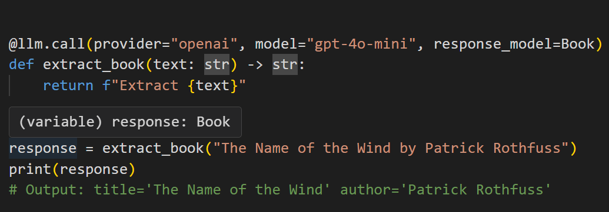

# LLM Integration: Key Tools and Techniques

LLM integration means embedding a language model into an application to give it superpowers like:

* Understanding the subtleties of user inputs to provide relevant and coherent responses.  
* Writing human-like text for tasks like drafting emails, writing reports, or creating other content.  
* Executing multi-step responses by interpreting and following instructions.  
* Interacting with various tools and APIs to fetch data, do actions, or control devices.

To get these benefits you connect the language model with external resources and data sources, typically via an API.

But calling an API isn’t the end of the story — **the software must be designed to handle certain challenges**:

* Non-deterministic responses need careful prompt engineering and error handling to maintain consistent outputs.  
* Network issues need to be reliably managed.  
* Model vendor lock-in requires flexible and open design.  
* Experimenting with different prompts requires version control and observability.

That’s why we created [Mirascope](https://github.com/mirascope/mirascope/), a user-friendly toolkit for integrating LLMs into applications, and [Lilypad](https://lilypad.so/docs), our prompt management and observability platform.

Below, we dive into real-world examples of LLM integrations and then explain the different ways you can set this up.

<!-- more -->

## Real-World Applications that Utilize LLMs

Below are three brief examples of how different industries are currently integrating LLM models into their operations, leading to significant advancements.

### In Customer Service

Vimeo has written up a [detailed case study](https://medium.com/vimeo-engineering-blog/from-idea-to-reality-elevating-our-customer-support-through-generative-ai-101a2c5ea680) of its use of RAG to surface immediate answers via customer support chatbots that are helpful, saving users the effort of having to dig through irrelevant help articles.

It does this by integrating an LLM (according to the article they tested Google Vertex AI Chat Bison and both GPT 3.5 and 4 from OpenAI) not once but twice in the application: the first pass to formulate a “standalone” question that takes into account both the user’s current question and their chat history (to make sure the model comprehends the query within the context of previous interactions), and a second pass to combine the standalone question with appropriate context from a vector store (knowledge base).

Their RAG setup allows for switching language models **and** vector stores according to the query. For example, one vector database hosts internal docs for employees, while the other contains their customer-facing knowledge base.

They developed their application using LangChain, an open-source framework as it provided an interface for interacting directly with embedding and LLM APIs to coordinate multiple prompts and manage the backend business logic.

An interesting detail about this case study of using [LangChain RAG](https://mirascope.com/blog/langchain-rag/) is its discussion of the different model capabilities and costs. For example, although OpenAI offered streaming while Vertex didn’t (at the time of the write-up), they still went with Vertex after extensive testing due to its “exceptional ability” to answer questions concisely and its easy authentication process.

Depending on the use case, teams may also consider fine-tuning a model to further improve performance, but this often involves additional costs and complexity, and as this [RAG LLM example](https://mirascope.com/blog/rag-llm-example/) shows, a well-structured retrieval system combined with prompt engineering can often achieve strong results without the need for fine-tuning.

(For more information and a tutorial on chatbots, see our guide on [how to make a chatbot](https://mirascope.com/blog/how-to-make-a-chatbot/).)

### In Software Development and Testing

Uber created [DragonCrawl](https://www.uber.com/en-GB/blog/generative-ai-for-high-quality-mobile-testing/), an LLM-powered application that autonomously tests mobile apps by taking action based on what it sees on the screen.

So it uses the Uber app like a traveler would, interacting with various screen elements to book rides. It can cope with unexpected occurrences like a button appearing in a new place (as a result of an app update or an A/B test), and adjust its testing accordingly.

In one instance it tested the trip flow of a booking to Paris airport and the elements for choosing a payment method didn’t load, so it closed the app, re-opened it, and successfully booked the trip all the way to the airport.

Such automatic testing saves countless hours of writing test scripts and manual evaluations.

DragonCrawl uses MPNet as a language model for accurately interpreting and interacting with the app’s UI. Its small size additionally makes it less resource intensive (and cost effective), while the model’s combination of masking and permuting strategies gives it a deep understanding of language semantics.

The platform is integrated into Uber’s CI pipeline to allow it to execute core-trip flows in multiple cities and on different devices and OS versions. This ensures high stability and reusability across different environments.

### In Finance

Hiscox has developed an [AI lead underwriting system](https://www.hiscoxgroup.com/news/press-releases/2024/12-08-24) that automates generating and sending insurance quotes to customers.

After requesting a quote, brokers now receive it within minutes via an automated email containing pricing and other details.

The system is powered by the Hiscox AI Laboratories platform, which uses Google Gemini and advanced machine learning techniques to automate the evaluation of risks and to generate relevant data for underwriting.

The system packages this information as a provisional quote sent to brokers, and an underwriter finalizes the quote by adjusting it as necessary.

## How to Integrate LLMs in Applications

### APIs

In the context of language models, an API specifies the rules and format for how you send prompts (e.g., to process text, images, or audio) to an LLM and receive responses back, which is the most common way to integrate language models.

Most commercially available LLM provider options, like Anthropic, Google, and OpenAI, provide APIs for developers to build applications on top of their models.

An API call typically consists of:

* An endpoint, which is a specific URL to which requests are sent — API requests are generally sent over HTTP.  
* A way of authenticating your requests, usually with an API key or token.  
* The request body that’s in JSON format and contains information and instructions like the model specification (e.g., “gpt-4o-mini” or “claude-3-opus”), as well as input text or messages, and optional parameters like temperature or `max_tokens`).

Here’s an example API call using `curl`, which makes requests over HTTP:

```bash
curl https://api.openai.com/v1/chat/completions \
  -H "Content-Type: application/json" \
  -H "Authorization: Bearer YOUR_API_KEY" \
  -d '{
    "model": "gpt-4o-mini",
    "messages": [
      {"role": "system", "content": "You are a helpful assistant."},
      {"role": "user", "content": "Hello!"}
    ],
    "temperature": 0.7
  }'
```

The response you get back will be formatted in JSON and contain the generated `message`, some metadata (e.g., token usage, model version, etc.), and possibly any error messages.

An example LLM response might be:

```json
{
    "id": "chatcmpl-Awokg9ThvjU2l09zdCbu5gPAhJ07s",
    "object": "chat.completion",
    "created": 1738581478,
    "model": "gpt-4o-mini-2024-07-18",
    "choices": [
        {
            "index": 0,
            "message": {
                "role": "assistant",
                "content": "The capital of France is Paris.",
                "refusal": null
            },
            "logprobs": null,
            "finish_reason": "stop"
        }
    ],
    "usage": {
        "prompt_tokens": 24,
        "completion_tokens": 8,
        "total_tokens": 32,
        "prompt_tokens_details": {
            "cached_tokens": 0,
            "audio_tokens": 0
        },
        "completion_tokens_details": {
            "reasoning_tokens": 0,
            "audio_tokens": 0,
            "accepted_prediction_tokens": 0,
            "rejected_prediction_tokens": 0
        }
    },
    "service_tier": "default",
    "system_fingerprint": "fp_72ed7ab54c"
}
```

APIs also play a central role in function and tool calling — where the model makes decisions on which functions to call based on the user’s query — but only if the function requires access to an external dataset or third-party services.

APIs themselves can be complex to use if you’re not doing so over an SDK or library that abstracts away low-level details like authentication, request construction, response parsing, and rate limiting. You then need to manually handle these aspects in your code, which is generally a burden.

### SDKs and Libraries (Including Our Own, Mirascope and Lilypad)

These are built on top of APIs and provide out-of-the-box functions and authentication, simplifying interacting with APIs and reducing the amount of boilerplate you need to write.

All the major model providers offer SDKs for interacting with their products, while libraries (also known as frameworks) like LangChain and LlamaIndex extend functionality by adding features like prompt management, retrieval augmented generation, and workflow orchestration.

While frameworks provide pre-built abstractions that help integrate LLMs, they also have certain downsides **that we built Mirascope and Lilypad to address**.

Below, we present a few of these challenges and explain how we designed Mirascope and Lilypad to overcome them.

#### Dependencies as Bottlenecks

Frameworks are often ecosystems in themselves, seeking to offer a module or class for every conceivable task you might want to do.

While this can be helpful for newcomers, it also introduces performance overhead and dependency management challenges. For example, when a model provider or some other major dependency updates their SDK, you often need to wait until the framework also updates, which may take weeks, months, or even longer.

#### Complex, Homegrown Abstractions

Another hidden cost of frameworks is they’re highly opinionated and sometimes invent their own abstractions **where vanilla Python would suffice**.

For example, in its aim to provide a consistent and unified way of interacting with different components (such as prompts, language models, and output parsers) LangChain offers its LangChain Expression Language (LCEL), a custom interface that provides a set of common methods (`invoke`, `batch`, and `stream`) for executing chains.

This declarative approach, which allows you to use runnables and pipe operators to link together components for prompts and responses, can be a concise way of expressing simple chains.

To illustrate this, we show a RAG application below where we:

* Scrape the content of a blog post to extract relevant parts (e.g., the post title and content).  
* Store the extracted parts as separate chunks in a vector store (Chroma).  
* Create a RAG workflow using a retriever object and prompt template.  
* Define a LangChain runnable chain (`overview_chain`) to retrieve snippets from the vector store and send these together with the query to the LLM, as well as parse the response.

```python hl_lines="45-50"
from bs4 import SoupStrainer
from langchain_chroma import Chroma
from langchain_community.document_loaders import WebBaseLoader
from langchain_core.output_parsers import StrOutputParser
from langchain_core.runnables import RunnablePassthrough
from langchain_openai import OpenAIEmbeddings, ChatOpenAI
from langchain_text_splitters import RecursiveCharacterTextSplitter
from langchain_core.prompts import PromptTemplate

# Load, chunk and index the contents of the article.
loader = WebBaseLoader(
    web_paths=("https://en.wikipedia.org/wiki/Quantum_computing",),
    bs_kwargs=dict(
        parse_only=SoupStrainer(class_=("post-content", "post-title", "post-header"))
    ),
)
docs = loader.load()

text_splitter = RecursiveCharacterTextSplitter(chunk_size=1000, chunk_overlap=200)
splits = text_splitter.split_documents(docs)
vectorstore = Chroma.from_documents(documents=splits, embedding=OpenAIEmbeddings())

# Retrieve and generate using the relevant snippets of the article.
retriever = vectorstore.as_retriever()
llm = ChatOpenAI()


def format_docs(docs):
    return "\n\n".join(doc.page_content for doc in docs)


template = """Use the following pieces of information to provide a concise overview.
If the details are insufficient, state that clearly without making assumptions.
Keep your response to three sentences for conciseness.
End with "hope this provides clarity!" to conclude your response.

{information}

Topic: {subject}

Overview:"""

custom_overview_prompt = PromptTemplate.from_template(template)

overview_chain = (
    {"information": retriever | format_docs, "subject": RunnablePassthrough()}
    | custom_overview_prompt
    | llm
    | StrOutputParser()
)

output = overview_chain.invoke("Describe quantum computing.")
print(output)
```

Note that in `overview_chain`, we string together components (including the prompt, LLM call, and the parser) using pipe operators. This may seem elegant, but the more components you add (and the more complex each component is), the more opaque this chain becomes and the harder it is to tell what’s happening under the hood.

Also, `RunnablePassThrough()` is designed to pass data through the chain unchanged but it’s hard to tell what data it accepts — especially since this class doesn’t offer editor support.

All in all, invoking this chain adds layers of abstraction to a seemingly straightforward task we could just implement in native Python.

To do this, we update the code by replacing the runnable chain with **Mirascope’s decorator-based approach to model interaction and prompt handling**.

This uses vanilla Python function definitions and annotations instead of constructing explicit processing chains, resulting in cleaner, more modular code:

```python
from bs4 import SoupStrainer
from langchain_chroma import Chroma
from langchain_community.document_loaders import WebBaseLoader
from langchain_openai import OpenAIEmbeddings
from langchain_text_splitters import RecursiveCharacterTextSplitter

from mirascope.core import openai, prompt_template

# Load, chunk and index the contents of the blog.
loader = WebBaseLoader(
    web_paths=("https://en.wikipedia.org/wiki/Quantum_computing",),
    bs_kwargs=dict(
        parse_only=SoupStrainer(class_=("post-content", "post-title", "post-header"))
    ),
)
docs = loader.load()

text_splitter = RecursiveCharacterTextSplitter(chunk_size=1000, chunk_overlap=200)
splits = text_splitter.split_documents(docs)
vectorstore = Chroma.from_documents(documents=splits, embedding=OpenAIEmbeddings())

# Retrieve and generate using the relevant snippets of the article.
retriever = vectorstore.as_retriever()


@llm.call(provider="openai", model="gpt-4o-mini", output_parser=str)
@prompt_template(
    """
    Use the following pieces of information to provide a concise overview.
    If the details are insufficient, state that clearly without making assumptions.
    Keep your response to three sentences for conciseness.
    End with "hope this provides clarity!" to conclude your response.

    {information}

    Topic: {subject}

    Overview:
    """
)
def overview(subject: str) -> openai.OpenAIDynamicConfig:
    information = "\n\n".join(doc.page_content for doc in retriever.invoke(subject))
    return {"computed_fields": {"information": information}}


output = overview("Describe quantum computing")
print(output)
```

* We replace LangChain’s `PromptTemplate` object with Mirascope’s `@prompt_template` decorator, which directly applies the prompt format to a function, removing the need for explicit template construction and chaining.  
* Instead of `RunnablePassthrough()`, we use Python native arguments as there’s no explicit need for a passthrough.  
* A manual LLM call and parsing (`ChatOpenAI()` and `StrOutputParser` respectively) are replaced by a single decorator  
* `@llm.call(provider="openai", model="gpt-4o-mini", output_parser=str)`  
* We replace the separate `format_docs()` function with inline string formatting.

This results in cleaner, more transparent code, making it easier to debug, extend, and maintain.

#### Scattered Prompts and Calls

Frameworks provide convenient ways to make API calls but often don’t enforce developer best practices such as colocating prompts and calls.

**Keeping prompts and calls together makes the code more readable and maintainable, and reduces the risk of errors and drift**.

Mirascope’s call decorator — e.g., `@llm.call()` — simplifies model invocation by binding a function to an LLM call and turning that function into a prompt.

When used with `@prompt_template()`, the call decorator injects function arguments into the formatted prompt, removing the need for manually formatting or passing inputs into the LLM call.

It also automates response parsing and its interface lets you hot switch model providers when needed — our growing list includes OpenAI, Anthropic, Mistral, Google Gemini, Groq, Cohere, LiteLLM, Azure AI, and Bedrock.

An example of this is shown below. To switch from OpenAI to Anthropic, you can use `llm_override` to override provider settings at runtime to specify a different model.

```python hl_lines="4 12-17"
from mirascope import llm


@llm.call(provider="openai", model="gpt-4o-mini") # Calls GPT-4o-mini and parses output as a string
def explain(topic: str) -> str:
    return f"Explain the concept of {topic} in two sentences."


output = explain("quantum computing")
print(output)

override_output = llm.override(
    recommend_book,
    provider="anthropic",
    model="claude-3-5-sonnet-20240620",
    call_params={"temperature": 0.7},
)("quantum computing")
print(override_output)
```

#### Not Validating Model Outputs

Although many frameworks offer built-in input validation using Pydantic, similarly validating responses of AI models remains overlooked.

Note that here we’re not talking solely about *structuring responses* — that’s about formatting the output as a specific schema or data structure.

Instead, we’re talking about:

* Defining exactly what you expect from the LLM to ensure consistency in responses.  
* Ensuring type safety of outputs to reduce errors in your application.  
* Working with Python objects instead of raw strings or dictionaries.

To get these benefits with the big frameworks, **you usually have to write your own boilerplate**.

Mirascope offers its Pydantic-based `response_model`, allowing you to easily define, structure, and validate outputs using Pydantic’s `BaseModel`.

Pydantic enforces the schema you define and automatically converts, validates, and constraints model outputs to ensure they’re well-formed, type-safe, and free from common parsing errors — without requiring extra manual checks.

An example of this is shown below, where we specify the model’s outputs should be checked against the Pydantic object `WeatherResponse` and automatically parsed into a structured, type-safe Python object:

```python hl_lines="5-7 13"
from mirascope import llm
from pydantic import BaseModel


class WeatherResponse(BaseModel):
    temperature: float
    condition: str


@llm.call(
    provider="openai",
    model="gpt-4o",
    response_model=WeatherResponse,
)
def get_weather(location: str) -> str:
    return f"What's the weather in {location}"


response = get_weather("Paris")
print(response.temperature, response.condition)  # Fully structured, type-safe output! 
```

A major benefit of Mirascope’s response models is they’re also fully integrated into your IDE, instantly showing you expected return types of LLM outputs:



It also shows auto-suggestions:


#### Untracked Prompts

We experienced the importance of version control back when working with the first versions of OpenAI’s SDK. At that time, there was no structured or automatic way to track modifications in prompts, and these quickly became unmanageable.

It got so bad that at one point, one of our developers forbade anyone from touching the code — as we had no means of determining what changes had what downstream effects, and comparing things using git was a headache.

**Prompt engineering is a fluid, experimental activity** due to natural language models’ non-determinism, sensitivity to slight wording changes, model updates, and the challenge of balancing specificity with flexibility to guide responses effectively.

That’s why having a structured system for tracking, versioning, and iterating on prompts is important — not just for maintaining consistency, but for ensuring that past optimizations aren’t lost and for making improvements with confidence.

[Lilypad](https://lilypad.so/docs/) versions and traces your LLM code automatically with every change you make.

You just add a Lilypad decorator `@lilypad.generation` to any function to start automatically versioning any changes that occur:

```python hl_lines="7"
import lilypad
from openai import OpenAI
 
client = OpenAI()
 

@lilypad.generation()
def answer_question(question: str) -> str:
    completion = client.chat.completions.create(
        model="gpt-4o-mini",
        messages=[{"role": "user", "content": question}],
    )
    return str(completion.choices[0].message.content)
 
if __name__ == "__main__":
    lilypad.configure()
    answer = answer_question("What's the famous question that's answered by '42'?")
    print(answer)
```

Lilypad versions LLM generations using their function closure, so even changes to functions or classes used within the generation are automatically versioned (as long as they’re user defined).

By adding `lilypad.configure()` to the application (see code above), you also automatically trace all calls made by any function decorated with `@lilypad.generation`. This means every call to an LLM is traced against the version of the code that generated it.


Lilypad shows traces in real time as LLM calls are made, providing real-time summaries of every call so you can evaluate and improve prompts more quickly.

### Writing Your Own Code

If you don’t want to rely on an SDK or library, however, then you’ll have to write your own integration code.

There are situations where you’ll want to do this, for example:

* An API provider doesn’t offer an interpreter in a language you need, e.g., C++ or Java.  
* You may have a use case not supported by a provider’s built-in solution.  
* The cost structure for code execution or model usage doesn’t fit the budget or constraints.  
* The file size of your input data is too large or not supported by the provider’s interpreter.  
* You want greater or more fine-grained control than what’s offered by existing solutions

Writing your own code involves immersing yourself in low-level details like implementing direct HTTP requests to the API, handling authentication, formatting requests, managing latency, etc.

It may be worth it, however, if the greater control you gain over API interactions allows you to improve performance, reduce costs, or implement custom functionality that’s not possible with an off-the-shelf SDK or library.

(If you also need to model complex relationships among your data, you can learn [how to build a knowledge graph](https://mirascope.com/blog/how-to-build-a-knowledge-graph/) to power more advanced querying and insights.)

## Integrate LLMs with Mirascope’s Provider-Agnostic Library

Future-proof your AI workflows and applications with our toolkit’s pythonic approach that takes the complexity out of managing LLM integrations. It offers the right level of abstraction for simplifying development and experimentation with large language models, while not boxing you in.

It offers the right level of abstraction for simplifying development and experimentation with large language models, while not boxing you in, and ensuring scalability for projects of any size.

Want to learn more about Mirascope’s tools for building generative AI agents? You can find Mirascope code samples both in our [documentation](https://mirascope.com/WELCOME/) and our [GitHub repository](https://github.com/mirascope/mirascope).

Lilypad code samples can also be found in our [documentation](https://lilypad.so/docs). These resources can help you incorporate automation into your LLM integration workflow, speeding up deployment and reducing manual tasks.
