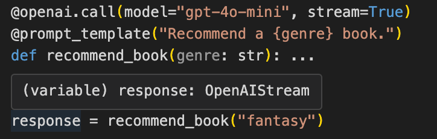

# LLM Prompt: Examples and Best Practices

An LLM prompt is an instruction you give a language model to guide it to a desired response, and can be anything from a simple question to an input spanning multiple calls.

For simple queries, a straightforward, one-liner prompt will often get you the response you want, but we recommend prompt engineering for anything more complex or when your initial prompts don’t achieve your desired results.

**This article explores examples and techniques for effective prompt writing, including:**

- The role of prompts in dialoguing with language models
- Prompt examples and their use cases
- Advanced techniques for prompting
- Challenges and limitations with prompt engineering

<!-- more -->

In addition, we discuss best practices for prompting, and, in case you’re using language model APIs as part of a software development project, we provide an advanced code sample showing how you can implement these with [Mirascope](https://github.com/mirascope/mirascope), our lightweight Python toolkit for working with LLMs.

## Parts of a Well-Structured Prompt

Before getting into how prompts are structured, let’s review the technical process of how they work.

Every interaction with an LLM begins with a prompt that guides the direction, and accuracy of the model's response.

LLMs interpret prompts by breaking down the input text into tokens — which are smaller units of meaning. These tokens are processed through layers of neural networks and predict the most probable next tokens to generate the response.

These tokens might be whole words, subwords, or even parts of words, depending on the model's tokenization method.

For instance, given the prompt “Explain why the sky is blue during the day,” the LLM might break it down into individual tokens:

<div>
<b>[<div style="background: #f8ff00; padding: 2px; display: inline;">“Explain”</div>, <div style="background: #efb5ac; padding: 2px; display: inline;">“why”</div>, <div style="background: #00ffff; padding: 2px; display: inline;">“the”</div>, <div style="background: #99c6ca; padding: 2px; display: inline;">“sky”</div>, <div style="background: #ec7662; padding: 2px; display: inline;">“is”</div>, <div style="background: #ffb42c; padding: 2px; display: inline;">“blue”</div>, <div style="background: #00ff1c; padding: 2px; display: inline;">“during”</div>, <div style="background: #c59100; padding: 2px; display: inline;">“the”</div>, <div style="background: #f0cedb; padding: 2px; display: inline;">“day”</div>]</b>
</div>
<br>

Alternatively, with subword tokenization, the model might split the prompt into smaller units, like:
‍<div>
<b>[<div style="background: #f8ff00; padding: 2px; display: inline;">“Ex”</div>, <div style="background: #efb5ac; padding: 2px; display: inline;">“pla”</div>, <div style="background: #00ffff; padding: 2px; display: inline;">“in”</div>, <div style="background: #99c6ca; padding: 2px; display: inline;">“why”</div>, <div style="background: #ec7662; padding: 2px; display: inline;">“the”</div>, <div style="background: #ffb42c; padding: 2px; display: inline;">“sk”</div>, <div style="background: #00ff1c; padding: 2px; display: inline;">“y”</div>, <div style="background: #c59100; padding: 2px; display: inline;">“is”</div>, <div style="background: #f0cedb; padding: 2px; display: inline;">“bl”</div>, <div style="background: #FCE5CD; padding: 2px; display: inline;">“ue”</div>, <div style="background: #f8ff00; padding: 2px; display: inline;">“du”</div>, <div style="background: #D8EAD3; padding: 2px; display: inline;">“ring”</div>, <div style="background: #B7D7A8; padding: 2px; display: inline;">“the”</div>, <div style="background: #F1C233; padding: 2px; display: inline;">“day”</div>]</b>

</div>
<br>

As for writing the prompts themselves, a well-structured prompt typically includes three key components:

- **Instruction:** This is the core directive or question to be addressed by the model. [Clear instructions are important](https://mirascope.com/blog/prompt-engineering-best-practices), as ambiguity can lead to unpredictable or irrelevant outputs.
  ‍**‍**
- **Context:** Various background details that help the model understand the instruction better. Context means everything when it comes to complex queries or when specific knowledge is required.
  ‍**‍**
- **Examples _(optional)_ : **Sample inputs and outputs that illustrate the expected response. While optional, examples — often referred to as few-shot prompts — are especially useful in guiding the model to produce outputs in a desired format or style.

Here’s a simple example of a summarization prompt:

```plaintext
Instruction: "Summarize the following article."

"The rapid melting of polar ice caps has accelerated in recent years, leading to a significant rise in global sea levels. Coastal cities around the world are facing increased flooding risks, with some communities already experiencing regular inundations during high tides. Scientists warn that without immediate action to reduce greenhouse gas emissions, these trends will continue, putting millions of people at risk of displacement. Moreover, the economic impact on these regions could be devastating, with billions of dollars in property damage and the loss of vital infrastructure. Governments and international organizations are now pushing for more aggressive climate policies to mitigate these effects and protect vulnerable populations."
```

Output:

```plaintext
"The article discusses the melting of polar ice caps and its impact on sea levels."
```

Notice how this output is overly broad and misses key details because the prompt provided little guidance beyond asking for a summary.

Let's use a well-structured prompt with a general example to guide the model in summarizing effectively:

```python
Instruction: "Summarize the following article."

Text: “The rapid melting of polar ice caps has accelerated in recent years, leading to a significant rise in global sea levels. Coastal cities around the world are facing increased flooding risks, with some communities already experiencing regular inundations during high tides. Scientists warn that without immediate action to reduce greenhouse gas emissions, these trends will continue, putting millions of people at risk of displacement. Moreover, the economic impact on these regions could be devastating, with billions of dollars in property damage and the loss of vital infrastructure. Governments and international organizations are now pushing for more aggressive climate policies to mitigate these effects and protect vulnerable populations."

Example text: "New research indicates that urban air pollution levels have risen sharply over the past decade. Major cities are now experiencing more frequent 'smog days,' with adverse effects on public health, particularly for those with respiratory conditions. Despite growing awareness, many cities struggle to implement effective air quality regulations due to economic and political constraints."

Example Summary: "The article explains the rise in urban air pollution levels, the increase in 'smog days,' and the challenges cities face in enforcing air quality regulations."
```

Now, our desired output:

```plaintext
"The article explains how the rapid melting of polar ice caps is causing global sea levels to rise, increasing flooding risks for coastal cities. It highlights the potential displacement of millions of people, the economic damage to infrastructure, and the urgent need for aggressive climate policies to mitigate these risks."
```

Clearly, the use of examples can produce better outputs.

## Prompts Examples And Use Cases

Below are five examples of the [most commonly used prompts](https://mirascope.com/blog/prompt-engineering-examples):

### Question-Answering (QA)

These are just straightforward questions that extract specific information or provide detailed answers to queries based on the context provided. [LLM-based applications](https://mirascope.com/blog/llm-applications) like chatbots often employ QA prompts to “interface” with humans.

Example prompt:

```plaintext
Briefly explain the difference between machine learning and artificial intelligence.
```

Expected output:

```plaintext
Artificial intelligence (AI) is a broad field that involves creating systems capable of performing tasks that typically require human intelligence, such as reasoning, understanding language, and problem-solving.

Machine learning (ML), on the other hand, is a subset of AI that focuses on enabling systems to learn and improve from experience without being explicitly programmed.
```

### Text Completion

Here you’re getting the model to complete a piece of text. You give it a starting sentence, paragraph, or phrase, and the model predicts and generates the continuation based on the context you've provided.

Example prompt:

```plaintext
Fully complete the rest of this nursery rhyme,

Jack and Jill went up the hill
To fetch a pail of water;
Jack fell down and broke his crown,
And Jill came....
```

Output:

```plaintext
...tumbling after.
Up Jack got and home did trot,
As fast as he could caper;
He went to bed to mend his head,
With vinegar and brown paper.
```

### Zero-Shot Prompting

These are prompts that don’t include context like an example or specific training. The model relies solely on the data it was trained on for its answer.

Example prompt:

```plaintext
Translate “Hello, how are you?” from English to French.
```

Expected output:

```plaintext
Bonjour, comment  ça va?
```

### Few-Shot Prompting

These types of prompts use few-shot learning by including more than one example of the desired output. This technique helps the model understand the specific task or structure of the expected response, making it more likely to generate the desired output.

Example prompt:

```plaintext
Write a short poem in the style of these examples:

Example 1: "The sun sets gently, painting the sky with hues of orange and pink, a masterpiece of the night."

Example 2: "The rain whispers secrets to the leaves, a soft symphony of nature's voice, soothing the soul."
```

Expected output:

```plaintext
The stars shimmer softly in the night, tiny beacons of hope and dreams, guiding us through the darkness.
```

### Code Generation

This involves prompting the model to write, complete, or debug code. This is particularly useful for developers who want to automate repetitive tasks, generate boilerplate code, or troubleshoot bugs.

Example prompt:

```plaintext
Create a Python class for a simple calculator that can add and subtract numbers.
```

Expected output:

```python
class Calculator:
    def add(self, a, b):
        return a + b

    def subtract(self, a, b):
        return a - b
```

### Role-Based Prompts

Here you assign a specific persona that you want the LLM to adopt when generating responses. This technique helps tailor the model’s output to fit a particular context, style, or expertise.

Example prompt:

```plaintext
You are a customer support representative for a tech company. Respond to the following customer inquiry:

"My laptop won't turn on. I've tried charging it, but nothing happens. What should I do?"
```

Expected output:

```plaintext
I'm sorry to hear that your laptop isn't turning on. Here are a few troubleshooting steps you can try:

1. Ensure that the power adapter is securely connected to both the laptop and the power outlet.
2. Check if the power outlet is working by plugging in another device.
3. Try performing a hard reset by holding down the power button for 10-15 seconds.
4. If the laptop still doesn't turn on, please contact our support team for further assistance.
```

## Advanced Prompting Techniques

### Chain-of-Thought Prompting (CoT)

This prompting technique involves guiding the LLM to outline its thought process step by step in a single LLM call. So instead of providing a direct answer, the model breaks down the problem, analyzes each part, and then provides an answer.

Example prompt:

```plaintext
Sarah bought 5 apples for $2 each and 3 oranges for $1 each. How much did she spend in total?

Explain each step of your reasoning before providing the final answer.
```

Expected output:

```plaintext
Sarah bought 5 apples at $2 each, so 5 * 2 = $10. She also bought 3 oranges at $1 each, so 3 * 1 = $3. The total cost is $10 + $3 = $13.
```

A regular prompt might return an incorrect output like, “**The total cost is $11**" because the output is generated based on probabilities that may not be correct, but with chain-of-thought prompting, the additional output generated for reasoning can increase the probability of the correct output.

### Using Multi-Turn Prompts

Multi-turn prompting involves guiding a conversation with a model over several interactions, where each response builds on the previous one — similar to [prompt chaining](https://mirascope.com/blog/prompt-chaining).

Instead of trying to get the final response in a single prompt, you break down the task into a series of exchanges. This permits more complex tasks to be handled in stages, providing the model with opportunities to clarify, refine, or expand on its responses based on additional context and feedback.

Here’s a multi-turn example where we iterate on our prompts with ChatGPT: ‍

**1. Our initial prompt:**

```plaintext
I need help creating a brief update for my team on the current status of our marketing campaign.

Feel free to ask me questions so you can draft an accurate update.
```

**2. Response:**

```plaintext
Sure! To help me create a more accurate update, could you provide a bit more detail on the following:
What specific activities or platforms have been a focus in the campaign so far?
Are there any particular metrics or results you'd like to highlight?
Have there been any challenges or areas that need attention?
```

**3. Our response to the clarifying questions:**

```plaintext
We've been focusing on social media ads, particularly on Instagram and Facebook. Engagement has been decent, but we're not seeing as many conversions as we'd hoped.
```

**4. Response:**

```plaintext
Team,

Our marketing campaign has been active on Instagram and Facebook, where we've launched several ad initiatives. While we're seeing good engagement on both platforms, the conversion rates are not meeting our expectations. We're currently analyzing the data to identify potential areas for improvement and will adjust our strategy accordingly. I'll keep you updated as we make progress.
Best,

[Your Name]
```

**5. Our response to ChatGPT’s first draft:**

```plaintext
That sounds good. Please add a note about an upcoming review meeting next week where we'll discuss these points.
```

**6. ChatGPT’s final response:**

```plaintext
Team,

Our marketing campaign has been active on Instagram and Facebook, where we've launched several ad initiatives. While we're seeing good engagement on both platforms, the conversion rates are not meeting our expectations. We're currently analyzing the data to identify potential areas for improvement and will adjust our strategy accordingly.

Additionally, we'll be holding a review meeting next week to discuss these points in detail. I'll send out a calendar invite shortly.

Best,
[Your Name]
```

This iterative process allows the LLM to generate an output that is much more in line with what we want as opposed to using a single-turn prompt to generate the output in one go.

While zero-shot prompts can reduce token usage (especially important if there are usage limits on your application), there are still situations where multi-turn prompting is advantageous.

For example, even with an engineered prompt, it’s useful to have the model first confirm its understanding of the task and ask clarifying questions (if needed) before generating the final output to ensure accuracy and thoroughness.

### Tree-of-Thought Prompting (ToT)

Unlike CoT and multi-turn prompting, which follow a single line of reasoning, ToT prompts the language model to explore several potential solutions or reasoning paths to guide the model’s problem-solving process.

This lets the LLM evaluate the merits of different approaches, determining which paths hold the most promise and discarding those proving less viable.

**Example prompt:**

```plaintext
Imagine you are tasked with designing a new public park in a city with limited space. Consider at least three different design approaches, outlining the pros and cons of each, and then choose the best one.
```

**Expected output:**

```plaintext
Approach 1: A compact park with vertical gardens to maximize green space in a small area.
- Pros: Uses minimal ground space, visually striking.
- Cons: Higher maintenance costs, and limited recreational space.

Approach 2: A linear park along a river, utilizing the natural landscape.
- Pros: Integrates with the environment, and provides a scenic route.
- Cons: Limited space for facilities, potential flooding risk.

Approach 3: A multi-purpose space with small green areas, playgrounds, and community spaces.
- Pros: Diverse uses, meets different community needs.
- Cons: Less green space overall, more complex design.

After evaluating the options, the best approach is the multi-purpose space, as it balances the needs of the community with available space.
```

## Building a Tree-Of-Thought Prompt

### Tree-of-Thought Prompt Example Using OpenAI’s SDK

In the code sample below, we guide the LLM through a structured analysis, setting up ToT to evaluate the best design approach for a new public park.

```python
from openai import OpenAI

client = OpenAI()


def tree_of_thought(task: str) -> str | None:
    completion = client.chat.completions.create(
        model="gpt-4o-mini",
        messages=[
            {
                "role": "system",
                "content": "When given a task, consider at least three different approaches first, outlining the pros and cons of each approach. Then choose the best one.",
            },
            {"role": "user", "content": task},
        ],
    )
    return completion.choices[0].message.content


task = "Design a new public park in a city with limited space."
output = tree_of_thought(task)
print(output)

# OUTPUT:
"""
When designing a new public park in a city with limited space, there are several approaches to consider. Here, I will outline three different approaches, detailing their pros and cons:

### Approach 1: Vertical Park Design

Description: Utilize vertical space by creating a multi-level park with green terraces and hanging gardens. This could include pathways and recreational areas that rise from the ground level upwards.

Pros:
- Maximizes limited horizontal space by utilizing verticality.
- Can incorporate innovative landscaping and unique design features that attract visitors.
- Provides more diverse micro-environments (e.g., different levels can host different types of vegetation and activities).

Cons:
- Higher construction and maintenance costs compared to conventional parks.
- Potentially limited accessibility for all age groups and abilities, unless thoughtfully designed with ramps and elevators.
- Requires thorough structural support and engineering, which can complicate the design process.

### Approach 2: Pocket Park Design

Description: Develop a small, community-focused pocket park that includes essential features such as seating areas, small gardens, and play equipment. These parks can be interspersed throughout the city in underutilized lots.

Pros:
- Low-cost and relatively simple to implement compared to larger park designs.
- Engages the community directly, leading to higher local buy-in and maintenance support.
- Enhances neighborhood aesthetics and provides a quick escape to nature in an urban setting.

Cons:
- Limited recreational opportunities due to the small scale.
- Can easily be overlooked or underutilized if not positioned well within the city.
- Requires careful planning to avoid overcrowding and maintain a balance of green spaces.

### Approach 3: Multi-Functional Community Hub

Description: Create a multifunctional park that combines green space with community resources such as a small community center, outdoor exercise equipment, and space for markets or art installations.

Pros:
- Provides diverse activities: recreational, social, educational, and cultural, all in one space.
- Encourages community engagement and usage by catering to various interests and demographics.
- Potential for partnership with local organizations, which can help with funding and programming.

Cons:
- Can risk becoming cluttered or losing the tranquility of a traditional green park if not carefully designed.
- Requires more extensive planning and coordination with community stakeholders, potentially delaying the process.
- Maintenance can become complex due to the variety of features and activities offered.

### Best Approach:

After considering the pros and cons, Approach 3: Multi-Functional Community Hub emerges as the most viable option. This approach not only utilizes the limited space efficiently but also fosters community interaction and engagement. The diversity of functions ensures that the park remains lively and responsive to the needs of the local population, promoting both socialization and well-being. While it requires meticulous planning and community collaboration, the long-term benefits of a multifunctional park will likely outweigh the challenges.
"""
```

### Tree-of-Thought Prompt Example Using Mirascope

Below, we provide an alternative using Mirascope, which makes it easier to approach Tree-of-Thought through a structured approach:

```python
from mirascope.core import openai, prompt_template
from pydantic import BaseModel, Field


class Thought(BaseModel):
    approach: str = Field(..., description="The approach to solve the task")
    pros: list[str] = Field(..., description="The pros of this approach")
    cons: list[str] = Field(..., description="The cons of this approach")


@openai.call("gpt-4o-mini", response_model=list[Thought])
@prompt_template(
    """
    SYSTEM:
    When given a task, think through at least three different approaches.
    Outline the pros and cons of each approach.

    USER: {task}
    """
)
def think(task: str): ...


@openai.call("gpt-4o-mini")
@prompt_template(
    """
    Based on the following thoughts on how to solve the task, select the best approach.
    Output ONLY your evaluation and conclusion.

    Thoughts:
    {thoughts:lists}
    """
)
def tree_of_thought(task: str) -> openai.OpenAIDynamicConfig:
    thoughts = [
        [
            f"Approach: {thought.approach}",
            f"Pros: {thought.pros}",
            f"Cons: {thought.cons}",
        ]
        for thought in think(task)
    ]
    return {"computed_fields": {"thoughts": thoughts}}


task = "Design a new public park in a city with limited space."
response = tree_of_thought(task)
print(response.content)
print("Thoughts:")
for thought in response.dynamic_config["computed_fields"]["thoughts"]:
    for part in thought:
        print(part)
    print()


# OUTPUT:
"""
After evaluating the three approaches, the best choice seems to be Multi-Functional Spaces. This approach offers the highest potential for community engagement and flexibility, allowing the area to serve multiple needs and adapt over time. While it requires careful planning to avoid overcrowding and manage conflicting activities, these challenges can be addressed with thoughtful design. In contrast, Vertical Gardens and Green Walls, while aesthetically appealing, may face structural and maintenance issues, and Pocket Parks, though beneficial, have limitations in space and impact on the broader urban environment. Thus, Multi-Functional Spaces present a more balanced, sustainable solution that can effectively contribute to urban livability.
Thoughts:
Approach: Vertical Gardens and Green Walls
Pros: ['Maximizes limited space by using vertical surfaces for planting.', 'Adds aesthetic appeal and urban greenery.', 'Can improve air quality and reduce heat absorption.']
Cons: ['Requires structural support and maintenance.', 'May need irrigation systems that could increase costs.', 'Plant selection is crucial for long-term sustainability.']

Approach: Multi-Functional Spaces
Pros: ['Allows for various activities in one area (playgrounds, seating, paths).', 'Encourages community engagement and diverse usage.', 'Space can be adapted for seasonal events.']
Cons: ['Need careful planning to avoid overcrowding.', 'Some activities may conflict with others.', 'Maintenance of diverse facilities can be challenging.']

Approach: Pocket Parks
Pros: ['Small, easily maintained parks can be implemented in underused spaces.', 'Provides green space and recreational opportunities in dense urban areas.', 'Can improve local property values and community spirit.']
Cons: ['Limited space restricts the variety of features (play areas, gardens, seating).', 'Potential safety concerns in very small or isolated areas.', 'Less impact on overall green space in the city compared to larger parks.']
"""
```

## Challenges with Prompting

### LLMs are Inherently Non-Deterministic

All things being equal, the same prompt can generate different responses each time. This variability is a challenge that prompt engineering tries to solve by refining and iterating on prompts to achieve more consistent and accurate outputs.

[Popular orchestration frameworks](https://mirascope.com/blog/llm-orchestration) like LangChain and Llama Index have introduced their own methods to streamline this process, but these methods sometimes obscure what’s going on under the hood.

For instance, LangChain allows you to elegantly string together components using pipe moderators when defining chains, but complex implementations of these (e.g., using [runnables](https://mirascope.com/blog/langchain-runnables)) can be challenging to debug.

That’s why we built Mirascope to rely on existing structures already defined in Python, rather than reinventing the wheel with new, proprietary constructs.

### Ambiguity and Misinterpretation

Often, the challenges with LLMs lie more in how we structure our prompts than in the model's ability to interpret them. When a prompt is vague or lacks sufficient detail, the model may interpret your instructions in ways that differ from your intentions, leading to responses that don’t meet your expectations.

Achieving the desired output can be challenging, frequently requiring multiple iterations with varied wordings and structures.

Furthermore, overloading a single prompt with too many details can cause the model to overlook important nuances or mix up information. To improve clarity and accuracy, it’s often more effective to break down complex instructions into a series of focused, multi-turn prompts spanning several LLM calls.

### Token Size Limit

LLMs have a limited context window for inputs and outputs, which can limit the amount of context, background information, and instructions you can include in a prompt. This makes dealing with large datasets, or tasks requiring extensive context, challenging to say the least.

To address this, Retrieval-Augmented Generation (RAG) can be used. RAG enables the model to retrieve only the relevant information from external sources, allowing it to work within the constraints of its context window while still leveraging a broader set of data.

However, this limitation is gradually being addressed as frontier models continue to expand the size of their context windows.

### Bias and Ethical Concerns

LLMs can reflect biases present in their training data, leading to unbalanced or inappropriate responses that raise ethical concerns, especially when prompts touch on sensitive topics.

Also, the lack of transparency in how these models arrive at their conclusions makes it difficult to fully understand or address sources of bias, which can perpetuate harmful stereotypes or misinformation.

The best practices in the next section can help mitigate some of these issues.

## 5 Practical Tips And Best Practices For Prompt Engineering

Although simple to follow, some of these techniques — derived from our early experiences working with LLMs — are surprisingly not widespread.

### Start with Simple Prompts, Then Iterate from There

Begin with a simple prompt without too many variables to observe how the model responds.

From there, gradually iterate and refine the prompt (as we saw earlier with multi-turn prompts), making adjustments based on the model's output to better align it with your desired outcome.

### Test Your Prompts with Different Models

The choice of model — whether it’s GPT-3.5, GPT-4, Claude, or others — can impact the quality of your responses. That’s why testing your prompt across multiple AI models is generally a good idea.

Mirascope’s `propt_template` decorator (combined with the [call decorator](https://mirascope.com/learn/calls)) serves as a kind of [template](https://mirascope.com/blog/langchain-prompt-template) to formulate model-agnostic prompts without needing to make major changes to the prompt structure or content.

### Colocate Parameters and Code with LLM Calls

Call parameters [should be colocated with the call](https://mirascope.com/blog/engineers-should-handle-prompting-llms). But that’s not a best practice we often see in the wild. This leads to the unfortunate consequence of your call parameters residing in different places than the calls they pertain to.

We’ve designed Mirascope so that prompts, model parameters, and other configuration details are tested and versioned together as a single unit. This results in clean code that’s easy to organize and maintain.

An example can be seen below, where all the relevant parameters for the API call (such as the model, temperature, and prompt template) are bundled together with the function.

```python
from mirascope.core import openai, prompt_template

@openai.call(model="gpt-4o-mini", call_params={"temperature": 0.9})
@prompt_template("Provide the estimated driving time from {city1} to {city2}")
def report_driving_time(city1: str, city2: str): ...

response = report_driving_time(city1="Los Angeles", city2="San Francisco")
print(response.content)  # prints the string content of the call
print(response.call_params) # prints the call parameters of the call
```

More examples of colocation can be found throughout our [library](https://github.com/mirascope/mirascope/).

### Validate Prompt Inputs for Data Integrity

Catching basic errors early, before they even reach the model, helps produce reliable and accurate model responses. For this reason, our prompt templates are implemented as functions so that they can take advantage of Pydantic's [`validate_call`](https://docs.pydantic.dev/latest/concepts/validation_decorator/) decorator to strictly enforce argument types.

Mirascope also provides linting features and editor support, showing warnings and errors based on our API even before you run the code.

For instance, `response` below is assigned the output of an OpenAI call that returns a stream. When you hover the cursor over the `response` object in your editor, it’s identified as being an `OpenAIStream`.



### Version Your Prompts

Just like code, prompts are iterated and refined over time, so they too should be placed under [version control](https://mirascope.com/blog/prompt-versioning).

It's helpful to use a local working directory for this. Mirascope offers a dedicated prompt management framework called [Lilypad](https://lilypad.so/docs) that versions and traces every prompt and LLM call automatically.

## Use Mirascope for Effective Prompting

Mirascope is a lightweight Python toolkit that’s premised on software engineering best practices. Our library offers tools for reducing boilerplate when writing LLM functions, and Lilypad offers prompt management and automatic versioning and tracing as a symbiotic partner library.

To use Mirascope, you only need to know Python and the Pydantic library — there are no other unique abstractions or fancy concepts to learn. Mirascope’s modules slot readily into existing developer workflows, making it easy to get started.

Want to learn more? You can find more Mirascope code samples both on our [documentation site](https://mirascope.com) and the [GitHub repository](https://github.com/mirascope/mirascope).
