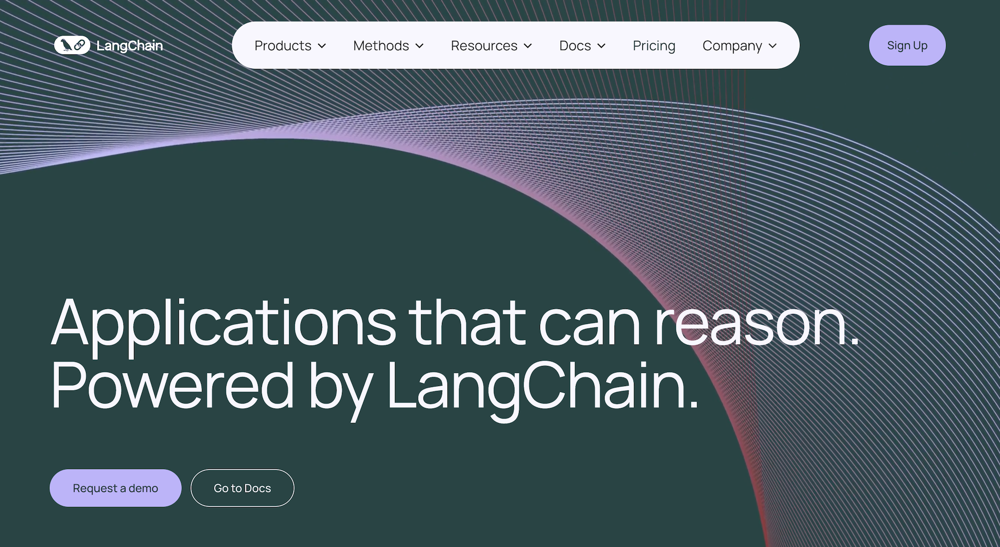

# 8 of the Best Prompt Engineering Tools in 2025

While anyone can develop LLM applications using just the OpenAI SDK—we used to do that since we didn’t find helper functions at the time to be particularly helpful—prompt engineering tools that simplify LLM interactions and enhance productivity are emerging as key players.

We’ve tried several libraries and have built our own, and in our experience you should look for six capabilities in a good prompt engineering tool, if you’re looking to develop robust, production-grade LLM applications:

<!-- more -->

1. **The tool offers dynamic prompting with automatic data validation** to reduce the likelihood of errors and ensure that inputs to the model are well formed and adhere to specified constraints. Not all tools do this: many leave this as an afterthought and expect you to take care of the error handling logic.
2. [**It colocates prompts with calls to the LLM**](https://mirascope.com/blog/engineers-should-handle-prompting-llms) to solve a major problem with prompt engineering where scattered calls and prompts become hard to manage at scale. We know of no other libraries (besides ours) embracing this principle—which as a leaner approach could be considered as good software practice.
3. **It simplifies model interactions with convenience wrappers and integrations** , reducing the complexities of interacting with, while offering more choice in LLMs, allowing developers to select the most suitable models and libraries to fit their use cases. Here we emphasize “simplifies,” as many libraries do indeed offer abstractions yet these (paradoxically) increase complexity rather than decrease it.
4. **The library allows you to extract structured data from the unstructured outputs of LLMs** to better integrate with other systems like databases, CRMs, etc., minimizing or eliminating the need for manual data entry or parsing. The unstructured text outputs are what LLMs are designed to provide, but getting structured data from their outputs is like a superpower and is something you should look to see that your tool provides (not all of them do).
5. **The library offers prompt management features like version control** so you can better track changes, revert to previous versions, and more. Version control makes all the difference in being able to track changes in complex prompts involving code, and for collaborative work. Many tools indeed provide prompt versioning, but as they don’t colocate the rest of the information affecting the quality of the LLM call (such as temperature, LLM model version, etc.) together with the prompt, only a part of the relevant information gets tracked consistently.
6. **It extends model capabilities by letting you add your own tools (i.e., function calling)** , like adding a calculator to increase the accuracy of math calculations, or granting it access to the Bing Web Search API to find answers. While some libraries provide methods to use such tools, many don’t, implying a reliance on developers to implement these functionalities independently.

Below, we present eight different prompt engineering tools, beginning with our own prompt engineering library, [Mirascope](https://github.com/mirascope/mirascope). In our list, we highlight the approach and strengths of each tool:

- [**Mirascope**](https://mirascope.com/blog/prompt-engineering-tools#mirascope)—best for building production-grade LLM applications.
- [**Guidance**](https://mirascope.com/blog/prompt-engineering-tools#guidance)—best for tailoring prompts via advanced constraints.
- [**Haystack**](https://mirascope.com/blog/prompt-engineering-tools#haystack)—best for structuring prompt pipelines.
- [**Priompt**](https://mirascope.com/blog/prompt-engineering-tools#priompt)—best for priority-controlled context management.
- [**Agenta**](https://mirascope.com/blog/prompt-engineering-tools#agenta)—best for rapid prototyping and collaborative LLM application development.
- [**LangChain**](https://mirascope.com/blog/prompt-engineering-tools#langchain)—best for customizable and scalable LLM applications.
- [**PromptHub**](https://mirascope.com/blog/prompt-engineering-tools#prompthub)—best for facilitating collaboration with non-tech roles.
- [**Promptmetheus**](https://mirascope.com/blog/prompt-engineering-tools#promptmetheus)—best for developers seeking an IDE for optimizing and testing prompts.

## 1. Mirascope—Best for Building Production Grade LLM Applications


### Automatically Validate Inputs of Dynamic Prompts to Ensure Accuracy

Back when we started working with the OpenAI SDK, we found that complex prompts involving code became unmanageable past two versions. So we began enforcing manual versioning, telling our developers not to touch the code without authorization, which made workflows inefficient.

It became important for us to catch basic errors before they reached the LLM, just as you’d expect in any standard software development workflow.

In [Mirascope](https://mirascope.com), the [`prompt_template`](https://mirascope.com/learn/prompts) decorator enables writing prompts and Python functions, which enables using Pydantic's [`validate_call`](https://docs.pydantic.dev/latest/concepts/validation_decorator/) decorator for automatic data validation to ensure the prompt's inputs are well formed and correspond to those defined by the prompt. This contributes to the overall quality of the prompt and lessens the chance of errors silently going into the LLM.

Mirascope offers inline documentation and linting for your editor to ensure the quality of your code. Two examples are shown below.

A missing argument in a function call:


‍
Autocompletion for a function call:


Since Mirascope prompt templates are just Python functions, you can easily customize and extend them to build prompt using dynamic content, according to your use case:

```python
from mirascope.core import prompt_template


@prompt_template(
    """
    SYSTEM: You are the world's greatest librarian.
    USER: Recommend a {genre} book.
    """
)
def recommend_book_prompt(genre: str): ...


messages = recommend_book_prompt("fantasy")
print(messages)
# > [BaseMessageParam(role='system', content="You are the world's greatest librarian."), BaseMessageParam(role='user', content='Recommend a fantasy book.')]
```

Above, the string template defined in the `prompt_template` decorator creates a structured, context-specific prompt, and calling the prompt template function returns the parsed and formatted messages using the arguments of the function as the template variables. This allows you to implement even more complex prompts just by extending the function:

```python
from mirascope.core import BaseDynamicConfig, prompt_template


@prompt_template(
    """
    Recommend some books on the following topic and genre pairs:
    {topics_x_genres:list}
    """
)
def recommend_book_prompt(topics: list[str], genres: list[str]) -> BaseDynamicConfig:
    topics_x_genres = [
        f"Topic: {topic}, Genre: {genre}" for topic in topics for genre in genres
    ]
    return {"computed_fields": {"topics_x_genres": topics_x_genres}}


messages = recommend_book_prompt(["coding", "music"], ["fiction", "fantasy"])
print(messages)
# > [BaseMessageParam(role='user', content='Recommend some books on the following topic and genre pairs:\nTopic: coding, Genre: fiction\nTopic: coding, Genre: fantasy\nTopic: music, Genre: fiction\nTopic: music, Genre: fantasy')]
print(messages[0].content)
# > Recommend some books on the following topic and genre pairs:
#   Topic: coding, Genre: fiction
#   Topic: coding, Genre: fantasy
#   Topic: music, Genre: fiction
#   Topic: music, Genre: fantasy
```

### Colocate Prompts with LLM Calls for Better Code Management

One frustration we experienced with prompting was not centralizing as much information as needed within API calls for better overall code management. This included details like model configuration, provider-specific parameters, and other details.

Having to manage code in disparate locations entailed greater manual efforts on our part to catch errors and keep track of changes. For example, if we decided to change model specification, which was located in one place and affected multiple prompts in other places in the codebase, then it could be a pain to ensure this change was properly accounted for.

Therefore we typically colocate critical information as well as the original model response within the call, as shown below:

```python
from mirascope.core import openai
from mirascope.core.base.prompt import prompt_template


def recommend_author(genre: str) -> str: ...


@openai.call("gpt-4o", call_params={"temperature": 0.4})
@prompt_template("Recommend a {genre} book by {author}.")
def recommend_book(genre: str) -> openai.OpenAIDynamicConfig:
    author = recommend_author(genre=genre)
    return {"computed_fields": {"author": author}}


response = recommend_book(genre="fantasy")
print(response.model_dump())
# > {
#     "tags": [],
#     "response": {
#         "id": "chatcmpl-9gedIF3hp8mqzPY3hjxwlQv8dqw80",
#         "choices": [
#             {
#                 "finish_reason": "stop",
#                 "index": 0,
#                 "logprobs": None,
#                 "message": {
#                     "content": 'I highly recommend ...,
#                     "role": "assistant",
#                     "function_call": None,
#                     "tool_calls": None,
#                 },
#             }
#         ],
#         "created": 1719952996,
#         "model": "gpt-4o-2024-05-13",
#         "object": "chat.completion",
#         "service_tier": None,
#         "system_fingerprint": "fp_d576307f90",
#         "usage": {"completion_tokens": 83, "prompt_tokens": 17, "total_tokens": 100},
#     },
#     "tool_types": [],
#     "prompt_template": "Recommend a {genre} book by {author}.",
#     "fn_args": {"genre": "fantasy", "author": "Patrick Rothfuss"},
#     "dynamic_config": {"computed_fields": {"author": "Patrick Rothfuss"}},
#     "messages": [
#         {"role": "user", "content": "Recommend a fantasy book by Patrick Rothfuss."}
#     ],
#     "call_params": {"temperature": 0.4},
#     "user_message_param": {
#         "content": "Recommend a fantasy book by Patrick Rothfuss.",
#         "role": "user",
#     },
#     "start_time": 1719952995968.4,
#     "end_time": 1719952997335.6309,
#     "cost": 0.00133,
#     "provider": "openai",
#     "message_param": {
#         "content": 'I highly recommend ...',
#         "role": "assistant",
#         "tool_calls": None,
#     },
#     "tools": None,
#     "tool": None,
# }
```

Mirascope both provides high-level wrappers for calling APIs and locates these calls within the prompt code.

Some of the key pieces of information include the prompt template, message parameters of the prompt and the response via the provider’s native API, the provider, cost, and more: `call_params` specifies the provider-specific parameters for the OpenAI API call, and `response` shows how every instance of the `OpenAICallResponse` class carries with it the original API response of the LLM call.

### Simplify Model Interactions with Wrappers and Integrations

Being able to use convenience wrappers and integrations for working with other libraries and LLMs saves developers time and effort, allowing them to focus more on their craft and less on the intricacies of API communications.

When working with the OpenAI API, the Mirascope `call` method returns an `OpenAICallResponse` class instance, which is a convenience wrapper encapsulating the response (i.e., the `ChatCompletion` class in `openai` that extends `BaseCallResponse`) from the OpenAI API, making it easier to work with by providing a simpler interface.

Each commented line of the code below shows the equivalent path to access the same information directly from a [`ChatCompletion` object](https://mirascope.com/learn/calls/#provider-specific-response-details) if you were not using the wrapper:

```python
from mirascope.core.openai import OpenAICallResponse

response = OpenAICallResponse(...)

response.response    # ChatCompletion(...)
response.content     # original.choices[0].message.content
```

Mirascope also supports interactions with other LLMs besides OpenAI to refine the execution of your calls. Currently, [the following models](https://mirascope.com/learn/calls) (and any providers using their APIs) are supported:

- OpenAI
- Anthropic
- Mistral
- Google Gemini
- Groq
- Cohere
- LiteLLM
- Azure AI
- Bedrock

Mirascope provides wrappers to integrate with a number of popular libraries in the machine learning and LLM space, such as Logfire, Langfuse, Open Telemetry, and Tenacity.

For working with libraries that implement a wrapper around the original client, you can set the `client` parameter within the provider’s decorator to internally wrap the client and get access to the functionalities of both Mirascope and the other library. From then on, all calls will be executed on top of the wrapped client. Here is an example with OpenAI:

```python
from mirascope.core import openai, prompt_template


@openai.call("gpt-4o", client=OpenAI(...))
@prompt_template("Recommend a {genre} book.")
def recommend_book(genre: str): ...
```

### Conveniently Extract Structured Data from Unstructured LLM Outputs

The conversational outputs of LLMs are valuable but can be difficult to action or integrate with other systems.

Extracting structured data from these unstructured outputs allows you to feed these as inputs to other processes and workflows in turn, making that information more useful and actionable..

Mirascope supports [extraction](https://mirascope.com/learn/response_models) by setting the `response_model` flag in the decorator, which takes a Pydantic `BaseModel` as a schema and takes advantage of function calling and JSON mode with LLMs to generate structured output.

In the example below, a call with `response_model` set to `TaskDetails` gets task details like due date, priority, and description from a user's natural language input:

```python
from typing import Literal

from mirascope.core import openai, prompt_template
from pydantic import BaseModel


class TaskDetails(BaseModel):
    due_date: str
    priority: Literal["low", "normal", "high"]
    description: str


@openai.call(model="gpt-4o", response_model=TaskDetails)
@prompt_template("Extract the details from this task: {task}")
def extract_task_details(task: str): ...


task = "Submit quarterly report by next Friday. Task is high priority."
task_details = extract_task_details(task)
assert isinstance(task_details, TaskDetails)
print(task_details)
# > due_date='next Friday' priority='high' description='Submit quarterly report'
```

Mirascope also provides ways to automatically extract base types from natural language, offering the shorthand convenience of not having to write the `pydantic.BaseModel` for when you want to extract a single base type instance:

```python
from mirascope.core import openai, prompt_template


@openai.call(model="gpt-4o-mini", response_model=list[str])
@prompt_template("Recommend me some {genre} books.")
def recommend_books(genre: str): ...


books = recommend_books(genre="fantasy")
print(books)
# > ['The Hobbit by J.R.R. Tolkien', 'Harry Potter Series by J.K. Rowling', 'The Name of the Wind by Patrick Rothfuss']
```

Mirascope supports extraction of numerous base types, including `str`, `int`, `float`, `bool`, `Literal`, `tuple`, and more.

### Manage Prompt Iterations with Version Control

As mentioned previously, a major pain point of ours has been successfully managing prompts after several iterations of changes. Prompts as code under development should be subject to [version tracking](https://mirascope.com/blog/prompt-versioning) like any code developed under collaboration.

For this reason we are working on [`Lilypad`](https://lilypad.so/docs), which is our prompt engineering framework. You can version and trace every prompt and LLM call automatically so you can spend your time focusing on improving your prompts rather than tracking them.

When installed, Lilypad creates a predefined directory structure as shown below:

```plaintext
|
|-- .lilypad/
|-- |-- config.json
|-- lily/
|   |-- __init__.py
|   |-- {llm_function_name}.py
|-- pad.db
```

This creates a prompt management environment that supports collaboration and allows you to centralize prompt development in one place. LLM functions live in the `lily` folder, and automatic versions and traces live in the `pad.db` SQLite database.

By versioning the entire lexical closure and tracing every call automatically, you can continue iterating on your prompts and any other code in your codebase without having to worry about manually tracking the potential impacts of such changes on the outputs of your functions.

### Extend Model Capabilities by Adding Tools (Function Calling)

LLMs can deliver impressive results with their conversational outputs, but relying solely on these introduces some limitations:

- Developers are restricted to the inherent outputs of LLMs, which are mainly text generation based on training data. This limitation hinders the scope of applications that can be developed, ​​confining these to scenarios where only text generation is needed.
- Without access to real-time data or external databases through tools, LLMs may generate outdated or inaccurate information. This increases the risk of incorrect answers, potentially eroding trust.
- Tasks that involve data retrieval, processing, or manipulation would become cumbersome. Developers would have to implement separate AI systems to handle these tasks outside the LLM, leading to complexity and fragmented system architectures.

To overcome these challenges, Mirascope provides a number of ways [to use tools](https://mirascope.com/learn/tools) in your LLM workflows.

For example, the `tool` property is used to attach a tool to a `BaseTool` extension like `OpenAITool`. It comes with the method `call()`, which lets you call the original function with the arguments returned by the model. The example below uses functions as-is with no additional work, automatically generating the tool, attaching the function, and passing along its docstring under-the-hood for you:

```python
from mirascope.core import openai, prompt_template


def format_book(title: str, author: str) -> str:
    """Returns the title and author of a book nicely formatted.

    Args:
        title: The title of the book.
        author: The author of the book in all caps.
    """
    return f"{title} by {author}"


@openai.call(
    model="gpt-4o-mini", tools=[format_book], call_params={"tool_choice": "required"}
)
@prompt_template("Recommend a {genre} book.")
def recommend_book(genre: str): ...


tool = recommend_book("fantasy").tool  # `format_book` tool instance
print(tool.call())  # runs `format_book` with `title` and `author` args
# > The Name of the Wind by PATRICK ROTHFUSS
```

Mirascope supports a number of docstrings, such as Google-, ReST-, Numpydoc-, and Epydoc-style docstrings.

Otherwise, Mirascope lets you define your own `BaseTool`, when the function you want has an insufficient or nonexistent docstring. You can find further use cases for using tools, and code samples, in our [overview documentation](https://mirascope.com/learn/tools).

```python
from pydantic import Field

from mirascope.core import BaseTool, openai, prompt_template


class FormatBook(BaseTool):
    """Returns the title and author of a book nicely formatted."""

    title: str = Field(..., description="The title of the book.")
    author: str = Field(..., description="The author of the book in all caps.")

    def call(self) -> str:
        return f"{self.title} by {self.author}"


@openai.call(
    model="gpt-4o", tools=[FormatBook], call_params={"tool_choice": "required"}
)
@prompt_template("Recommend a {genre} book.")
def recommend_book(genre: str): ...
```

*If you want to give Mirascope a try, you can get started with our source code on [GitHub](https://github.com/mirascope/mirascope/). You can find our documentation (and more code samples) on our [documentation site](https://mirascope.com) as well.*‍

## 2. Guidance—Best for Tailoring Prompts via Advanced Constraints


[Guidance](https://github.com/guidance-ai/guidance/tree/main) is a prompt engineering library that constrains generation using regexes and context-free grammars in Python.

### Constrained Generation Using Regular Expressions and Grammars

Guidance allows for dynamic prompting by constraining text generation to adhere to specific formats or rules. As an indirect form of data validation, it ensures you only get well-formed outputs meeting the specified constraints.

### Simplified Model Interactions with Convenience Wrappers and Integrations

The library works with a variety of LLM backends like Transformers, Llama.cpp, VertexAI, and OpenAI by providing convenience wrappers that simplify interactions with these models and allowing developers the flexibility to choose the most suitable LLM for their needs.

### Extension of Model Capabilities with Custom Tools

The library allows for the integration of custom tools or functions during the text generation process, enhancing the model's capabilities. Examples include adding a calculator function or potentially integrating external APIs for additional data access, although specific API integration capabilities like Bing Web Search were not mentioned.

Guidance, along with its documentation, is available on GitHub.

## 3. Haystack—Best for structuring prompt pipelines


[Haystack](https://haystack.deepset.ai/) is an orchestration framework for building customizable, production-ready LLM applications. Its prompt engineering features allow you to dynamically construct effective prompts, tailor interactions with a variety of LLMs, and leverage Retrieval-Augmented Generation (RAG) for context-enriched responses.

Its [PromptHub](https://prompthub.deepset.ai/) offers an open source repository for prompt templates.

### Simplify Model Interactions

Haystack is technology agnostic and allows users to decide which vendor or technology they want to use, making it easy to switch out components. It supports models from OpenAI, Cohere, and Hugging Face, providing flexibility in model selection.

It’s also generally extensible and flexible, allowing for custom components like modules or classes.

### Extract Structured Data from Unstructured Outputs

The framework’s architecture, with its focus on pipelines and components, is geared towards processing and manipulating unstructured data (like documents) to perform tasks such as question answering and semantic search.

### Extend Model Capabilities with Tools

Haystack’s design as an extensible framework supports the integration of custom components, which could include tools for enhanced calculations or external API calls.

The framework features a GitHub repository, a dedication documentation site, and a website.

## 4. Priompt—Best for Priority-Controlled Context Management


[Priompt](https://github.com/anysphere/priompt) (_priority + prompt_) is a JSX-based prompting library that uses priorities to decide what to include in the context window. Priompt embodies the philosophy that prompting should be referred to as prompt design and therefore likened to web design.

### JSX-based Prompt Composition

Priompt offers an adaptable prompting system using a syntax reminiscent of modern web development frameworks like React, where input variables dynamically alter the prompt’s structure.

By leveraging the familiar JSX syntax, developers can easily create complex, nested prompts that adapt to the specific needs of their application, improving the clarity and effectiveness of communication with language models.

### Priority-Driven Context Inclusion

Priompt’s priority mechanism ensures that the most relevant information is presented within the context window, enhancing the quality of generated responses. Developers can specify absolute and relative priorities for different segments of the prompt, allowing for fine-tuned control over what information is critical and must be included versus what can be omitted if space constraints require it.

Priompt actively maintains its source code on GitHub.

## 5. Agenta—Best for Rapid Prototyping and Collaborative LLM Application Development


[Agenta](https://agenta.ai/) is an open-source, end-to-end LLMOps platform that helps developers and product teams build robust generative AI applications powered by large language models.

### Collaborative Development and Evaluation

Agenta lowers the barrier for non-developers to participate in prompt engineering and evaluation (such as collaborating on natural language prompts). By allowing the development of custom LLM applications through a user interface, Agenta empowers product teams to iterate on the configuration of any custom LLM application, evaluate it, annotate it, test it, and deploy it, all within the user interface.

### Simplifies Model Interactions

Agenta provides convenience through integrations with various model providers (e.g., OpenAI, Cohere) and compatibility with frameworks like Langchain or LlamaIndex. This simplifies model interactions and offers developers flexibility in choosing suitable models for their needs, and to directly align their prompt engineering techniques.

More information about Agenta is available on its website, its documentation site, and on GitHub.

## 6. LangChain—Best for Scalable and Customizable LLM Applications



[LangChain](https://www.langchain.com/) offers structured, reusable [prompt templates](https://mirascope.com/blog/langchain-prompt-template) as classes incorporating dynamic content for basic use cases such as few-shot prompting and LLM chat interactions.

LangChain also provides its LangChain Hub, to which you can upload and manage prompts.

### Dynamic Prompting and Advanced Customization

LangChain, through its LangChain Expression Language (LCEL) and modular design, allows for dynamic composition of chains. This includes sophisticated prompt construction that can incorporate customized logic and components, adapting to varying contexts and requirements.

### Simplifies Model Interactions with Wrappers and Integrations

LangChain introduces a variety of NLP wrappers that abstract away the complexities of dealing directly with large language models. These wrappers provide developers with high-level abstractions for model I/O, enabling straightforward interaction with AI models.

The library also offers libraries with integrations for components like large language models, agents, output parsers, and more, as well as off-the-shelf chains for common tasks.

### Extend Model Capabilities with Custom Tools

LangChain's extensible design allows developers to automate and integrate custom AI tools and components into their chains.

More information about LangChain is available on its website, GitHub page, and documentation site. We’ve also written an article about [LangChain alternatives for AI development](https://mirascope.com/blog/langchain-alternatives).

## 7. PromptHub—Best for Facilitating Collaboration with Non-Tech Roles


[PromptHub](https://www.prompthub.us/) is a SaaS prompt management platform built for team collaboration, which includes features such as commonly used templates and prompt versioning.

### Dynamic Prompting with Templates Containing Variable Placeholders

PromptHub offers a large number of predefined templates for use cases in areas such as marketing, sales, and engineering. The templates contain placeholders into which you can inject variable values to create dynamic content for your prompts.

### Side-by-Side Prompt Version Evaluation

It simplifies the process of experimenting with and comparing different prompt versions, offering a straightforward platform for side-by-side output evaluation. Starting with writing and testing a prompt, users can easily version changes, adjust prompts, AI models, or parameters, and rerun tests to view the previous and new versions alongside each other for direct comparison.

For more information you can read about PromptHub on its website or consult its documentation site.

## 8. Promptmetheus—Best for Developers Seeking an IDE for Optimizing and Testing Prompts


[Promptmetheus](https://promptmetheus.com/) is a cloud-based IDE for prompt development, which provides AI tools and functionality to help you write, test, and optimize LLM prompts faster and efficiently.

### Prompt Engineering IDE

Promptmetheus facilitates the creation, optimization, and deployment of complex prompts and enables users to assemble prompts using different text and data blocks.

### Prompt Design and Testing Toolset

The IDE provides a toolset and user experience tailored for prompt engineering, including features for composability, traceability, input variables, and a centralized prompt library. These features support the iterative development process, allowing users to experiment with various AI prompt configurations and fine-tune them for optimal performance. The traceability feature, in particular, keeps a detailed history of prompt versions and their outputs, enabling users to track the evolution of their prompts and understand the impact of changes.

### Collaboration and Synchronization Features

Promptmetheus supports real-time collaboration for teams and device synchronization, to streamline the prompt development process for distributed teams and individuals working across multiple devices. These features ensure that all team members have access to the latest versions of AI prompts and can contribute to the development process effectively, regardless of their location or the device they are using.

You can find more information about Promptmetheus’ features on its website.

Want to learn more? You can find Mirascope’s code samples mentioned in this article on both our [documentation site](https://mirascope.com) and on [GitHub](https://github.com/mirascope/mirascope/).
