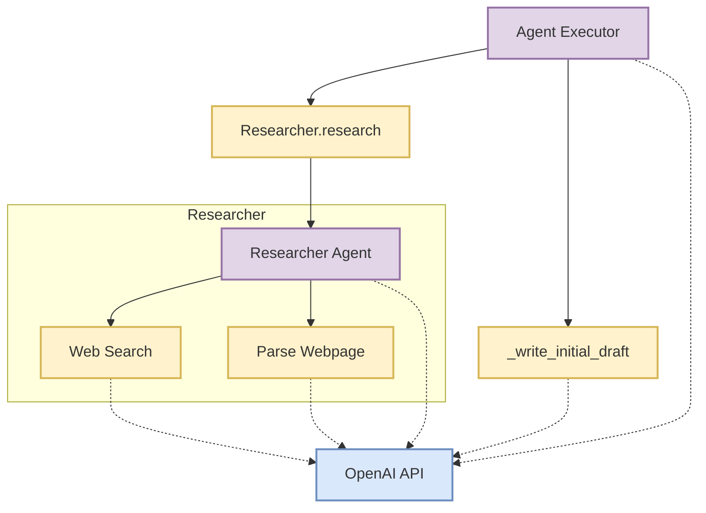

# Building an Agent Executor for Writing Blog Posts

This recipe demonstrates how to build an Agent Executor using Mirascope to automate the process of researching and writing a blog post. We'll create a system that combines a researcher agent and a writer tool, orchestrated by an executor agent.

??? tip "Mirascope Concepts Used"

    - [Prompts](../../learn/prompts.md)
    - [Calls](../../learn/calls.md)
    - [Streams](../../learn/streams.md)
    - [Tools](../../learn/tools.md)
    - [Response Model](../../learn/response_models.md)
    - [Output Parser](../../learn/output_parsers.md)
    - [Tenacity Integration](../../integrations/tenacity.md)

!!! note "Background"

    Agent-based systems in AI involve creating autonomous agents that can perform tasks or make decisions. In this recipe, we're using multiple agents (researcher and writer) coordinated by an executor to create a blog post. This approach allows for a more modular and potentially more effective content creation process.

## System Architecture

<div align="center">

</div>

## Setup

To set up our environment, first let's install all of the packages we will use:

```shell
pip install "mirascope[openai]" requests beautifulsoup4 duckduckgo-search tenacity
```

Make sure to also set your `OPENAI_API_KEY` if you haven't already.

## Implementing the `BaseAgent`

First, let's create a base `OpenAIAgent` class that we can later subclass to implement specialized agents:

```python
--8<-- "examples/cookbook/agents/blog_writing_agent.py:7:7"
--8<-- "examples/cookbook/agents/blog_writing_agent.py:9:10"
--8<-- "examples/cookbook/agents/blog_writing_agent.py:12:37"
```

Note that the `_step` function is marked as an abstract method that each subclass will need to implement.

## Research Agent

The first step to writing a good blog post is researching your topic, so let's create an agent that can search the internet and summarize relevant information that we can later consume when writing the post.

### Web Search Tool

We can use the `duckduckgo-search` package (with no API key!) to perform some basic keyword search on the internet. Note that we are including `self` as an argument so that we can access the state of the `Researcher` agent we will build. This enables easier configuration.

```python
--8<-- "examples/cookbook/agents/blog_writing_agent.py:40:68"
```

### Parsing HTML Content

Our `web_search` tool only returns search results -- not the actual content of the webpages found at the href results of our search. While we could deterministically parse every web page returned, let's instead provide our researcher with a tool for parsing the content. The value of this approach is that we can greatly increase the number of search results and let the researcher decide which of the results are worth parsing and using.

```python
--8<-- "examples/cookbook/agents/blog_writing_agent.py:40:42"
    ...

--8<-- "examples/cookbook/agents/blog_writing_agent.py:70:84"
```

### Researcher Step Function

Now that we have our tools we're ready to implement the `_step` method of our researcher where the majority of the remaining work lies in engineering the prompt:

```python
--8<-- "examples/cookbook/agents/blog_writing_agent.py:40:42"
    ...

--8<-- "examples/cookbook/agents/blog_writing_agent.py:86:111"
```

### Implementing a `research` tool method

While we could use the `run` method from our `OpenAIAgent` as a tool, there is value in further engineering our prompt by providing good descriptions (and names!) for the tools we use. Putting everything together, we can expose a `research` method that we can later use as a tool in our agent executor:

```python
--8<-- "examples/cookbook/agents/blog_writing_agent.py:40:42"
    ...

--8<-- "examples/cookbook/agents/blog_writing_agent.py:113:127"
```

## Writing An Initial Draft

The next step when writing a blog is to write an initial draft and critique it. We can then incorporate the feedback from the critique to iteratively improve the post. Let's make a call to an LLM to write this first draft as well as critique it:

```python
--8<-- "examples/cookbook/agents/blog_writing_agent.py:7:7"
--8<-- "examples/cookbook/agents/blog_writing_agent.py:11:13"
--8<-- "examples/cookbook/agents/blog_writing_agent.py:130:188"
```

There are a few things worth noting here:

- We are again using `self` for convenient access to the containing class' state. In this case we expect to put this function inside of our executor and want to give access to the conversation history -- particularly the results of the researcher.
- We are using `response_model` to extract specifically the `draft` and `critique` fields.
- We are using an output parser `parse_initial_draft` to parse the `InitialDraft` class into a format that is friendly for using tools (`str`).
- We are using `tenacity` in order to retry should the call fail to properly generate an `InitialDraft` instance, reinserting the list of previous errors into each subsequent call.

## Agent Executor

Now we just need to put it all together into our `AgentExecutor` class, write our `_step` function, and run it!

```python
--8<-- "examples/cookbook/agents/blog_writing_agent.py:130:133"
    ...
--8<-- "examples/cookbook/agents/blog_writing_agent.py:189:220"
```

!!! tip "Additional Real-World Applications"

    1. Automated Content Marketing:

        - Create a system that generates targeted blog posts for different customer segments based on current market trends and company data.
        - Example: An e-commerce platform could use this to write product category overviews, incorporating latest fashion trends and customer preferences.

    2. Technical Documentation Generation:

        - Develop an agent that researches API changes, new features, and community feedback to automatically update and expand technical documentation.
        - Example: A software company could use this to keep their SDK documentation up-to-date with each new release.

    3. Personalized Learning Content:

        - Build an educational tool that creates customized study materials based on a student's learning style, current knowledge, and learning goals.
        - Example: An online learning platform could generate personalized course summaries and practice exercises for each student.

    4. Automated News Summary and Analysis:

        - Create a system that gathers news from various sources, summarizes key points, and generates analytical pieces on trending topics.
        - Example: A news agency could use this to produce daily briefings on complex, evolving stories like economic trends or geopolitical events.

    5. Scientific Literature Review Assistant:

        - Develop an agent that can scan recent publications in a specific field, summarize key findings, and draft literature review sections for research papers.
        - Example: Researchers could use this to stay updated on the latest developments in their field and to assist in writing comprehensive literature reviews.

    6. Legal Document Drafting:

        - Create a system that researches relevant case law and regulations to assist in drafting legal documents like contracts or briefs.
        - Example: A law firm could use this to generate first drafts of standard contracts, incorporating the latest legal precedents and regulations.

    7. Product Description Generator:
        - Build an agent that researches product features, customer reviews, and market trends to write engaging and informative product descriptions.
        - Example: An online marketplace could use this to automatically generate or update descriptions for thousands of products.

    8. Travel Guide Creation:

        - Develop a system that researches destinations, local attractions, and traveler reviews to create personalized travel guides.
        - Example: A travel company could use this to generate custom itineraries and destination guides based on a traveler's preferences and budget.

When adapting this recipe, consider:

- Implement a feedback loop where the executor can request additional research or revisions.
- Add more specialized agents, such as an editor or fact-checker.
- Incorporate user feedback into the writing process.
- Extend the system to handle multiple blog post formats or styles.
- Implement caching for research results to improve efficiency for similar topics.
- Adjusting the prompts and system messages to fit your specific use case or writing style.
- Experimenting with different LLM models for various tasks (research vs. writing).
- Implementing error handling and logging for production use.
- Optimizing the web search and parsing functions for better performance and reliability.
