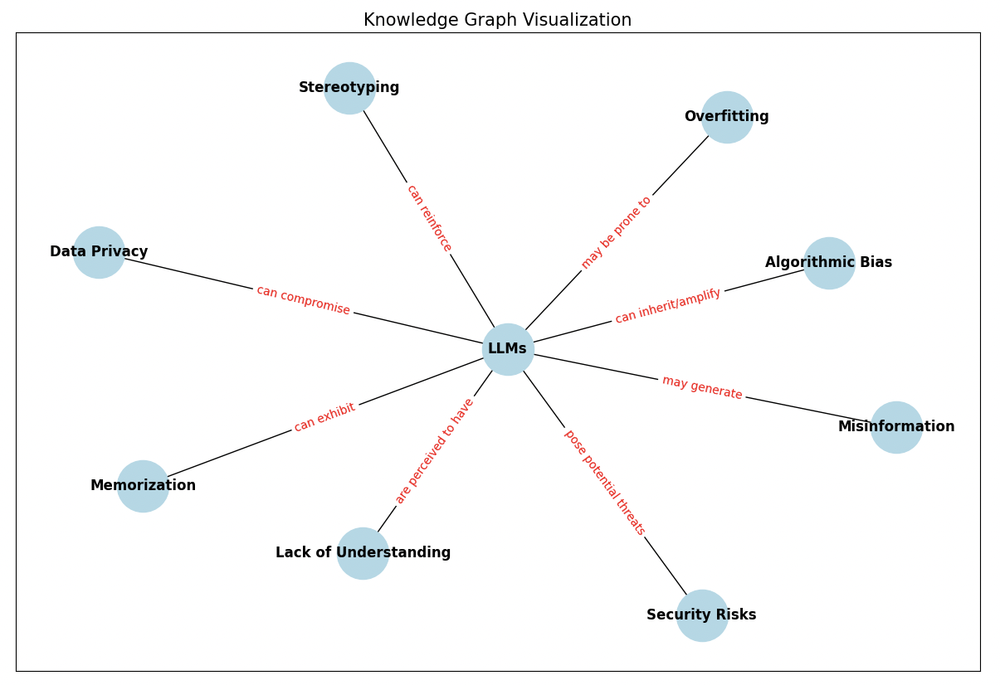

# Knowledge Graph

Often times, data is messy and not always stored in a structured manner ready for use by an LLM. In this recipe, we show how to create a knowledge graph from an unstructured document using common python libraries and Mirascope using OpenAI GPT-4o-mini.

??? tip "Mirascope Concepts Used"

    - [Prompts](../learn/prompts.md)
    - [Dynamic Configuration](../learn/dynamic_configuration.md)
    - [Calls](../learn/calls.md)
    - [Response Models](../learn/response_models.md)

!!! note "Background"

    While traditional Natural Language Processing (NLP) techniques have long been used in knowledge graphs to identify entities and relationships in unstructured text, Large Language Models (LLMs) have significantly improved this process. LLMs enhance the accuracy of entity identification and linking to knowledge graph entries, demonstrating superior ability to handle context and ambiguity compared to conventional NLP methods. 

## Setup

```python
pip install mirascope[openai]
# (Optional) For visualization
pip install matplotlib, networkx
```

## Create the `KnowledgeGraph`

The first step is to create a `KnowledgeGraph` with `Nodes` and `Edges` that represent our entities and relationships. For our simple recipe, we will use a Pydantic `BaseModel` to represent our `KnowledgeGraph`:

```python
from pydantic import BaseModel, Field


class Edge(BaseModel):
    source: str = Field(..., description="The source node of the edge")
    target: str = Field(..., description="The target node of the edge")
    relationship: str = Field(
        ..., description="The relationship between the source and target nodes"
    )


class Node(BaseModel):
    id: str = Field(..., description="The unique identifier of the node")
    type: str = Field(..., description="The type or label of the node")
    properties: dict | None = Field(
        ..., description="Additional properties and metadata associated with the node"
    )


class KnowledgeGraph(BaseModel):
    nodes: list[Node] = Field(..., description="List of nodes in the knowledge graph")
    edges: list[Edge] = Field(..., description="List of edges in the knowledge graph")
```

Our `Edge` represents connections between nodes, with attributes for the source node, target node, and the relationship between them. While our `Node` defines nodes with an ID, type, and optional properties. Our `KnowledgeGraph` then aggregates these nodes and edges into a comprehensive knowledge graph.

Now that we have our schema defined, it's time to create our knowledge graph.

## Creating the knowledge graph

We start off with engineering our prompt, prompting the LLM to create a knowledge graph based on the user query. Then we are taking a [Wikipedia](https://en.wikipedia.org/wiki/Large_language_model) article and converting the raw text into a structured knowledge graph.

```python
from mirascope.core import openai, prompt_template

@openai.call(model="gpt-4o-mini", response_model=KnowledgeGraph)
@prompt_template(
    """
    SYSTEM:
    Your job is to create a knowledge graph based on the text and user question.
    
    The article:
    {text}

    Example:
    John and Jane Doe are siblings. Jane is 25 and 5 years younger than John.
    Node(id="John Doe", type="Person", properties={{"age": 30}})
    Node(id="Jane Doe", type="Person", properties={{"age": 25}})
    Edge(source="John Doe", target="Jane Doe", relationship="Siblings")

    USER:
    {question}
    """
)
def generate_knowledge_graph(
    question: str, file_name: str
) -> openai.OpenAIDynamicConfig:
    text = ""
    with open(file_name) as f:
        text = f.read()
    return {"computed_fields": {"text": text}}

question = "What are the pitfalls of using LLMs?"
kg = generate_knowledge_graph(question, "PATH_TO_YOUR_FILE")
```

We engineer our prompt by giving examples of how the properties should be filled out and use Mirascope's `DynamicConfig` to pass in the article. While it seems silly in this context, there may be multiple documents that you may want to conditionally pass in depending on the query. This can include text chunks from a Vector Store or data from a Database.

After we generated our knowledge graph, it is time to create our `run` function

```python
@openai.call(model="gpt-4o-mini")
@prompt_template(
    """
    SYSTEM:
    Answer the following question based on the knowledge graph.

    Knowledge Graph:
    {knowledge_graph}
    
    USER:
    {question}
    """
)
def run(question: str, knowledge_graph: KnowledgeGraph): ...
```

We define a simple `run` function that answers the users query based on the knowledge graph. Combining knowledge graphs with semnatic search will lead to the LLM having better context to address complex questions.

```python
result = run(question, kg)
print(result)
# The knowledge graph contains information about the pitfalls of using LLMs. Based on the existing entries, the pitfalls include:
#
# 1. **Algorithmic Bias** - LLMs can inherit or amplify biases present in the training data.
# 2. **Misinformation** - LLMs may generate misinformation.
# 3. **Lack of Understanding** - There is a perception that LLMs can be understood like humans, which is not accurate.
# 4. **Data Privacy** - LLMs can compromise data privacy.
# 5. **Overfitting** - LLMs may be prone to overfitting, where they perform well on training data but poorly on new data.
# 6. **Memorization** - LLMs can exhibit memorization issues, where they recall specific training data verbatim.
# 7. **Stereotyping** - LLMs can reinforce stereotypes found in the training data.
# 8. **Security Risks** - LLMs pose potential security risks and threats.
```

## Render your graph

Optionally, to visualize the knowledge graph, we use networkx and matplotlib to draw the edges and nodes.

```python
import matplotlib.pyplot as plt
import networkx as nx

def render_graph(kg: KnowledgeGraph):
    G = nx.DiGraph()

    for node in kg.nodes:
        G.add_node(node.id, label=node.type, **(node.properties or {}))

    for edge in kg.edges:
        G.add_edge(edge.source, edge.target, label=edge.relationship)

    plt.figure(figsize=(15, 10))
    pos = nx.spring_layout(G)

    nx.draw_networkx_nodes(G, pos, node_size=2000, node_color="lightblue")
    nx.draw_networkx_edges(G, pos, arrowstyle="->", arrowsize=20)
    nx.draw_networkx_labels(G, pos, font_size=12, font_weight="bold")

    edge_labels = nx.get_edge_attributes(G, "label")
    nx.draw_networkx_edge_labels(G, pos, edge_labels=edge_labels, font_color="red")

    plt.title("Knowledge Graph Visualization", fontsize=15)
    plt.show()


render_graph(agent.knowledge_graph)
```



!!! tip "Additional Real-World Applications"

    1. Enhance your Q&A
        - Customer support system uses knowledge graph containing information about products to answer questions.
        - Example: "Does the Mirascope phone support fast charging?" The knowledge graph has a node "Mirascope smartphone" and searches "support" edge to find fast charging and returns results for the LLM to use.

    2. Supply Chain Optimization
        - A knowledge graph could represent complex relationships between suppliers, manufacturing plants, distribution centers, products, and transportation routes.
        - Example: How would a 20% increase in demand for a mirascope affect our inventory needs and shipping costs? Use knowledge graph to trace the mirascope toy, calculate inventory, and then estimate shipping costs and return results for the LLM to give a report.

    3. Healthcare Assistant
        - Assuming no PII or HIPPA violation, build a knowledge graph from patient remarks.
        - Example: "Mary said help, I've fallen". Build up a knowledge graph from comments and use an LLM to scan the node "Mary" for any worrying activity. Have the LLM alert Healthcare employees that there may be an emergency.

When adapting this recipe, consider:

- Combining knowledge graph with Text Embeddings for both structured search and semantic search, depending on your requirements.
- Store your knowledge graph in a database / cache for faster retrieval.
- Experiment with different LLM models, some may be better than others for generating the knowledge graph.
- Turn the example into an Agentic workflow, giving it access to tools such as web search so the LLM can call tools to update its own knowledge graph to answer any question.
- Adding Pydantic `AfterValidators` to prevent duplicate Node IDs.
