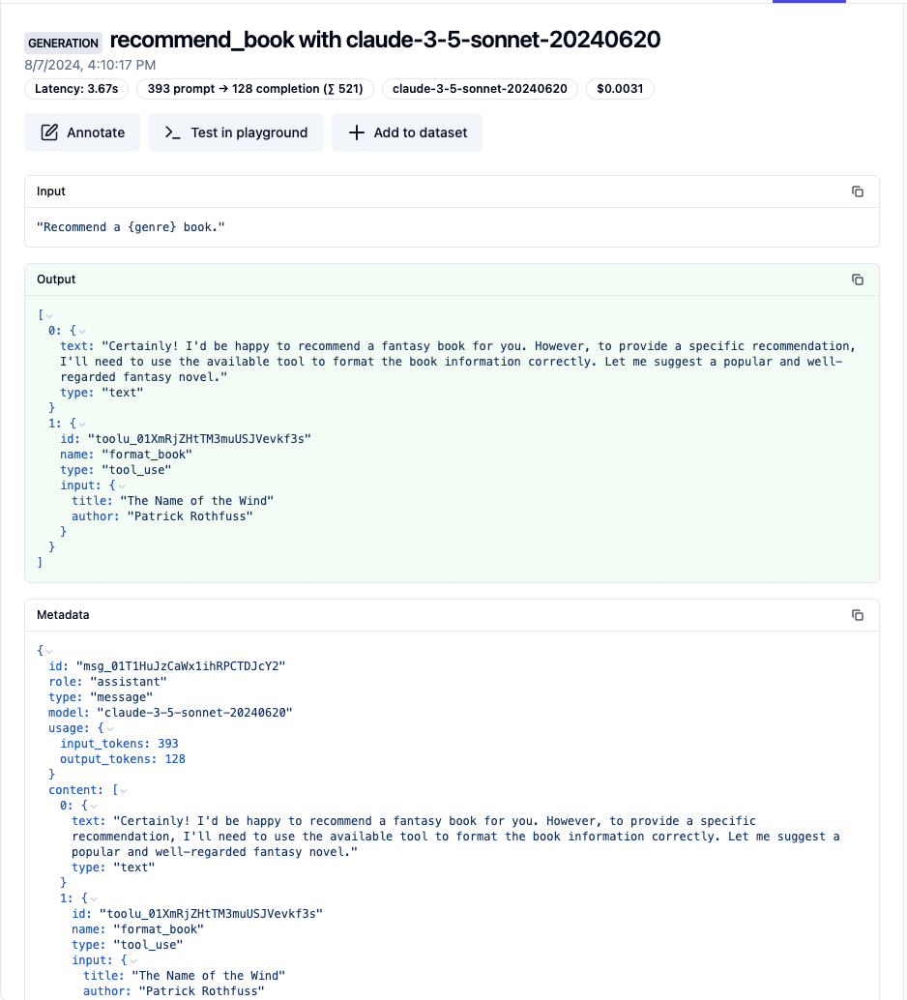
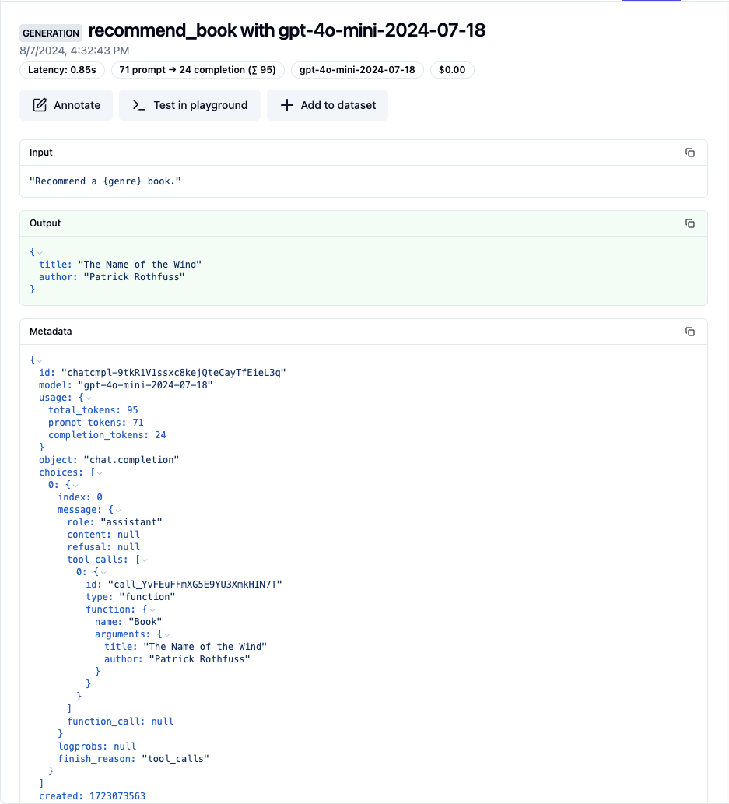

# Langfuse

Mirascope provides out-of-the-box integration with [Langfuse](https://langfuse.com/).

You can install the necessary packages directly or using the `langfuse` extras flag:

```python
pip install "mirascope[langfuse]"
```

## How to use Langfuse with Mirascope

### Calls

The `with_langfuse` decorator can be used on all Mirascope functions to automatically log calls across all of our [supported LLM providers](../learn/calls.md#supported-providers).

Here is a simple example using tools:

```python
from mirascope.core import anthropic, prompt_template
from mirascope.integrations.langfuse import with_langfuse


def format_book(title: str, author: str):
    return f"{title} by {author}"


@with_langfuse()
@anthropic.call(model="claude-3-5-sonnet-20240620", tools=[format_book])
@prompt_template("Recommend a {genre} book.")
def recommend_book(genre: str):
    ...


print(recommend_book("fantasy"))
# > Certainly! I'd be happy to recommend a fantasy book...
```

This will give you:

* A trace around the `recommend_book` function that captures items like the prompt template, and input/output attributes and more.
* Human-readable display of the conversation with the agent
* Details of the response, including the number of tokens used



### Streams

You can capture streams exactly the same way:

```python
from mirascope.core import openai, prompt_template
from mirascope.integrations.langfuse import with_langfuse


@with_langfuse()
@openai.call(
    model="gpt-4o-mini",
    stream=True,
    call_params={"stream_options": {"include_usage": True}},
)
@prompt_template("Recommend a {genre} book.")
def recommend_book(genre: str):
    ...


for chunk, _ in recommend_book("fantasy"):
    print(chunk.content, end="", flush=True)
# > I recommend **"The Name of the Wind"** by Patrick Rothfuss. It's the first book...
```

For some providers, certain `call_params` will need to be set in order for usage to be tracked.

!!! note "Logged Only On Exhasution"

    When logging streams, the span will not be logged until the stream has been exhausted. This is a function of how streaming works.

### Response Models

Setting `response_model` also behaves the exact same way:

```python
from mirascope.core import openai, prompt_template
from mirascope.integrations.langfuse import with_langfuse
from pydantic import BaseModel


class Book(BaseModel):
    title: str
    author: str


@with_langfuse()
@openai.call(model="gpt-4o-mini", response_model=Book)
@prompt_template("Recommend a {genre} book.")
def recommend_book(genre: str):
    ...


print(recommend_book("fantasy"))
# > title='The Name of the Wind' author='Patrick Rothfuss'
```

This will give you all the information from call with a `response_model` output. You can also set `stream=True` when using `response_model`, which has the same behavior as standard streaming.



## Using Langfuse directly with Mirascope

If you choose not to use our `with_langfuse` decorator, you can use Langfuse's wrapper of the OpenAI client.

Here is an example Mirascope call using `langfuse.openai`:

```python
from langfuse.openai import OpenAI
from mirascope.core import openai, prompt_template


@openai.call(model="gpt-4o-mini", client=OpenAI())
@prompt_template("Recommend a {genre} book.")
def recommend_book(genre: str):
    ...


print(recommend_book("fantasy"))
# > I recommend **"The Name of the Wind"** by Patrick Rothfuss. It's the first book...
```
