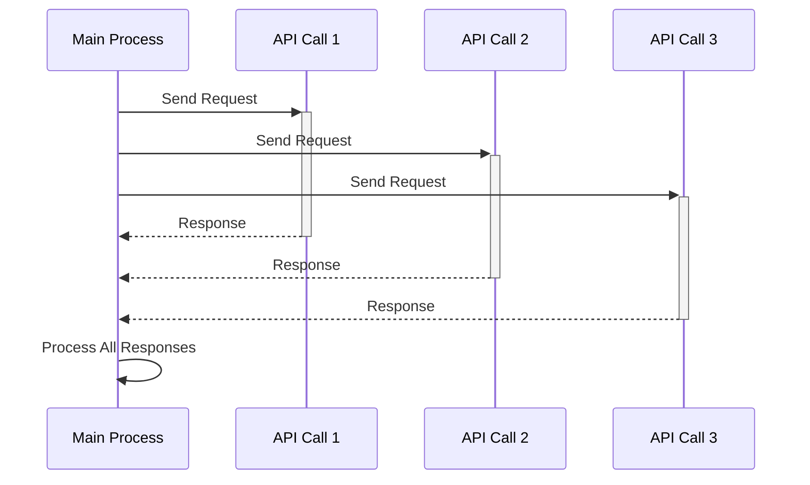

# Async

Asynchronous programming is a crucial concept when building LLM (Large Language Model) applications using Mirascope. This feature allows for efficient handling of I/O-bound operations (e.g., API calls), improving application responsiveness and scalability. Mirascope utilizes the [asyncio](https://docs.python.org/3/library/asyncio.html) library to implement asynchronous processing.

## Key Terms

- `async`: Keyword used to define a function as asynchronous
- `await`: Keyword used to wait for the completion of an asynchronous operation
- `asyncio`: Python library that supports asynchronous programming

## Basic Async Usage

To use async in Mirascope, you simply need to define your function as async and use the `await` keyword when calling it. Here's a basic example:

```python hl_lines="6 10 13"
import asyncio
from mirascope.core import openai, Messages, prompt_template

@openai.call(model="gpt-4o-mini")
@prompt_template()
async def recommend_book_prompt(genre: str) -> Messages.Type:
    return f"Recommend a {genre} book"

async def main():
    response = await recommend_book_prompt("fantasy")
    print(response.content)

asyncio.run(main())
```

This code does the following:

1. Defines an asynchronous function `recommend_book_prompt` that uses the OpenAI model to recommend a book of a given genre.
2. Creates a `main` function that calls `recommend_book_prompt` asynchronously.
3. Uses `asyncio.run(main())` to start the asynchronous event loop and run the main function.

## Async Streaming

Streaming with async works similarly to synchronous streaming, but you use `async for` instead of a regular `for` loop:

```python hl_lines="4 6 10-11"
import asyncio
from mirascope.core import openai, prompt_template

@openai.call(model="gpt-4o-mini", stream=True)
@prompt_template()
async def recommend_book_prompt(genre: str) -> Messages.Type:
    return f"Recommend a {genre} book"

async def main():
    stream = await recommend_book_prompt("fantasy")
    async for chunk, _ in stream:
        print(chunk.content, end="", flush=True)

asyncio.run(main())
```

This code:

1. Sets up an asynchronous streaming call to the OpenAI model.
2. Uses `async for` to iterate over the stream of response chunks.
3. Prints each chunk of the response as it's received, providing a real-time output experience.

## Async with Tools

When using tools asynchronously, you can make the `call` method of a tool async. Here's an example:

```python hl_lines="8 13 20-21"
import asyncio
from mirascope.core import openai, BaseTool, prompt_template

class FormatBook(BaseTool):
    title: str
    author: str

    async def call(self) -> str:
        # Simulating an async API call
        await asyncio.sleep(1)
        return f"{self.title} by {self.author}"

@openai.call(model="gpt-4o-mini", tools=[FormatBook])
@prompt_template()
async def recommend_book_prompt(genre: str) -> Messages.Type:
    return f"Recommend a {genre} book"

async def main():
    response = await recommend_book_prompt("fantasy")
    if isinstance((tool := response.tool), FormatBook):
        output = await tool.call()
        print(output)
    else:
        print(response.content)

asyncio.run(main())
```

This example:

1. Defines an asynchronous tool `FormatBook` with an async `call` method.
2. Uses this tool in an asynchronous OpenAI call.
3. In the main function, it checks if the response includes a tool call, and if so, calls the tool asynchronously.

## Async with BasePrompt

For `BasePrompt`, Mirascope provides a `run_async` method to access async functionality:

```python hl_lines="5 10"
import asyncio
from mirascope.core import BasePrompt, openai, prompt_template

@prompt_template()
class SentimentAnalysisPrompt(BasePrompt):
    text: str

async def main():
    prompt = SentimentAnalysisPrompt(text="I love using Mirascope!")
    result = await prompt.run_async(openai.call(model="gpt-4o-mini"))
    print(result.content)

asyncio.run(main())
```

This code:

1. Defines a `SentimentAnalysisPrompt` class that inherits from `BasePrompt`.
2. Uses the `run_async` method to execute the prompt asynchronously with the OpenAI model.

## Parallel Async Calls

One of the main benefits of async is the ability to run multiple operations concurrently. Here's an example of making parallel async calls:

```python hl_lines="10-12"
import asyncio
from mirascope.core import openai, prompt_template

@openai.call(model="gpt-4o-mini")
@prompt_template()
async def summarize_movie_prompt(genre: str) -> Messages.Type:
    return f"Summarize the plot of a {genre} movie"

async def main():
    genres = ["action", "comedy", "drama", "sci-fi"]
    tasks = [summarize_movie_prompt(genre) for genre in genres]
    results = await asyncio.gather(*tasks)

    for genre, result in zip(genres, results):
        print(f"{genre.capitalize()} movie summary:")
        print(result.content)
        print()

asyncio.run(main())
```

This example demonstrates:

1. Creating multiple asynchronous tasks for different movie genres.
2. Using `asyncio.gather` to run all tasks concurrently and wait for all results.
3. Printing the results for each genre once all tasks are completed.

## Error Handling in Async Context

Error handling in async contexts is similar to synchronous code. You can use try/except blocks as usual:

```python hl_lines="11-15"
import asyncio
from mirascope.core import openai, prompt_template
from openai import APIError

@openai.call(model="gpt-4o-mini")
@prompt_template()
async def explain_concept_prompt(concept: str) -> Messages.Type:
    return f"Explain {concept} in simple terms"

async def main():
    try:
        response = await explain_concept_prompt("quantum computing")
        print(response.content)
    except APIError as e:
        print(f"An error occurred: {e}")

asyncio.run(main())
```

This code:

1. Defines an asynchronous function to explain a concept.
2. Uses a try/except block in the main function to catch potential API errors.
3. Prints the explanation if successful, or an error message if an exception occurs.

## Best Practices and Considerations

- **Use asyncio for I/O-bound tasks**: Async is most beneficial for I/O-bound operations like API calls. It may not provide significant benefits for CPU-bound tasks.
- **Avoid blocking operations**: Ensure that you're not using blocking operations within async functions, as this can negate the benefits of asynchronous programming.
- **Consider using connection pools**: When making many async requests, consider using connection pools to manage and reuse connections efficiently.
- **Be mindful of rate limits**: While async allows for concurrent requests, be aware of API rate limits and implement appropriate throttling if necessary.
- **Use appropriate timeouts**: Implement timeouts for async operations to prevent hanging in case of network issues or unresponsive services.
- **Test thoroughly**: Async code can introduce subtle bugs. Ensure comprehensive testing of your async implementations.
- **Leverage async context managers**: Use async context managers (async with) for managing resources that require setup and cleanup in async contexts.


## Visual Explanation

Here's a simple diagram showing the flow of asynchronous processing:



This diagram illustrates the advantage of asynchronous processing, where multiple API calls can be made simultaneously, allowing the program to proceed to the next operation without waiting for each response.

By leveraging these async features in Mirascope, you can build more efficient and responsive applications, especially when working with multiple LLM calls or other I/O-bound operations.
