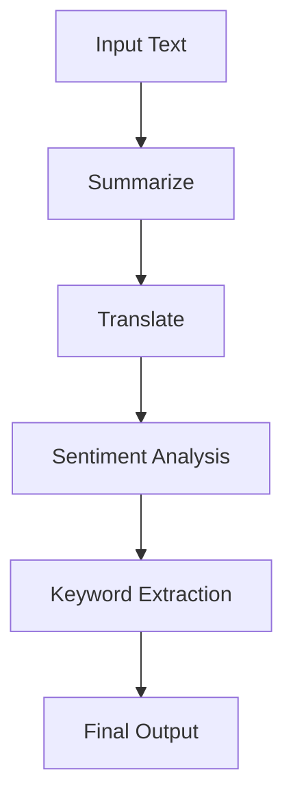

# Chaining

??? api "API Documentation"
    [`mirascope.core.base.dynamic_config`](../api/core/base/dynamic_config.md)

Chaining in Mirascope allows you to combine multiple LLM calls or operations in a sequence to solve complex tasks. This approach is particularly useful for breaking down complex problems into smaller, manageable steps. Mirascope's unique approach to chaining leverages dynamic configuration and computed fields, providing a powerful way to create sophisticated LLM-powered applications.

## Understanding Chaining

Before diving into Mirascope's implementation, let's understand what chaining means in the context of LLM applications:

1. **Problem Decomposition**: Breaking a complex task into smaller, manageable steps.
2. **Sequential Processing**: Executing these steps in a specific order, where the output of one step becomes the input for the next.
3. **Data Flow**: Passing information between steps to build up a final result.

## Chaining with Dynamic Configuration

The primary method of chaining in Mirascope involves using dynamic configuration with computed fields. This approach allows you to pass the results of previous steps as inputs to subsequent steps in the chain.

### How It Works

1. Each step in the chain is defined as a separate function decorated with a Mirascope LLM call decorator (e.g., `@openai.call`).
2. The functions return a dynamic configuration dictionary that includes `computed_fields`.
3. These `computed_fields` can contain the results of previous steps, allowing you to pass information through the chain.

### Example

Here's a basic example of chaining using dynamic configuration:

```python hl_lines="12 13"
from mirascope.core import openai, prompt_template


@openai.call(model="gpt-4o-mini")
@prompt_template("Summarize this text: {text}")
def summarize(text: str):
    ...


@openai.call(model="gpt-4o-mini")
@prompt_template("Translate this text to {language}: {summary}")
def summarize_and_translate(text: str, language: str) -> openai.OpenAIDynamicConfig:
    return {"computed_fields": {"summary": summarize(text)}}


response = summarize_and_translate("Long English text here...", "french")
print(response.content)
print(response.model_dump()["computed_fields"])  # This will contain the `summarize` response
```

In this example:

1. The `summarize` function first creates a summary of the input text.
2. The `summarize_and_translate` function then uses this summary as input for translation.
3. The `computed_fields` in the dynamic configuration allows us to pass the summary from the first step to the second step.

## Benefits of Chaining with Computed Fields

Mirascope's approach to chaining offers several advantages:

1. **Traceability**: By using computed fields, each step's inputs and outputs are recorded in the final `model_dump()`, providing a clear trace of the entire chain's execution.
2. **Flexibility**: You can easily modify or extend the chain by adding or changing computed fields.
3. **Debugging**: The `model_dump()` method provides a comprehensive view of the chain's execution, making it easier to debug complex chains.

## Comparison with Traditional Chaining

To understand the benefits of Mirascope's approach, let's compare it with a more traditional chaining method:

```python hl_lines="20 21"
from openai import OpenAI

client = OpenAI()

def summarize(text: str):
    response = client.chat.completions.create(
        model="gpt-4o-mini",
        messages=[{"role": "user", "content": f"Summarize this text: {text}"}]
    )
    return response.choices[0].message.content

def translate(text: str, language: str):
    response = client.chat.completions.create(
        model="gpt-4o-mini",
        messages=[{"role": "user", "content": f"Translate this text to {language}: {text}"}]
    )
    return response.choices[0].message.content

def summarize_and_translate(original_text: str, language: str):
    summary = summarize(original_text)
    translation = translate(summary, language)
    return translation
```

While this traditional approach works, it has several limitations compared to Mirascope's method:
- Less traceable: It's harder to see the intermediate steps and their outputs.
- More boilerplate: Each function needs to handle the API call explicitly.
- Less flexible: Adding new steps or modifying the chain is more cumbersome.

## Advanced Chaining Techniques

For more complex scenarios, Mirascope supports advanced chaining techniques. Here's a diagram illustrating a more complex chain:



This diagram shows a chain that processes text through multiple steps: summarization, translation, sentiment analysis, and keyword extraction, before producing a final output. Each step in this chain builds upon the results of the previous steps, demonstrating how complex tasks can be broken down into a series of simpler operations.

Here's an example of how this chain might be implemented in Mirascope:

```python hl_lines="16 21 26"
from mirascope.core import openai, prompt_template

@openai.call(model="gpt-4o-mini")
@prompt_template("Summarize this text: {text}")
def summarize(text: str):
    ...

@openai.call(model="gpt-4o-mini")
@prompt_template("Translate this text to English: {text}")
def translate(text: str) -> openai.OpenAIDynamicConfig:
    return {"computed_fields": {"summary": summarize(text)}}

@openai.call(model="gpt-4o-mini")
@prompt_template("Analyze the sentiment of this text: {text}")
def sentiment_analysis(text: str) -> openai.OpenAIDynamicConfig:
    return {"computed_fields": {"translated_text": translate(text)}}

@openai.call(model="gpt-4o-mini")
@prompt_template("Extract keywords from this text: {text}")
def keyword_extraction(text: str) -> openai.OpenAIDynamicConfig:
    return {"computed_fields": {"sentiment": sentiment_analysis(text)}}

@openai.call(model="gpt-4o-mini")
@prompt_template("Provide a final analysis based on these inputs: {text}, {keywords}, {sentiment}")
def final_analysis(text: str) -> openai.OpenAIDynamicConfig:
    return {"computed_fields": {"keywords": keyword_extraction(text)}}

# Usage
input_text = "Long text in any language..."
result = final_analysis(input_text)
print(result.content)
```

This example demonstrates how each step in the chain builds upon the previous steps, passing information through `computed_fields` to create a complex analysis pipeline.

## Best Practices

When implementing chains in Mirascope, consider the following best practices:

1. **Use Computed Fields**: Leverage computed fields for better traceability and debugging.

    ```python hl_lines="5 6"
    @openai.call(model="gpt-4o-mini")
    @prompt_template("Translate this text to {language}: {summary}")
    def summarize_and_translate(text: str, language: str) -> openai.OpenAIDynamicConfig:
        return {
            "computed_fields": {"summary": summarize(text)},
            "metadata": {"original_length": len(text)}
        }
    ```

2. **Modular Design**: Break down complex tasks into smaller, reusable functions.

    ```python hl_lines="3 8 12 13"
    @openai.call(model="gpt-4o-mini")
    @prompt_template("Summarize this text: {text}")
    def summarize(text: str):
        ...
    
    @openai.call(model="gpt-4o-mini")
    @prompt_template("Translate this text to {language}: {text}")
    def translate(text: str, language: str):
        ...
    
    def summarize_and_translate(text: str, language: str) -> openai.OpenAIDynamicConfig:
        return {"computed_fields": {"summary": summarize(text),
                                    "translation": translate(text, language)}}
    ```

3. **Error Handling**: Implement robust error handling at each step of your chain.

    ```python hl_lines="4-9"
    @openai.call(model="gpt-4o-mini")
    @prompt_template("Summarize this text: {text}")
    def summarize(text: str) -> openai.OpenAIDynamicConfig:
        try:
            summary = summarize_text(text)
            return {"computed_fields": {"summary": summary}}
        except Exception as e:
            return {"computed_fields": {"error": f"Error in summarization: {str(e)}"},
                    "metadata": {"error_type": type(e).__name__}}
    ```

4. **Use Response Models**: Structure your intermediate outputs for better type safety and easier processing. See the [`Response Models`](./response_models.md) documentation for details.

    ```python hl_lines="1 2 3 4 9 10"
    class Summary(BaseModel):
        text: str
        word_count: int
        key_points: list[str]
    
    @openai.call(model="gpt-4o-mini", response_model=Summary)
    @prompt_template("Summarize this text: {text}")
    def summarize(text: str) -> openai.OpenAIDynamicConfig:
        return {"computed_fields": {"original_text": text},
                "metadata": {"original_length": len(text)}}
    ```

5. **Asynchronous Operations**: Utilize async programming for parallel processing when appropriate. Refer to the [`Async`](./async.md) documentation for more information.

    ```python hl_lines="1 5 7 10 11"
    import asyncio
    
    @openai.call(model="gpt-4o-mini")
    @prompt_template("Summarize this text: {text}")
    async def summarize(text: str): ...
    
    async def process_multiple_texts(texts: list[str]) -> openai.OpenAIDynamicConfig:
        tasks = [summarize(text) for text in texts]
        summaries = await asyncio.gather(*tasks)
        return {"computed_fields": {"summaries": summaries},
                "metadata": {"num_texts": len(texts)}}
    ```

6. **Testing**: Test each component of your chain individually as well as the entire chain.

    ```python hl_lines="4 5 7 8"
    def test_summarize():
        text = "This is a long text that needs summarizing."
        result = summarize(text)
        assert "computed_fields" in result
        assert "summary" in result["computed_fields"]
        summary = result["computed_fields"]["summary"]
        assert len(summary) < len(text)
        assert "summary" in summary.lower()
    
    test_summarize()
    ```

7. **Logging**: Use the `model_dump()` method to log the entire chain's execution for debugging and analysis. This pairs well with [custom middleware](../integrations/middleware.md).

    ```python hl_lines="7"
    @openai.call(model="gpt-4o-mini")
    @prompt_template("Summarize and translate this text to {language}: {text}")
    def summarize_and_translate(text: str, language: str) -> openai.OpenAIDynamicConfig:
        ...
    
    def log_execution(response):
        execution_log = response.model_dump()
        print(f"Execution log: {execution_log}")
        logger.info(f"Chain execution: {execution_log}")
        return {"metadata": {"logged_at": datetime.now().isoformat()}}
    
    response = summarize_and_translate("Long text here", "French")
    log_execution(response)
    ```

## Real-World Example: Product Recommendation Engine

Let's consider a real-world example of a product recommendation engine using chaining:

```python hl_lines="11 16"
from mirascope.core import openai, prompt_template

@openai.call(model="gpt-4o-mini")
@prompt_template("Analyze the user profile: {profile}")
def analyze_user(profile: str):
    ...

@openai.call(model="gpt-4o-mini")
@prompt_template("Generate product recommendations based on this analysis: {analysis}")
def generate_recommendations(analysis: str) -> openai.OpenAIDynamicConfig:
    return {"computed_fields": {"analysis": analyze_user(profile)}}

@openai.call(model="gpt-4o-mini")
@prompt_template("Explain these recommendations to the user: {recommendations}")
def explain_recommendations(recommendations: str) -> openai.OpenAIDynamicConfig:
    return {"computed_fields": {"recommendations": generate_recommendations(analysis)}}

# Usage
user_profile = "35-year-old urban professional interested in fitness and technology"
final_output = explain_recommendations(user_profile)
print(final_output.content)
```

This example demonstrates how chaining can be used to create a sophisticated product recommendation system, breaking down the process into analyzable, debuggable steps.

By mastering Mirascope's chaining techniques, you can create sophisticated LLM-powered applications that tackle complex, multi-step problems with greater accuracy, control, and traceability.
