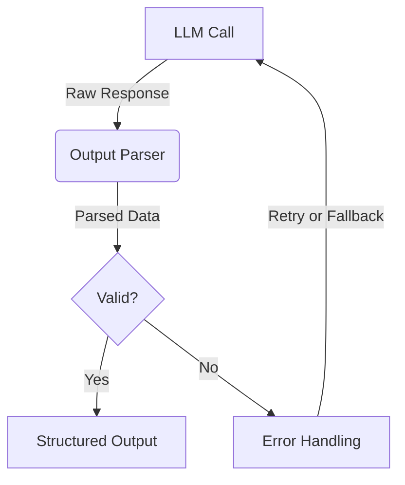

# Output Parsers

??? api "API Documentation"
    [`mirascope.core.azure.call.output_parser`](../api/core/azure/call.md?h=output_parser)

    [`mirascope.core.cohere.call.output_parser`](../api/core/cohere/call.md?h=output_parser)

    [`mirascope.core.gemini.call.output_parser`](../api/core/gemini/call.md?h=output_parser)

    [`mirascope.core.groq.call.output_parser`](../api/core/groq/call.md?h=output_parser)

    [`mirascope.core.litellm.call.output_parser`](../api/core/litellm/call.md?h=output_parser)

    [`mirascope.core.mistral.call.output_parser`](../api/core/mistral/call.md?h=output_parser)

    [`mirascope.core.openai.call.output_parser`](../api/core/openai/call.md?h=output_parser)

    [`mirascope.core.vertex.call.output_parser`](../api/core/vertex/call.md?h=output_parser)

Output Parsers in Mirascope provide a flexible way to process and structure the raw output from Large Language Models (LLMs). They allow you to transform the LLM's response into a more usable format, enabling easier integration with your application logic and improving the overall reliability of your LLM-powered features.

## How Output Parsers Work

Output Parsers are functions that take the call response object as input and return an output of a specified type. When you supply an output parser to a `call` decorator, it modifies the return type of the decorated function to match the output type of the parser.

Here's a basic example of how to use an Output Parser:

```python hl_lines="10-12  16"
from mirascope.core import anthropic, prompt_template
from pydantic import BaseModel


class Book(BaseModel):
    title: str
    author: str


def parse_book_recommendation(response: anthropic.AnthropicCallResponse) -> Book:
    title, author = response.content.split(" by ")
    return Book(title=title, author=author)


@anthropic.call(
    model="claude-3-5-sonnet-20240620", output_parser=parse_book_recommendation
)
@prompt_template("Recommend a {genre} book in the format Title by Author")
def recommend_book(genre: str):
    ...


book = recommend_book("science fiction")
print(f"Title: {book.title}")
print(f"Author: {book.author}")
```

In this example:

1. We define a `Book` model using Pydantic.
2. The `parse_book_recommendation` function serves as an Output Parser, transforming the raw response into a structured `Book` instance.
3. We use the `output_parser` parameter in the `@anthropic.call` decorator to specify our parser.
4. The `recommend_book` function now returns a `Book` object instead of a raw response.

### Type Safety and Proper Hints

When using output parsers with Mirascope's call decorator, you benefit from accurate type hints that reflect the parser's output type. This enhances code reliability and helps catch potential type-related errors early in the development process.

For example, in the code above, your IDE will recognize `book` as a `Book` instance, providing appropriate autocompletion and type checking for `book.title` and `book.author`.

## Comparison with Official SDK

Let's compare the Mirascope approach with using the official Anthropic SDK directly:

```python hl_lines="13-14"
from anthropic import Anthropic

client = Anthropic()

def recommend_book(genre: str):
    response = client.completions.create(
        model="claude-3-5-sonnet-20240620",
        prompt=f"Recommend a {genre} book in the format Title by Author",
        max_tokens_to_sample=100
    )
    
    # Manual parsing without type safety
    title, author = response.completion.split(" by ")
    return {"title": title, "author": author}

result = recommend_book("science fiction")
print(f"Title: {result['title']}")
print(f"Author: {result['author']}")
```

Key differences:

1. Mirascope provides a more declarative approach with decorators.
2. Output parsing is more structured and type-safe in Mirascope.
3. Mirascope's approach is more reusable and easier to maintain.

## Real-World Example: Book Recommendation System

Let's expand our example into a more realistic book recommendation system:

```python
import xml.etree.ElementTree as ET

from mirascope.core import anthropic, prompt_template
from pydantic import BaseModel


class Book(BaseModel):
    title: str
    author: str
    year: int
    summary: str


def parse_book_xml(response: anthropic.AnthropicCallResponse) -> Book | None:
    try:
        root = ET.fromstring(response.content)
        if (node := root.find("title")) is None or not (title := node.text):
            raise ValueError("Missing title")
        if (node := root.find("author")) is None or not (author := node.text):
            raise ValueError("Missing author")
        if (node := root.find("year")) is None or not (year := node.text):
            raise ValueError("Missing year")
        if (node := root.find("summary")) is None or not (summary := node.text):
            raise ValueError("Missing summary")
        return Book(title=title, author=author, year=int(year), summary=summary)
    except (ET.ParseError, ValueError) as e:
        print(f"Error parsing XML: {e}")
        return None


@anthropic.call(model="claude-3-5-sonnet-20240620", output_parser=parse_book_xml)
@prompt_template(
    """
    Recommend a {genre} book. Provide the information in the following XML format:
    <book>
        <title>Book Title</title>
        <author>Author Name</author>
        <year>Publication Year</year>
        <summary>Brief summary of the book</summary>
    </book>
                 
    Output ONLY the XML and no other text.
    """
)
def recommend_book(genre: str):
    ...


book = recommend_book("science fiction")
if book:
    print(f"Title: {book.title}")
    print(f"Author: {book.author}")
    print(f"Year: {book.year}")
    print(f"Summary: {book.summary}")
else:
    print("Failed to parse the recommendation.")
```

This example demonstrates a more complex use case where we:

1. Define a more comprehensive `Book` model.
2. Use XML parsing function `parse_book_xml` for structured output.
3. Include error handling and validation in the parser.
4. Provide a more detailed prompt with multiple parameters.

## Best Practices

When working with Output Parsers in Mirascope, consider the following best practices:

1. **Align with Prompt Engineering**: Design your prompts to generate outputs that match your parser's expectations. This improves consistency and reliability.

    ```python
    import xml.etree.ElementTree as ET
    from mirascope.core import anthropic, prompt_template
    
    def parse_book_recommendation(response: anthropic.AnthropicCallResponse) -> dict:
        root = ET.fromstring(response.content)
        return {
            "title": root.find("title").text,
            "author": root.find("author").text,
            "year": int(root.find("year").text),
            "summary": root.find("summary").text
        }
    
    @anthropic.call("claude-3-5-sonnet-20240620", output_parser=parse_book_recommendation)
    @prompt_template("""
        Recommend a {genre} book. Provide the information in the following XML format:
        <book>
            <title>Book Title</title>
            <author>Author Name</author>
            <year>Publication Year</year>
            <summary>Brief summary of the book</summary>
        </book>
        Output ONLY the XML and no other text.
        """)
    def recommend_book(genre: str):
        ...
    
    result = recommend_book("science fiction")
    print(f"Title: {result['title']}")
    print(f"Author: {result['author']}")
    ```

2. **Handle Parsing Errors**: Always implement error handling in your parsers. LLMs may occasionally produce outputs that don't conform to the expected structure.

    ```python
    import xml.etree.ElementTree as ET
    from mirascope.core import anthropic, prompt_template
    
    def parse_book_recommendation(response: anthropic.AnthropicCallResponse) -> dict:
        try:
            root = ET.fromstring(response.content)
            required_elements = ["title", "author", "year", "summary"]
            if not all(root.find(elem) is not None for elem in required_elements):
                raise ValueError("Missing required elements in the XML")
            return {
                "title": root.find("title").text,
                "author": root.find("author").text,
                "year": int(root.find("year").text),
                "summary": root.find("summary").text
            }
        except ET.ParseError:
            print("Failed to parse XML from the response")
            return {}
        except ValueError as e:
            print(f"Invalid data structure: {e}")
            return {}
    
    @anthropic.call("claude-3-5-sonnet-20240620", output_parser=parse_book_recommendation)
    @prompt_template("Recommend a {genre} book with title, author, year, and summary in XML format.")
    def recommend_book(genre: str):
        ...
    
    result = recommend_book("mystery")
    if result:
        print(f"Title: {result.get('title', 'N/A')}")
        print(f"Author: {result.get('author', 'N/A')}")
    else:
        print("Failed to get a valid recommendation")
    ```

3. **Gradual Refinement**: Start with simple parsers and gradually increase complexity as you refine your prompts and understand the model's output patterns.

    ```python
    import xml.etree.ElementTree as ET
    from mirascope.core import anthropic, prompt_template
    
    # Simple parser
    def parse_title_author(response: anthropic.AnthropicCallResponse) -> dict:
        root = ET.fromstring(response.content)
        return {
            "title": root.find("title").text,
            "author": root.find("author").text
        }
    
    # More complex parser
    def parse_book_details(response: anthropic.AnthropicCallResponse) -> dict:
        root = ET.fromstring(response.content)
        return {
            "title": root.find("title").text,
            "author": root.find("author").text,
            "year": int(root.find("year").text),
            "summary": root.find("summary").text,
            "genres": [genre.text for genre in root.findall("genre")]
        }
    
    @anthropic.call("claude-3-5-sonnet-20240620", output_parser=parse_title_author)
    @prompt_template("""
        Recommend a {genre} book. Format the response as follows:
        <book>
            <title>Book Title</title>
            <author>Author Name</author>
        </book>
        """)
    def recommend_book_simple(genre: str):
        ...
    
    @anthropic.call("claude-3-5-sonnet-20240620", output_parser=parse_book_details)
    @prompt_template("""
        Recommend a {genre} book. Format the response as follows:
        <book>
            <title>Book Title</title>
            <author>Author Name</author>
            <year>Publication Year</year>
            <summary>Brief summary</summary>
            <genre>Primary Genre</genre>
            <genre>Secondary Genre</genre>
        </book>
        """)
    def recommend_book_detailed(genre: str):
        ...
    
    simple_result = recommend_book_simple("fantasy")
    detailed_result = recommend_book_detailed("science fiction")
    
    print("Simple result:", simple_result)
    print("Detailed result:", detailed_result)
    ```

4. **Provide Clear Instructions**: In your prompts, be explicit about the structure you expect the LLM to produce. This helps ensure the output is parseable.

    ```python
    import xml.etree.ElementTree as ET
    from mirascope.core import anthropic, prompt_template
    
    def parse_book_recommendation(response: anthropic.AnthropicCallResponse) -> dict:
        root = ET.fromstring(response.content)
        return {
            "title": root.find("title").text,
            "author": root.find("author").text,
            "year": int(root.find("year").text),
            "summary": root.find("summary").text
        }
    
    @anthropic.call("claude-3-5-sonnet-20240620", output_parser=parse_book_recommendation)
    @prompt_template("""
        Recommend a {genre} book. Follow these instructions precisely:
        1. Provide the information in XML format.
        2. Include the following elements: title, author, year, and summary.
        3. The 'year' element must contain only an integer.
        4. The 'summary' element should contain 50-100 words.
        5. Do not include any additional elements.
        6. Do not include any text outside of the XML structure.
    
        Example format:
        <book>
            <title>Book Title</title>
            <author>Author Name</author>
            <year>2023</year>
            <summary>A brief summary of the book...</summary>
        </book>
        """)
    def recommend_book(genre: str):
        ...
    
    result = recommend_book("historical fiction")
    print(ET.tostring(ET.fromstring(result), encoding='unicode', method='xml'))
    ```

5. **Validate Parsed Output**: After parsing, validate the extracted information to ensure it meets your application's requirements. Pydantic models are great for this.

    ```python
    import xml.etree.ElementTree as ET
    from mirascope.core import anthropic, prompt_template
    from pydantic import BaseModel, Field, validator
    
    class BookRecommendation(BaseModel):
        title: str = Field(..., min_length=1)
        author: str = Field(..., min_length=1)
        year: int = Field(..., ge=1800, le=2100)
        summary: str = Field(..., min_length=50, max_length=200)
    
        @validator('summary')
        def summary_word_count(cls, v):
            if len(v.split()) < 10:
                raise ValueError('Summary must be at least 10 words long')
            return v
    
    def parse_and_validate_book(response: anthropic.AnthropicCallResponse) -> BookRecommendation:
        try:
            root = ET.fromstring(response.content)
            data = {
                "title": root.find("title").text,
                "author": root.find("author").text,
                "year": int(root.find("year").text),
                "summary": root.find("summary").text
            }
            return BookRecommendation(**data)
        except (ET.ParseError, ValueError) as e:
            print(f"Validation error: {e}")
            return None
    
    @anthropic.call("claude-3-5-sonnet-20240620", output_parser=parse_and_validate_book)
    @prompt_template("""
        Recommend a {genre} book. Provide the information in XML format with title, author, year (1800-2100), and summary (50-200 words) elements.
        """)
    def recommend_book(genre: str):
        ...
    
    result = recommend_book("science fiction")
    if result:
        print(f"Title: {result.title}")
        print(f"Author: {result.author}")
        print(f"Year: {result.year}")
        print(f"Summary: {result.summary}")
    else:
        print("Failed to get a valid recommendation")
    ```

6. **Consider Fallback Strategies**: Implement fallback strategies for cases where parsing fails, such as requesting a reformatted response from the LLM. Check out our [tenacity integration](../integrations/tenacity.md) for more details on how to easily reinsert caught errors into subsequent retries.

    ```python
    import xml.etree.ElementTree as ET
    from mirascope.core import anthropic, prompt_template
    from mirascope.integrations.tenacity import collect_errors
    from tenacity import retry, stop_after_attempt
    
    def parse_book_recommendation(response: anthropic.AnthropicCallResponse) -> dict:
        root = ET.fromstring(response.content)
        return {
            "title": root.find("title").text,
            "author": root.find("author").text,
            "year": int(root.find("year").text),
            "summary": root.find("summary").text
        }
    
    @retry(stop=stop_after_attempt(3), after=collect_errors(ET.ParseError, ValueError))
    @anthropic.call("claude-3-5-sonnet-20240620", output_parser=parse_book_recommendation)
    @prompt_template("""
        Recommend a {genre} book. Provide the information in XML format with title, author, year, and summary elements.
        If this is a retry, please ensure your response is valid XML with all required elements.
        """)
    def recommend_book(genre: str):
        ...
    
    try:
        result = recommend_book("mystery")
        print(f"Title: {result['title']}")
        print(f"Author: {result['author']}")
    except Exception as e:
        print(f"Failed to get a recommendation after multiple attempts: {e}")
    ```

## Limitations and Considerations

- **Output Variability**: Even with well-engineered prompts, LLM outputs can vary. Your parsers should be robust enough to handle slight variations.
- **Performance Impact**: Complex parsing operations may impact the overall performance of your application. Consider this when designing your parsers.
- **Model-Specific Behaviors**: Different models may have varying capabilities in producing structured outputs. Test your parsers across different models if you plan to switch or use multiple models.
- **Security Considerations**: When parsing XML or other structured formats, be aware of potential security issues like XML entity expansion attacks. Use secure parsing methods when dealing with untrusted input.

## Diagram: Output Parser Flow



This diagram illustrates the flow of data through an output parser, including error handling and potential retry mechanisms.

By leveraging Output Parsers effectively, you can create more robust and reliable LLM-powered applications, ensuring that the raw model outputs are transformed into structured data that's easy to work with in your application logic.
