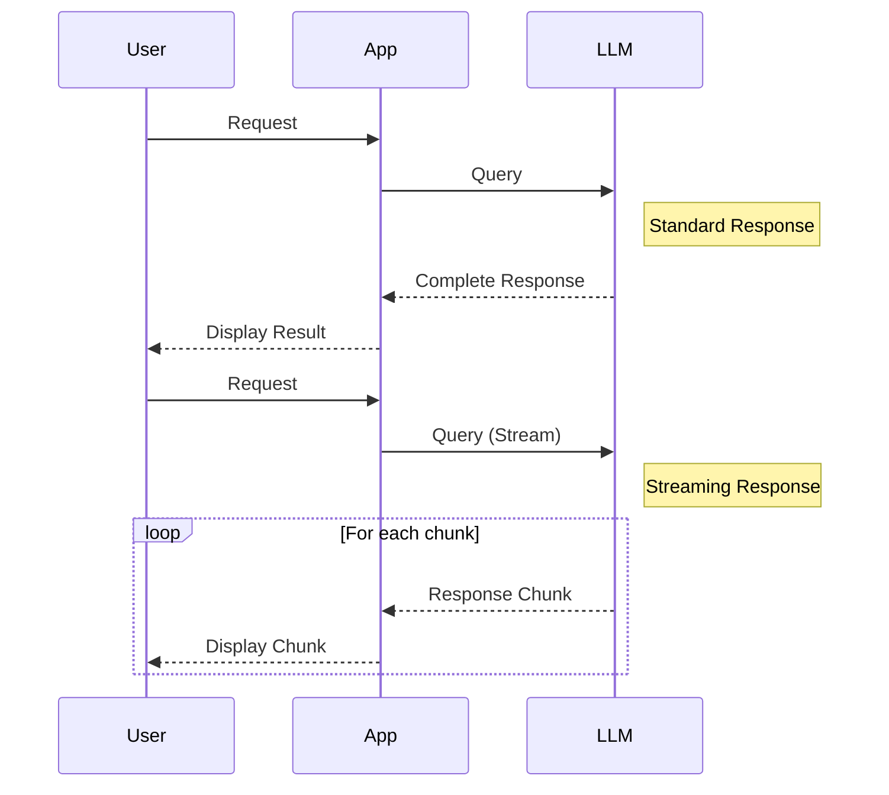

# Streams

??? api "API Documentation"

    [`mirascope.core.anthropic.stream`](../api/core/anthropic/stream.md)

    [`mirascope.core.azure.stream`](../api/core/azure/stream.md)

    [`mirascope.core.cohere.stream`](../api/core/cohere/stream.md)

    [`mirascope.core.gemini.stream`](../api/core/gemini/stream.md)

    [`mirascope.core.groq.stream`](../api/core/groq/stream.md)

    [`mirascope.core.litellm.stream`](../api/core/litellm/stream.md)

    [`mirascope.core.mistral.stream`](../api/core/mistral/stream.md)

    [`mirascope.core.openai.stream`](../api/core/openai/stream.md)

    [`mirascope.core.vertex.stream`](../api/core/vertex/stream.md)

Streaming is a powerful feature when using LLMs that allows you to process LLM responses in real-time as they are generated. This can be particularly useful for long-running tasks, providing immediate feedback to users, or implementing more responsive applications.

## What is Streaming?

Streaming in the context of LLMs refers to the process of receiving and processing the model's output in chunks as it's being generated, rather than waiting for the entire response to be completed. This approach offers several benefits:

1. **Immediate feedback**: Users can see responses as they're being generated, creating a more interactive experience.
2. **Reduced latency**: For long responses, users don't have to wait for the entire generation to complete before seeing results.
3. **Incremental processing**: Applications can process and act on partial results as they arrive.
4. **Efficient resource use**: Memory usage can be optimized by processing chunks instead of storing the entire response.
5. **Early termination**: If the desired information is found early in the response, processing can be stopped without waiting for the full generation.

Here's a diagram illustrating the difference between standard and streaming responses:



Streaming is particularly useful in scenarios such as:

- Interactive chatbots where immediate responses enhance user engagement
- Long-form content generation (e.g., articles, reports) where progress feedback is valuable
- Real-time translation services
- Live coding assistants that provide suggestions as you type

## Basic Usage and Syntax

To use streaming with Mirascope, you simply need to set the `stream` parameter to `True` in your [`call`](./calls.md) decorator. Here's a basic example:

```python hl_lines="4 10-11"
from mirascope.core import openai, prompt_template


@openai.call(model="gpt-4o-mini", stream=True)
@prompt_template("Recommend a {genre} book")
def recommend_book(genre: str):
    ...


for chunk, _ in recommend_book("fantasy"):
    print(chunk.content, end="", flush=True)
# > The Name of the Wind by Patrick Rothfuss is an excellent fantasy...
```

In this example:

1. We use the `@openai.call` decorator with `stream=True` to enable streaming.
2. The `recommend_book` function now returns a generator that yields chunks of the response.
3. We iterate over the chunks, printing each one as it's received.

The `end=""` and `flush=True` parameters in the print function ensure that the output is displayed in real-time without line breaks.

!!! info "Supported Providers"

    Mirascope supports standard streaming (without tools) for all supported providers. While we use OpenAI in this example, the interface is the same across all supported providers.

??? tip "Streaming with Other Providers"
    
    To use streaming with other providers, simply replace `openai.call` with the appropriate provider's call decorator.
    
    Supported providers include:

    [`mirascope.core.anthropic.call`](../api/core/anthropic/call.md)

    [`mirascope.core.azure.call`](../api/core/azure/call.md)

    [`mirascope.core.cohere.call`](../api/core/cohere/call.md)

    [`mirascope.core.gemini.call`](../api/core/gemini/call.md)

    [`mirascope.core.groq.call`](../api/core/groq/call.md)

    [`mirascope.core.litellm.call`](../api/core/litellm/call.md)

    [`mirascope.core.mistral.call`](../api/core/mistral/call.md)

    [`mirascope.core.openai.call`](../api/core/openai/call.md)

    [`mirascope.core.vertex.call`](../api/core/vertex/call.md)

## Handling Streamed Responses

??? api "API Documentation"

    [`mirascope.core.base.call_response_chunk`](../api/core/base/call_response_chunk.md)

    [`mirascope.core.anthropic.call_response_chunk`](../api/core/anthropic/call_response_chunk.md)

    [`mirascope.core.cohere.call_response_chunk`](../api/core/cohere/call_response_chunk.md) 

    [`mirascope.core.gemini.call_response_chunk`](../api/core/gemini/call_response_chunk.md)

    [`mirascope.core.groq.call_response_chunk`](../api/core/groq/call_response_chunk.md) 

    [`mirascope.core.mistral.call_response_chunk`](../api/core/mistral/call_response_chunk.md)

    [`mirascope.core.openai.call_response_chunk`](../api/core/openai/call_response_chunk.md) 

When streaming, the initial response will be a provider-specific `BaseStream` instance (e.g. `OpenAIStream`), which is a generator that yields tuples `(chunk, tool)` where `chunk` is a provider-specific `BaseCallResponseChunk` (e.g. `OpenAICallResponseChunk`) that wraps the original chunk in the provider's response. These objects provide a consistent interface across providers while still allowing access to provider-specific details.

!!! note "Streaming Tools"

    You'll notice in the above example that we ignore the `tool` in each tuple. If no tools are set in the call, then `tool` will always be `None` and can be safely ignored. For more details, check out the documentation on [streaming tools](./tools.md#streaming-tools)

### Common Chunk Properties and Methods

All `BaseCallResponseChunk` objects share these common properties:

- `content`: The main text content of the response. If no content is present, this will be the empty string.
- `finish_reasons`: A list of reasons why the generation finished (e.g., "stop", "length"). These will be typed specifically for the provider used. If no finish reasons are present, this will be `None`.
- `model`: The name of the model used for generation.
- `id`: A unique identifier for the response if available. Otherwise this will be `None`.
- `usage`: Information about token usage for the call if available. Otherwise this will be `None`.
- `input_tokens`: The number of input tokens used if available. Otherwise this will be `None`.
- `output_tokens`: The number of output tokens generated if available. Otherwise this will be `None`.

### Provider-Specific Response Details

While Mirascope provides a consistent interface, you can always access the full, provider-specific response object if needed. This is available through the `chunk` property of the `BaseCallResponseChunk` object:

```python
# Accessing OpenAI-specific chat completion details
completion_chunk = chunk.chunk
print(f"Delta Content: {completion_chunk.choices[0].delta.content}")
```

!!! note "Reasoning For Provider-Specific `BaseCallResponseChunk` Objects"

    The reason that we have provider-specific response objects (e.g. `OpenAICallResponseChunk`) is to provide proper type hints and safety when accessing the original response.

### Common Stream Properties and Methods

All `BaseStream` objects share the same common properties and methods as [`BaseCallResponse`](./calls.md#common-response-properties-and-methods), except for `usage`, `tools`, `tool`, and `__str__`. You can access these properties by using the additional shared method `construct_call_response` to reconstruct a `BaseCallResponse` instance:

```python
stream = recommend_book("fantasy")
response = stream.construct_call_response()
print(response.model_dump())
# > {'metadata': {...}, 'response': {...}, 'fn_args': {'genre': 'fantasy'}, ...}
```

!!! note "Reconstructed Response Limitations"

    While we try our best to reconstruct the `BaseCallResponse` instance from the stream, there's always a chance that some information present in a standard call might be missing from the stream.

## Error Handling

Error handling in streams is similar to standard non-streaming calls. However, it's important to note that errors may occur during iteration rather than at the initial function call:

```python hl_lines="11 14-15"
from openai import OpenAIError
from mirascope.core import openai, prompt_template


@openai.call(model="gpt-4o-mini", stream=True)
@prompt_template("Recommend a {genre} book")
def recommend_book(genre: str):
    ...


try:
    for chunk, _ in recommend_book("fantasy"):
        print(chunk.content, end="", flush=True)
except OpenAIError as e:
    print(f"\nStreaming Error: {str(e)}")
```

In this example, we wrap the iteration loop in a try/except block to catch any errors that might occur during streaming.

!!! warning "When Errors Occur"

    The initial response when calling an LLM function with `stream=True` will return a generator. Any errors that may occur during streaming will not happen until you actually iterate through the generator. This is why we wrap the generation loop in the try/except block and not just the call to `recommend_book`.

## Type Safety with Streams

Mirascope's `call` decorator provides proper type hints and safety when working with streams. When you enable streaming, the return type of your function will accurately reflect the stream type:

```python
@openai.call(model="gpt-4o-mini", stream=True)
@prompt_template("Recommend a {genre} book")
def recommend_book(genre: str) -> openai.OpenAIStream:
    ...

stream = recommend_book("fantasy")
# Your IDE will provide autocompletion for stream methods and properties
```


This type safety ensures that your IDE can provide appropriate autocompletion and type checking for the stream's methods and properties, improving your development experience when working with streamed LLM responses.

## Best Practices

When working with streaming in Mirascope, consider the following best practices:

1. **Real-time Feedback**: Use streaming for applications where users benefit from seeing results immediately, such as chatbots or writing assistants.
   ```python
   @openai.call(model="gpt-4o-mini", stream=True)
   @prompt_template("Write a short story about {topic}")
   def write_story(topic: str):
       ...
   
   print("Generating story...")
   for chunk, _ in write_story("a magical forest"):
       print(chunk.content, end="", flush=True)
       # > Generating story...
       # Once upon a time, in a magical forest...
   ```

2. **Progress Indicators**: Implement progress bars or loading animations that update based on the streamed response, improving user experience for longer generations.
   ```python
   from tqdm import tqdm

   @openai.call(model="gpt-4o-mini", stream=True)
   @prompt_template()
   def summarize_text(text: str) -> Messages.Type:
         return f"Summarize the following text: {text}"

   text = "..." # Long text to summarize
   summary = []
   with tqdm(desc="Summarizing", unit=" chunks") as pbar:
        for chunk, _ in summarize_text(text):
           summary.append(chunk.content)
           pbar.update(1)  # Update progress bar
   print("Summary:", "".join(summary))
   ```

3. **Incremental Processing**: Process streamed content incrementally for large outputs, reducing memory usage and allowing for early termination if needed.
   ```python
   from mirascope.core import openai, prompt_template
   
   @openai.call("gpt-4o-mini")
   @prompt_template()
   def generate_story(genre: str, length: str) -> Messages.Type: 
       return f"Generate a {length} {genre} story."
   
   stream = generate_story("fantasy", "short")
   # Open a file for writing the generated story
   with open("output.txt", "w") as file:
       for chunk, _ in stream:
           file.write(chunk.content)
   ```

4. **Timeout Handling**: Implement timeouts for streamed responses to handle cases where the LLM might take too long to generate content.
   ```python
   import asyncio
   from asyncio import TimeoutError

   @openai.call(model="gpt-4o-mini", stream=True)
   @prompt_template()
   async def write_essay(topic: str) -> Messages.Type:
         return f"Write an essay on {topic}"

   async def stream_with_timeout(topic: str, timeout: float):
       try:
           async for chunk, _ in asyncio.wait_for(write_essay(topic), timeout):
               print(chunk.content, end="", flush=True)
       except TimeoutError:
           print("\nGeneration timed out")

   asyncio.run(stream_with_timeout("artificial intelligence", 30.0))
   ```

By leveraging streaming effectively, you can create more responsive and efficient LLM-powered applications with Mirascope's streaming capabilities.
