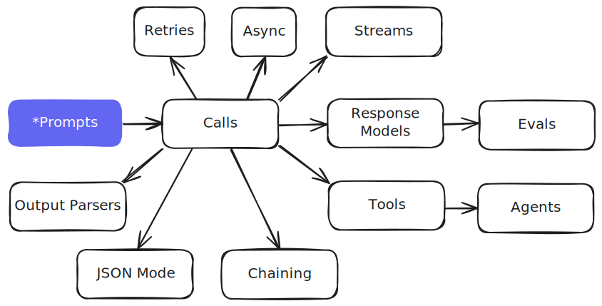

# Learn Mirascope

This section is designed to help you master Mirascope, a toolkit for building AI-powered applications with Large Language Models (LLMs).

Our documentation is tailored for developers who have at least some experience with Python and LLMs. Whether you're coming from other development tool libraries or have worked directly with provider SDKs and APIs, Mirascope offers a familiar but enhanced experience.

If you haven't already, we recommend checking out [Getting Started](../index.md) and [Why Use Mirascope](../WHY.md).

## Key Features and Benefits

- :material-language-python: __Pythonic By Design__

    Our design approach is to remain Pythonic so you can build your way

- :material-shield-check: __Editor Support & Type Hints__

    Rich automplete, inline documentation, and type hints to catch errors before runtime

- :material-compare: __Provider-Agnostic & Provider-Specific__

    Seamlessly engineer prompts agnostic or specific to various LLM providers

- :material-wrench: __Comprehensive Tooling__

    Complete suite of tools for every aspect of working with LLM provider APIs

## Core Components

Mirascope is built around these core components, each designed to handle specific aspects of working with LLM provider APIs.

We encourage you to dive into each component's documentation to gain a deeper understanding of Mirascope's capabilities. Start with the topics that align most closely with your immediate needs, but don't hesitate to explore all areas – you might discover new ways to enhance your LLM applications!

-   __Prompts__

    ---

    Learn how to create and manage prompts effectively

    [:octicons-arrow-right-24: Docs](./prompts.md)

-   __Calls__

    ---

    Understand how to make calls to LLMs using Mirascope

    [:octicons-arrow-right-24: Docs](./calls.md)

-   __Streams__

    ---

    Explore streaming responses for real-time applications

    [:octicons-arrow-right-24: Docs](./streams.md)

-   __Chaining__

    ---

    Understand the art of chaining multiple LLM calls for complex tasks

    [:octicons-arrow-right-24: Docs](./chaining.md)

-   __Response Models__

    Define and use structured output models with automatic validation

    [:octicons-arrow-right-24: Docs](./response_models.md)

-   __JSON Mode__

    Work with structured JSON data responses from LLMs

    [:octicons-arrow-right-24: Docs](./json_mode.md)

-   __Output Parsers__

    Process and transform custom LLM output structures effectively

    [:octicons-arrow-right-24: Docs](./output_parsers.md)

-   __Tools__

    Discover how to extend LLM capabilities with custom tools

    [:octicons-arrow-right-24: Docs](./tools.md)

-   __Agents__

    Put everything together to build advanced AI agents using Mirascope

    [:octicons-arrow-right-24: Docs](./agents.md)

-   __Evals__

    Apply core components to build evaluation strategies for your LLM applications

    [:octicons-arrow-right-24: Docs](./evals.md)

-   __Async__

    Maximize efficiecy with asynchronous programming

    [:octicons-arrow-right-24: Docs](./async.md)

-   __Retries__

    Understand how to automatically retry failed API calls

    [:octicons-arrow-right-24: Docs](./retries.md)

As you progress, you'll find advanced topics and best practices throughout the documentation. These will help you optimize your use of Mirascope and build increasingly sophisticated AI-powered applications.

Happy learning, and welcome to the world of development with Mirascope!
