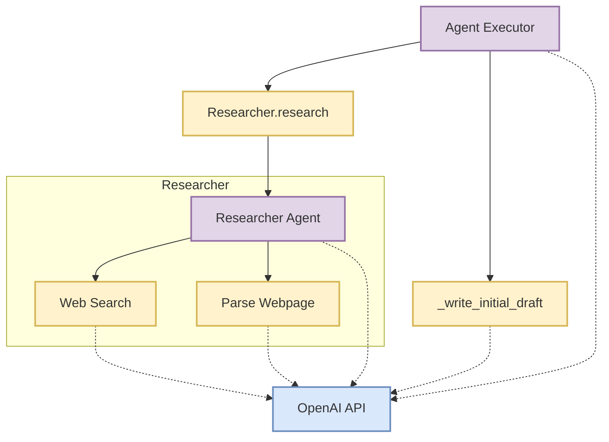

# Agent Executor: Blog Writing

This recipe demonstrates how to build an Agent Executor using Mirascope to automate the process of researching and writing a blog post. We'll create a system that combines a researcher agent and a writer tool, orchestrated by an executor agent.

<div class="admonition tip">
<p class="admonition-title">Mirascope Concepts Used</p>
<ul>
<li><a href="../../../learn/prompts/">Prompts</a></li>
<li><a href="../../../learn/calls/">Calls</a></li>
<li><a href="../../../learn/streams/">Streams</a></li>
<li><a href="../../../learn/tools/">Tools</a></li>
<li><a href="../../../learn/response_models/">Response Model</a></li>
<li><a href="../../../learn/output_parsers/">Output Parser</a></li>
<li><a href="../../../learn/retries/">Retries</a></li>
</ul>
</div>

<div class="admonition note">
<p class="admonition-title">Background</p>
<p>
Agent-based systems in AI involve creating autonomous agents that can perform tasks or make decisions. In this recipe, we're using multiple agents (researcher and writer) coordinated by an executor to create a blog post. This approach allows for a more modular and potentially more effective content creation process.
</p>
</div>

## System Architecture



## Setup

To set up our environment, first let's install all of the packages we will use:


```python
!pip install "mirascope[openai]" requests beautifulsoup4 duckduckgo-search tenacity
```


```python
import os

os.environ["OPENAI_API_KEY"] = "YOUR_API_KEY"
# Set the appropriate API key for the provider you're using
```


Make sure to also set your `OPENAI_API_KEY` if you haven't already.

## Implementing the `BaseAgent`

First, let's create a base `OpenAIAgent` class that we can later subclass to implement specialized agents:


```python
from abc import abstractmethod

from mirascope.core import BaseMessageParam, openai
from pydantic import BaseModel


class OpenAIAgent(BaseModel):
    history: list[BaseMessageParam | openai.OpenAIMessageParam] = []

    @abstractmethod
    def _step(self, prompt: str) -> openai.OpenAIStream: ...

    def run(self, prompt: str) -> str:
        stream = self._step(prompt)
        result, tools_and_outputs = "", []

        for chunk, tool in stream:
            if tool:
                tools_and_outputs.append((tool, tool.call()))
            else:
                result += chunk.content
                print(chunk.content, end="", flush=True)
        if stream.user_message_param:
            self.history.append(stream.user_message_param)
        self.history.append(stream.message_param)
        if tools_and_outputs:
            self.history += stream.tool_message_params(tools_and_outputs)
            return self.run("")
        print("\n")
        return result
```


Note that the `_step` function is marked as an abstract method that each subclass will need to implement.

## Research Agent

The first step to writing a good blog post is researching your topic, so let's create an agent that can search the internet and summarize relevant information that we can later consume when writing the post.

### Web Search Tool

We can use the `duckduckgo-search` package (with no API key!) to perform some basic keyword search on the internet. Note that we are including `self` as an argument so that we can access the state of the `Researcher` agent we will build. This enables easier configuration.


```python
import inspect

from duckduckgo_search import DDGS


class ResearcherBase(OpenAIAgent):
    max_results: int = 10

    def web_search(self, text: str) -> str:
        """Search the web for the given text.

        Args:
            text: The text to search for.

        Returns:
            The search results for the given text formatted as newline separated
            dictionaries with keys 'title', 'href', and 'body'.
        """
        try:
            results = DDGS(proxy=None).text(text, max_results=self.max_results)
            return "\n\n".join(
                [
                    inspect.cleandoc(
                        """
                        title: {title}
                        href: {href}
                        body: {body}
                        """
                    ).format(**result)
                    for result in results
                ]
            )
        except Exception as e:
            return f"{type(e)}: Failed to search the web for text"
```


### Parsing HTML Content

Our `web_search` tool only returns search results -- not the actual content of the webpages found at the href results of our search. While we could deterministically parse every web page returned, let's instead provide our researcher with a tool for parsing the content. The value of this approach is that we can greatly increase the number of search results and let the researcher decide which of the results are worth parsing and using.


```python
import requests
from bs4 import BeautifulSoup


class ResearcherBaseWithParser(ResearcherBase):
    def parse_webpage(self, link: str) -> str:
        """Parse the paragraphs of the webpage found at `link`.

        Args:
            link: The URL of the webpage.

        Returns:
            The parsed paragraphs of the webpage, separated by newlines.
        """
        try:
            response = requests.get(link)
            soup = BeautifulSoup(response.content, "html.parser")
            return "\n".join([p.text for p in soup.find_all("p")])
        except Exception as e:
            return f"{type(e)}: Failed to parse content from URL"
```


### Researcher Step Function

Now that we have our tools we're ready to implement the `_step` method of our researcher where the majority of the remaining work lies in engineering the prompt:


```python
from mirascope.core import prompt_template


class ResearcherBaseWithStep(ResearcherBaseWithParser):
    @openai.call("gpt-4o-mini", stream=True)
    @prompt_template(
        """
        SYSTEM:
        Your task is to research a topic and summarize the information you find.
        This information will be given to a writer (user) to create a blog post.

        You have access to the following tools:
        - `web_search`: Search the web for information. Limit to max {self.max_results}
            results.
        - `parse_webpage`: Parse the content of a webpage.

        When calling the `web_search` tool, the `body` is simply the body of the search
        result. You MUST then call the `parse_webpage` tool to get the actual content
        of the webpage. It is up to you to determine which search results to parse.

        Once you have gathered all of the information you need, generate a writeup that
        strikes the right balance between brevity and completeness. The goal is to
        provide as much information to the writer as possible without overwhelming them.

        MESSAGES: {self.history}
        USER: {prompt}
        """
    )
    def _step(self, prompt: str) -> openai.OpenAIDynamicConfig:
        return {"tools": [self.web_search, self.parse_webpage]}
```


### Implementing a `research` tool method

While we could use the `run` method from our `OpenAIAgent` as a tool, there is value in further engineering our prompt by providing good descriptions (and names!) for the tools we use. Putting everything together, we can expose a `research` method that we can later use as a tool in our agent executor:


```python
class Researcher(ResearcherBaseWithStep):
    def research(self, prompt: str) -> str:
        """Research a topic and summarize the information found.

        Args:
            prompt: The user prompt to guide the research. The content of this prompt
                is directly responsible for the quality of the research, so it is
                crucial that the prompt be clear and concise.

        Returns:
            The results of the research.
        """
        print("RESEARCHING...")
        result = self.run(prompt)
        print("RESEARCH COMPLETE!")
        return result
```


## Writing An Initial Draft

The next step when writing a blog is to write an initial draft and critique it. We can then incorporate the feedback from the critique to iteratively improve the post. Let's make a call to an LLM to write this first draft as well as critique it:


```python
from mirascope.integrations.tenacity import collect_errors
from pydantic import ValidationError
from tenacity import retry, wait_exponential


class AgentExecutorBase(OpenAIAgent):
    researcher: Researcher = Researcher()
    num_paragraphs: int = 4

    class InitialDraft(BaseModel):
        draft: str
        critique: str

    @staticmethod
    def parse_initial_draft(response: InitialDraft) -> str:
        return f"Draft: {response.draft}\nCritique: {response.critique}"

    @retry(
        wait=wait_exponential(multiplier=1, min=4, max=10),
        after=collect_errors(ValidationError),
    )
    @openai.call(
        "gpt-4o-mini", response_model=InitialDraft, output_parser=parse_initial_draft
    )
    @prompt_template(
        """
        SYSTEM:
        Your task is to write the initial draft for a blog post based on the information
        provided to you by the researcher, which will be a summary of the information
        they found on the internet.

        Along with the draft, you will also write a critique of your own work. This
        critique is crucial for improving the quality of the draft in subsequent
        iterations. Ensure that the critique is thoughtful, constructive, and specific.
        It should strike the right balance between comprehensive and concise feedback.

        If for any reason you deem that the research is insufficient or unclear, you can
        request that additional research be conducted by the researcher. Make sure that
        your request is specific, clear, and concise.

        MESSAGES: {self.history}
        USER:
        {previous_errors}
        {prompt}
        """
    )
    def _write_initial_draft(
        self, prompt: str, *, errors: list[ValidationError] | None = None
    ) -> openai.OpenAIDynamicConfig:
        """Writes the initial draft of a blog post along with a self-critique.

        Args:
            prompt: The user prompt to guide the writing process. The content of this
                prompt is directly responsible for the quality of the blog post, so it
                is crucial that the prompt be clear and concise.

        Returns:
            The initial draft of the blog post along with a self-critique.
        """
        return {
            "computed_fields": {
                "previous_errors": f"Previous Errors: {errors}" if errors else None
            }
        }
```


There are a few things worth noting here:

- We are again using `self` for convenient access to the containing class' state. In this case we expect to put this function inside of our executor and want to give access to the conversation history -- particularly the results of the researcher.
- We are using `response_model` to extract specifically the `draft` and `critique` fields.
- We are using an output parser `parse_initial_draft` to parse the `InitialDraft` class into a format that is friendly for using tools (`str`).
- We are using `tenacity` in order to retry should the call fail to properly generate an `InitialDraft` instance, reinserting the list of previous errors into each subsequent call.

## Agent Executor

Now we just need to put it all together into our `AgentExecutor` class, write our `_step` function, and run it!


```python
class AgentExecutor(AgentExecutorBase):
    @openai.call("gpt-4o-mini", stream=True)
    @prompt_template(
        """
        SYSTEM:
        Your task is to facilitate the collaboration between the researcher and the
        blog writer. The researcher will provide the blog writer with the information
        they need to write a blog post, and the blog writer will draft and critique the
        blog post until they reach a final iteration they are satisfied with.

        To access the researcher and writer, you have the following tools:
        - `research`: Prompt the researcher to perform research.
        - `_write_initial_draft`: Write an initial draft with a self-critique

        You will need to manage the flow of information between the researcher and the
        blog writer, ensuring that the information provided is clear, concise, and
        relevant to the task at hand.

        The final blog post MUST have EXACTLY {self.num_paragraphs} paragraphs.

        MESSAGES: {self.history}
        USER: {prompt}
        """
    )
    def _step(self, prompt: str) -> openai.OpenAIDynamicConfig:
        return {"tools": [self.researcher.research, self._write_initial_draft]}


agent = AgentExecutor()
print("STARTING AGENT EXECUTION...")
agent.run("Help me write a blog post about LLMs and structured outputs.")
```


<div class="admonition tip">
<p class="admonition-title">Additional Real-World Applications</p>
<ol>
<li>
<p><b>Automated Content Marketing:</b></p>
<ul>
<li>Create a system that generates targeted blog posts for different customer segments based on current market trends and company data.</li>
<li>Example: An e-commerce platform could use this to write product category overviews, incorporating latest fashion trends and customer preferences.</li>
</ul>
</li>
<li>
<p><b>Technical Documentation Generation:</b></p>
<ul>
<li>Develop an agent that researches API changes, new features, and community feedback to automatically update and expand technical documentation.</li>
<li>Example: A software company could use this to keep their SDK documentation up-to-date with each new release.</li>
</ul>
</li>
<li>
<p><b>Personalized Learning Content:</b></p>
<ul>
<li>Build an educational tool that creates customized study materials based on a student's learning style, current knowledge, and learning goals.</li>
<li>Example: An online learning platform could generate personalized course summaries and practice exercises for each student.</li>
</ul>
</li>
<li>
<p><b>Automated News Summary and Analysis:</b></p>
<ul>
<li>Create a system that gathers news from various sources, summarizes key points, and generates analytical pieces on trending topics.</li>
<li>Example: A news agency could use this to produce daily briefings on complex, evolving stories like economic trends or geopolitical events.</li>
</ul>
</li>
<li>
<p><b>Scientific Literature Review Assistant:</b></p>
<ul>
<li>Develop an agent that can scan recent publications in a specific field, summarize key findings, and draft literature review sections for research papers.</li>
<li>Example: Researchers could use this to stay updated on the latest developments in their field and to assist in writing comprehensive literature reviews.</li>
</ul>
</li>
<li>
<p><b>Legal Document Drafting:</b></p>
<ul>
<li>Create a system that researches relevant case law and regulations to assist in drafting legal documents like contracts or briefs.</li>
<li>Example: A law firm could use this to generate first drafts of standard contracts, incorporating the latest legal precedents and regulations.</li>
</ul>
</li>
<li>
<p><b>Product Description Generator:</b></p>
<ul>
<li>Build an agent that researches product features, customer reviews, and market trends to write engaging and informative product descriptions.</li>
<li>Example: An online marketplace could use this to automatically generate or update descriptions for thousands of products.</li>
</ul>
</li>
<li>
<p><b>Travel Guide Creation:</b></p>
<ul>
<li>Develop a system that researches destinations, local attractions, and traveler reviews to create personalized travel guides.</li>
<li>Example: A travel company could use this to generate custom itineraries and destination guides based on a traveler's preferences and budget.</li>
</ul>
</li>
</ol>
</div>

When adapting this recipe, consider:

- Implement a feedback loop where the executor can request additional research or revisions.
- Add more specialized agents, such as an editor or fact-checker.
- Incorporate user feedback into the writing process.
- Extend the system to handle multiple blog post formats or styles.
- Implement caching for research results to improve efficiency for similar topics.
- Adjusting the prompts and system messages to fit your specific use case or writing style.
- Experimenting with different LLM models for various tasks (research vs. writing).
- Implementing error handling and logging for production use.
- Optimizing the web search and parsing functions for better performance and reliability.

