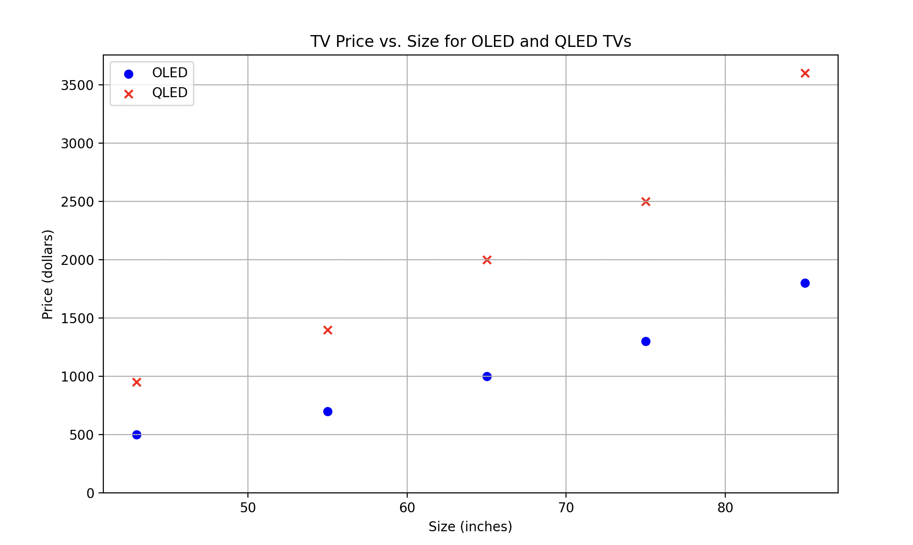

# Generate Synthetic Data

In this tutorial, we go over how to generate synthetic data for LLMs, in this case, OpenAI’s `gpt-4o-mini`. When using LLMs to synthetically generate data, it is most useful to generate non-numerical data which isn’t strictly dependent on a defined probability distribution - in those cases, it will be far easier to define a distribution and generate these points directly from the distribution.

However, for:

- data that needs general intelligence to be realistic
- data that lists many items within a broad category
- data which is language related

and more, LLMs are far easier to use and yield better (or the only feasible) results.

<div class="admonition tip">
<p class="admonition-title">Mirascope Concepts Used</p>
<ul>
<li><a href="../../../learn/prompts/">Prompts</a></li>
<li><a href="../../../learn/calls/">Calls</a></li>
<li><a href="../../../learn/response_models/">Response Models</a></li>
</ul>
</div>

<div class="admonition note">
<p class="admonition-title">Background</p>
<p>
Large Language Models (LLMs) have emerged as powerful tools for generating synthetic data, particularly for text-based applications. Compared to traditional synthetic data generation methods, LLMs can produce more diverse, contextually rich, and human-like textual data, often with less need for domain-specific rules or statistical modeling.
</p>
</div>


## Setup

To set up our environment, first let's install all of the packages we will use:


```python
!pip install "mirascope[openai]" pandas
```


```python
import os

os.environ["OPENAI_API_KEY"] = "YOUR_API_KEY"
# Set the appropriate API key for the provider you're using
```

## Generate Data as CSV

To generate realistic, synthetic data as a csv, you can accomplish this in a single call by requesting a csv format in the prompt and describing the kind of data you would like generated.


```python
from mirascope.core import openai, prompt_template


@openai.call(model="gpt-4o-mini")
@prompt_template(
    """
    Generate {num_datapoints} random but realistic datapoints of items which could
    be in a home appliances warehouse. Output the datapoints as a csv, and your
    response should only be the CSV.

    Format:
    Name, Price, Inventory

    Name - the name of the home appliance product
    Price - the price of an individual product, in dollars (include cents)
    Inventory - how many are left in stock
    """
)
def generate_csv_data(num_datapoints: int): ...


print(generate_csv_data(5))
```

    Name, Price, Inventory  
    "4-Slice Toaster", 29.99, 150  
    "Stainless Steel Blender", 49.99, 75  
    "Robot Vacuum Cleaner", 199.99, 30  
    "Microwave Oven 1000W", 89.99, 50  
    "Electric Kettle", 24.99, 200


Note that the prices and inventory of each item are somewhat realistic for their corresponding item, something which would be otherwise difficult to accomplish.


## Generate Data with `response_model`

Sometimes, it will be easier to integrate your datapoints into your code if they are defined as some schema, namely a Pydantic `BaseModel`. In this case, describe each column as the `description` of a `Field` in the `BaseModel` instead of the prompt, and set `response_model` to your defined schema:


```python
from pydantic import BaseModel, Field


class HomeAppliance(BaseModel):
    name: str = Field(description="The name of the home appliance product")
    price: float = Field(
        description="The price of an individual product, in dollars (include cents)"
    )
    inventory: int = Field(description="How many of the items are left in stock")


@openai.call(model="gpt-4o-mini", response_model=list[HomeAppliance])
@prompt_template(
    """
    Generate {num_datapoints} random but realistic datapoints of items which could
    be in a home appliances warehouse. Output the datapoints as a list of instances
    of HomeAppliance.
    """
)
def generate_home_appliance_data(num_datapoints: int): ...


print(generate_home_appliance_data(5))
```

    [HomeAppliance(name='Refrigerator', price=899.99, inventory=25), HomeAppliance(name='Microwave', price=129.99, inventory=50), HomeAppliance(name='Washing Machine', price=499.99, inventory=15), HomeAppliance(name='Dishwasher', price=749.99, inventory=10), HomeAppliance(name='Air Conditioner', price=349.99, inventory=30)]


## Generate Data into a pandas `DataFrame`

Since pandas is a common library for working with data, it’s also worth knowing how to directly create and append to a dataframe with LLMs.

### Create a New `DataFrame`

To create a new `DataFrame`, we define a `BaseModel` schema with a simple function to generate  `DataFrame` via a list of list of data and the column names:


```python
from typing import Any, Literal

import pandas as pd


class DataFrameGenerator(BaseModel):
    data: list[list[Any]] = Field(
        description="the data to be inserted into the dataframe"
    )
    column_names: list[str] = Field(description="The names of the columns in data")

    def append_dataframe(self, df: pd.DataFrame) -> pd.DataFrame:
        return pd.concat([df, self.generate_dataframe()], ignore_index=True)

    def generate_dataframe(self) -> pd.DataFrame:
        return pd.DataFrame(dict(zip(self.column_names, self.data, strict=False)))


@openai.call(model="gpt-4o-mini", response_model=DataFrameGenerator)
@prompt_template(
    """
    Generate {num_datapoints} random but realistic datapoints of items which could
    be in a home appliances warehouse. Generate your response as `data` and
    `column_names`, so that a pandas DataFrame may be generated with:
    `pd.DataFrame(data, columns=column_names)`.

    Format:
    Name, Price, Inventory

    Name - the name of the home appliance product
    Price - the price of an individual product, in dollars (include cents)
    Inventory - how many are left in stock
    """
)
def generate_df_data(num_datapoints: int): ...


df_data = generate_df_data(5)
df = df_data.generate_dataframe()
print(df)
```

                 Name         Price Inventory
    0  Microwave Oven  Refrigerator   Blender
    1           79.99        899.99     49.99
    2              25            10        40


### Appending to a `DataFrame`

To append to a `DataFrame`, we can modify the prompt so that instead of describing the data we want to generate, we ask the LLM to match the type of data it already sees. Furthermore, we add a `append_dataframe()` function to append to an existing `DataFrame`. Finally, note that we use the generated `df` from above as the `DataFrame` to append to in the following example:


```python
@openai.call(model="gpt-4o-mini", response_model=DataFrameGenerator)
@prompt_template(
    """
    Generate {num_datapoints} random but realistic datapoints of items which would
    make sense to the following dataset:
    {df}
    Generate your response as `data` and
    `column_names`, so that a pandas DataFrame may be generated with:
    `pd.DataFrame(data, columns=column_names)` then appended to the existing data.
    """
)
def generate_additional_df_data(num_datapoints: int, df: pd.DataFrame): ...


df_data = generate_additional_df_data(5, df)
df = df_data.append_dataframe(df)
print(df)
```

                 Name         Price     Inventory
    0  Microwave Oven  Refrigerator       Blender
    1           79.99        899.99         49.99
    2              25            10            40
    3         Toaster   Slow Cooker  Coffee Maker
    4           29.99         49.99         39.99
    5             150            80           200


## Adding Constraints

While you cannot successfully add complex mathematical constraints to generated data (think statistics, such as distributions and covariances), asking LLMs to abide by basic constraints will (generally) prove successful, especially with newer models. Let’s look at an example where we generate TVs where the TV price should roughly linearly correlate with TV size, and QLEDs are 2-3x more expensive than OLEDs of the same size:


```python
class TV(BaseModel):
    size: int = Field(description="The size of the TV")
    price: float = Field(description="The price of the TV in dollars (include cents)")
    tv_type: Literal["OLED", "QLED"]


@openai.call(model="gpt-4o-mini", response_model=list[TV])
@prompt_template(
    """
    Generate {num_datapoints} random but realistic datapoints of TVs.
    Output the datapoints as a list of instances of TV.

    Make sure to abide by the following constraints:
    QLEDS should be roughly (not exactly) 2x the price of an OLED of the same size
    for both OLEDs and QLEDS, price should increase roughly proportionately to size
    """
)
def generate_tv_data(num_datapoints: int): ...


for tv in generate_tv_data(10):
    print(tv)
```

    size=32 price=299.99 tv_type='OLED'
    size=32 price=549.99 tv_type='QLED'
    size=43 price=399.99 tv_type='OLED'
    size=43 price=749.99 tv_type='QLED'
    size=55 price=699.99 tv_type='OLED'
    size=55 price=1399.99 tv_type='QLED'
    size=65 price=999.99 tv_type='OLED'
    size=65 price=1999.99 tv_type='QLED'
    size=75 price=1299.99 tv_type='OLED'
    size=75 price=2499.99 tv_type='QLED'


To demonstrate the constraints’ being followed, you can graph the data using matplotlib, which shows the linear relationships between size and price, and QLEDs costing roughly twice as much as OLED:



<div class="admonition tip">
<p class="admonition-title">Additional Real-World Examples</p>
<ul>
<li><b>Healthcare and Medical Research</b>: Generating synthetic patient records for training machine learning models without compromising patient privacy</li>
<li><b>Environmental Science</b>: Generating synthetic climate data for modeling long-term environmental changes</li>
<li><b>Fraud Detection Systems</b>: Generating synthetic data of fraudulent and legitimate transactions for training fraud detection models.</li>
</ul>
</div>

When adapting this recipe to your specific use-case, consider the following:
    - Add Pydantic `AfterValidators` to constrain your synthetic data generation
    - Verify that the synthetic data generated actually matches real-world data.
    - Make sure no biases are present in the generated data, this can be prompt engineered.
    - Experiment with different model providers and versions for quality.

